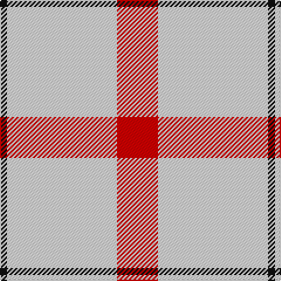

In pattern [KWR](/patterns/kwr/).

This was sourced from tartans-authority.  It is a [3 stripes tartan](/stripes/stripes3/).

Original link http://www.tartansauthority.com/tartan-ferret/display/10303/

## Thread count
K/6 LN94 R/35

## Palette
Each colour and its ΔE from the base-6 reference it is a variant of.

| Colour | Shade | Base | ΔE (OKLab) |
|---|---|---|---|
| K | <code style="background-color:#101010;">#101010</code> `#101010` | K <code style="background-color:#000000;">#000000</code> | 0.17 |
| LN | <code style="background-color:#E0E0E0;">#E0E0E0</code> `#E0E0E0` | W <code style="background-color:#F4F4F0;">#F4F4F0</code> | 0.06 |
| R | <code style="background-color:#D40000;">#D40000</code> `#D40000` | R <code style="background-color:#C80000;">#C80000</code> | 0.03 |

# Sample pattern

## Nearest tartans

The nearest existing variants by ΔTartan distance.

1. [St Georges Check](/setts/s3/r35w94k6-k101010-rff0000-wffffff/) — ΔT 0.79
1. [Triplett, Jack Arnold](/setts/s4/w70b24r4ba4-b335280-ba666666-rff0000-wf8eeb7/) — ΔT 1.75
1. [Tarbh Deargh (Red Bull)](/setts/s4/w160b60y10ya8-b202060-we0e0e0-yd87c00-yae8c000/) — ΔT 1.98
1. [Young in Australia](/setts/s4/w162g12y16g16-g23321b-we8ddcb-ye0a126/) — ΔT 2.06
1. [Clayton Dress (Dance)](/setts/s6/w16r28w16r28w70k8-k000000-r880000-wfcfcfc/) — ΔT 2.10
1. [Triplett, Jack Arnold](/setts/s4/w112b40r8ba8-b1870a4-ba5c8ca8-rc80000-wfcfcfc/) — ΔT 2.12
1. [Buchanan VS](/setts/s6/w2r4w2r4w9k1-k000000-rff0000-wd0d0d0/) — ΔT 2.16
1. [Lewis, Magenta (Dance)](/setts/s4/w8r62w70y8-rb80478-wf0e0c8-y54b8b8/) — ΔT 2.18
1. [Hose](/setts/s3/w74k4r72-k000000-rc00000-we0e0e0/) — ΔT 2.22
1. [Burt's Highlanders (Fashion)](/setts/s5/y80g26y12b26y44-b2c2c80-g006818-yfcb464/) — ΔT 2.27

## Neighbour map

Every grey dot is one of 15726 variants placed by the first two principal components of the ΔTartan feature space (44% of its variance). Red is this tartan; blue dots are its nearest — click one to open its page.

<svg viewBox="0 0 640 380" role="img" style="max-width:100%;height:auto;border:1px solid #e0e0e0;border-radius:4px;display:block" xmlns="http://www.w3.org/2000/svg"><image href="/nn/cloud.v1.png" width="640" height="380"/><a href="/setts/s3/r35w94k6-k101010-rff0000-wffffff/"><circle cx="412.2" cy="205.5" r="4" fill="#3465a4"><title>St Georges Check</title></circle></a><a href="/setts/s4/w70b24r4ba4-b335280-ba666666-rff0000-wf8eeb7/"><circle cx="394.5" cy="166.6" r="4" fill="#3465a4"><title>Triplett, Jack Arnold</title></circle></a><a href="/setts/s4/w160b60y10ya8-b202060-we0e0e0-yd87c00-yae8c000/"><circle cx="380.6" cy="162.5" r="4" fill="#3465a4"><title>Tarbh Deargh (Red Bull)</title></circle></a><a href="/setts/s4/w162g12y16g16-g23321b-we8ddcb-ye0a126/"><circle cx="499.8" cy="187.4" r="4" fill="#3465a4"><title>Young in Australia</title></circle></a><a href="/setts/s6/w16r28w16r28w70k8-k000000-r880000-wfcfcfc/"><circle cx="305.6" cy="203.8" r="4" fill="#3465a4"><title>Clayton Dress (Dance)</title></circle></a><a href="/setts/s4/w112b40r8ba8-b1870a4-ba5c8ca8-rc80000-wfcfcfc/"><circle cx="367.8" cy="177.6" r="4" fill="#3465a4"><title>Triplett, Jack Arnold</title></circle></a><a href="/setts/s6/w2r4w2r4w9k1-k000000-rff0000-wd0d0d0/"><circle cx="324.6" cy="210.1" r="4" fill="#3465a4"><title>Buchanan VS</title></circle></a><a href="/setts/s4/w8r62w70y8-rb80478-wf0e0c8-y54b8b8/"><circle cx="309.2" cy="221.8" r="4" fill="#3465a4"><title>Lewis, Magenta (Dance)</title></circle></a><a href="/setts/s3/w74k4r72-k000000-rc00000-we0e0e0/"><circle cx="319.5" cy="218.7" r="4" fill="#3465a4"><title>Hose</title></circle></a><a href="/setts/s5/y80g26y12b26y44-b2c2c80-g006818-yfcb464/"><circle cx="378.3" cy="248.9" r="4" fill="#3465a4"><title>Burt's Highlanders (Fashion)</title></circle></a><circle cx="421.4" cy="214.3" r="5" fill="#c00000"/></svg>

ID: /setts/s3/r35w94k6-k101010-rd40000-we0e0e0/
