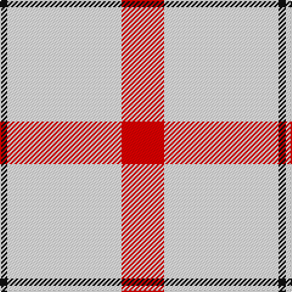

In pattern [KWR](/stripes/kwr/).

This was sourced from register-of-tartans.  It is a [3 stripe tartan](/stripes/stripes3/).

Original link https://www.tartanregister.gov.uk/tartanDetails.aspx?ref=10303

## Also known as

This cloth is also recorded under:

- St. George's Check

## Attestations

This cloth appears in 2 source records; the oldest owns this page.

- 07/10/2010 — St Georges Check (register-of-tartans, [record](https://www.tartanregister.gov.uk/tartanDetails.aspx?ref=10303))
- 7th Oct. 2010 — St. George's Check (Fashion) (tartans-authority, [record](http://www.tartansauthority.com/tartan-ferret/display/10303/))

## Register references

External register numbers recorded for this tartan.

- Scottish Register of Tartans: [10303](https://www.tartanregister.gov.uk/tartanDetails.aspx?ref=10303)

## Thread count
R/35 W94 K/6

## Palette
Each colour and the base-6 reference it is a variant of.

| Colour | Shade | Base |
|---|---|---|
| K | <code style="background-color:#101010;">#101010</code> `oklch(17.3% 0.000 89.9)` <small>#101010</small> | K <code style="background-color:#000000;">#000000</code> |
| R | <code style="background-color:#FF0000;">#FF0000</code> `oklch(62.8% 0.258 29.2)` <small>#FF0000</small> | R <code style="background-color:#CC0000;">#CC0000</code> |
| W | <code style="background-color:#FFFFFF;">#FFFFFF</code> `oklch(100.0% 0.000 89.9)` <small>#FFFFFF</small> | W <code style="background-color:#F7F7F7;">#F7F7F7</code> |

# Sample pattern

## Nearest tartans

The nearest existing variants by ΔTartan distance.

1. [Triplett, Jack Arnold](/setts/s4/w35n12r2n2~x2/) — ΔT 1.96
1. [Triplett, Jack Arnold](/setts/s4/w14b5r1t1~x8/) — ΔT 2.24
1. [Young in Australia](/setts/s4/w81dg6lo8dg8~x2/) — ΔT 2.24
1. [Clayton Dress (Dance)](/setts/s6/w8r14w8r14w35k4~x2/) — ΔT 2.26
1. [Tarbh Deargh (Red Bull)](/setts/s4/w80db30lo5ly4~x2/) — ΔT 2.31
1. [Buchanan VS](/setts/s6/lb2r4lb2r4lb9k1~x2/) — ΔT 2.36
1. [Lewis, Magenta (Dance)](/setts/s4/w4m31w35lg4~x2/) — ΔT 2.41
1. [Butties](/setts/s6/w93o6w13db35w12o6/) — ΔT 2.44
1. [Clayton Dress (Dance)](/setts/s8/r14w35k4w35r14w8r14w8~x2/) — ΔT 2.49
1. [Hose](/setts/s3/w37k2r36~x2/) — ΔT 2.49

## Neighbour map

Every grey dot is one of 14299 variants placed by the first two principal components of the ΔTartan feature space (44% of its variance). Red is this tartan; blue dots are its nearest — click one to open its page.

<svg viewBox="0 0 640 380" role="img" style="max-width:100%;height:auto;border:1px solid #e0e0e0;border-radius:4px;display:block" xmlns="http://www.w3.org/2000/svg"><image href="/nn/cloud.v1.png" width="640" height="380"/><a href="/setts/s4/w35n12r2n2~x2/"><circle cx="393.5" cy="163.0" r="4" fill="#3465a4"><title>Triplett, Jack Arnold</title></circle></a><a href="/setts/s4/w14b5r1t1~x8/"><circle cx="367.4" cy="174.6" r="4" fill="#3465a4"><title>Triplett, Jack Arnold</title></circle></a><a href="/setts/s4/w81dg6lo8dg8~x2/"><circle cx="497.4" cy="183.8" r="4" fill="#3465a4"><title>Young in Australia</title></circle></a><a href="/setts/s6/w8r14w8r14w35k4~x2/"><circle cx="303.4" cy="198.2" r="4" fill="#3465a4"><title>Clayton Dress (Dance)</title></circle></a><a href="/setts/s4/w80db30lo5ly4~x2/"><circle cx="380.5" cy="159.1" r="4" fill="#3465a4"><title>Tarbh Deargh (Red Bull)</title></circle></a><a href="/setts/s6/lb2r4lb2r4lb9k1~x2/"><circle cx="321.8" cy="205.5" r="4" fill="#3465a4"><title>Buchanan VS</title></circle></a><a href="/setts/s4/w4m31w35lg4~x2/"><circle cx="307.0" cy="217.6" r="4" fill="#3465a4"><title>Lewis, Magenta (Dance)</title></circle></a><a href="/setts/s6/w93o6w13db35w12o6/"><circle cx="407.4" cy="156.0" r="4" fill="#3465a4"><title>Butties</title></circle></a><a href="/setts/s8/r14w35k4w35r14w8r14w8~x2/"><circle cx="317.5" cy="191.9" r="4" fill="#3465a4"><title>Clayton Dress (Dance)</title></circle></a><a href="/setts/s3/w37k2r36~x2/"><circle cx="316.7" cy="213.6" r="4" fill="#3465a4"><title>Hose</title></circle></a><circle cx="408.4" cy="199.6" r="5" fill="#c00000"/></svg>

ID: /setts/s3/r35w94k6/
