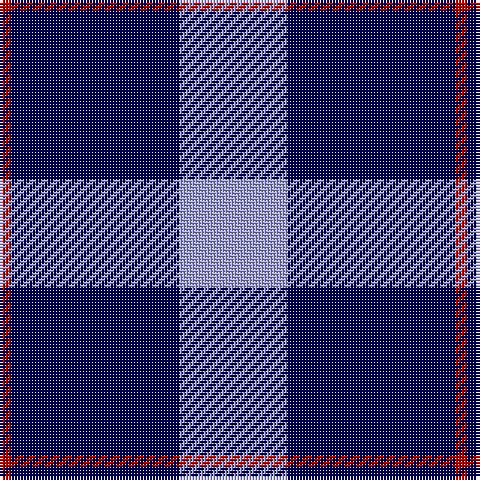

In pattern [RBW](/patterns/rbw/).

This was sourced from register-of-tartans.  It is a [3 stripes tartan](/stripes/stripes3/).

Original link https://www.tartanregister.gov.uk/tartanDetails.aspx?ref=3907

## Thread count
DR/4 DB56 LP/36

## Palette
Each colour and its ΔE from the base-6 reference it is a variant of.

| Colour | Shade | Base | ΔE (OKLab) |
|---|---|---|---|
| B | <code style="background-color:#788CB4;">#788CB4</code> `#788CB4` | B <code style="background-color:#2C4084;">#2C4084</code> | 0.25 |
| DB | <code style="background-color:#000050;">#000050</code> `#000050` | B <code style="background-color:#2C4084;">#2C4084</code> | 0.20 |
| DR | <code style="background-color:#B00000;">#B00000</code> `#B00000` | R <code style="background-color:#C80000;">#C80000</code> | 0.05 |
| DY | <code style="background-color:#C88C00;">#C88C00</code> `#C88C00` | Y <code style="background-color:#E8C000;">#E8C000</code> | 0.15 |
| K | <code style="background-color:#000000;">#000000</code> `#000000` | K <code style="background-color:#000000;">#000000</code> | 0.00 |
| LP | <code style="background-color:#A0A0DC;">#A0A0DC</code> `#A0A0DC` | W <code style="background-color:#F4F4F0;">#F4F4F0</code> | 0.26 |
| N | <code style="background-color:#C8C8C8;">#C8C8C8</code> `#C8C8C8` | W <code style="background-color:#F4F4F0;">#F4F4F0</code> | 0.13 |
| P | <code style="background-color:#64008C;">#64008C</code> `#64008C` | B <code style="background-color:#2C4084;">#2C4084</code> | 0.13 |

# Sample pattern

ID: /setts/s3/r4b56w36-b000050-rb00000-wa0a0dc/
