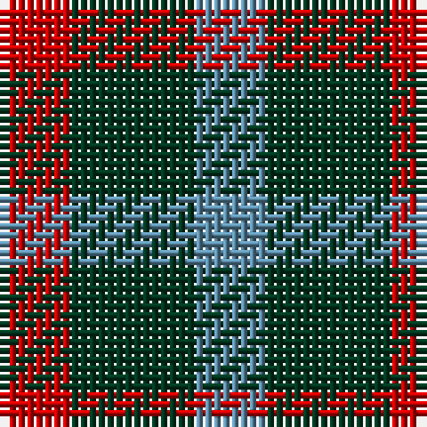

In pattern [BGR](/stripes/bgr/).

This was sourced from register-of-tartans.  It is a [3 stripe tartan](/stripes/stripes3/).

Original link https://www.tartanregister.gov.uk/tartanDetails.aspx?ref=4661

## Register references

External register numbers recorded for this tartan.

- Scottish Register of Tartans: [4661](https://www.tartanregister.gov.uk/tartanDetails.aspx?ref=4661)
- Scottish Tartans Authority (ITI): 1932
- Scottish Tartans World Register: 1932

## Thread count
R/8 DG14 B/8

## Palette
Each colour and the base-6 reference it is a variant of.

| Colour | Shade | Base |
|---|---|---|
| B | <code style="background-color:#5C8CA8;">#5C8CA8</code> `oklch(61.7% 0.067 235.0)` <small>#5C8CA8</small> | B <code style="background-color:#2A418A;">#2A418A</code> |
| DG | <code style="background-color:#003820;">#003820</code> `oklch(30.0% 0.070 158.3)` <small>#003820</small> | G <code style="background-color:#006100;">#006100</code> |
| LG | <code style="background-color:#789484;">#789484</code> `oklch(64.0% 0.040 160.0)` <small>#789484</small> | G <code style="background-color:#006100;">#006100</code> |
| R | <code style="background-color:#C80000;">#C80000</code> `oklch(52.3% 0.215 29.2)` <small>#C80000</small> | R <code style="background-color:#CC0000;">#CC0000</code> |

# Sample pattern

## Nearest tartans

The nearest existing variants by ΔTartan distance, with this tartan at the top so the swatches line up against it.

ΔTartan

Tartan

Sett

—

<a href="/ttd/edit/#slug=r4dg7t4~x2">Wilson's No.061</a> <a class="nn-out" href="/setts/s3/r4dg7t4~x2/" title="open its dictionary page">↗</a>

0.98

<a href="/ttd/edit/#slug=g7k4r4~x2">Wilson's No.202</a> <a class="nn-out" href="/setts/s3/g7k4r4~x2/" title="open its dictionary page">↗</a>

1.08

<a href="/ttd/edit/#slug=r4k7g4~x2">Wilson's No.200</a> <a class="nn-out" href="/setts/s3/r4k7g4~x2/" title="open its dictionary page">↗</a>

1.27

<a href="/ttd/edit/#slug=p5g4t2~x2">Wilson's, No 209</a> <a class="nn-out" href="/setts/s3/p5g4t2~x2/" title="open its dictionary page">↗</a>

1.27

<a href="/ttd/edit/#slug=lo5db5k3~x4">Kazakhstan Relic (Artefact)</a> <a class="nn-out" href="/setts/s3/lo5db5k3~x4/" title="open its dictionary page">↗</a>

1.28

<a href="/ttd/edit/#slug=r4k7t4~x2">Wilson's No.198</a> <a class="nn-out" href="/setts/s3/r4k7t4~x2/" title="open its dictionary page">↗</a>

1.28

<a href="/ttd/edit/#slug=g4k5g4r2~x2">Wilson's No.094</a> <a class="nn-out" href="/setts/s4/g4k5g4r2~x2/" title="open its dictionary page">↗</a>

1.36

<a href="/ttd/edit/#slug=r2g2t1~x4">Wilson's, No 207</a> <a class="nn-out" href="/setts/s3/r2g2t1~x4/" title="open its dictionary page">↗</a>

1.43

<a href="/ttd/edit/#slug=r4g7t4~x2">Wilson's, No 61</a> <a class="nn-out" href="/setts/s3/r4g7t4~x2/" title="open its dictionary page">↗</a>

1.52

<a href="/ttd/edit/#slug=dt1k2r1~x42">Allen, Nicholas (Personal)</a> <a class="nn-out" href="/setts/s3/dt1k2r1~x42/" title="open its dictionary page">↗</a>

1.55

<a href="/ttd/edit/#slug=g4dp5g4t2~x2">Wilson's No.209</a> <a class="nn-out" href="/setts/s4/g4dp5g4t2~x2/" title="open its dictionary page">↗</a>

## Neighbour map

Every grey dot is one of 14299 variants placed by the first two principal components of the ΔTartan feature space (44% of its variance). Red is this tartan; blue dots are its nearest — click one to open its page.

<svg viewBox="0 0 640 380" role="img" style="max-width:100%;height:auto;border:1px solid #e0e0e0;border-radius:4px;display:block" xmlns="http://www.w3.org/2000/svg"><image href="/nn/cloud.v1.png" width="640" height="380"/><a href="/setts/s3/g7k4r4~x2/"><circle cx="160.0" cy="366.0" r="4" fill="#3465a4"><title>Wilson's No.202</title></circle></a><a href="/setts/s3/r4k7g4~x2/"><circle cx="159.1" cy="366.0" r="4" fill="#3465a4"><title>Wilson's No.200</title></circle></a><a href="/setts/s3/p5g4t2~x2/"><circle cx="185.7" cy="361.2" r="4" fill="#3465a4"><title>Wilson's, No 209</title></circle></a><a href="/setts/s3/lo5db5k3~x4/"><circle cx="94.3" cy="366.0" r="4" fill="#3465a4"><title>Kazakhstan Relic (Artefact)</title></circle></a><a href="/setts/s3/r4k7t4~x2/"><circle cx="142.3" cy="366.0" r="4" fill="#3465a4"><title>Wilson's No.198</title></circle></a><a href="/setts/s4/g4k5g4r2~x2/"><circle cx="200.2" cy="359.2" r="4" fill="#3465a4"><title>Wilson's No.094</title></circle></a><a href="/setts/s3/r2g2t1~x4/"><circle cx="158.4" cy="366.0" r="4" fill="#3465a4"><title>Wilson's, No 207</title></circle></a><a href="/setts/s3/r4g7t4~x2/"><circle cx="175.1" cy="366.0" r="4" fill="#3465a4"><title>Wilson's, No 61</title></circle></a><a href="/setts/s3/dt1k2r1~x42/"><circle cx="207.6" cy="366.0" r="4" fill="#3465a4"><title>Allen, Nicholas (Personal)</title></circle></a><a href="/setts/s4/g4dp5g4t2~x2/"><circle cx="217.4" cy="366.0" r="4" fill="#3465a4"><title>Wilson's No.209</title></circle></a><circle cx="161.9" cy="366.0" r="5" fill="#c00000"/></svg>

ID: /setts/s3/r4dg7t4~x2/
