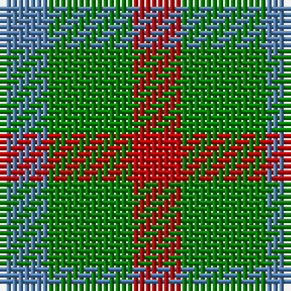

This page is one **sett** — a single exact thread-count. It belongs to the [tartan](/tartans/r4g7b4/)
(the same proportion at any scale), whose colour order is pattern [BGR](/stripes/bgr/).

Sourced from weddslist.  It is a [3 stripe tartan](/stripes/stripes3/).

Original link http://www.weddslist.com/cgi-bin/tartans/pg.pl?source=sts

## Thread count
R/8 G14 B/8

## Palette
Each colour and the base-6 reference it is a variant of.

| Colour | Shade | Base |
|---|---|---|
| B | <code style="background-color:#5480B0;">#5480B0</code> `oklch(58.8% 0.089 251.5)` <small>#5480B0</small> | B <code style="background-color:#2A418A;">#2A418A</code> |
| G | <code style="background-color:#008000;">#008000</code> `oklch(52.0% 0.177 142.5)` <small>#008000</small> | G <code style="background-color:#006100;">#006100</code> |
| R | <code style="background-color:#C00000;">#C00000</code> `oklch(50.7% 0.208 29.2)` <small>#C00000</small> | R <code style="background-color:#CC0000;">#CC0000</code> |

# Sample pattern

## Nearest tartans

The nearest existing variants by ΔTartan distance, with this tartan at the top so the swatches line up against it.

ΔTartan

Tartan

Sett

—

<a href="/ttd/edit/#slug=r4g7t4~x2">Wilson's, No 61</a> <a class="nn-out" href="/setts/s3/r4g7t4~x2/" title="open its dictionary page">↗</a>

1.00

<a href="/ttd/edit/#slug=r2g2t1~x4">Wilson's, No 207</a> <a class="nn-out" href="/setts/s3/r2g2t1~x4/" title="open its dictionary page">↗</a>

1.17

<a href="/ttd/edit/#slug=dy2t1lo1~x2">Gearach Woodcock Tweed (Corporate)</a> <a class="nn-out" href="/setts/s3/dy2t1lo1~x2/" title="open its dictionary page">↗</a>

1.31

<a href="/ttd/edit/#slug=g2r2g2t1~x4">Wilson's No.207</a> <a class="nn-out" href="/setts/s4/g2r2g2t1~x4/" title="open its dictionary page">↗</a>

1.43

<a href="/ttd/edit/#slug=r4dg7t4~x2">Wilson's No.061</a> <a class="nn-out" href="/setts/s3/r4dg7t4~x2/" title="open its dictionary page">↗</a>

1.51

<a href="/ttd/edit/#slug=k5g8lo5g3lo5~x4">Angle Dress (Fashion)</a> <a class="nn-out" href="/setts/s5/k5g8lo5g3lo5~x4/" title="open its dictionary page">↗</a>

1.54

<a href="/ttd/edit/#slug=g7k4r4~x2">Wilson's No.202</a> <a class="nn-out" href="/setts/s3/g7k4r4~x2/" title="open its dictionary page">↗</a>

1.78

<a href="/ttd/edit/#slug=g7t2r4~x2">Wilson's, No 208</a> <a class="nn-out" href="/setts/s3/g7t2r4~x2/" title="open its dictionary page">↗</a>

1.83

<a href="/ttd/edit/#slug=g7k4t4~x2">Wilson's No.052</a> <a class="nn-out" href="/setts/s3/g7k4t4~x2/" title="open its dictionary page">↗</a>

1.86

<a href="/ttd/edit/#slug=g4dp5g4t2~x2">Wilson's No.209</a> <a class="nn-out" href="/setts/s4/g4dp5g4t2~x2/" title="open its dictionary page">↗</a>

1.90

<a href="/ttd/edit/#slug=g4k5g4r2~x2">Wilson's No.094</a> <a class="nn-out" href="/setts/s4/g4k5g4r2~x2/" title="open its dictionary page">↗</a>

## Neighbour map

Every grey dot is one of 14299 variants placed by the first two principal components of the ΔTartan feature space (44% of its variance). Red is this tartan; blue dots are its nearest — click one to open its page.

<svg viewBox="0 0 640 380" role="img" style="max-width:100%;height:auto;border:1px solid #e0e0e0;border-radius:4px;display:block" xmlns="http://www.w3.org/2000/svg"><image href="/nn/cloud.v1.png" width="640" height="380"/><a href="/setts/s3/r2g2t1~x4/"><circle cx="158.4" cy="366.0" r="4" fill="#3465a4"><title>Wilson's, No 207</title></circle></a><a href="/setts/s3/dy2t1lo1~x2/"><circle cx="224.7" cy="366.0" r="4" fill="#3465a4"><title>Gearach Woodcock Tweed (Corporate)</title></circle></a><a href="/setts/s4/g2r2g2t1~x4/"><circle cx="226.9" cy="366.0" r="4" fill="#3465a4"><title>Wilson's No.207</title></circle></a><a href="/setts/s3/r4dg7t4~x2/"><circle cx="161.9" cy="366.0" r="4" fill="#3465a4"><title>Wilson's No.061</title></circle></a><a href="/setts/s5/k5g8lo5g3lo5~x4/"><circle cx="149.5" cy="341.3" r="4" fill="#3465a4"><title>Angle Dress (Fashion)</title></circle></a><a href="/setts/s3/g7k4r4~x2/"><circle cx="160.0" cy="366.0" r="4" fill="#3465a4"><title>Wilson's No.202</title></circle></a><a href="/setts/s3/g7t2r4~x2/"><circle cx="268.7" cy="339.0" r="4" fill="#3465a4"><title>Wilson's, No 208</title></circle></a><a href="/setts/s3/g7k4t4~x2/"><circle cx="153.6" cy="366.0" r="4" fill="#3465a4"><title>Wilson's No.052</title></circle></a><a href="/setts/s4/g4dp5g4t2~x2/"><circle cx="217.4" cy="366.0" r="4" fill="#3465a4"><title>Wilson's No.209</title></circle></a><a href="/setts/s4/g4k5g4r2~x2/"><circle cx="200.2" cy="359.2" r="4" fill="#3465a4"><title>Wilson's No.094</title></circle></a><circle cx="175.1" cy="366.0" r="5" fill="#c00000"/></svg>

ID: /setts/s3/r4g7t4~x2/
