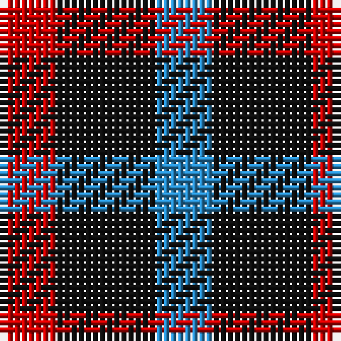

In pattern [BKR](/stripes/bkr/).

This was sourced from register-of-tartans.  It is a [3 stripe tartan](/stripes/stripes3/).

Original link https://www.tartanregister.gov.uk/tartanDetails.aspx?ref=4730

## Also known as

This cloth is also recorded under:

- Wilson's, No 198

## Attestations

This cloth appears in 2 source records; the oldest owns this page.

- 01/01/1819 — Wilson's No.198 (register-of-tartans, [record](https://www.tartanregister.gov.uk/tartanDetails.aspx?ref=4730))
- undated — Wilson's, No 198 (weddslist, [record](http://www.weddslist.com/cgi-bin/tartans/pg.pl?source=sts))

## Register references

External register numbers recorded for this tartan.

- Scottish Register of Tartans: [4730](https://www.tartanregister.gov.uk/tartanDetails.aspx?ref=4730)
- Scottish Tartans Authority (ITI): 1943
- Scottish Tartans World Register: 1943

## Thread count
R/8 K14 B/8

## Palette
Each colour and the base-6 reference it is a variant of.

| Colour | Shade | Base |
|---|---|---|
| B | <code style="background-color:#2888C4;">#2888C4</code> `oklch(60.1% 0.125 241.5)` <small>#2888C4</small> | B <code style="background-color:#2A418A;">#2A418A</code> |
| K | <code style="background-color:#101010;">#101010</code> `oklch(17.3% 0.000 89.9)` <small>#101010</small> | K <code style="background-color:#000000;">#000000</code> |
| LG | <code style="background-color:#789484;">#789484</code> `oklch(64.0% 0.040 160.0)` <small>#789484</small> | G <code style="background-color:#006100;">#006100</code> |
| R | <code style="background-color:#C80000;">#C80000</code> `oklch(52.3% 0.215 29.2)` <small>#C80000</small> | R <code style="background-color:#CC0000;">#CC0000</code> |
| Ra | <code style="background-color:#C80000;">#C80000</code> `oklch(52.3% 0.215 29.2)` <small>#C80000</small> | R <code style="background-color:#CC0000;">#CC0000</code> |

# Sample pattern

## Nearest tartans

The nearest existing variants by ΔTartan distance.

1. [Kazakhstan Relic (Artefact)](/setts/s3/lo5db5k3~x4/) — ΔT 1.02
1. [Wilson's No.200](/setts/s3/r4k7g4~x2/) — ΔT 1.28
1. [Wilson's No.061](/setts/s3/r4dg7t4~x2/) — ΔT 1.28
1. [Allen, Nicholas (Personal)](/setts/s3/dt1k2r1~x42/) — ΔT 1.35
1. [Kazakhstan Relic](/setts/s4/lo5db5k3~x4/) — ΔT 1.43
1. [Wilson's, No 209](/setts/s3/p5g4t2~x2/) — ΔT 1.58
1. [Wilson's No.094](/setts/s4/g4k5g4r2~x2/) — ΔT 1.78
1. [Wilson's No.202](/setts/s3/g7k4r4~x2/) — ΔT 1.79
1. [Daks, Black (Fashion)](/setts/s5/r3k6dy4k6ly3~x2/) — ΔT 1.81
1. [Kucher, Gregory (Personal)](/setts/s4/n2r1k1lr1~x10/) — ΔT 1.90

## Neighbour map

Every grey dot is one of 14299 variants placed by the first two principal components of the ΔTartan feature space (44% of its variance). Red is this tartan; blue dots are its nearest — click one to open its page.

<svg viewBox="0 0 640 380" role="img" style="max-width:100%;height:auto;border:1px solid #e0e0e0;border-radius:4px;display:block" xmlns="http://www.w3.org/2000/svg"><image href="/nn/cloud.v1.png" width="640" height="380"/><a href="/setts/s3/lo5db5k3~x4/"><circle cx="94.3" cy="366.0" r="4" fill="#3465a4"><title>Kazakhstan Relic (Artefact)</title></circle></a><a href="/setts/s3/r4k7g4~x2/"><circle cx="159.1" cy="366.0" r="4" fill="#3465a4"><title>Wilson's No.200</title></circle></a><a href="/setts/s3/r4dg7t4~x2/"><circle cx="161.9" cy="366.0" r="4" fill="#3465a4"><title>Wilson's No.061</title></circle></a><a href="/setts/s3/dt1k2r1~x42/"><circle cx="207.6" cy="366.0" r="4" fill="#3465a4"><title>Allen, Nicholas (Personal)</title></circle></a><a href="/setts/s4/lo5db5k3~x4/"><circle cx="171.7" cy="366.0" r="4" fill="#3465a4"><title>Kazakhstan Relic</title></circle></a><a href="/setts/s3/p5g4t2~x2/"><circle cx="185.7" cy="361.2" r="4" fill="#3465a4"><title>Wilson's, No 209</title></circle></a><a href="/setts/s4/g4k5g4r2~x2/"><circle cx="200.2" cy="359.2" r="4" fill="#3465a4"><title>Wilson's No.094</title></circle></a><a href="/setts/s3/g7k4r4~x2/"><circle cx="160.0" cy="366.0" r="4" fill="#3465a4"><title>Wilson's No.202</title></circle></a><a href="/setts/s5/r3k6dy4k6ly3~x2/"><circle cx="147.0" cy="327.0" r="4" fill="#3465a4"><title>Daks, Black (Fashion)</title></circle></a><a href="/setts/s4/n2r1k1lr1~x10/"><circle cx="104.8" cy="338.8" r="4" fill="#3465a4"><title>Kucher, Gregory (Personal)</title></circle></a><circle cx="142.3" cy="366.0" r="5" fill="#c00000"/></svg>

ID: /setts/s3/r4k7t4~x2/
