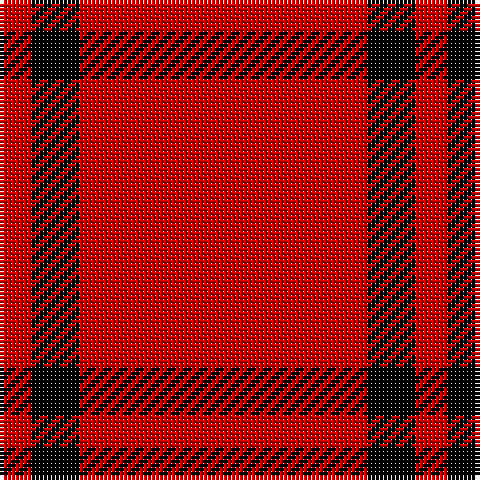

In pattern [RKR](/patterns/rkr/).

This was sourced from register-of-tartans.  It is a [3 stripes tartan](/stripes/stripes3/).

Original link https://www.tartanregister.gov.uk/tartanDetails.aspx?ref=436

## Attestations

This cloth appears in 2 source records; the oldest owns this page.

- 01/01/1968 — Buie (register-of-tartans, [record](https://www.tartanregister.gov.uk/tartanDetails.aspx?ref=436))
- 1968 — Buie (Name) (tartans-authority, [record](http://www.tartansauthority.com/tartan-ferret/display/1590/))

## Thread count
R/8 K12 R/72

## Palette
Each colour and its ΔE from the base-6 reference it is a variant of.

| Colour | Shade | Base | ΔE (OKLab) |
|---|---|---|---|
| K | <code style="background-color:#000000;">#000000</code> `#000000` | K <code style="background-color:#000000;">#000000</code> | 0.00 |
| R | <code style="background-color:#C80000;">#C80000</code> `#C80000` | R <code style="background-color:#CC0000;">#CC0000</code> | 0.01 |

# Sample pattern

## Nearest tartans

The nearest existing variants by ΔTartan distance.

1. [Buie Family Tartan Tartan Number: 1590. Earliest known date: pre 2003 A sample of this tartan was recorded by the Scottish Tartans Society during the period 1970 to 1990. See products available Copyright © Blair Urquhart, Comrie, 2015](/setts/s3/r72k12r8-k101010-rc80000/) — ΔT 1.29
1. [International Karate Fed. (Corporat)](/setts/s3/r160w20k20-k101010-r880000-we0e0e0/) — ΔT 1.95
1. [Martin Family, Robert N Personal Tartan Tartan Number: 10481. Earliest known date: 2011 May This tartan was designed to honour Robert Nunley Martin. The maroon and white colours represent Texas A&M University where Robert Nunley Martin (and his grandson, Ian Thomas Martin) were educated. The dark green represents Baylor University where Robert's mother, Vernon Nunley Martin, and his grandson, Ryan Len Martin graduated. See products available Copyright © Blair Urquhart, Comrie, 2015](/setts/s5/r108w12r24w8g12-g004820-r800000-we0e0e0/) — ΔT 2.39
1. [Buie](/setts/s3/r72k12r8-k000000-r802040/) — ΔT 2.39
1. [Roddy "Rowdy" Piper (Personal)](/setts/s2/r180y20-r8c0000-yb0b0b0/) — ΔT 2.41
1. [Masai Shuka 07 (Artefact)](/setts/s5/r150k30r8k30r8-k101010-rc80000/) — ΔT 2.57
1. [Martin, Robert N (Personal)](/setts/s5/r108w12r24w8g12-g003820-r901c38-we0e0e0/) — ΔT 2.57
1. [Masai Shuka 12 (Artefact)](/setts/s4/r100k20r4k20-k101010-rc80000/) — ΔT 2.71
1. [Masai Shuka 21 (Artefact)](/setts/s4/r80b4r12b30-b2c2c80-rc80000/) — ΔT 2.81
1. [Masai Shuka 20 (Artefact)](/setts/s3/r120k40y12-k101010-rc80000-ye8c000/) — ΔT 2.82

## Neighbour map

Every grey dot is one of 15726 variants placed by the first two principal components of the ΔTartan feature space (44% of its variance). Red is this tartan; blue dots are its nearest — click one to open its page.

<svg viewBox="0 0 640 380" role="img" style="max-width:100%;height:auto;border:1px solid #e0e0e0;border-radius:4px;display:block" xmlns="http://www.w3.org/2000/svg"><image href="/nn/cloud.v1.png" width="640" height="380"/><a href="/setts/s3/r72k12r8-k101010-rc80000/"><circle cx="626.0" cy="270.1" r="4" fill="#3465a4"><title>Buie Family Tartan Tartan Number: 1590. Earliest known date: pre 2003 A sample of this tartan was recorded by the Scottish Tartans Society during the period 1970 to 1990. See products available Copyright © Blair Urquhart, Comrie, 2015</title></circle></a><a href="/setts/s3/r160w20k20-k101010-r880000-we0e0e0/"><circle cx="527.8" cy="249.1" r="4" fill="#3465a4"><title>International Karate Fed. (Corporat)</title></circle></a><a href="/setts/s5/r108w12r24w8g12-g004820-r800000-we0e0e0/"><circle cx="547.0" cy="197.7" r="4" fill="#3465a4"><title>Martin Family, Robert N Personal Tartan Tartan Number: 10481. Earliest known date: 2011 May This tartan was designed to honour Robert Nunley Martin. The maroon and white colours represent Texas A&amp;M University where Robert Nunley Martin (and his grandson, Ian Thomas Martin) were educated. The dark green represents Baylor University where Robert's mother, Vernon Nunley Martin, and his grandson, Ryan Len Martin graduated. See products available Copyright © Blair Urquhart, Comrie, 2015</title></circle></a><a href="/setts/s3/r72k12r8-k000000-r802040/"><circle cx="626.0" cy="282.1" r="4" fill="#3465a4"><title>Buie</title></circle></a><a href="/setts/s2/r180y20-r8c0000-yb0b0b0/"><circle cx="626.0" cy="315.3" r="4" fill="#3465a4"><title>Roddy &quot;Rowdy&quot; Piper (Personal)</title></circle></a><a href="/setts/s5/r150k30r8k30r8-k101010-rc80000/"><circle cx="543.2" cy="196.2" r="4" fill="#3465a4"><title>Masai Shuka 07 (Artefact)</title></circle></a><a href="/setts/s5/r108w12r24w8g12-g003820-r901c38-we0e0e0/"><circle cx="552.4" cy="197.9" r="4" fill="#3465a4"><title>Martin, Robert N (Personal)</title></circle></a><a href="/setts/s4/r100k20r4k20-k101010-rc80000/"><circle cx="540.3" cy="203.8" r="4" fill="#3465a4"><title>Masai Shuka 12 (Artefact)</title></circle></a><a href="/setts/s4/r80b4r12b30-b2c2c80-rc80000/"><circle cx="551.6" cy="226.8" r="4" fill="#3465a4"><title>Masai Shuka 21 (Artefact)</title></circle></a><a href="/setts/s3/r120k40y12-k101010-rc80000-ye8c000/"><circle cx="438.8" cy="244.3" r="4" fill="#3465a4"><title>Masai Shuka 20 (Artefact)</title></circle></a><circle cx="615.3" cy="257.1" r="5" fill="#c00000"/></svg>

ID: /setts/s3/r72k12r8-k000000-rc80000/
