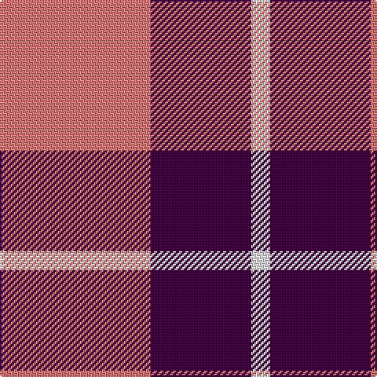

In pattern [RBW](/patterns/rbw/).

This was sourced from tartans-authority.  It is a [3 stripes tartan](/stripes/stripes3/).

Original link http://www.tartansauthority.com/tartan-ferret/display/10685/

## Thread count
LR/96 DP64 W/12

## Palette
Each colour and its ΔE from the base-6 reference it is a variant of.

| Colour | Shade | Base | ΔE (OKLab) |
|---|---|---|---|
| DP | <code style="background-color:#440044;">#440044</code> `#440044` | B <code style="background-color:#2A418A;">#2A418A</code> | 0.18 |
| LR | <code style="background-color:#E87878;">#E87878</code> `#E87878` | R <code style="background-color:#CC0000;">#CC0000</code> | 0.19 |
| W | <code style="background-color:#FCFCFC;">#FCFCFC</code> `#FCFCFC` | W <code style="background-color:#F7F7F7;">#F7F7F7</code> | 0.01 |

# Sample pattern

## Nearest tartans

The nearest existing variants by ΔTartan distance.

1. [National Autistic Society Scotland](/setts/s3/r96b64w12-b5c2458-re82460-we8e8e8/) — ΔT 1.49
1. [Hose (Dunmore)](/setts/s3/r52k4w52-k000000-rc80000-wc8c8c8/) — ΔT 1.64
1. [Masai Shuka 24 (Artefact)](/setts/s4/b60w8r80w12-b2888c4-rc80000-we0e0e0/) — ΔT 1.66
1. [Hamilton (Clan)](/setts/s5/b32r8b32r60w8-b2c2c80-rc80000-we0e0e0/) — ΔT 1.66
1. [Masai Shuka 28 (Artefact)](/setts/s3/w18r40b4-b2c2c80-rc80000-wd4d4d4/) — ΔT 1.68
1. [MacRae of Conchra](/setts/s4/k10w74r74w10-k000000-rc00000-we0e0e0/) — ΔT 1.79
1. [Hamilton Red Clan Tartan Tartan Number: 477. Earliest known date: 1842 First recorded in the Vestiarium Scoticum which was supposedly based on an ancient manuscript now known to have been forged. The original illustration shows the four main stripes in a very dark shade of blue. There is no evidence of a Hamilton tartan prior to the publication of this spectacular work. The authors, the Sobieski Stuart brothers, enjoyed a popular following amongst the Scottish gentry of the period and it is probable that the design can be attributed to Charles Edward Stuart (Allan Hay) who prepared the illustrations for the book. See products available Copyright © Blair Urquhart, Comrie, 2015](/setts/s5/b24r4b24r36w4-b2c2c80-rc80000-we0e0e0/) — ΔT 1.82
1. [Masai Shuka 25 (Artefact)](/setts/s5/b30w4r40b4r8-b2c2c80-rc80000-we0e0e0/) — ΔT 1.84
1. [Lewis, Magenta (Dance)](/setts/s4/w8r62w70y8-rb80478-wf0e0c8-y54b8b8/) — ΔT 1.87
1. [MacRae of Conchra #2](/setts/s4/k10w74r74w10-k101010-rdc0000-we0e0e0/) — ΔT 1.93

## Neighbour map

Every grey dot is one of 15726 variants placed by the first two principal components of the ΔTartan feature space (44% of its variance). Red is this tartan; blue dots are its nearest — click one to open its page.

<svg viewBox="0 0 640 380" role="img" style="max-width:100%;height:auto;border:1px solid #e0e0e0;border-radius:4px;display:block" xmlns="http://www.w3.org/2000/svg"><image href="/nn/cloud.v1.png" width="640" height="380"/><a href="/setts/s3/r96b64w12-b5c2458-re82460-we8e8e8/"><circle cx="347.4" cy="269.8" r="4" fill="#3465a4"><title>National Autistic Society Scotland</title></circle></a><a href="/setts/s3/r52k4w52-k000000-rc80000-wc8c8c8/"><circle cx="308.3" cy="238.8" r="4" fill="#3465a4"><title>Hose (Dunmore)</title></circle></a><a href="/setts/s4/b60w8r80w12-b2888c4-rc80000-we0e0e0/"><circle cx="302.0" cy="232.0" r="4" fill="#3465a4"><title>Masai Shuka 24 (Artefact)</title></circle></a><a href="/setts/s5/b32r8b32r60w8-b2c2c80-rc80000-we0e0e0/"><circle cx="296.6" cy="246.6" r="4" fill="#3465a4"><title>Hamilton (Clan)</title></circle></a><a href="/setts/s3/w18r40b4-b2c2c80-rc80000-wd4d4d4/"><circle cx="390.8" cy="242.9" r="4" fill="#3465a4"><title>Masai Shuka 28 (Artefact)</title></circle></a><a href="/setts/s4/k10w74r74w10-k000000-rc00000-we0e0e0/"><circle cx="274.5" cy="225.8" r="4" fill="#3465a4"><title>MacRae of Conchra</title></circle></a><a href="/setts/s5/b24r4b24r36w4-b2c2c80-rc80000-we0e0e0/"><circle cx="321.7" cy="244.8" r="4" fill="#3465a4"><title>Hamilton Red Clan Tartan Tartan Number: 477. Earliest known date: 1842 First recorded in the Vestiarium Scoticum which was supposedly based on an ancient manuscript now known to have been forged. The original illustration shows the four main stripes in a very dark shade of blue. There is no evidence of a Hamilton tartan prior to the publication of this spectacular work. The authors, the Sobieski Stuart brothers, enjoyed a popular following amongst the Scottish gentry of the period and it is probable that the design can be attributed to Charles Edward Stuart (Allan Hay) who prepared the illustrations for the book. See products available Copyright © Blair Urquhart, Comrie, 2015</title></circle></a><a href="/setts/s5/b30w4r40b4r8-b2c2c80-rc80000-we0e0e0/"><circle cx="360.2" cy="220.5" r="4" fill="#3465a4"><title>Masai Shuka 25 (Artefact)</title></circle></a><a href="/setts/s4/w8r62w70y8-rb80478-wf0e0c8-y54b8b8/"><circle cx="309.2" cy="221.8" r="4" fill="#3465a4"><title>Lewis, Magenta (Dance)</title></circle></a><a href="/setts/s4/k10w74r74w10-k101010-rdc0000-we0e0e0/"><circle cx="284.1" cy="226.6" r="4" fill="#3465a4"><title>MacRae of Conchra #2</title></circle></a><circle cx="307.3" cy="259.7" r="5" fill="#c00000"/></svg>

ID: /setts/s3/r96b64w12-b440044-re87878-wfcfcfc/
