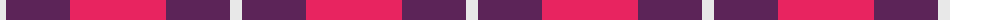
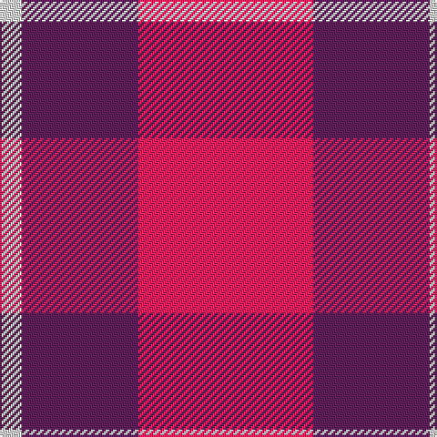

In pattern [RBW](/patterns/rbw/).

This was sourced from register-of-tartans.  It is a [3 stripes tartan](/stripes/stripes3/).

Original link https://www.tartanregister.gov.uk/tartanDetails.aspx?ref=10685

## Attestations

This cloth appears in 2 source records; the oldest owns this page.

- 28/08/2012 — National Autistic Society Scotland (register-of-tartans, [record](https://www.tartanregister.gov.uk/tartanDetails.aspx?ref=10685))
- undated — National Autistic Society Scotla Corporate Tartan Tartan Number: 10685. Earliest known date: 30 August 2012 A simple and bold design using the highly identifiable colours of the National Autistic Society. This tartan is intended for use by the Scottish members of the Society. See products available Copyright © Blair Urquhart, Comrie, 2015 (house-of-tartan, [record](http://www.house-of-tartan.scotland.net/house/TartanViewjs.asp?colr=Def&tnam=10685))

## Thread count
LN/12 DR64 R/96

## Palette
Each colour and its ΔE from the base-6 reference it is a variant of.

| Colour | Shade | Base | ΔE (OKLab) |
|---|---|---|---|
| DR | <code style="background-color:#5C2458;">#5C2458</code> `#5C2458` | B <code style="background-color:#2C4084;">#2C4084</code> | 0.12 |
| LN | <code style="background-color:#E8E8E8;">#E8E8E8</code> `#E8E8E8` | W <code style="background-color:#F4F4F0;">#F4F4F0</code> | 0.04 |
| R | <code style="background-color:#E82460;">#E82460</code> `#E82460` | R <code style="background-color:#C80000;">#C80000</code> | 0.11 |

# Sample pattern

ID: /setts/s3/r96b64w12-b5c2458-re82460-we8e8e8/
