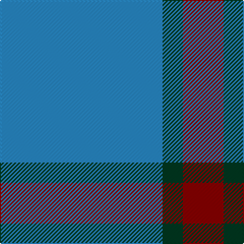

This page is one **sett** — a single exact thread-count. It belongs to the [tartan](/tartans/b8dg1dr2/)
(the same proportion at any scale), whose colour order is pattern [BGR](/stripes/bgr/).

Sourced from tartans-authority.  It is a [3 stripe tartan](/stripes/stripes3/).

Original link http://www.tartansauthority.com/tartan-ferret/display/2692/

## Thread count
B/160 DG20 DR/40

## Palette
Each colour and the base-6 reference it is a variant of.

| Colour | Shade | Base |
|---|---|---|
| B | <code style="background-color:#2888C4;">#2888C4</code> `oklch(60.1% 0.125 241.5)` <small>#2888C4</small> | B <code style="background-color:#2A418A;">#2A418A</code> |
| DG | <code style="background-color:#003820;">#003820</code> `oklch(30.0% 0.070 158.3)` <small>#003820</small> | G <code style="background-color:#006100;">#006100</code> |
| DR | <code style="background-color:#880000;">#880000</code> `oklch(39.4% 0.162 29.2)` <small>#880000</small> | R <code style="background-color:#CC0000;">#CC0000</code> |

# Sample pattern

## Nearest tartans

The nearest existing variants by ΔTartan distance, with this tartan at the top so the swatches line up against it.

ΔTartan

Tartan

Sett

—

<a href="/ttd/edit/#slug=t8dg1r2~x20">Gyle (Corporate)</a> <a class="nn-out" href="/setts/s3/t8dg1r2~x20/" title="open its dictionary page">↗</a>

1.13

<a href="/setts/s4/t8dg1r2~x20/">Gyle</a>

1.68

<a href="/ttd/edit/#slug=t9db1w1ly1~x20">Varrie Commemorative Tartan Tartan Number: 9113. Earliest known date: 2009 November I have designed this tartan in remembrance of my mother Jean Alexander Varrie and for her Scottish Heritage, and all the Varrie Family's can used this design. See products available Copyright © Blair Urquhart, Comrie, 2015</a> <a class="nn-out" href="/setts/s4/t9db1w1ly1~x20/" title="open its dictionary page">↗</a>

1.69

<a href="/ttd/edit/#slug=b4g8b18w3~x2">Blue Meadow Check (Fashion)</a> <a class="nn-out" href="/setts/s4/b4g8b18w3~x2/" title="open its dictionary page">↗</a>

1.72

<a href="/ttd/edit/#slug=ly6t38k3~x2">Poulain League (Corporate)</a> <a class="nn-out" href="/setts/s3/ly6t38k3~x2/" title="open its dictionary page">↗</a>

1.83

<a href="/ttd/edit/#slug=dt72b6dt12b17w6~x2">GulfMark</a> <a class="nn-out" href="/setts/s5/dt72b6dt12b17w6~x2/" title="open its dictionary page">↗</a>

1.99

<a href="/ttd/edit/#slug=b30ly5b4r12~x4">UEFA (Corporate)</a> <a class="nn-out" href="/setts/s4/b30ly5b4r12~x4/" title="open its dictionary page">↗</a>

2.00

<a href="/ttd/edit/#slug=b11lo2r1lo2r1~x4">Carlisle Ancient</a> <a class="nn-out" href="/setts/s5/b11lo2r1lo2r1~x4/" title="open its dictionary page">↗</a>

2.01

<a href="/ttd/edit/#slug=n25k9n10w2~x4">Graham Grey - 1820 (Fashion?)</a> <a class="nn-out" href="/setts/s4/n25k9n10w2~x4/" title="open its dictionary page">↗</a>

2.01

<a href="/ttd/edit/#slug=t11db1w1ly1~x20">Varrie</a> <a class="nn-out" href="/setts/s4/t11db1w1ly1~x20/" title="open its dictionary page">↗</a>

2.06

<a href="/ttd/edit/#slug=dt50k12dt21w5~x2">Coinean Dubh</a> <a class="nn-out" href="/setts/s4/dt50k12dt21w5~x2/" title="open its dictionary page">↗</a>

## Neighbour map

Every grey dot is one of 14299 variants placed by the first two principal components of the ΔTartan feature space (44% of its variance). Red is this tartan; blue dots are its nearest — click one to open its page.

<svg viewBox="0 0 640 380" role="img" style="max-width:100%;height:auto;border:1px solid #e0e0e0;border-radius:4px;display:block" xmlns="http://www.w3.org/2000/svg"><image href="/nn/cloud.v1.png" width="640" height="380"/><a href="/setts/s4/t8dg1r2~x20/"><circle cx="406.1" cy="255.2" r="4" fill="#3465a4"><title>Gyle</title></circle></a><a href="/setts/s4/t9db1w1ly1~x20/"><circle cx="461.9" cy="225.5" r="4" fill="#3465a4"><title>Varrie Commemorative Tartan Tartan Number: 9113. Earliest known date: 2009 November I have designed this tartan in remembrance of my mother Jean Alexander Varrie and for her Scottish Heritage, and all the Varrie Family's can used this design. See products available Copyright © Blair Urquhart, Comrie, 2015</title></circle></a><a href="/setts/s4/b4g8b18w3~x2/"><circle cx="366.3" cy="285.1" r="4" fill="#3465a4"><title>Blue Meadow Check (Fashion)</title></circle></a><a href="/setts/s3/ly6t38k3~x2/"><circle cx="529.8" cy="248.3" r="4" fill="#3465a4"><title>Poulain League (Corporate)</title></circle></a><a href="/setts/s5/dt72b6dt12b17w6~x2/"><circle cx="512.1" cy="236.8" r="4" fill="#3465a4"><title>GulfMark</title></circle></a><a href="/setts/s4/b30ly5b4r12~x4/"><circle cx="381.9" cy="250.7" r="4" fill="#3465a4"><title>UEFA (Corporate)</title></circle></a><a href="/setts/s5/b11lo2r1lo2r1~x4/"><circle cx="396.5" cy="209.3" r="4" fill="#3465a4"><title>Carlisle Ancient</title></circle></a><a href="/setts/s4/n25k9n10w2~x4/"><circle cx="481.1" cy="260.5" r="4" fill="#3465a4"><title>Graham Grey - 1820 (Fashion?)</title></circle></a><a href="/setts/s4/t11db1w1ly1~x20/"><circle cx="512.0" cy="219.8" r="4" fill="#3465a4"><title>Varrie</title></circle></a><a href="/setts/s4/dt50k12dt21w5~x2/"><circle cx="508.5" cy="276.5" r="4" fill="#3465a4"><title>Coinean Dubh</title></circle></a><circle cx="453.2" cy="280.6" r="5" fill="#c00000"/></svg>

ID: /setts/s3/t8dg1r2~x20/
