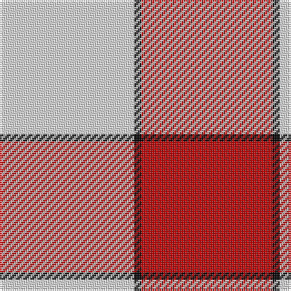

In pattern [RKW](/patterns/rkw/).

This was sourced from weddslist.  It is a [3 stripes tartan](/stripes/stripes3/).

Original link http://www.weddslist.com/cgi-bin/tartans/pg.pl?source=sts

## Thread count
LN/74 K4 R/72

## Palette
Each colour and its ΔE from the base-6 reference it is a variant of.

| Colour | Shade | Base | ΔE (OKLab) |
|---|---|---|---|
| K | <code style="background-color:#000000;">#000000</code> `#000000` | K <code style="background-color:#000000;">#000000</code> | 0.00 |
| LN | <code style="background-color:#E0E0E0;">#E0E0E0</code> `#E0E0E0` | W <code style="background-color:#F4F4F0;">#F4F4F0</code> | 0.06 |
| R | <code style="background-color:#C00000;">#C00000</code> `#C00000` | R <code style="background-color:#C80000;">#C80000</code> | 0.02 |

# Sample pattern

## Nearest tartans

The nearest existing variants by ΔTartan distance.

1. [Hose (Dunmore)](/setts/s3/r52k4w52-k000000-rc80000-wc8c8c8/) — ΔT 0.72
1. [MacRae of Conchra #2](/setts/s4/k10w74r74w10-k101010-rdc0000-we0e0e0/) — ΔT 1.59
1. [MacRae of Conchra](/setts/s4/k10w74r74w10-k000000-rc00000-we0e0e0/) — ΔT 1.61
1. [Lewis, Magenta (Dance)](/setts/s4/w8r62w70y8-rb80478-wf0e0c8-y54b8b8/) — ΔT 1.78
1. [Lewis, Red (Dance)](/setts/s4/r8w70r62w8-rd40000-wf0e0c8/) — ΔT 1.85
1. [Malaysian Unknown (Artefact)](/setts/s5/w90r4g18w4r60-g006818-r880000-we8ccb8/) — ΔT 1.86
1. [Buchanan #5](/setts/s6/k4w56r26w4r26w4-k101010-r960028-we0e0e0/) — ΔT 1.95
1. [Masai Shuka 28 (Artefact)](/setts/s3/w18r40b4-b2c2c80-rc80000-wd4d4d4/) — ΔT 1.96
1. [Masai Shuka 24 (Artefact)](/setts/s4/b60w8r80w12-b2888c4-rc80000-we0e0e0/) — ΔT 1.96
1. [Buchanan VS](/setts/s6/w2r4w2r4w9k1-k000000-rff0000-wd0d0d0/) — ΔT 2.01

## Neighbour map

Every grey dot is one of 15726 variants placed by the first two principal components of the ΔTartan feature space (44% of its variance). Red is this tartan; blue dots are its nearest — click one to open its page.

<svg viewBox="0 0 640 380" role="img" style="max-width:100%;height:auto;border:1px solid #e0e0e0;border-radius:4px;display:block" xmlns="http://www.w3.org/2000/svg"><image href="/nn/cloud.v1.png" width="640" height="380"/><a href="/setts/s3/r52k4w52-k000000-rc80000-wc8c8c8/"><circle cx="308.3" cy="238.8" r="4" fill="#3465a4"><title>Hose (Dunmore)</title></circle></a><a href="/setts/s4/k10w74r74w10-k101010-rdc0000-we0e0e0/"><circle cx="284.1" cy="226.6" r="4" fill="#3465a4"><title>MacRae of Conchra #2</title></circle></a><a href="/setts/s4/k10w74r74w10-k000000-rc00000-we0e0e0/"><circle cx="274.5" cy="225.8" r="4" fill="#3465a4"><title>MacRae of Conchra</title></circle></a><a href="/setts/s4/w8r62w70y8-rb80478-wf0e0c8-y54b8b8/"><circle cx="309.2" cy="221.8" r="4" fill="#3465a4"><title>Lewis, Magenta (Dance)</title></circle></a><a href="/setts/s4/r8w70r62w8-rd40000-wf0e0c8/"><circle cx="353.0" cy="238.0" r="4" fill="#3465a4"><title>Lewis, Red (Dance)</title></circle></a><a href="/setts/s5/w90r4g18w4r60-g006818-r880000-we8ccb8/"><circle cx="336.3" cy="167.3" r="4" fill="#3465a4"><title>Malaysian Unknown (Artefact)</title></circle></a><a href="/setts/s6/k4w56r26w4r26w4-k101010-r960028-we0e0e0/"><circle cx="323.9" cy="174.9" r="4" fill="#3465a4"><title>Buchanan #5</title></circle></a><a href="/setts/s3/w18r40b4-b2c2c80-rc80000-wd4d4d4/"><circle cx="390.8" cy="242.9" r="4" fill="#3465a4"><title>Masai Shuka 28 (Artefact)</title></circle></a><a href="/setts/s4/b60w8r80w12-b2888c4-rc80000-we0e0e0/"><circle cx="302.0" cy="232.0" r="4" fill="#3465a4"><title>Masai Shuka 24 (Artefact)</title></circle></a><a href="/setts/s6/w2r4w2r4w9k1-k000000-rff0000-wd0d0d0/"><circle cx="324.6" cy="210.1" r="4" fill="#3465a4"><title>Buchanan VS</title></circle></a><circle cx="319.5" cy="218.7" r="5" fill="#c00000"/></svg>

ID: /setts/s3/w74k4r72-k000000-rc00000-we0e0e0/
