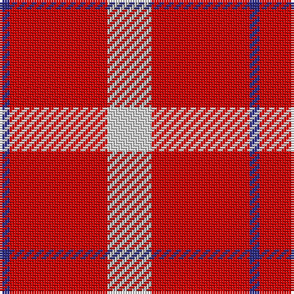

In pattern [BRW](/patterns/brw/).

This was sourced from tartans-authority.  It is a [3 stripes tartan](/stripes/stripes3/).

Original link http://www.tartansauthority.com/tartan-ferret/display/7288/

## Thread count
DB/4 R40 LN/18

## Palette
Each colour and its ΔE from the base-6 reference it is a variant of.

| Colour | Shade | Base | ΔE (OKLab) |
|---|---|---|---|
| DB | <code style="background-color:#2C2C80;">#2C2C80</code> `#2C2C80` | B <code style="background-color:#2A418A;">#2A418A</code> | 0.06 |
| LN | <code style="background-color:#D4D4D4;">#D4D4D4</code> `#D4D4D4` | W <code style="background-color:#F7F7F7;">#F7F7F7</code> | 0.11 |
| R | <code style="background-color:#C80000;">#C80000</code> `#C80000` | R <code style="background-color:#CC0000;">#CC0000</code> | 0.01 |

# Sample pattern

## Nearest tartans

The nearest existing variants by ΔTartan distance.

1. [Masai Shuka 26 (Artefact)](/setts/s4/y3k2r10k1x4~k101010-rc80000-ye8c000/) — ΔT 1.53
1. [Masai Shuka 20 (Artefact)](/setts/s3/r30k10y3x4~k101010-rc80000-ye8c000/) — ΔT 1.53
1. [McPeek (Fashion)](/setts/s4/r125k26w20y16~k101010-rc80000-wa8d0ec-yfca428/) — ΔT 1.62
1. [Hose (Dunmore)](/setts/s3/r13k1w13x4~k000000-rc80000-wc8c8c8/) — ΔT 1.67
1. [Loch Morar Trade Tartan Tartan Number: 1701. Earliest known date: pre 2003 Nothing See products available Copyright © Blair Urquhart, Comrie, 2015](/setts/s5/r38w9r3b9w3x2~b441800-rc80000-we0e0e0/) — ΔT 1.68
1. [National Autistic Society Scotland](/setts/s3/r24b16w3x4~b440044-re87878-wfcfcfc/) — ΔT 1.68
1. [Loch Morar](/setts/s5/r38w9r3b9w3x2~b401000-rc00000-we0e0e0/) — ΔT 1.70
1. [Ploysongsang, Edward Thiravej (Pers](/setts/s6/r34w4b7y10b7r18x2~b5c8ca8-rc80000-wfcfcfc-yfccc00/) — ΔT 1.81
1. [MacKinnon #6](/setts/s4/r3g20r25w3x4~g005020-rdc0000-we0e0e0/) — ΔT 1.81
1. [Lewis, Red (Dance)](/setts/s4/r4w35r31w4x2~rd40000-wf0e0c8/) — ΔT 1.88

## Neighbour map

Every grey dot is one of 15726 variants placed by the first two principal components of the ΔTartan feature space (44% of its variance). Red is this tartan; blue dots are its nearest — click one to open its page.

<svg viewBox="0 0 640 380" role="img" style="max-width:100%;height:auto;border:1px solid #e0e0e0;border-radius:4px;display:block" xmlns="http://www.w3.org/2000/svg"><image href="/nn/cloud.v1.png" width="640" height="380"/><a href="/setts/s4/y3k2r10k1x4~k101010-rc80000-ye8c000/"><circle cx="368.2" cy="221.1" r="4" fill="#3465a4"><title>Masai Shuka 26 (Artefact)</title></circle></a><a href="/setts/s3/r30k10y3x4~k101010-rc80000-ye8c000/"><circle cx="435.7" cy="250.1" r="4" fill="#3465a4"><title>Masai Shuka 20 (Artefact)</title></circle></a><a href="/setts/s4/r125k26w20y16~k101010-rc80000-wa8d0ec-yfca428/"><circle cx="377.7" cy="209.2" r="4" fill="#3465a4"><title>McPeek (Fashion)</title></circle></a><a href="/setts/s3/r13k1w13x4~k000000-rc80000-wc8c8c8/"><circle cx="305.7" cy="242.8" r="4" fill="#3465a4"><title>Hose (Dunmore)</title></circle></a><a href="/setts/s5/r38w9r3b9w3x2~b441800-rc80000-we0e0e0/"><circle cx="415.8" cy="191.1" r="4" fill="#3465a4"><title>Loch Morar Trade Tartan Tartan Number: 1701. Earliest known date: pre 2003 Nothing See products available Copyright © Blair Urquhart, Comrie, 2015</title></circle></a><a href="/setts/s3/r24b16w3x4~b440044-re87878-wfcfcfc/"><circle cx="304.2" cy="264.2" r="4" fill="#3465a4"><title>National Autistic Society Scotland</title></circle></a><a href="/setts/s5/r38w9r3b9w3x2~b401000-rc00000-we0e0e0/"><circle cx="413.8" cy="191.5" r="4" fill="#3465a4"><title>Loch Morar</title></circle></a><a href="/setts/s6/r34w4b7y10b7r18x2~b5c8ca8-rc80000-wfcfcfc-yfccc00/"><circle cx="354.6" cy="206.7" r="4" fill="#3465a4"><title>Ploysongsang, Edward Thiravej (Pers</title></circle></a><a href="/setts/s4/r3g20r25w3x4~g005020-rdc0000-we0e0e0/"><circle cx="335.2" cy="246.0" r="4" fill="#3465a4"><title>MacKinnon #6</title></circle></a><a href="/setts/s4/r4w35r31w4x2~rd40000-wf0e0c8/"><circle cx="349.9" cy="242.4" r="4" fill="#3465a4"><title>Lewis, Red (Dance)</title></circle></a><circle cx="387.7" cy="247.9" r="5" fill="#c00000"/></svg>

ID: /setts/s3/w9r20b2x2~b2c2c80-rc80000-wd4d4d4/
