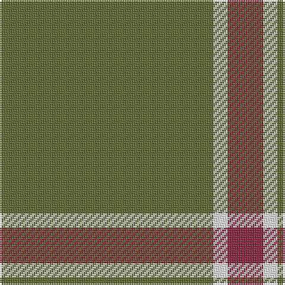

This page is one **sett** — a single exact thread-count. It belongs to the [tartan](/tartans/y30w2r5/)
(the same proportion at any scale), whose colour order is pattern [GWR](/stripes/gwr/).

Sourced from register-of-tartans.  It is a [3 stripe tartan](/stripes/stripes3/).

Original link https://www.tartanregister.gov.uk/tartanDetails.aspx?ref=3630

## Also known as

This cloth is also recorded under:

- Strategic Staffing Solutions (Corpor

2 attestations — the source records this cloth was collapsed from (oldest owns this page)

<ul>
<li>16/03/2004 — S3 (register-of-tartans, <a href="https://www.tartanregister.gov.uk/tartanDetails.aspx?ref=3630">record</a>)</li>
<li>pre 2004 — Strategic Staffing Solutions (Corpor (tartans-authority, <a href="http://www.tartansauthority.com/tartan-ferret/display/6227/">record</a>)</li>
</ul>

## Register references

External register numbers recorded for this tartan.

- Scottish Register of Tartans: [3630](https://www.tartanregister.gov.uk/tartanDetails.aspx?ref=3630)
- Scottish Tartans Authority (ITI): 6227
- Scottish Tartans World Register: 2986

## Thread count
G/120 W8 DR/20

## Palette

Palette: <strong>Tartan Register</strong>
<table><thead><tr><th>Colour</th><th>Threads</th><th>Shade</th><th>Base</th><th>OKLCh</th></tr></thead><tbody><tr><td>G/</td><td style="text-align:right;font-variant-numeric:tabular-nums">120</td><td><code style="background-color:#5C6428;">#5C6428</code> <small style="color:#888">#5C6428</small></td><td>G <code style="background-color:#006100;">#006100</code></td><td><small style="color:#888">oklch(48.3% 0.084 116.0)</small></td></tr><tr><td>W</td><td style="text-align:right;font-variant-numeric:tabular-nums">8</td><td><code style="background-color:#FCFCFC;">#FCFCFC</code> <small style="color:#888">#FCFCFC</small></td><td>W <code style="background-color:#F7F7F7;">#F7F7F7</code></td><td><small style="color:#888">oklch(99.1% 0.000 89.9)</small></td></tr><tr><td>DR/</td><td style="text-align:right;font-variant-numeric:tabular-nums">20</td><td><code style="background-color:#901C38;">#901C38</code> <small style="color:#888">#901C38</small></td><td>R <code style="background-color:#CC0000;">#CC0000</code></td><td><small style="color:#888">oklch(43.2% 0.150 13.1)</small></td></tr></tbody></table>

# Sample pattern

## Nearest tartans

The nearest existing variants by ΔTartan distance, with this tartan at the top so the swatches line up against it.

ΔTartan

Tartan

Sett

—

<a href="/ttd/edit/#slug=y30w2r5~x4">S3</a> <a class="nn-out" href="/setts/s3/y30w2r5~x4/" title="open its dictionary page">↗</a>

1.75

<a href="/ttd/edit/#slug=db1lo9db2lo9r1~x4">Brooks Brothers Tattersall Camel</a> <a class="nn-out" href="/setts/s5/db1lo9db2lo9r1~x4/" title="open its dictionary page">↗</a>

1.76

<a href="/ttd/edit/#slug=dy9t3dy6t3dy20ly2~x2">Oman RAF, Sultanate of (Military)</a> <a class="nn-out" href="/setts/s6/dy9t3dy6t3dy20ly2~x2/" title="open its dictionary page">↗</a>

1.89

<a href="/ttd/edit/#slug=r8g3r4g44w4~x2">Welsh National (District)</a> <a class="nn-out" href="/setts/s5/r8g3r4g44w4~x2/" title="open its dictionary page">↗</a>

1.98

<a href="/ttd/edit/#slug=g49w4lo11~x2">Hibernian S3</a> <a class="nn-out" href="/setts/s3/g49w4lo11~x2/" title="open its dictionary page">↗</a>

1.99

<a href="/ttd/edit/#slug=dg12db3ly1~x4">Unidentified pattern #2</a> <a class="nn-out" href="/setts/s3/dg12db3ly1~x4/" title="open its dictionary page">↗</a>

2.05

<a href="/ttd/edit/#slug=m2g1m1g10w1~x4">Welsh National District Tartan Tartan Number: 1523. Earliest known date: 1968 The Welsh Tartan owes its origin to a Society formed in Cardiff in 1967. Its aims were cultural and political - to strengthen Celtic ties and give visible signs of being an individual nation in culture, language and dress. The colours are those of the Welsh flag. It is said that the design was based on the Lord of the Isles tartan because the present Lord is also Prince of Wales. However comparison reveals similarity only to MacDonald, MacDonald of the Isles, or perhaps Applecross district. See products available Copyright © Blair Urquhart, Comrie, 2015</a> <a class="nn-out" href="/setts/s5/m2g1m1g10w1~x4/" title="open its dictionary page">↗</a>

2.07

<a href="/ttd/edit/#slug=dp7g23r3g7~x2">Highland Spring (1997) (Corporate)</a> <a class="nn-out" href="/setts/s4/dp7g23r3g7~x2/" title="open its dictionary page">↗</a>

2.16

<a href="/ttd/edit/#slug=g7r3g23m7~x2">Highland Spring (Green)</a> <a class="nn-out" href="/setts/s4/g7r3g23m7~x2/" title="open its dictionary page">↗</a>

2.17

<a href="/ttd/edit/#slug=dy12lo6dy2ly1~x4">Loch Garth Tartan Tartan Number: 1750. Earliest known date: pre 2003 Nothing See products available Copyright © Blair Urquhart, Comrie, 2015</a> <a class="nn-out" href="/setts/s4/dy12lo6dy2ly1~x4/" title="open its dictionary page">↗</a>

2.24

<a href="/ttd/edit/#slug=n25k9n10w2~x4">Graham Grey - 1820 (Fashion?)</a> <a class="nn-out" href="/setts/s4/n25k9n10w2~x4/" title="open its dictionary page">↗</a>

## Neighbour map

Every grey dot is one of 14359 variants placed by the first two principal components of the ΔTartan feature space (44% of its variance). Red is this tartan; blue dots are its nearest — click one to open its page.

<svg viewBox="0 0 640 380" role="img" style="max-width:100%;height:auto;border:1px solid #e0e0e0;border-radius:4px;display:block" xmlns="http://www.w3.org/2000/svg"><image href="/nn/cloud.v1.png" width="640" height="380"/><a href="/setts/s5/db1lo9db2lo9r1~x4/"><circle cx="533.4" cy="249.4" r="4" fill="#3465a4"><title>Brooks Brothers Tattersall Camel</title></circle></a><a href="/setts/s6/dy9t3dy6t3dy20ly2~x2/"><circle cx="557.9" cy="256.6" r="4" fill="#3465a4"><title>Oman RAF, Sultanate of (Military)</title></circle></a><a href="/setts/s5/r8g3r4g44w4~x2/"><circle cx="503.5" cy="208.4" r="4" fill="#3465a4"><title>Welsh National (District)</title></circle></a><a href="/setts/s3/g49w4lo11~x2/"><circle cx="491.3" cy="257.6" r="4" fill="#3465a4"><title>Hibernian S3</title></circle></a><a href="/setts/s3/dg12db3ly1~x4/"><circle cx="515.7" cy="287.1" r="4" fill="#3465a4"><title>Unidentified pattern #2</title></circle></a><a href="/setts/s5/m2g1m1g10w1~x4/"><circle cx="478.6" cy="228.9" r="4" fill="#3465a4"><title>Welsh National District Tartan Tartan Number: 1523. Earliest known date: 1968 The Welsh Tartan owes its origin to a Society formed in Cardiff in 1967. Its aims were cultural and political - to strengthen Celtic ties and give visible signs of being an individual nation in culture, language and dress. The colours are those of the Welsh flag. It is said that the design was based on the Lord of the Isles tartan because the present Lord is also Prince of Wales. However comparison reveals similarity only to MacDonald, MacDonald of the Isles, or perhaps Applecross district. See products available Copyright © Blair Urquhart, Comrie, 2015</title></circle></a><a href="/setts/s4/dp7g23r3g7~x2/"><circle cx="471.0" cy="290.0" r="4" fill="#3465a4"><title>Highland Spring (1997) (Corporate)</title></circle></a><a href="/setts/s4/g7r3g23m7~x2/"><circle cx="473.4" cy="289.2" r="4" fill="#3465a4"><title>Highland Spring (Green)</title></circle></a><a href="/setts/s4/dy12lo6dy2ly1~x4/"><circle cx="463.3" cy="263.6" r="4" fill="#3465a4"><title>Loch Garth Tartan Tartan Number: 1750. Earliest known date: pre 2003 Nothing See products available Copyright © Blair Urquhart, Comrie, 2015</title></circle></a><a href="/setts/s4/n25k9n10w2~x4/"><circle cx="480.1" cy="261.4" r="4" fill="#3465a4"><title>Graham Grey - 1820 (Fashion?)</title></circle></a><circle cx="581.5" cy="255.3" r="5" fill="#c00000"/></svg>

ID: /setts/s3/y30w2r5~x4/
