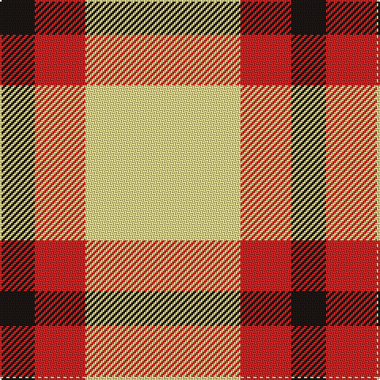

In pattern [KRY](/patterns/kry/).

This was sourced from register-of-tartans.  It is a [3 stripes tartan](/stripes/stripes3/).

Original link https://www.tartanregister.gov.uk/tartanDetails.aspx?ref=10479

## Thread count
K/22 R32 LY/98

## Palette
Each colour and its ΔE from the base-6 reference it is a variant of.

| Colour | Shade | Base | ΔE (OKLab) |
|---|---|---|---|
| K | <code style="background-color:#1C1714;">#1C1714</code> `#1C1714` | K <code style="background-color:#000000;">#000000</code> | 0.21 |
| LY | <code style="background-color:#F8E38C;">#F8E38C</code> `#F8E38C` | Y <code style="background-color:#F2BF00;">#F2BF00</code> | 0.11 |
| R | <code style="background-color:#CA2625;">#CA2625</code> `#CA2625` | R <code style="background-color:#CC0000;">#CC0000</code> | 0.02 |

# Sample pattern

## Nearest tartans

The nearest existing variants by ΔTartan distance.

1. [Sands-Pingot Family, Alabama (Personal)](/setts/s5/y6r1y4r4b2x5~b0000cd-rff0000-yffe600/) — ΔT 1.57
1. [Masai Shuka 04 (Artefact)](/setts/s3/y20b10k3x2~b2c2c80-k000000-ye8c000/) — ΔT 1.64
1. [Sands-Pingot (Name?)](/setts/s5/y6r1y4r4b2x5~b2c2c80-rc80000-yfccc00/) — ΔT 1.69
1. [Burt's Highlanders (Fashion)](/setts/s5/y40g13y6b13y22x2~b2c2c80-g006818-yfcb464/) — ΔT 1.73
1. [Silvicola](/setts/s4/y20k15y20w3x2~k101010-we0e0e0-ye8c000/) — ΔT 1.82
1. [Hogan (2014)](/setts/s4/g10w7y41k7x2~g649848-k1c1714-wf8f8f8-yf8e38c/) — ΔT 1.93
1. [Silvicola (Corporate)](/setts/s3/k15y20w3x2~k101010-we0e0e0-ye8c000/) — ΔT 2.05
1. [Hogan](/setts/s4/g10w7y41k7x2~g006818-k101010-wfcfcfc-yc4bc68/) — ΔT 2.07
1. [MacRae of Conchra](/setts/s4/k5w37r37w5x2~k000000-rc00000-we0e0e0/) — ΔT 2.17
1. [Barclay Dress](/setts/s4/w5y32b32y5x2~b1c1c1c-we0e0e0-ye8c000/) — ΔT 2.18

## Neighbour map

Every grey dot is one of 15726 variants placed by the first two principal components of the ΔTartan feature space (44% of its variance). Red is this tartan; blue dots are its nearest — click one to open its page.

<svg viewBox="0 0 640 380" role="img" style="max-width:100%;height:auto;border:1px solid #e0e0e0;border-radius:4px;display:block" xmlns="http://www.w3.org/2000/svg"><image href="/nn/cloud.v1.png" width="640" height="380"/><a href="/setts/s5/y6r1y4r4b2x5~b0000cd-rff0000-yffe600/"><circle cx="257.5" cy="252.0" r="4" fill="#3465a4"><title>Sands-Pingot Family, Alabama (Personal)</title></circle></a><a href="/setts/s3/y20b10k3x2~b2c2c80-k000000-ye8c000/"><circle cx="286.8" cy="269.3" r="4" fill="#3465a4"><title>Masai Shuka 04 (Artefact)</title></circle></a><a href="/setts/s5/y6r1y4r4b2x5~b2c2c80-rc80000-yfccc00/"><circle cx="271.1" cy="257.8" r="4" fill="#3465a4"><title>Sands-Pingot (Name?)</title></circle></a><a href="/setts/s5/y40g13y6b13y22x2~b2c2c80-g006818-yfcb464/"><circle cx="374.7" cy="253.7" r="4" fill="#3465a4"><title>Burt's Highlanders (Fashion)</title></circle></a><a href="/setts/s4/y20k15y20w3x2~k101010-we0e0e0-ye8c000/"><circle cx="321.9" cy="276.2" r="4" fill="#3465a4"><title>Silvicola</title></circle></a><a href="/setts/s4/g10w7y41k7x2~g649848-k1c1714-wf8f8f8-yf8e38c/"><circle cx="291.9" cy="219.7" r="4" fill="#3465a4"><title>Hogan (2014)</title></circle></a><a href="/setts/s3/k15y20w3x2~k101010-we0e0e0-ye8c000/"><circle cx="242.4" cy="276.1" r="4" fill="#3465a4"><title>Silvicola (Corporate)</title></circle></a><a href="/setts/s4/g10w7y41k7x2~g006818-k101010-wfcfcfc-yc4bc68/"><circle cx="293.3" cy="227.2" r="4" fill="#3465a4"><title>Hogan</title></circle></a><a href="/setts/s4/k5w37r37w5x2~k000000-rc00000-we0e0e0/"><circle cx="271.9" cy="229.8" r="4" fill="#3465a4"><title>MacRae of Conchra</title></circle></a><a href="/setts/s4/w5y32b32y5x2~b1c1c1c-we0e0e0-ye8c000/"><circle cx="247.6" cy="249.2" r="4" fill="#3465a4"><title>Barclay Dress</title></circle></a><circle cx="301.2" cy="272.0" r="5" fill="#c00000"/></svg>

ID: /setts/s3/y49r16k11x2~k1c1714-rca2625-yf8e38c/
