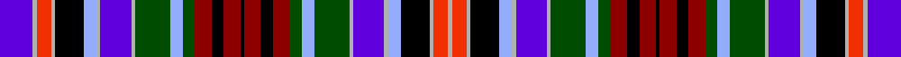

In pattern [BYRYKWYBYGWGRKRKRKRGWGYBYWKYRY](/stripes/byrykwybygwgrkrkrkrgwgybywkyry/).

This was sourced from register-of-tartans.  It is a [30 stripe tartan](/stripes/stripes30/).

Original link https://www.tartanregister.gov.uk/tartanDetails.aspx?ref=1796

## Register references

External register numbers recorded for this tartan.

- Scottish Register of Tartans: [1796](https://www.tartanregister.gov.uk/tartanDetails.aspx?ref=1796)
- Scottish Tartans Authority (ITI): 5234

## Thread count
P/32 N4 R14 N4 K28 LP12 N4 P30 N4 G34 LP12 G12 DR16 K12 DR16 K4 DR16 K12 DR16 G12 LP12 G34 N4 P30 N4 LP12 K28 N4 R14 N/4

## Palette
Each colour and the base-6 reference it is a variant of.

| Colour | Shade | Base |
|---|---|---|
| DR | <code style="background-color:#8C0000;">#8C0000</code> `oklch(40.2% 0.165 29.2)` <small>#8C0000</small> | R <code style="background-color:#CC0000;">#CC0000</code> |
| G | <code style="background-color:#004C00;">#004C00</code> `oklch(36.1% 0.123 142.5)` <small>#004C00</small> | G <code style="background-color:#006100;">#006100</code> |
| K | <code style="background-color:#000000;">#000000</code> `oklch(0.0% 0.000 0.0)` <small>#000000</small> | K <code style="background-color:#000000;">#000000</code> |
| LP | <code style="background-color:#94ACFC;">#94ACFC</code> `oklch(75.8% 0.119 270.6)` <small>#94ACFC</small> | W <code style="background-color:#F7F7F7;">#F7F7F7</code> |
| N | <code style="background-color:#B0B0B0;">#B0B0B0</code> `oklch(75.7% 0.000 89.9)` <small>#B0B0B0</small> | Y <code style="background-color:#F2BF00;">#F2BF00</code> |
| P | <code style="background-color:#6000DC;">#6000DC</code> `oklch(46.0% 0.262 288.8)` <small>#6000DC</small> | B <code style="background-color:#2A418A;">#2A418A</code> |
| R | <code style="background-color:#F03000;">#F03000</code> `oklch(61.8% 0.230 32.7)` <small>#F03000</small> | R <code style="background-color:#CC0000;">#CC0000</code> |

## Nearest tartans

The nearest existing variants by ΔTartan distance, with this tartan at the top so the swatches line up against it.

ΔTartan

Tartan

Sett

—

<a href="/ttd/edit/#slug=b16lr2r7lr2k14lb6lr2b15lr2dg17lb6dg6r8k6r8k2~x2">Huntly #2</a> <a class="nn-out" href="/setts/s30/b16lr2r7lr2k14lb6lr2b15lr2dg17lb6dg6r8k6r8k2~x2/" title="open its dictionary page">↗</a>

1.12

<a href="/setts/s30/dp16w2r7w2k14t6w2dp15w2dg17t6dg6r8k6r8k2~x2/">Gordon, Red (1819)</a>

1.16

<a href="/ttd/edit/#slug=db8k2db3dg3k3r3dg10g3k3w3k3dp16dg6k3db6w8k2dp2~x2">Kukri</a> <a class="nn-out" href="/setts/s18/db8k2db3dg3k3r3dg10g3k3w3k3dp16dg6k3db6w8k2dp2~x2/" title="open its dictionary page">↗</a>

1.52

<a href="/ttd/edit/#slug=db8k2db3dg3k3r3dg10g3k3w3k3m16dg6k3db8ly13k2m2~x2">Kukri</a> <a class="nn-out" href="/setts/s18/db8k2db3dg3k3r3dg10g3k3w3k3m16dg6k3db8ly13k2m2~x2/" title="open its dictionary page">↗</a>

1.56

<a href="/ttd/edit/#slug=p16w2r7w2k14t6w2p15w2g17t6g6r8k6r8k2~x2">Gordon, Red</a> <a class="nn-out" href="/setts/s16/p16w2r7w2k14t6w2p15w2g17t6g6r8k6r8k2~x2/" title="open its dictionary page">↗</a>

1.59

<a href="/ttd/edit/#slug=r3g6k1r2k1g6r2db5r2k2ly2k2ly2k3w3k3b14k1r2k1b6r3~x2">Anderson 11</a> <a class="nn-out" href="/setts/s22/r3g6k1r2k1g6r2db5r2k2ly2k2ly2k3w3k3b14k1r2k1b6r3~x2/" title="open its dictionary page">↗</a>

1.61

<a href="/ttd/edit/#slug=r3dg6k1r2k1dg6r2db5r2k2ly2k2ly2k3w3k3b14k1r2k1b6r3~x2">Anderson (Coulson Bonner #2)</a> <a class="nn-out" href="/setts/s22/r3dg6k1r2k1dg6r2db5r2k2ly2k2ly2k3w3k3b14k1r2k1b6r3~x2/" title="open its dictionary page">↗</a>

1.69

<a href="/setts/s32/db12k2db2k2r3k2t6k2w2k2t6k2ly2k2db6k2r2~x2/">Kilburnie</a>

1.69

<a href="/ttd/edit/#slug=r4g7k1r2k1g7p5r2k5ly2k2ly2k3w3p3db16k1r2k1db6r4~x2">Anderson 6</a> <a class="nn-out" href="/setts/s21/r4g7k1r2k1g7p5r2k5ly2k2ly2k3w3p3db16k1r2k1db6r4~x2/" title="open its dictionary page">↗</a>

1.70

<a href="/ttd/edit/#slug=g18w2db16w2t6k16w2r8w2db9r9k6r9g6t6~x2">Gordon, Red</a> <a class="nn-out" href="/setts/s15/g18w2db16w2t6k16w2r8w2db9r9k6r9g6t6~x2/" title="open its dictionary page">↗</a>

1.73

<a href="/ttd/edit/#slug=dp16w2r7w2k14t6w2dp15w2g17t6g6r8k6r8k2~x2">Gordon Red.. Family Tartan Tartan Number: 652. Earliest known date: pre 1819 Sample from the Telfer-Dunbar collection. Also known as 'Old Huntly' and frequently used as the Huntly District tartan. Not to be confused with the 'usual' Huntly District tartan which is based on the MacRae, Ross, Grant group with which it does not appear to be related. See products available Copyright © Blair Urquhart, Comrie, 2015</a> <a class="nn-out" href="/setts/s16/dp16w2r7w2k14t6w2dp15w2g17t6g6r8k6r8k2~x2/" title="open its dictionary page">↗</a>

## Neighbour map

Every grey dot is one of 14299 variants placed by the first two principal components of the ΔTartan feature space (44% of its variance). Red is this tartan; blue dots are its nearest — click one to open its page.

<svg viewBox="0 0 640 380" role="img" style="max-width:100%;height:auto;border:1px solid #e0e0e0;border-radius:4px;display:block" xmlns="http://www.w3.org/2000/svg"><image href="/nn/cloud.v1.png" width="640" height="380"/><a href="/setts/s30/dp16w2r7w2k14t6w2dp15w2dg17t6dg6r8k6r8k2~x2/"><circle cx="14.0" cy="98.4" r="4" fill="#3465a4"><title>Gordon, Red (1819)</title></circle></a><a href="/setts/s18/db8k2db3dg3k3r3dg10g3k3w3k3dp16dg6k3db6w8k2dp2~x2/"><circle cx="14.0" cy="120.8" r="4" fill="#3465a4"><title>Kukri</title></circle></a><a href="/setts/s18/db8k2db3dg3k3r3dg10g3k3w3k3m16dg6k3db8ly13k2m2~x2/"><circle cx="14.0" cy="88.3" r="4" fill="#3465a4"><title>Kukri</title></circle></a><a href="/setts/s16/p16w2r7w2k14t6w2p15w2g17t6g6r8k6r8k2~x2/"><circle cx="14.0" cy="117.0" r="4" fill="#3465a4"><title>Gordon, Red</title></circle></a><a href="/setts/s22/r3g6k1r2k1g6r2db5r2k2ly2k2ly2k3w3k3b14k1r2k1b6r3~x2/"><circle cx="29.9" cy="70.5" r="4" fill="#3465a4"><title>Anderson 11</title></circle></a><a href="/setts/s22/r3dg6k1r2k1dg6r2db5r2k2ly2k2ly2k3w3k3b14k1r2k1b6r3~x2/"><circle cx="34.0" cy="74.7" r="4" fill="#3465a4"><title>Anderson (Coulson Bonner #2)</title></circle></a><a href="/setts/s32/db12k2db2k2r3k2t6k2w2k2t6k2ly2k2db6k2r2~x2/"><circle cx="48.7" cy="130.2" r="4" fill="#3465a4"><title>Kilburnie</title></circle></a><a href="/setts/s21/r4g7k1r2k1g7p5r2k5ly2k2ly2k3w3p3db16k1r2k1db6r4~x2/"><circle cx="46.8" cy="72.6" r="4" fill="#3465a4"><title>Anderson 6</title></circle></a><a href="/setts/s15/g18w2db16w2t6k16w2r8w2db9r9k6r9g6t6~x2/"><circle cx="14.0" cy="127.8" r="4" fill="#3465a4"><title>Gordon, Red</title></circle></a><a href="/setts/s16/dp16w2r7w2k14t6w2dp15w2g17t6g6r8k6r8k2~x2/"><circle cx="20.3" cy="124.9" r="4" fill="#3465a4"><title>Gordon Red.. Family Tartan Tartan Number: 652. Earliest known date: pre 1819 Sample from the Telfer-Dunbar collection. Also known as 'Old Huntly' and frequently used as the Huntly District tartan. Not to be confused with the 'usual' Huntly District tartan which is based on the MacRae, Ross, Grant group with which it does not appear to be related. See products available Copyright © Blair Urquhart, Comrie, 2015</title></circle></a><circle cx="14.0" cy="95.5" r="5" fill="#c00000"/></svg>

ID: /setts/s30/b16lr2r7lr2k14lb6lr2b15lr2dg17lb6dg6r8k6r8k2~x2/
