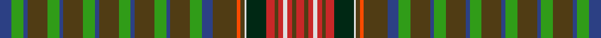

In pattern [BGBGGBGGBGGBGGBGGBGRGWGRGRWRGR](/stripes/bgbggbggbggbggbggbgrgwgrgrwrgr/).

This was sourced from register-of-tartans.  It is a [30 stripe tartan](/stripes/stripes30/).

Original link https://www.tartanregister.gov.uk/tartanDetails.aspx?ref=4391

## Register references

External register numbers recorded for this tartan.

- Scottish Register of Tartans: [4391](https://www.tartanregister.gov.uk/tartanDetails.aspx?ref=4391)
- Scottish Tartans World Register: 1919

## Thread count
B/12 G12 B4 T20 G12 B4 T20 G12 B4 T20 G12 B4 T20 G12 B4 T20 G12 B11 T24 R4 T4 LN2 DG20 Ra8 T4 Ra5 LN4 Ra5 T4 Ra/8

## Palette
Each colour and its ΔE from the base-6 reference it is a variant of.

| Colour | Shade | Base | ΔE (OKLab) |
|---|---|---|---|
| B | <code style="background-color:#2C4084;">#2C4084</code> `#2C4084` | B <code style="background-color:#2A418A;">#2A418A</code> | 0.01 |
| DG | <code style="background-color:#002814;">#002814</code> `#002814` | G <code style="background-color:#006100;">#006100</code> | 0.20 |
| G | <code style="background-color:#309C18;">#309C18</code> `#309C18` | G <code style="background-color:#006100;">#006100</code> | 0.19 |
| LN | <code style="background-color:#E0E0E0;">#E0E0E0</code> `#E0E0E0` | W <code style="background-color:#F7F7F7;">#F7F7F7</code> | 0.07 |
| R | <code style="background-color:#FA4B00;">#FA4B00</code> `#FA4B00` | R <code style="background-color:#CC0000;">#CC0000</code> | 0.13 |
| Ra | <code style="background-color:#C82828;">#C82828</code> `#C82828` | R <code style="background-color:#CC0000;">#CC0000</code> | 0.03 |
| T | <code style="background-color:#503C14;">#503C14</code> `#503C14` | G <code style="background-color:#006100;">#006100</code> | 0.14 |

## Nearest tartans

The nearest existing variants by ΔTartan distance.

1. [Unidentified, Victorian fancy](/setts/s30/db12g12db4o20g12db4o20g12db4o20g12db4o20g12db4o20g12db11o24lo4o4w2dg20r8o4r5w4r5o4r8/) — ΔT 0.77
1. [MacMaster (Name 2001)](/setts/s28/r12dg12lb2dg12r12dg2r2dg2r2dg6lo2r1lo2dg6r2dg2r2dg2r12db8dg8k2r4k2r4k2dg8db8~x2/) — ΔT 1.50
1. [MacMaster (New) Family Tartan Tartan Number: 3218. Earliest known date: 2001 Asymetrical design follows Canadian tradition. Elements of the MacInnes and the Nova Scotia tartans were included in line with Dave McMaster's family history. See products available Copyright © Blair Urquhart, Comrie, 2015](/setts/s28/g12r12g2r2g2r2g6ly2r1ly2g6r2g2r2g2r12db8g8k2r4k2r4k2g8db8r12g12t2~x2/) — ΔT 1.55
1. [O'Sullivan McCragh (Personal)](/setts/s24/y16r2y4lo2y4r2y16db2y3db2y3db10w2o12k2o5k2o12w2db10y3db2y3db2~x2/) — ΔT 1.67
1. [Sprouston](/setts/s26/dy3b12g6ly3g6b12dy3b12g6ly3g6ly3g6b12dy6b12dy3w1dy3r3dy3w1dy3r3dy3w1~x2/) — ΔT 1.71
1. [Scottish Heritage USA (SHUSA)](/setts/s28/g3r2g14k6g4w2t14r2t14w2g4k6g14m2g3~x2/) — ΔT 1.75
1. [Lodge Dunblane Australis No.966](/setts/s42/dg12ly1k2w2k2w2k2w2k2ly1dg12dp1dg2dp3dg1dp4r2dp4dg1dp3dg2dp1dg12k1lg4k1lg4k1lg4k1dg12dp1dg2dp3dg1dp4ly2dp4dg1dp3dg2dp1~x2/) — ΔT 1.75
1. [Otago Peninsula](/setts/s40/g4dt4r4dt2g12dt2g12dt2r4g4w1r4db2r4dt4g4dt4r4dt2g12dt2~x2/) — ΔT 1.79
1. [Lundie](/setts/s21/r4b2dt5y2dt2y2dt2y13dt2y2dt2y2dt5lo2dt3w2y6r5b3dt4w2~x2/) — ΔT 1.81
1. [Lundie (Personal)](/setts/s21/r4b2dt5g2dt2g2dt2g13dt2g2dt2g2dt5ly2dt3w2g6r5b3dt4w2~x2/) — ΔT 1.86

## Neighbour map

Every grey dot is one of 14299 variants placed by the first two principal components of the ΔTartan feature space (44% of its variance). Red is this tartan; blue dots are its nearest — click one to open its page.

<svg viewBox="0 0 640 380" role="img" style="max-width:100%;height:auto;border:1px solid #e0e0e0;border-radius:4px;display:block" xmlns="http://www.w3.org/2000/svg"><image href="/nn/cloud.v1.png" width="640" height="380"/><a href="/setts/s30/db12g12db4o20g12db4o20g12db4o20g12db4o20g12db4o20g12db11o24lo4o4w2dg20r8o4r5w4r5o4r8/"><circle cx="147.1" cy="118.9" r="4" fill="#3465a4"><title>Unidentified, Victorian fancy</title></circle></a><a href="/setts/s28/r12dg12lb2dg12r12dg2r2dg2r2dg6lo2r1lo2dg6r2dg2r2dg2r12db8dg8k2r4k2r4k2dg8db8~x2/"><circle cx="201.3" cy="129.7" r="4" fill="#3465a4"><title>MacMaster (Name 2001)</title></circle></a><a href="/setts/s28/g12r12g2r2g2r2g6ly2r1ly2g6r2g2r2g2r12db8g8k2r4k2r4k2g8db8r12g12t2~x2/"><circle cx="176.9" cy="112.1" r="4" fill="#3465a4"><title>MacMaster (New) Family Tartan Tartan Number: 3218. Earliest known date: 2001 Asymetrical design follows Canadian tradition. Elements of the MacInnes and the Nova Scotia tartans were included in line with Dave McMaster's family history. See products available Copyright © Blair Urquhart, Comrie, 2015</title></circle></a><a href="/setts/s24/y16r2y4lo2y4r2y16db2y3db2y3db10w2o12k2o5k2o12w2db10y3db2y3db2~x2/"><circle cx="134.4" cy="111.9" r="4" fill="#3465a4"><title>O'Sullivan McCragh (Personal)</title></circle></a><a href="/setts/s26/dy3b12g6ly3g6b12dy3b12g6ly3g6ly3g6b12dy6b12dy3w1dy3r3dy3w1dy3r3dy3w1~x2/"><circle cx="151.6" cy="128.1" r="4" fill="#3465a4"><title>Sprouston</title></circle></a><a href="/setts/s28/g3r2g14k6g4w2t14r2t14w2g4k6g14m2g3~x2/"><circle cx="138.5" cy="136.8" r="4" fill="#3465a4"><title>Scottish Heritage USA (SHUSA)</title></circle></a><a href="/setts/s42/dg12ly1k2w2k2w2k2w2k2ly1dg12dp1dg2dp3dg1dp4r2dp4dg1dp3dg2dp1dg12k1lg4k1lg4k1lg4k1dg12dp1dg2dp3dg1dp4ly2dp4dg1dp3dg2dp1~x2/"><circle cx="160.9" cy="66.7" r="4" fill="#3465a4"><title>Lodge Dunblane Australis No.966</title></circle></a><a href="/setts/s40/g4dt4r4dt2g12dt2g12dt2r4g4w1r4db2r4dt4g4dt4r4dt2g12dt2~x2/"><circle cx="229.4" cy="133.0" r="4" fill="#3465a4"><title>Otago Peninsula</title></circle></a><a href="/setts/s21/r4b2dt5y2dt2y2dt2y13dt2y2dt2y2dt5lo2dt3w2y6r5b3dt4w2~x2/"><circle cx="125.5" cy="161.5" r="4" fill="#3465a4"><title>Lundie</title></circle></a><a href="/setts/s21/r4b2dt5g2dt2g2dt2g13dt2g2dt2g2dt5ly2dt3w2g6r5b3dt4w2~x2/"><circle cx="111.0" cy="157.9" r="4" fill="#3465a4"><title>Lundie (Personal)</title></circle></a><circle cx="138.2" cy="118.3" r="5" fill="#c00000"/></svg>

ID: /setts/s30/db12g12db4dy20g12db4dy20g12db4dy20g12db4dy20g12db4dy20g12db11dy24r4dy4w2dg20r8dy4r5w4r5dy4r8/
