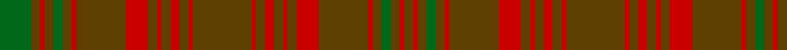

**Bands:** [GRGGGRGRGRGRGRGRGRGRGRGRGGGRGG](/stripes/grgggrgrgrgrgrgrgrgrgrgrgggrgg/) · **Stripes:** [DY R DY G DY R DY R DY R DY R DY R DY R DY R DY R DY R DY R DY G DY R DY G](/stripes/stripes30/) DY R DY G DY R DY R DY R DY R DY R DY R DY R DY R DY R DY R DY G DY R DY G

This was sourced from register-of-tartans.  It is a [30 band tartan](/bands/bands30/).

Original link https://www.tartanregister.gov.uk/tartanDetails.aspx?ref=3655

## Also known as

This cloth is also recorded under:

- Särna

## Register references

External register numbers recorded for this tartan.

- Scottish Register of Tartans: [3655](https://www.tartanregister.gov.uk/tartanDetails.aspx?ref=3655)
- Scottish Tartans Authority (ITI): 2039
- Scottish Tartans World Register: 2039

## Thread count
G/14 T4 R2 T4 G4 T4 R2 T22 R10 T4 R2 T4 R4 T4 R2 T26 R2 T4 R4 T4 R2 T4 R10 T22 R2 T4 G4 T4 R2 T/4

## Palette
Each colour and its ΔE from the base-6 reference it is a variant of.

| Colour | Shade | Base | ΔE (OKLab) |
|---|---|---|---|
| G | <code style="background-color:#006818;">#006818</code> `#006818` | G <code style="background-color:#006100;">#006100</code> | 0.02 |
| R | <code style="background-color:#C80000;">#C80000</code> `#C80000` | R <code style="background-color:#CC0000;">#CC0000</code> | 0.01 |
| T | <code style="background-color:#604000;">#604000</code> `#604000` | G <code style="background-color:#006100;">#006100</code> | 0.14 |

## Nearest tartans

The nearest existing variants by ΔTartan distance.

1. [Sarna (District)](/setts/s16/dy13r1dy2r2dy2r1dy2r5dy11r1dy2g2dy2r1dy2g7~x2/) — ΔT 1.32
1. [Sarna](/setts/s16/o13r1o2r2o2r1o2r5o11r1o2g2o2r1o2g7~x2/) — ΔT 1.61
1. [Gray (Personal)](/setts/s18/n33g10r3g3r3g3r8n10r3n10r8g3r3g3r3g10n33r3~x2/) — ΔT 2.00
1. [Murray of Dunmore (Clan)](/setts/s21/dg4r4dg4r6dg15r11dg2r2dg16r21dg2r2dg4r2dg2r3dg5r3dg2r2dg4~x2/) — ΔT 2.06
1. [Frame - Ferniegair (Personal)](/setts/s12/dg4dy14r1dy1dg1dy1r1dy14r14dy1r1dg1~x4/) — ΔT 2.21
1. [MacDonell of Keppoch #3](/setts/s15/r12g2r1g1r1g1r6g12r1k1r12k1r1k1r3~x4/) — ΔT 2.35
1. [MacGillivray Htg (Clan)](/setts/s14/g8o5g5o5g5o6db1o2g8o2db1o24db4o6~x2/) — ΔT 2.35
1. [Howells](/setts/s15/n16r1dg3n5r1n5dg3n4dg12n14ly1n14dg12ly2r6~x2/) — ΔT 2.36
1. [MacAlister of Glenbarr](/setts/s14/g4o2g2o2g2o3db1o1g4o1db1o12db2o3~x2/) — ΔT 2.41
1. [Williams #2](/setts/s22/y46y4do6o3do3y3do3dt10y8do3y6y3~x2/) — ΔT 2.43

## Neighbour map

Every grey dot is one of 14299 variants placed by the first two principal components of the ΔTartan feature space (44% of its variance). Red is this tartan; blue dots are its nearest — click one to open its page.

<svg viewBox="0 0 640 380" role="img" style="max-width:100%;height:auto;border:1px solid #e0e0e0;border-radius:4px;display:block" xmlns="http://www.w3.org/2000/svg"><image href="/nn/cloud.v1.png" width="640" height="380"/><a href="/setts/s16/dy13r1dy2r2dy2r1dy2r5dy11r1dy2g2dy2r1dy2g7~x2/"><circle cx="479.1" cy="214.3" r="4" fill="#3465a4"><title>Sarna (District)</title></circle></a><a href="/setts/s16/o13r1o2r2o2r1o2r5o11r1o2g2o2r1o2g7~x2/"><circle cx="480.8" cy="212.3" r="4" fill="#3465a4"><title>Sarna</title></circle></a><a href="/setts/s18/n33g10r3g3r3g3r8n10r3n10r8g3r3g3r3g10n33r3~x2/"><circle cx="430.4" cy="216.7" r="4" fill="#3465a4"><title>Gray (Personal)</title></circle></a><a href="/setts/s21/dg4r4dg4r6dg15r11dg2r2dg16r21dg2r2dg4r2dg2r3dg5r3dg2r2dg4~x2/"><circle cx="426.1" cy="222.3" r="4" fill="#3465a4"><title>Murray of Dunmore (Clan)</title></circle></a><a href="/setts/s12/dg4dy14r1dy1dg1dy1r1dy14r14dy1r1dg1~x4/"><circle cx="446.2" cy="192.8" r="4" fill="#3465a4"><title>Frame - Ferniegair (Personal)</title></circle></a><a href="/setts/s15/r12g2r1g1r1g1r6g12r1k1r12k1r1k1r3~x4/"><circle cx="466.1" cy="183.9" r="4" fill="#3465a4"><title>MacDonell of Keppoch #3</title></circle></a><a href="/setts/s14/g8o5g5o5g5o6db1o2g8o2db1o24db4o6~x2/"><circle cx="446.5" cy="183.7" r="4" fill="#3465a4"><title>MacGillivray Htg (Clan)</title></circle></a><a href="/setts/s15/n16r1dg3n5r1n5dg3n4dg12n14ly1n14dg12ly2r6~x2/"><circle cx="390.5" cy="197.5" r="4" fill="#3465a4"><title>Howells</title></circle></a><a href="/setts/s14/g4o2g2o2g2o3db1o1g4o1db1o12db2o3~x2/"><circle cx="440.2" cy="228.7" r="4" fill="#3465a4"><title>MacAlister of Glenbarr</title></circle></a><a href="/setts/s22/y46y4do6o3do3y3do3dt10y8do3y6y3~x2/"><circle cx="376.9" cy="134.4" r="4" fill="#3465a4"><title>Williams #2</title></circle></a><circle cx="466.0" cy="183.3" r="5" fill="#c00000"/></svg>

ID: /setts/s30/dy13r1dy2r2dy2r1dy2r5dy11r1dy2g2dy2r1dy2g7~x2/
