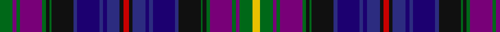

In pattern [GBGBGKGKBBBBBKRKBBBBBKGKGBGBGY](/patterns/gbgbgkgkbbbbbkrkbbbbbkgkgbgbgy/).

This was sourced from register-of-tartans.  It is a [30 stripes tartan](/stripes/stripes30/).

Original link https://www.tartanregister.gov.uk/tartanDetails.aspx?ref=2774

## Thread count
G/14 P4 G4 P24 G4 K4 G2 K24 DBa4 DB24 DBa4 DB4 DBa14 K4 R6 K4 DBa14 DB4 DBa4 DB24 DBa4 K24 G2 K4 G4 P24 G4 P4 G14 Y/8

## Palette
Each colour and its ΔE from the base-6 reference it is a variant of.

| Colour | Shade | Base | ΔE (OKLab) |
|---|---|---|---|
| DB | <code style="background-color:#1C0070;">#1C0070</code> `#1C0070` | B <code style="background-color:#2A418A;">#2A418A</code> | 0.14 |
| DBa | <code style="background-color:#2C2C80;">#2C2C80</code> `#2C2C80` | B <code style="background-color:#2A418A;">#2A418A</code> | 0.06 |
| G | <code style="background-color:#006818;">#006818</code> `#006818` | G <code style="background-color:#006100;">#006100</code> | 0.02 |
| K | <code style="background-color:#101010;">#101010</code> `#101010` | K <code style="background-color:#000000;">#000000</code> | 0.17 |
| P | <code style="background-color:#780078;">#780078</code> `#780078` | B <code style="background-color:#2A418A;">#2A418A</code> | 0.17 |
| R | <code style="background-color:#C80000;">#C80000</code> `#C80000` | R <code style="background-color:#CC0000;">#CC0000</code> | 0.01 |
| Y | <code style="background-color:#E8C000;">#E8C000</code> `#E8C000` | Y <code style="background-color:#F2BF00;">#F2BF00</code> | 0.02 |

## Nearest tartans

The nearest existing variants by ΔTartan distance.

1. [MacWatts (Personal)](/setts/s16/y4g7b2g2b12g2k2g1k12ba2bb12ba2bb2ba7k2r3x2~b780078-ba2c2c80-bb1c0070-g006818-k101010-rc80000-ye8c000/) — ΔT 1.38
1. [Hird (Personal)](/setts/s29/b4g4k20r5k4ba5k4b5k18g4r8b2w2r16k4y2k4r16w2b2r6b6r2y2b20w2b20y2r3x2~b2c2c80-ba680028-g006818-k101010-r880000-wc0c0c0-yd09800/) — ΔT 1.40
1. [Selkirk, New](/setts/s32/b24g2r12k2w2k3ba2k3b4k3ba2k3w2k2bb12g2bb24g2bb12k2w2k3ba2k3b4k3ba2k3w2k2r12g2x2~b1474b4-ba780078-bb2c2c80-g006818-k101010-rc80000-we0e0e0/) — ΔT 1.46
1. [Stevens (Personal)](/setts/s32/r6y3r3b24ba24g24bb3y4bb3g24ba10w3ba10b24r3y3r6y3r3b24ba10w3ba10g24bb3y4bb3g24ba24b24r3y3~b1c0070-ba2c2c80-bb2888c4-g006818-rc80000-wf8f8f8-ye8c000/) — ΔT 1.52
1. [Anderson (W L Anderson, Stirling)](/setts/s21/r4g7k1r2k1g7b5r2k5y2k2y2k3w3b3ba16k1r2k1ba6r4x2~b5a008c-ba2c4084-g005020-k101010-rdc0000-we0e0e0-ye8c000/) — ΔT 1.75
1. [Selkirk Corporate District Tartan Tartan Number: 2304. Earliest known date: 1996 . See products available Copyright © Blair Urquhart, Comrie, 2015](/setts/s17/b24g2b12k2w2k3r2k3ba4k3r2k3w2k2ra12g2ba24x2~b202060-ba2c2c80-g006818-k101010-rb468ac-rac80000-we0e0e0/) — ΔT 1.84
1. [MacDonald of Pr Edward Island Tartan Tartan Number: 1973. Earliest known date: 1772 Estimated count from Coulson Bonner drawing. See products available Copyright © Blair Urquhart, Comrie, 2015](/setts/s24/r12b6k8g6r1g6r2g3k1y2k1g1r1g2r1g7k9b11k1w2k1b11k9b8x2~b2c2c80-g006818-k101010-rc80000-we0e0e0-ye8c000/) — ΔT 1.84
1. [Highfield Hunting](/setts/s20/b10k2g2r2g2k2ba2k2ga4k1gb2k1ga4k2ba2k2g2r2g2k2x4~b1c0070-ba441800-g006818-ga603800-gb8c7038-k101010-r880000/) — ΔT 1.85
1. [Stevens (Personal)](/setts/s17/r6y3r3b24ba24g24bb3y4bb3g24ba10w3ba10b24r3y3r6~b1c0070-ba2c2c80-bb2888c4-g006818-rc80000-wf8f8f8-ye8c000/) — ΔT 1.86
1. [South Lanarkshire](/setts/s16/b1ba7k1g6k1bb7w1k2w1bb7k1g6k1ba7b1k1x4~b2888c4-ba2c2c80-bb780078-g006818-k101010-we0e0e0/) — ΔT 1.91

## Neighbour map

Every grey dot is one of 15726 variants placed by the first two principal components of the ΔTartan feature space (44% of its variance). Red is this tartan; blue dots are its nearest — click one to open its page.

<svg viewBox="0 0 640 380" role="img" style="max-width:100%;height:auto;border:1px solid #e0e0e0;border-radius:4px;display:block" xmlns="http://www.w3.org/2000/svg"><image href="/nn/cloud.v1.png" width="640" height="380"/><a href="/setts/s16/y4g7b2g2b12g2k2g1k12ba2bb12ba2bb2ba7k2r3x2~b780078-ba2c2c80-bb1c0070-g006818-k101010-rc80000-ye8c000/"><circle cx="42.1" cy="110.4" r="4" fill="#3465a4"><title>MacWatts (Personal)</title></circle></a><a href="/setts/s29/b4g4k20r5k4ba5k4b5k18g4r8b2w2r16k4y2k4r16w2b2r6b6r2y2b20w2b20y2r3x2~b2c2c80-ba680028-g006818-k101010-r880000-wc0c0c0-yd09800/"><circle cx="106.6" cy="91.7" r="4" fill="#3465a4"><title>Hird (Personal)</title></circle></a><a href="/setts/s32/b24g2r12k2w2k3ba2k3b4k3ba2k3w2k2bb12g2bb24g2bb12k2w2k3ba2k3b4k3ba2k3w2k2r12g2x2~b1474b4-ba780078-bb2c2c80-g006818-k101010-rc80000-we0e0e0/"><circle cx="77.6" cy="52.8" r="4" fill="#3465a4"><title>Selkirk, New</title></circle></a><a href="/setts/s32/r6y3r3b24ba24g24bb3y4bb3g24ba10w3ba10b24r3y3r6y3r3b24ba10w3ba10g24bb3y4bb3g24ba24b24r3y3~b1c0070-ba2c2c80-bb2888c4-g006818-rc80000-wf8f8f8-ye8c000/"><circle cx="43.4" cy="93.5" r="4" fill="#3465a4"><title>Stevens (Personal)</title></circle></a><a href="/setts/s21/r4g7k1r2k1g7b5r2k5y2k2y2k3w3b3ba16k1r2k1ba6r4x2~b5a008c-ba2c4084-g005020-k101010-rdc0000-we0e0e0-ye8c000/"><circle cx="60.8" cy="75.8" r="4" fill="#3465a4"><title>Anderson (W L Anderson, Stirling)</title></circle></a><a href="/setts/s17/b24g2b12k2w2k3r2k3ba4k3r2k3w2k2ra12g2ba24x2~b202060-ba2c2c80-g006818-k101010-rb468ac-rac80000-we0e0e0/"><circle cx="141.4" cy="93.2" r="4" fill="#3465a4"><title>Selkirk Corporate District Tartan Tartan Number: 2304. Earliest known date: 1996 . See products available Copyright © Blair Urquhart, Comrie, 2015</title></circle></a><a href="/setts/s24/r12b6k8g6r1g6r2g3k1y2k1g1r1g2r1g7k9b11k1w2k1b11k9b8x2~b2c2c80-g006818-k101010-rc80000-we0e0e0-ye8c000/"><circle cx="104.4" cy="113.4" r="4" fill="#3465a4"><title>MacDonald of Pr Edward Island Tartan Tartan Number: 1973. Earliest known date: 1772 Estimated count from Coulson Bonner drawing. See products available Copyright © Blair Urquhart, Comrie, 2015</title></circle></a><a href="/setts/s20/b10k2g2r2g2k2ba2k2ga4k1gb2k1ga4k2ba2k2g2r2g2k2x4~b1c0070-ba441800-g006818-ga603800-gb8c7038-k101010-r880000/"><circle cx="84.3" cy="135.1" r="4" fill="#3465a4"><title>Highfield Hunting</title></circle></a><a href="/setts/s17/r6y3r3b24ba24g24bb3y4bb3g24ba10w3ba10b24r3y3r6~b1c0070-ba2c2c80-bb2888c4-g006818-rc80000-wf8f8f8-ye8c000/"><circle cx="49.5" cy="118.4" r="4" fill="#3465a4"><title>Stevens (Personal)</title></circle></a><a href="/setts/s16/b1ba7k1g6k1bb7w1k2w1bb7k1g6k1ba7b1k1x4~b2888c4-ba2c2c80-bb780078-g006818-k101010-we0e0e0/"><circle cx="82.6" cy="147.8" r="4" fill="#3465a4"><title>South Lanarkshire</title></circle></a><circle cx="51.5" cy="89.8" r="5" fill="#c00000"/></svg>

ID: /setts/s30/g7b2g2b12g2k2g1k12ba2bb12ba2bb2ba7k2r3k2ba7bb2ba2bb12ba2k12g1k2g2b12g2b2g7y4x2~b780078-ba2c2c80-bb1c0070-g006818-k101010-rc80000-ye8c000/
