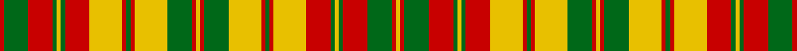

In pattern [RGRGYGRYRGRYGRYRGYRGRYRGYGRGRY](/stripes/rgrgygryrgrygryrgyrgryrgygrgry/).

This was sourced from register-of-tartans.  It is a [30 stripe tartan](/stripes/stripes30/).

Original link https://www.tartanregister.gov.uk/tartanDetails.aspx?ref=3984

## Register references

External register numbers recorded for this tartan.

- Scottish Register of Tartans: [3984](https://www.tartanregister.gov.uk/tartanDetails.aspx?ref=3984)
- Scottish Tartans Authority (ITI): 1890
- Scottish Tartans World Register: 1890

## Thread count
R/2 G12 R12 G2 Y2 G2 R12 Y16 R2 G2 R2 Y16 G12 R2 Y2 R2 G12 Y16 R2 G2 R2 Y16 R12 G2 Y2 G2 R12 G12 R2 Y/2

## Palette
Each colour and the base-6 reference it is a variant of.

| Colour | Shade | Base |
|---|---|---|
| G | <code style="background-color:#006818;">#006818</code> `oklch(45.0% 0.142 145.0)` <small>#006818</small> | G <code style="background-color:#006100;">#006100</code> |
| R | <code style="background-color:#C80000;">#C80000</code> `oklch(52.3% 0.215 29.2)` <small>#C80000</small> | R <code style="background-color:#CC0000;">#CC0000</code> |
| Y | <code style="background-color:#E8C000;">#E8C000</code> `oklch(81.9% 0.168 93.7)` <small>#E8C000</small> | Y <code style="background-color:#F2BF00;">#F2BF00</code> |

## Nearest tartans

The nearest existing variants by ΔTartan distance.

1. [Strathearn](/setts/s16/ly1r1g6ly8r1g1r1ly8r6g1ly1g1r6g6r1ly1~x2/) — ΔT 1.32
1. [MacDougall (Lochcarron)](/setts/s19/w6r2g16r3g2r3g6w2r2w2g6r7g6r2g2r16w2r2w2~x2/) — ΔT 1.52
1. [Highland Aircraft](/setts/s20/k2lo4lo5lo2lo1k1lo2k12lo2k1lo2lo6lo7lo3lo12lo1lo4lo1lo12lo1~x2/) — ΔT 1.86
1. [Highland Aircraft](/setts/s20/k2lo4lo5o2lo1k1lo2k12lo2k1lo2o6lo7o3lo12o1lo4o1lo12lo1~x2/) — ΔT 2.01
1. [Setting Sun, The](/setts/s30/lo15do4lb8o18do2lb2lo4do2o6do16lo2o2lb6do2lo3lb1~x2/) — ΔT 2.07
1. [Reid of Straloch (Personal)](/setts/s17/o3g3o18g6o4b3w3b18o6g18w3g3o4b6o18g3o3~x2/) — ΔT 2.14
1. [Aubigny Auld Alliance District Tartan Tartan Number: 2159. Earliest known date: 1994 The Aubigny Auld Alliance tartan was created using the Stewart of Atholl tartan and the colours of the Aubigny sur Nere town crest. The Stewart of Atholl tartan was used as the basis for this tartan because of the 16th century Chateau d'Aubigny sur Nere which was built by the Stewarts. The name arises from the Auld Alliance, a cultural and diplomatic treaty between Scotland and France, which was at it's strongest during conflicts with England, the common enemy. See products available Copyright © Blair Urquhart, Comrie, 2015](/setts/s17/r9k9ly4k2ly3k2ly20k2ly3k2ly4k9r18k2r5k2r9~x2/) — ΔT 2.15
1. [Strathearn (Royal)](/setts/s11/g1r1ly8r6g1ly1g1r6g6r1ly1~x4/) — ΔT 2.15
1. [MacDonald of Staffa 5](/setts/s29/r29g5r9g24w3g24r27w3r27k16g21r5g5r27g5r5k3g25k3g4r27g5r5g5r5g5r5g5r8~x2/) — ΔT 2.18
1. [Wcwm 1131](/setts/s31/o10do1o1do1o1do1o1do1o1do1lb1o1lb1o1lb1o1lb1o1lb1o1lb1do1lb1do1lb1do1lb1do1lb1do1lb10~x4/) — ΔT 2.18

## Neighbour map

Every grey dot is one of 14299 variants placed by the first two principal components of the ΔTartan feature space (44% of its variance). Red is this tartan; blue dots are its nearest — click one to open its page.

<svg viewBox="0 0 640 380" role="img" style="max-width:100%;height:auto;border:1px solid #e0e0e0;border-radius:4px;display:block" xmlns="http://www.w3.org/2000/svg"><image href="/nn/cloud.v1.png" width="640" height="380"/><a href="/setts/s16/ly1r1g6ly8r1g1r1ly8r6g1ly1g1r6g6r1ly1~x2/"><circle cx="203.2" cy="167.3" r="4" fill="#3465a4"><title>Strathearn</title></circle></a><a href="/setts/s19/w6r2g16r3g2r3g6w2r2w2g6r7g6r2g2r16w2r2w2~x2/"><circle cx="229.0" cy="162.6" r="4" fill="#3465a4"><title>MacDougall (Lochcarron)</title></circle></a><a href="/setts/s20/k2lo4lo5lo2lo1k1lo2k12lo2k1lo2lo6lo7lo3lo12lo1lo4lo1lo12lo1~x2/"><circle cx="155.3" cy="115.0" r="4" fill="#3465a4"><title>Highland Aircraft</title></circle></a><a href="/setts/s20/k2lo4lo5o2lo1k1lo2k12lo2k1lo2o6lo7o3lo12o1lo4o1lo12lo1~x2/"><circle cx="243.8" cy="129.4" r="4" fill="#3465a4"><title>Highland Aircraft</title></circle></a><a href="/setts/s30/lo15do4lb8o18do2lb2lo4do2o6do16lo2o2lb6do2lo3lb1~x2/"><circle cx="153.5" cy="89.4" r="4" fill="#3465a4"><title>Setting Sun, The</title></circle></a><a href="/setts/s17/o3g3o18g6o4b3w3b18o6g18w3g3o4b6o18g3o3~x2/"><circle cx="209.9" cy="175.7" r="4" fill="#3465a4"><title>Reid of Straloch (Personal)</title></circle></a><a href="/setts/s17/r9k9ly4k2ly3k2ly20k2ly3k2ly4k9r18k2r5k2r9~x2/"><circle cx="194.8" cy="145.9" r="4" fill="#3465a4"><title>Aubigny Auld Alliance District Tartan Tartan Number: 2159. Earliest known date: 1994 The Aubigny Auld Alliance tartan was created using the Stewart of Atholl tartan and the colours of the Aubigny sur Nere town crest. The Stewart of Atholl tartan was used as the basis for this tartan because of the 16th century Chateau d'Aubigny sur Nere which was built by the Stewarts. The name arises from the Auld Alliance, a cultural and diplomatic treaty between Scotland and France, which was at it's strongest during conflicts with England, the common enemy. See products available Copyright © Blair Urquhart, Comrie, 2015</title></circle></a><a href="/setts/s11/g1r1ly8r6g1ly1g1r6g6r1ly1~x4/"><circle cx="232.9" cy="182.0" r="4" fill="#3465a4"><title>Strathearn (Royal)</title></circle></a><a href="/setts/s29/r29g5r9g24w3g24r27w3r27k16g21r5g5r27g5r5k3g25k3g4r27g5r5g5r5g5r5g5r8~x2/"><circle cx="263.2" cy="134.7" r="4" fill="#3465a4"><title>MacDonald of Staffa 5</title></circle></a><a href="/setts/s31/o10do1o1do1o1do1o1do1o1do1lb1o1lb1o1lb1o1lb1o1lb1o1lb1do1lb1do1lb1do1lb1do1lb1do1lb10~x4/"><circle cx="239.6" cy="103.6" r="4" fill="#3465a4"><title>Wcwm 1131</title></circle></a><circle cx="182.0" cy="142.8" r="5" fill="#c00000"/></svg>

ID: /setts/s30/r1g6r6g1ly1g1r6ly8r1g1r1ly8g6r1ly1r1g6ly8r1g1r1ly8r6g1ly1g1r6g6r1ly1~x2/
