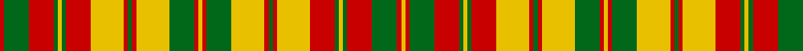

In pattern [RGRGYGRYRGRYGRYRGYRGRYRGYGRGRY](/patterns/rgrgygryrgrygryrgyrgryrgygrgry/).

This was sourced from register-of-tartans.  It is a [30 stripes tartan](/stripes/stripes30/).

Original link https://www.tartanregister.gov.uk/tartanDetails.aspx?ref=3984

## Register references

External register numbers recorded for this tartan.

- Scottish Register of Tartans: [3984](https://www.tartanregister.gov.uk/tartanDetails.aspx?ref=3984)
- Scottish Tartans Authority (ITI): 1890
- Scottish Tartans World Register: 1890

## Thread count
R/2 G12 R12 G2 Y2 G2 R12 Y16 R2 G2 R2 Y16 G12 R2 Y2 R2 G12 Y16 R2 G2 R2 Y16 R12 G2 Y2 G2 R12 G12 R2 Y/2

## Palette
Each colour and its ΔE from the base-6 reference it is a variant of.

| Colour | Shade | Base | ΔE (OKLab) |
|---|---|---|---|
| G | <code style="background-color:#006818;">#006818</code> `#006818` | G <code style="background-color:#006100;">#006100</code> | 0.02 |
| R | <code style="background-color:#C80000;">#C80000</code> `#C80000` | R <code style="background-color:#CC0000;">#CC0000</code> | 0.01 |
| Y | <code style="background-color:#E8C000;">#E8C000</code> `#E8C000` | Y <code style="background-color:#F2BF00;">#F2BF00</code> | 0.02 |

## Nearest tartans

The nearest existing variants by ΔTartan distance.

1. [Strathearn District Tartan Tartan Number: 1890. Earliest known date: 1812 Ref: The Setts No. 244 The Strathearn tartan is said to have been worn by the father of Queen Victoria H.R.H. Edward, Duke of Kent, who was also Duke of Strathearn. As Colonel of the Royal Scots Regiment 1801-1821, he apparently sent a sample to Wilson's of Bannockburn with a view to 'dressing the gallant corps'. It it also the adopted tartan of the Comrie Pipe Band who regularly march past the Scottish Tartans Museum in village main street. See products available Copyright © Blair Urquhart, Comrie, 2015](/setts/s16/y1r1g6y8r1g1r1y8r6g1y1g1r6g6r1y1~g006818-rc80000-ye8c000~x2/) — ΔT 1.29
1. [Strathearn](/setts/s16/y1r1g6y8r1g1r1y8r6g1y1g1r6g6r1y1~g008000-rc00000-yf0c000~x2/) — ΔT 1.32
1. [MacDougall (Lochcarron)](/setts/s19/w6r2g16r3g2r3g6w2r2w2g6r7g6r2g2r16w2r2w2~g006818-rc80000-we0e0e0~x2/) — ΔT 1.52
1. [Highland Aircraft](/setts/s20/k2y4ya5yb2ya1k1ya2k12ya2k1ya2yb6y7yb3y12yb1ya4yb1ya12y1~k101010-yec8048-yafcb464-ybd87c00~x2/) — ΔT 1.86
1. [Highland Aircraft](/setts/s20/k2y4ya5r2ya1k1ya2k12ya2k1ya2r6y7r3ya12r1ya4r1ya12y1~k101010-rb84c00-ydc943c-yad87c00~x2/) — ΔT 2.01
1. [Setting Sun, The](/setts/s30/y15b4w8r18b2w2y4b2r6b16y2r2w6b2y3w1y3b2w6r2y2b16r6b2y4w2b2r18w8b4~b441800-re86000-wc0c0c0-yd09800~x2/) — ΔT 2.07
1. [Reid of Straloch (Personal)](/setts/s17/r3g3r18b6r4g3w3g18r6b18w3b3r4g6r18g3r3~b1474b4-g289c18-re86000-we0e0e0~x2/) — ΔT 2.15
1. [Aubigny Auld Alliance District Tartan Tartan Number: 2159. Earliest known date: 1994 The Aubigny Auld Alliance tartan was created using the Stewart of Atholl tartan and the colours of the Aubigny sur Nere town crest. The Stewart of Atholl tartan was used as the basis for this tartan because of the 16th century Chateau d'Aubigny sur Nere which was built by the Stewarts. The name arises from the Auld Alliance, a cultural and diplomatic treaty between Scotland and France, which was at it's strongest during conflicts with England, the common enemy. See products available Copyright © Blair Urquhart, Comrie, 2015](/setts/s17/r9k9y4k2y3k2y20k2y3k2y4k9r18k2r5k2r9~k101010-rc8002c-ye8c000~x2/) — ΔT 2.15
1. [Strathearn (Royal)](/setts/s11/g1r1y8r6g1y1g1r6g6r1y1~g006818-rc80000-ye8c000~x4/) — ΔT 2.16
1. [MacDonald of Staffa 5](/setts/s29/r29g5r9g24w3g24r27w3r27k16g21r5g5r27g5r5k3g25k3g4r27g5r5g5r5g5r5g5r8~g008000-k000000-rc00000-we0e0e0~x2/) — ΔT 2.18

## Neighbour map

Every grey dot is one of 15726 variants placed by the first two principal components of the ΔTartan feature space (44% of its variance). Red is this tartan; blue dots are its nearest — click one to open its page.

<svg viewBox="0 0 640 380" role="img" style="max-width:100%;height:auto;border:1px solid #e0e0e0;border-radius:4px;display:block" xmlns="http://www.w3.org/2000/svg"><image href="/nn/cloud.v1.png" width="640" height="380"/><a href="/setts/s16/y1r1g6y8r1g1r1y8r6g1y1g1r6g6r1y1~g006818-rc80000-ye8c000~x2/"><circle cx="200.2" cy="168.3" r="4" fill="#3465a4"><title>Strathearn District Tartan Tartan Number: 1890. Earliest known date: 1812 Ref: The Setts No. 244 The Strathearn tartan is said to have been worn by the father of Queen Victoria H.R.H. Edward, Duke of Kent, who was also Duke of Strathearn. As Colonel of the Royal Scots Regiment 1801-1821, he apparently sent a sample to Wilson's of Bannockburn with a view to 'dressing the gallant corps'. It it also the adopted tartan of the Comrie Pipe Band who regularly march past the Scottish Tartans Museum in village main street. See products available Copyright © Blair Urquhart, Comrie, 2015</title></circle></a><a href="/setts/s16/y1r1g6y8r1g1r1y8r6g1y1g1r6g6r1y1~g008000-rc00000-yf0c000~x2/"><circle cx="202.4" cy="168.9" r="4" fill="#3465a4"><title>Strathearn</title></circle></a><a href="/setts/s19/w6r2g16r3g2r3g6w2r2w2g6r7g6r2g2r16w2r2w2~g006818-rc80000-we0e0e0~x2/"><circle cx="227.7" cy="164.7" r="4" fill="#3465a4"><title>MacDougall (Lochcarron)</title></circle></a><a href="/setts/s20/k2y4ya5yb2ya1k1ya2k12ya2k1ya2yb6y7yb3y12yb1ya4yb1ya12y1~k101010-yec8048-yafcb464-ybd87c00~x2/"><circle cx="154.5" cy="116.2" r="4" fill="#3465a4"><title>Highland Aircraft</title></circle></a><a href="/setts/s20/k2y4ya5r2ya1k1ya2k12ya2k1ya2r6y7r3ya12r1ya4r1ya12y1~k101010-rb84c00-ydc943c-yad87c00~x2/"><circle cx="243.6" cy="130.1" r="4" fill="#3465a4"><title>Highland Aircraft</title></circle></a><a href="/setts/s30/y15b4w8r18b2w2y4b2r6b16y2r2w6b2y3w1y3b2w6r2y2b16r6b2y4w2b2r18w8b4~b441800-re86000-wc0c0c0-yd09800~x2/"><circle cx="152.4" cy="89.1" r="4" fill="#3465a4"><title>Setting Sun, The</title></circle></a><a href="/setts/s17/r3g3r18b6r4g3w3g18r6b18w3b3r4g6r18g3r3~b1474b4-g289c18-re86000-we0e0e0~x2/"><circle cx="208.7" cy="174.3" r="4" fill="#3465a4"><title>Reid of Straloch (Personal)</title></circle></a><a href="/setts/s17/r9k9y4k2y3k2y20k2y3k2y4k9r18k2r5k2r9~k101010-rc8002c-ye8c000~x2/"><circle cx="193.9" cy="150.9" r="4" fill="#3465a4"><title>Aubigny Auld Alliance District Tartan Tartan Number: 2159. Earliest known date: 1994 The Aubigny Auld Alliance tartan was created using the Stewart of Atholl tartan and the colours of the Aubigny sur Nere town crest. The Stewart of Atholl tartan was used as the basis for this tartan because of the 16th century Chateau d'Aubigny sur Nere which was built by the Stewarts. The name arises from the Auld Alliance, a cultural and diplomatic treaty between Scotland and France, which was at it's strongest during conflicts with England, the common enemy. See products available Copyright © Blair Urquhart, Comrie, 2015</title></circle></a><a href="/setts/s11/g1r1y8r6g1y1g1r6g6r1y1~g006818-rc80000-ye8c000~x4/"><circle cx="232.5" cy="184.9" r="4" fill="#3465a4"><title>Strathearn (Royal)</title></circle></a><a href="/setts/s29/r29g5r9g24w3g24r27w3r27k16g21r5g5r27g5r5k3g25k3g4r27g5r5g5r5g5r5g5r8~g008000-k000000-rc00000-we0e0e0~x2/"><circle cx="262.5" cy="136.7" r="4" fill="#3465a4"><title>MacDonald of Staffa 5</title></circle></a><circle cx="181.0" cy="143.7" r="5" fill="#c00000"/></svg>

ID: /setts/s30/r1g6r6g1y1g1r6y8r1g1r1y8g6r1y1r1g6y8r1g1r1y8r6g1y1g1r6g6r1y1~g006818-rc80000-ye8c000~x2/
