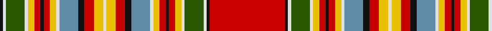

**Bands:** [KWGWYRKRYWBKRYWYRKBWYRKRYWGWKR](/stripes/kwgwyrkrywbkrywyrkbwyrkrywgwkr/) · **Stripes:** [K W DG W LY R K R LY W T K R LY W LY R K T W LY R K R LY W DG W K R](/stripes/stripes30/) K W DG W LY R K R LY W T K R LY W LY R K T W LY R K R LY W DG W K R

This was sourced from register-of-tartans.  It is a [30 band tartan](/bands/bands30/).

Original link https://www.tartanregister.gov.uk/tartanDetails.aspx?ref=1759

## Register references

External register numbers recorded for this tartan.

- Scottish Register of Tartans: [1759](https://www.tartanregister.gov.uk/tartanDetails.aspx?ref=1759)
- Scottish Tartans Authority (ITI): 6131

## Thread count
K/2 LN2 G12 LN2 Y4 R4 K2 R4 Y4 LN2 B12 K4 R6 Y6 LN2 Y6 R6 K4 B12 LN2 Y4 R4 K2 R4 Y4 LN2 G12 LN2 K2 R/48

## Palette
Each colour and its ΔE from the base-6 reference it is a variant of.

| Colour | Shade | Base | ΔE (OKLab) |
|---|---|---|---|
| B | <code style="background-color:#5C8CA8;">#5C8CA8</code> `#5C8CA8` | B <code style="background-color:#2A418A;">#2A418A</code> | 0.23 |
| G | <code style="background-color:#285800;">#285800</code> `#285800` | G <code style="background-color:#006100;">#006100</code> | 0.03 |
| K | <code style="background-color:#101010;">#101010</code> `#101010` | K <code style="background-color:#000000;">#000000</code> | 0.17 |
| LN | <code style="background-color:#E0E0E0;">#E0E0E0</code> `#E0E0E0` | W <code style="background-color:#F7F7F7;">#F7F7F7</code> | 0.07 |
| R | <code style="background-color:#C80000;">#C80000</code> `#C80000` | R <code style="background-color:#CC0000;">#CC0000</code> | 0.01 |
| Y | <code style="background-color:#E8C000;">#E8C000</code> `#E8C000` | Y <code style="background-color:#F2BF00;">#F2BF00</code> | 0.02 |

## Nearest tartans

The nearest existing variants by ΔTartan distance.

1. [Chattan](/setts/s17/w4ly10r8k7y28w3ly6r5k2r5ly6w3g30w2k3r50w2~x2/) — ΔT 1.26
1. [Chattan, Chief of Clan](/setts/s17/w4ly12r8k8t32w4ly7r7k2r7ly7w4g32w2k4r60w2~x2/) — ΔT 1.26
1. [Chattan Chief Clan Tartan Tartan Number: 1851. Earliest known date: 1816 Also known as Finzean's fancy. The record of the Lord Lyon states, 'Note - this tartan is specifically for the Chief of Clan Chattan and his immediate family.' Logan descibed this sett (without the chiefs extra white line) thus: 'The Chief also wears a particular tartan of a very showy pattern.' It is illustrated by Smith in 1850. Chief of the Clan Mackintosh Sir Aeneas Mackintosh of that Ilk, acknowledged this sett as the Clan tartan in 1816. See products available Copyright © Blair Urquhart, Comrie, 2015](/setts/s17/w4ly12r8k8t32w4ly7r7k2r7ly7w4g32w2k4r60w2/) — ΔT 1.26
1. [MacKintosh 7](/setts/s19/r24k1w1g6w1g1ly2r2k1r2ly2g1w1t6k2r3ly3g2w1~x2/) — ΔT 1.33
1. [Chattan, Chief](/setts/s17/w4ly12r8k8t32w4ly7r7k2r7ly7w4g32w2k8r60w2/) — ΔT 1.36
1. [Stewart](/setts/s23/w2r3k2r8g16k2w2k2ly1k10t6r32t6k10ly1k2w2k2g16r8k2r3w1~x4/) — ΔT 1.37
1. [MacKintosh #8](/setts/s19/r24k1w1dg6w1dg1ly2r2k1r2ly2dg1w1t6k2r3ly3dg2w1~x2/) — ΔT 1.38
1. [O'Keefe](/setts/s22/k8r2k3ly2k2w3k2lo12y22r2y2k1y2r2y22lo12k2w3k2ly2k3r2~x2/) — ΔT 1.43
1. [Whitworth](/setts/s38/r5ly1r8w1db20w1t20w1g20ly1r5ly1r5ly1g20ly2r52w1ly5w1ly5w1r52ly2g20ly1r5ly1r5ly1g20w1t20w1db20w1r8ly1~x2/) — ΔT 1.45
1. [Canadian Dental Association (Corp.)](/setts/s18/r8k3o15k1w3k1o8k1w3k1r19k2ly2k2g2k2r2k2~x2/) — ΔT 1.45

## Neighbour map

Every grey dot is one of 14313 variants placed by the first two principal components of the ΔTartan feature space (44% of its variance). Red is this tartan; blue dots are its nearest — click one to open its page.

<svg viewBox="0 0 640 380" role="img" style="max-width:100%;height:auto;border:1px solid #e0e0e0;border-radius:4px;display:block" xmlns="http://www.w3.org/2000/svg"><image href="/nn/cloud.v1.png" width="640" height="380"/><a href="/setts/s17/w4ly10r8k7y28w3ly6r5k2r5ly6w3g30w2k3r50w2~x2/"><circle cx="170.7" cy="47.0" r="4" fill="#3465a4"><title>Chattan</title></circle></a><a href="/setts/s17/w4ly12r8k8t32w4ly7r7k2r7ly7w4g32w2k4r60w2~x2/"><circle cx="186.9" cy="40.6" r="4" fill="#3465a4"><title>Chattan, Chief of Clan</title></circle></a><a href="/setts/s17/w4ly12r8k8t32w4ly7r7k2r7ly7w4g32w2k4r60w2/"><circle cx="191.9" cy="43.4" r="4" fill="#3465a4"><title>Chattan Chief Clan Tartan Tartan Number: 1851. Earliest known date: 1816 Also known as Finzean's fancy. The record of the Lord Lyon states, 'Note - this tartan is specifically for the Chief of Clan Chattan and his immediate family.' Logan descibed this sett (without the chiefs extra white line) thus: 'The Chief also wears a particular tartan of a very showy pattern.' It is illustrated by Smith in 1850. Chief of the Clan Mackintosh Sir Aeneas Mackintosh of that Ilk, acknowledged this sett as the Clan tartan in 1816. See products available Copyright © Blair Urquhart, Comrie, 2015</title></circle></a><a href="/setts/s19/r24k1w1g6w1g1ly2r2k1r2ly2g1w1t6k2r3ly3g2w1~x2/"><circle cx="246.3" cy="29.3" r="4" fill="#3465a4"><title>MacKintosh 7</title></circle></a><a href="/setts/s17/w4ly12r8k8t32w4ly7r7k2r7ly7w4g32w2k8r60w2/"><circle cx="172.3" cy="40.4" r="4" fill="#3465a4"><title>Chattan, Chief</title></circle></a><a href="/setts/s23/w2r3k2r8g16k2w2k2ly1k10t6r32t6k10ly1k2w2k2g16r8k2r3w1~x4/"><circle cx="187.8" cy="41.6" r="4" fill="#3465a4"><title>Stewart</title></circle></a><a href="/setts/s19/r24k1w1dg6w1dg1ly2r2k1r2ly2dg1w1t6k2r3ly3dg2w1~x2/"><circle cx="253.3" cy="29.5" r="4" fill="#3465a4"><title>MacKintosh #8</title></circle></a><a href="/setts/s22/k8r2k3ly2k2w3k2lo12y22r2y2k1y2r2y22lo12k2w3k2ly2k3r2~x2/"><circle cx="200.4" cy="63.0" r="4" fill="#3465a4"><title>O'Keefe</title></circle></a><a href="/setts/s38/r5ly1r8w1db20w1t20w1g20ly1r5ly1r5ly1g20ly2r52w1ly5w1ly5w1r52ly2g20ly1r5ly1r5ly1g20w1t20w1db20w1r8ly1~x2/"><circle cx="229.7" cy="14.0" r="4" fill="#3465a4"><title>Whitworth</title></circle></a><a href="/setts/s18/r8k3o15k1w3k1o8k1w3k1r19k2ly2k2g2k2r2k2~x2/"><circle cx="172.7" cy="64.0" r="4" fill="#3465a4"><title>Canadian Dental Association (Corp.)</title></circle></a><circle cx="182.5" cy="18.2" r="5" fill="#c00000"/></svg>

ID: /setts/s30/r24k1w1dg6w1ly2r2k1r2ly2w1t6k2r3ly3w1ly3r3k2t6w1ly2r2k1r2ly2w1dg6w1k1~x2/
