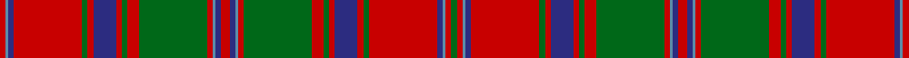

This page is one **sett** — a single exact thread-count. It belongs to the [tartan](/tartans/r2b1db2r24g2r2db8r2g2r4g24r2b1db2r3db2b1r2g24r4g2r2db8r2g2r24db2b1r2g2/)
(the same proportion at any scale), whose colour order is pattern [GRBBRGRBRGRGRBBRBBRGRGRBRGRBBR](/stripes/grbbrgrbrgrgrbbrbbrgrgrbrgrbbr/).

Sourced from register-of-tartans.  It is a [30 stripe tartan](/stripes/stripes30/).

Original link https://www.tartanregister.gov.uk/tartanDetails.aspx?ref=3949

## Register references

External register numbers recorded for this tartan.

- Scottish Register of Tartans: [3949](https://www.tartanregister.gov.uk/tartanDetails.aspx?ref=3949)
- Scottish Tartans Authority (ITI): 839
- Scottish Tartans World Register: 839

## Thread count
R/4 B2 DB4 R48 G4 R4 DB16 R4 G4 R8 G48 R4 B2 DB4 R6 DB4 B2 R4 G48 R8 G4 R4 DB16 R4 G4 R48 DB4 B2 R4 G/4

## Palette
Each colour and the base-6 reference it is a variant of.

| Colour | Shade | Base |
|---|---|---|
| B | <code style="background-color:#5C8CA8;">#5C8CA8</code> `oklch(61.7% 0.067 235.0)` <small>#5C8CA8</small> | B <code style="background-color:#2A418A;">#2A418A</code> |
| DB | <code style="background-color:#2C2C80;">#2C2C80</code> `oklch(35.0% 0.138 276.6)` <small>#2C2C80</small> | B <code style="background-color:#2A418A;">#2A418A</code> |
| G | <code style="background-color:#006818;">#006818</code> `oklch(45.0% 0.142 145.0)` <small>#006818</small> | G <code style="background-color:#006100;">#006100</code> |
| R | <code style="background-color:#C80000;">#C80000</code> `oklch(52.3% 0.215 29.2)` <small>#C80000</small> | R <code style="background-color:#CC0000;">#CC0000</code> |

## Nearest tartans

The nearest existing variants by ΔTartan distance, with this tartan at the top so the swatches line up against it.

ΔTartan

Tartan

Sett

—

<a href="/ttd/edit/#slug=r2t1db2r24g2r2db8r2g2r4g24r2t1db2r3db2t1r2g24r4g2r2db8r2g2r24db2t1r2g2~x2">Stewart/Stuart of Appin #2</a> <a class="nn-out" href="/setts/s30/r2t1db2r24g2r2db8r2g2r4g24r2t1db2r3db2t1r2g24r4g2r2db8r2g2r24db2t1r2g2~x2/" title="open its dictionary page">↗</a>

1.12

<a href="/ttd/edit/#slug=g10r2db2r30dp3r2w1r2dp3r30db2r2g10r10g10dp4r2dp4db10r4g2r4g30r2dp3w1~x2">MacDougal</a> <a class="nn-out" href="/setts/s26/g10r2db2r30dp3r2w1r2dp3r30db2r2g10r10g10dp4r2dp4db10r4g2r4g30r2dp3w1~x2/" title="open its dictionary page">↗</a>

1.12

<a href="/ttd/edit/#slug=r5g10r2db2r30p3r2w1r2p3r30db2r2g10r10g10p4r2p4db10r4g2r4g30r2p3w1~x2">MacDougall 9</a> <a class="nn-out" href="/setts/s27/r5g10r2db2r30p3r2w1r2p3r30db2r2g10r10g10p4r2p4db10r4g2r4g30r2p3w1~x2/" title="open its dictionary page">↗</a>

1.14

<a href="/ttd/edit/#slug=dt13r6dt2r6w1y26r2dt26w1r26w1dt6r2y2r2dt13r2y2r2dt6w1r26w1dt26y26w1r6dt2r6~x2">Unnamed C18/19th - Antigonish (A) #2</a> <a class="nn-out" href="/setts/s29/dt13r6dt2r6w1y26r2dt26w1r26w1dt6r2y2r2dt13r2y2r2dt6w1r26w1dt26y26w1r6dt2r6~x2/" title="open its dictionary page">↗</a>

1.15

<a href="/ttd/edit/#slug=r5g10r2db2r30lr3r2w1r2lr3r30db2r2g10r10g10lr4r2lr4db10r4g2r4g30r2lr3w1~x2">MacDougall Clan Tartan Tartan Number: 1519. Earliest known date: 1815-16 The earliest reference to the MacDougall tartan is in the collection of the Highland Society of London where a sample exists, signed and sealed by the Clan Chief around 1815. The sett is a complex one and the nearest count to the present day day tartan comes from a sample in Paton's collection housed at the Scottish Tartans Museum, and dating to about 1830. The Highland Society also have a sample certified by the Chief MacDougall of MacDougall dated 1906, in their archives store at the Royal Caledonian School near London. See products available Copyright © Blair Urquhart, Comrie, 2015</a> <a class="nn-out" href="/setts/s27/r5g10r2db2r30lr3r2w1r2lr3r30db2r2g10r10g10lr4r2lr4db10r4g2r4g30r2lr3w1~x2/" title="open its dictionary page">↗</a>

1.15

<a href="/ttd/edit/#slug=r5g10r2db2r30dp3r2w1r2dp3r30db2r2g10r10g10dp4r2dp4db10r4g2r4g30r2dp3w1~x2">MacDougall - 1970 (H of E)</a> <a class="nn-out" href="/setts/s27/r5g10r2db2r30dp3r2w1r2dp3r30db2r2g10r10g10dp4r2dp4db10r4g2r4g30r2dp3w1~x2/" title="open its dictionary page">↗</a>

1.21

<a href="/ttd/edit/#slug=db2r1db1r2db4r2db1r1k2r1db1r24db12r2g2r8g12r4db2r2k1~x2">Murray of Tullibardine 1</a> <a class="nn-out" href="/setts/s21/db2r1db1r2db4r2db1r1k2r1db1r24db12r2g2r8g12r4db2r2k1~x2/" title="open its dictionary page">↗</a>

1.25

<a href="/setts/s28/r6y2db2r30g2r2g4r2g2r1g20r1y2db2r4~x2/">All Irish Red Irish District Tartan Tartan Number: 4067. Earliest known date: 1997 Part of a collection produced by Lochcarron in 1997 to acknowledge the early historical and cultural links between the Scots and Irish. Lochcarron sample. See products available Copyright © Blair Urquhart, Comrie, 2015</a>

1.26

<a href="/ttd/edit/#slug=g8r4g1r1g1r24db8g4r1g1r1g4r8g1r1g1r1db8g8r2g4~x2">Matheson</a> <a class="nn-out" href="/setts/s21/g8r4g1r1g1r24db8g4r1g1r1g4r8g1r1g1r1db8g8r2g4~x2/" title="open its dictionary page">↗</a>

1.28

<a href="/ttd/edit/#slug=r3db2t1r2g24r4g2r2db8r2g2r24db2t1r2g2~x2">Stewart of Appin - 1906</a> <a class="nn-out" href="/setts/s16/r3db2t1r2g24r4g2r2db8r2g2r24db2t1r2g2~x2/" title="open its dictionary page">↗</a>

1.29

<a href="/ttd/edit/#slug=r6g12r2db1r36r4r36db1r2g12r12g12r6r2r6db12r4g2r4g36r2r2~x4">MacDougall</a> <a class="nn-out" href="/setts/s22/r6g12r2db1r36r4r36db1r2g12r12g12r6r2r6db12r4g2r4g36r2r2~x4/" title="open its dictionary page">↗</a>

## Neighbour map

Every grey dot is one of 14299 variants placed by the first two principal components of the ΔTartan feature space (44% of its variance). Red is this tartan; blue dots are its nearest — click one to open its page.

<svg viewBox="0 0 640 380" role="img" style="max-width:100%;height:auto;border:1px solid #e0e0e0;border-radius:4px;display:block" xmlns="http://www.w3.org/2000/svg"><image href="/nn/cloud.v1.png" width="640" height="380"/><a href="/setts/s26/g10r2db2r30dp3r2w1r2dp3r30db2r2g10r10g10dp4r2dp4db10r4g2r4g30r2dp3w1~x2/"><circle cx="301.3" cy="63.5" r="4" fill="#3465a4"><title>MacDougal</title></circle></a><a href="/setts/s27/r5g10r2db2r30p3r2w1r2p3r30db2r2g10r10g10p4r2p4db10r4g2r4g30r2p3w1~x2/"><circle cx="306.3" cy="62.2" r="4" fill="#3465a4"><title>MacDougall 9</title></circle></a><a href="/setts/s29/dt13r6dt2r6w1y26r2dt26w1r26w1dt6r2y2r2dt13r2y2r2dt6w1r26w1dt26y26w1r6dt2r6~x2/"><circle cx="257.5" cy="86.9" r="4" fill="#3465a4"><title>Unnamed C18/19th - Antigonish (A) #2</title></circle></a><a href="/setts/s27/r5g10r2db2r30lr3r2w1r2lr3r30db2r2g10r10g10lr4r2lr4db10r4g2r4g30r2lr3w1~x2/"><circle cx="306.5" cy="61.5" r="4" fill="#3465a4"><title>MacDougall Clan Tartan Tartan Number: 1519. Earliest known date: 1815-16 The earliest reference to the MacDougall tartan is in the collection of the Highland Society of London where a sample exists, signed and sealed by the Clan Chief around 1815. The sett is a complex one and the nearest count to the present day day tartan comes from a sample in Paton's collection housed at the Scottish Tartans Museum, and dating to about 1830. The Highland Society also have a sample certified by the Chief MacDougall of MacDougall dated 1906, in their archives store at the Royal Caledonian School near London. See products available Copyright © Blair Urquhart, Comrie, 2015</title></circle></a><a href="/setts/s27/r5g10r2db2r30dp3r2w1r2dp3r30db2r2g10r10g10dp4r2dp4db10r4g2r4g30r2dp3w1~x2/"><circle cx="307.8" cy="62.4" r="4" fill="#3465a4"><title>MacDougall - 1970 (H of E)</title></circle></a><a href="/setts/s21/db2r1db1r2db4r2db1r1k2r1db1r24db12r2g2r8g12r4db2r2k1~x2/"><circle cx="341.6" cy="88.4" r="4" fill="#3465a4"><title>Murray of Tullibardine 1</title></circle></a><a href="/setts/s28/r6y2db2r30g2r2g4r2g2r1g20r1y2db2r4~x2/"><circle cx="341.2" cy="50.4" r="4" fill="#3465a4"><title>All Irish Red Irish District Tartan Tartan Number: 4067. Earliest known date: 1997 Part of a collection produced by Lochcarron in 1997 to acknowledge the early historical and cultural links between the Scots and Irish. Lochcarron sample. See products available Copyright © Blair Urquhart, Comrie, 2015</title></circle></a><a href="/setts/s21/g8r4g1r1g1r24db8g4r1g1r1g4r8g1r1g1r1db8g8r2g4~x2/"><circle cx="326.0" cy="117.7" r="4" fill="#3465a4"><title>Matheson</title></circle></a><a href="/setts/s16/r3db2t1r2g24r4g2r2db8r2g2r24db2t1r2g2~x2/"><circle cx="326.7" cy="101.9" r="4" fill="#3465a4"><title>Stewart of Appin - 1906</title></circle></a><a href="/setts/s22/r6g12r2db1r36r4r36db1r2g12r12g12r6r2r6db12r4g2r4g36r2r2~x4/"><circle cx="350.3" cy="91.1" r="4" fill="#3465a4"><title>MacDougall</title></circle></a><circle cx="310.7" cy="76.2" r="5" fill="#c00000"/></svg>

ID: /setts/s30/r2t1db2r24g2r2db8r2g2r4g24r2t1db2r3db2t1r2g24r4g2r2db8r2g2r24db2t1r2g2~x2/
