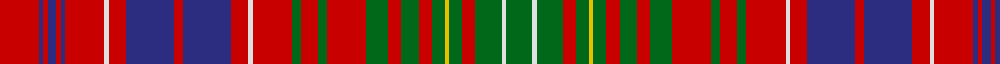

This page is one **sett** — a single exact thread-count. It belongs to the [tartan](/tartans/r9db1r1db2r1db1r9ln1r4db11r2db11r4ln1r9g2r4g2r9g5r3g4r3g3y1g3r3g6ln1g6/)
(the same proportion at any scale), whose colour order is pattern [GWGRGYGRGRGRGRGRWRBRBRWRBRBRBR](/stripes/gwgrgygrgrgrgrgrwrbrbrwrbrbrbr/).

Sourced from register-of-tartans.  It is a [30 stripe tartan](/stripes/stripes30/).

Original link https://www.tartanregister.gov.uk/tartanDetails.aspx?ref=2243

## Also known as

This cloth is also recorded under:

- Lumsden Short Version
- Lumsden Short version

4 attestations — the source records this cloth was collapsed from (oldest owns this page)

<ul>
<li>undated — Lumsden (Short) (register-of-tartans, <a href="https://www.tartanregister.gov.uk/tartanDetails.aspx?ref=2243">record</a>)</li>
<li>Unknown — Lumsden (Clan) (tartans-authority, <a href="http://www.tartansauthority.com/tartan-ferret/display/931/">record</a>)</li>
<li>undated — Lumsden Short Version (weddslist, <a href="http://www.weddslist.com/cgi-bin/tartans/pg.pl?source=sts">record</a>)</li>
<li>undated — Lumsden Short version Family Tartan Tartan Number: 931. Earliest known date: 0 One of a set of three similar designs for Laurie, Lawrie and Lowry. See products available Copyright © Blair Urquhart, Comrie, 2015 (house-of-tartan, <a href="http://www.house-of-tartan.scotland.net/house/TartanViewjs.asp?colr=Def&tnam=931">record</a>)</li>
</ul>

## Register references

External register numbers recorded for this tartan.

- Scottish Register of Tartans: [2243](https://www.tartanregister.gov.uk/tartanDetails.aspx?ref=2243)
- Scottish Tartans Authority (ITI): 931
- Scottish Tartans World Register: 931

## Thread count
R/18 DB2 R2 DB4 R2 DB2 R18 LN2 R8 DB22 R4 DB22 R8 LN2 R18 G4 R8 G4 R18 G10 R6 G8 R6 G6 Y2 G6 R6 G12 LN2 G/12

## Palette
Each colour and the base-6 reference it is a variant of.

| Colour | Shade | Base |
|---|---|---|
| DB | <code style="background-color:#2C2C80;">#2C2C80</code> `oklch(35.0% 0.138 276.6)` <small>#2C2C80</small> | B <code style="background-color:#2A418A;">#2A418A</code> |
| G | <code style="background-color:#006818;">#006818</code> `oklch(45.0% 0.142 145.0)` <small>#006818</small> | G <code style="background-color:#006100;">#006100</code> |
| LN | <code style="background-color:#E0E0E0;">#E0E0E0</code> `oklch(90.7% 0.000 89.9)` <small>#E0E0E0</small> | W <code style="background-color:#F7F7F7;">#F7F7F7</code> |
| R | <code style="background-color:#C80000;">#C80000</code> `oklch(52.3% 0.215 29.2)` <small>#C80000</small> | R <code style="background-color:#CC0000;">#CC0000</code> |
| Y | <code style="background-color:#E8C000;">#E8C000</code> `oklch(81.9% 0.168 93.7)` <small>#E8C000</small> | Y <code style="background-color:#F2BF00;">#F2BF00</code> |

## Nearest tartans

The nearest existing variants by ΔTartan distance, with this tartan at the top so the swatches line up against it.

ΔTartan

Tartan

Sett

—

<a href="/ttd/edit/#slug=r9db1r1db2r1db1r9w1r4db11r2db11r4w1r9g2r4g2r9g5r3g4r3g3ly1g3r3g6w1g6~x2">Lumsden (Short)</a> <a class="nn-out" href="/setts/s30/r9db1r1db2r1db1r9w1r4db11r2db11r4w1r9g2r4g2r9g5r3g4r3g3ly1g3r3g6w1g6~x2/" title="open its dictionary page">↗</a>

0.79

<a href="/ttd/edit/#slug=g8r2g8r12g2r3g2r12w1r3ly1db12r3db12ly1r3w1r12db1r1db2r1db1r12db1r1db2r1db1r12g8r2g8~x2">Huntly</a> <a class="nn-out" href="/setts/s33/g8r2g8r12g2r3g2r12w1r3ly1db12r3db12ly1r3w1r12db1r1db2r1db1r12db1r1db2r1db1r12g8r2g8~x2/" title="open its dictionary page">↗</a>

0.87

<a href="/ttd/edit/#slug=g21w2g20r8g6ly3g6r8g10r9g11r22g3r9g3r21w2r10db26r6db26r10w2r19g2r2g3r2g2r20g2r2g3r2g2r19g20r6g20">Lumsden (Waistcoat)</a> <a class="nn-out" href="/setts/s39/g21w2g20r8g6ly3g6r8g10r9g11r22g3r9g3r21w2r10db26r6db26r10w2r19g2r2g3r2g2r20g2r2g3r2g2r19g20r6g20/" title="open its dictionary page">↗</a>

0.88

<a href="/ttd/edit/#slug=g23r6g23r25g4r10g4r25w3r10b31r6b31r10w3r25k2r2k4r2k2r25k2r2k4r2k2r25g23r6g23~x2">Kinnoull</a> <a class="nn-out" href="/setts/s31/g23r6g23r25g4r10g4r25w3r10b31r6b31r10w3r25k2r2k4r2k2r25k2r2k4r2k2r25g23r6g23~x2/" title="open its dictionary page">↗</a>

0.96

<a href="/ttd/edit/#slug=db9r2db9r9g1r1g2r1g1r9g1r1g2r1g1r9w1r4db11r2db11r4w1r9g2r4g2r9g9r2g9~x2">Lumsden, of Clova</a> <a class="nn-out" href="/setts/s31/db9r2db9r9g1r1g2r1g1r9g1r1g2r1g1r9w1r4db11r2db11r4w1r9g2r4g2r9g9r2g9~x2/" title="open its dictionary page">↗</a>

1.06

<a href="/ttd/edit/#slug=g10r2g10r9k1r1k2r1k1r9k1r1k2r1k1r9w1r4db11r2db11r4w1r9g2r4g2r9g5r3g4r3g3ly1g3r3g6w1~x2">MacRae Prince's Own</a> <a class="nn-out" href="/setts/s38/g10r2g10r9k1r1k2r1k1r9k1r1k2r1k1r9w1r4db11r2db11r4w1r9g2r4g2r9g5r3g4r3g3ly1g3r3g6w1~x2/" title="open its dictionary page">↗</a>

1.16

<a href="/ttd/edit/#slug=g32r7g32r33g4r12g4r33lb3r12ly3dp33r7dp33ly3r12lb3r33dp2r2dp5r2dp2r33dp2r2dp5r2dp2r33g32r7g32~x2">Marchioness of Huntly's</a> <a class="nn-out" href="/setts/s33/g32r7g32r33g4r12g4r33lb3r12ly3dp33r7dp33ly3r12lb3r33dp2r2dp5r2dp2r33dp2r2dp5r2dp2r33g32r7g32~x2/" title="open its dictionary page">↗</a>

1.17

<a href="/ttd/edit/#slug=g21w2g20r8g6ly3g6r8g10r9g11r22g3r9g3r21w2r10db26r6db26r10w2r19g2r2g3r2g2r20g2r2g3r2g2r19g20r6g20~x2">Lumsden Waistcoat</a> <a class="nn-out" href="/setts/s39/g21w2g20r8g6ly3g6r8g10r9g11r22g3r9g3r21w2r10db26r6db26r10w2r19g2r2g3r2g2r20g2r2g3r2g2r19g20r6g20~x2/" title="open its dictionary page">↗</a>

1.19

<a href="/ttd/edit/#slug=k1r4dg8r2dg1r2db4r2w1r1w1r2dg4r3dg4r1k1r8w1~x2">MacDougall #6</a> <a class="nn-out" href="/setts/s19/k1r4dg8r2dg1r2db4r2w1r1w1r2dg4r3dg4r1k1r8w1~x2/" title="open its dictionary page">↗</a>

1.20

<a href="/ttd/edit/#slug=r23g2r3g2r3g2r5ly5r5g2r3g2r3g2r23g23r5g15r5g23r23g2r3g2r3g2r5w5r5g2r3g2r3g2r23db15r5db15r5db15~x2">MacRae of Inverinate</a> <a class="nn-out" href="/setts/s40/r23g2r3g2r3g2r5ly5r5g2r3g2r3g2r23g23r5g15r5g23r23g2r3g2r3g2r5w5r5g2r3g2r3g2r23db15r5db15r5db15~x2/" title="open its dictionary page">↗</a>

1.21

<a href="/ttd/edit/#slug=dg32r7dg32r33dg4r12dg4r33w3r12ly3dp33r7dp33ly3r12w3r33dp2r2dp5r2dp2r33dp2r2dp5r2dp2r33dg32r6dg23">Huntly (District)</a> <a class="nn-out" href="/setts/s33/dg32r7dg32r33dg4r12dg4r33w3r12ly3dp33r7dp33ly3r12w3r33dp2r2dp5r2dp2r33dp2r2dp5r2dp2r33dg32r6dg23/" title="open its dictionary page">↗</a>

## Neighbour map

Every grey dot is one of 14299 variants placed by the first two principal components of the ΔTartan feature space (44% of its variance). Red is this tartan; blue dots are its nearest — click one to open its page.

<svg viewBox="0 0 640 380" role="img" style="max-width:100%;height:auto;border:1px solid #e0e0e0;border-radius:4px;display:block" xmlns="http://www.w3.org/2000/svg"><image href="/nn/cloud.v1.png" width="640" height="380"/><a href="/setts/s33/g8r2g8r12g2r3g2r12w1r3ly1db12r3db12ly1r3w1r12db1r1db2r1db1r12db1r1db2r1db1r12g8r2g8~x2/"><circle cx="260.2" cy="102.8" r="4" fill="#3465a4"><title>Huntly</title></circle></a><a href="/setts/s39/g21w2g20r8g6ly3g6r8g10r9g11r22g3r9g3r21w2r10db26r6db26r10w2r19g2r2g3r2g2r20g2r2g3r2g2r19g20r6g20/"><circle cx="229.3" cy="103.1" r="4" fill="#3465a4"><title>Lumsden (Waistcoat)</title></circle></a><a href="/setts/s31/g23r6g23r25g4r10g4r25w3r10b31r6b31r10w3r25k2r2k4r2k2r25k2r2k4r2k2r25g23r6g23~x2/"><circle cx="228.7" cy="91.8" r="4" fill="#3465a4"><title>Kinnoull</title></circle></a><a href="/setts/s31/db9r2db9r9g1r1g2r1g1r9g1r1g2r1g1r9w1r4db11r2db11r4w1r9g2r4g2r9g9r2g9~x2/"><circle cx="246.5" cy="135.1" r="4" fill="#3465a4"><title>Lumsden, of Clova</title></circle></a><a href="/setts/s38/g10r2g10r9k1r1k2r1k1r9k1r1k2r1k1r9w1r4db11r2db11r4w1r9g2r4g2r9g5r3g4r3g3ly1g3r3g6w1~x2/"><circle cx="194.3" cy="90.3" r="4" fill="#3465a4"><title>MacRae Prince's Own</title></circle></a><a href="/setts/s33/g32r7g32r33g4r12g4r33lb3r12ly3dp33r7dp33ly3r12lb3r33dp2r2dp5r2dp2r33dp2r2dp5r2dp2r33g32r7g32~x2/"><circle cx="271.3" cy="92.3" r="4" fill="#3465a4"><title>Marchioness of Huntly's</title></circle></a><a href="/setts/s39/g21w2g20r8g6ly3g6r8g10r9g11r22g3r9g3r21w2r10db26r6db26r10w2r19g2r2g3r2g2r20g2r2g3r2g2r19g20r6g20~x2/"><circle cx="228.4" cy="103.6" r="4" fill="#3465a4"><title>Lumsden Waistcoat</title></circle></a><a href="/setts/s19/k1r4dg8r2dg1r2db4r2w1r1w1r2dg4r3dg4r1k1r8w1~x2/"><circle cx="210.1" cy="141.4" r="4" fill="#3465a4"><title>MacDougall #6</title></circle></a><a href="/setts/s40/r23g2r3g2r3g2r5ly5r5g2r3g2r3g2r23g23r5g15r5g23r23g2r3g2r3g2r5w5r5g2r3g2r3g2r23db15r5db15r5db15~x2/"><circle cx="259.2" cy="91.1" r="4" fill="#3465a4"><title>MacRae of Inverinate</title></circle></a><a href="/setts/s33/dg32r7dg32r33dg4r12dg4r33w3r12ly3dp33r7dp33ly3r12w3r33dp2r2dp5r2dp2r33dp2r2dp5r2dp2r33dg32r6dg23/"><circle cx="274.1" cy="91.3" r="4" fill="#3465a4"><title>Huntly (District)</title></circle></a><circle cx="224.0" cy="120.7" r="5" fill="#c00000"/></svg>

ID: /setts/s30/r9db1r1db2r1db1r9w1r4db11r2db11r4w1r9g2r4g2r9g5r3g4r3g3ly1g3r3g6w1g6~x2/
