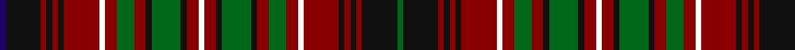

In pattern [BKRKRKRWRGRKGKRWRKGKRGRWRKRKRKG](/patterns/bkrkrkrwrgrkgkrwrkgkrgrwrkrkrkg/).

This was sourced from tartans-authority.  It is a [31 stripes tartan](/stripes/stripes31/).

Original link http://www.tartansauthority.com/tartan-ferret/display/353/

## Thread count
DB/4 K24 DR4 K4 DR4 K4 DR24 W4 DR8 G12 DR8 K4 G20 K4 DR8 W4 DR8 K4 G20 K4 DR8 G12 DR8 W4 DR24 K4 DR4 K4 DR4 K24 G/4

## Palette
Each colour and its ΔE from the base-6 reference it is a variant of.

| Colour | Shade | Base | ΔE (OKLab) |
|---|---|---|---|
| DB | <code style="background-color:#1C0070;">#1C0070</code> `#1C0070` | B <code style="background-color:#2A418A;">#2A418A</code> | 0.14 |
| DR | <code style="background-color:#880000;">#880000</code> `#880000` | R <code style="background-color:#CC0000;">#CC0000</code> | 0.15 |
| G | <code style="background-color:#006818;">#006818</code> `#006818` | G <code style="background-color:#006100;">#006100</code> | 0.02 |
| K | <code style="background-color:#101010;">#101010</code> `#101010` | K <code style="background-color:#000000;">#000000</code> | 0.17 |
| W | <code style="background-color:#FCFCFC;">#FCFCFC</code> `#FCFCFC` | W <code style="background-color:#F7F7F7;">#F7F7F7</code> | 0.01 |

## Nearest tartans

The nearest existing variants by ΔTartan distance.

1. [Innes, of Cowie](/setts/s31/b1k6r1k1r1k1r6w1r2g3r2k1g5k1r2w1r2k1g5k1r2g3r2w1r6k1r1k1r1k6g1~b304080-g008000-k000000-rc00000-we0e0e0~x2/) — ΔT 1.21
1. [Cumming/Comyn/Buchan](/setts/s23/r6g6r1k8r1k1b1r1k8r1g6r6b1k6r1g8r1k1r1g8r1k6b1~b2c4084-g005020-k101010-rdc0000~x2/) — ΔT 1.22
1. [Kilbarchan Unidentified No. 7](/setts/s28/b4r4k4r6g24r4k3r6g3r4k24r6g4r4b4r4g4r6k24r4g3r6k3r4g24r6k4r4~b2888c4-g006818-k101010-rc80000~x2/) — ΔT 1.26
1. [Cumming Comyn Buchan Clan Tartan Tartan Number: 2012. Earliest known date: pre 2003 D.C.Stewart comments, "Still further confusion has arisen from Smibert's illustration.." The present editor is none the wiser. See products available Copyright © Blair Urquhart, Comrie, 2015](/setts/s23/r6g6r1k8r1k1b1r1k8r1g6r6b1k6r1g8r1k1r1g8r1k6b1~b2c2c80-g006818-k101010-rc80000~x2/) — ΔT 1.27
1. [Cumming Hunting](/setts/s23/k1r1g8r1k6b1r6g6r1k8r1b1k1r1k8r1g6r6b1k6r1g8r1~b2888c4-g006818-k101010-rc80000~x4/) — ΔT 1.29
1. [Innes of Cowie](/setts/s60/k6r1k1r1k1r6w1r2g3r2k1g5k1r2w1r2k1g5k1r2g3r2w1r6k1r1k1r1k6g1k6r1k1r1k1r6w1r2g3r2k1g5k1r2w1r2k1g5k1r2g3r2w1r6k1r1k1r1k6b1~b1c0070-g006818-k101010-r880000-wfcfcfc~x4/) — ΔT 1.35
1. [Gordonstoun (1957)](/setts/s25/r8g8r2k14r2k2b2r2k14r2g8r8b2ba8r2g14y2g2y3g2y2g14r2ba8b2~b3c82af-ba2c4084-g005020-k101010-rdc0000-ye8c000~x2/) — ΔT 1.43
1. [Dryburgh Clan Tartan Tartan Number: 6422. Earliest known date: 2004 Based on Kerr, and the colours of the Dryburgh coat of arms including the 3 martlet birds, matriculated for William J. Dryburgh. See products available Copyright © Blair Urquhart, Comrie, 2015](/setts/s20/k10b2k2b2k3b10r16ra2r2ra2r2ra2r16b10k3b2k2b2k10y2~b6c5454-k101010-rbc4c10-ra907c80-ydcc010~x2/) — ΔT 1.45
1. [MacRae](/setts/s31/g4r1g4r4b1r1b1r1b1r4b1r1b1r1b1r4y1r1b4r1b4r1y1r4g1r1g1r4g4r1g4~b000052-g11450d-raa0000-yaaaaaa~x2/) — ΔT 1.46
1. [MacRae](/setts/s31/g4r1g4r4b1r1b1r1b1r4b1r1b1r1b1r4y1r1b4r1b4r1y1r4g1r1g1r4g4r1g4~b000052-g11450d-raa0000-yaaaaaa/) — ΔT 1.46

## Neighbour map

Every grey dot is one of 15726 variants placed by the first two principal components of the ΔTartan feature space (44% of its variance). Red is this tartan; blue dots are its nearest — click one to open its page.

<svg viewBox="0 0 640 380" role="img" style="max-width:100%;height:auto;border:1px solid #e0e0e0;border-radius:4px;display:block" xmlns="http://www.w3.org/2000/svg"><image href="/nn/cloud.v1.png" width="640" height="380"/><a href="/setts/s31/b1k6r1k1r1k1r6w1r2g3r2k1g5k1r2w1r2k1g5k1r2g3r2w1r6k1r1k1r1k6g1~b304080-g008000-k000000-rc00000-we0e0e0~x2/"><circle cx="114.5" cy="127.3" r="4" fill="#3465a4"><title>Innes, of Cowie</title></circle></a><a href="/setts/s23/r6g6r1k8r1k1b1r1k8r1g6r6b1k6r1g8r1k1r1g8r1k6b1~b2c4084-g005020-k101010-rdc0000~x2/"><circle cx="177.4" cy="162.8" r="4" fill="#3465a4"><title>Cumming/Comyn/Buchan</title></circle></a><a href="/setts/s28/b4r4k4r6g24r4k3r6g3r4k24r6g4r4b4r4g4r6k24r4g3r6k3r4g24r6k4r4~b2888c4-g006818-k101010-rc80000~x2/"><circle cx="163.3" cy="136.4" r="4" fill="#3465a4"><title>Kilbarchan Unidentified No. 7</title></circle></a><a href="/setts/s23/r6g6r1k8r1k1b1r1k8r1g6r6b1k6r1g8r1k1r1g8r1k6b1~b2c2c80-g006818-k101010-rc80000~x2/"><circle cx="173.3" cy="162.0" r="4" fill="#3465a4"><title>Cumming Comyn Buchan Clan Tartan Tartan Number: 2012. Earliest known date: pre 2003 D.C.Stewart comments, &quot;Still further confusion has arisen from Smibert's illustration..&quot; The present editor is none the wiser. See products available Copyright © Blair Urquhart, Comrie, 2015</title></circle></a><a href="/setts/s23/k1r1g8r1k6b1r6g6r1k8r1b1k1r1k8r1g6r6b1k6r1g8r1~b2888c4-g006818-k101010-rc80000~x4/"><circle cx="169.7" cy="160.5" r="4" fill="#3465a4"><title>Cumming Hunting</title></circle></a><a href="/setts/s60/k6r1k1r1k1r6w1r2g3r2k1g5k1r2w1r2k1g5k1r2g3r2w1r6k1r1k1r1k6g1k6r1k1r1k1r6w1r2g3r2k1g5k1r2w1r2k1g5k1r2g3r2w1r6k1r1k1r1k6b1~b1c0070-g006818-k101010-r880000-wfcfcfc~x4/"><circle cx="135.5" cy="114.9" r="4" fill="#3465a4"><title>Innes of Cowie</title></circle></a><a href="/setts/s25/r8g8r2k14r2k2b2r2k14r2g8r8b2ba8r2g14y2g2y3g2y2g14r2ba8b2~b3c82af-ba2c4084-g005020-k101010-rdc0000-ye8c000~x2/"><circle cx="88.8" cy="124.1" r="4" fill="#3465a4"><title>Gordonstoun (1957)</title></circle></a><a href="/setts/s20/k10b2k2b2k3b10r16ra2r2ra2r2ra2r16b10k3b2k2b2k10y2~b6c5454-k101010-rbc4c10-ra907c80-ydcc010~x2/"><circle cx="164.0" cy="139.1" r="4" fill="#3465a4"><title>Dryburgh Clan Tartan Tartan Number: 6422. Earliest known date: 2004 Based on Kerr, and the colours of the Dryburgh coat of arms including the 3 martlet birds, matriculated for William J. Dryburgh. See products available Copyright © Blair Urquhart, Comrie, 2015</title></circle></a><a href="/setts/s31/g4r1g4r4b1r1b1r1b1r4b1r1b1r1b1r4y1r1b4r1b4r1y1r4g1r1g1r4g4r1g4~b000052-g11450d-raa0000-yaaaaaa~x2/"><circle cx="183.1" cy="185.2" r="4" fill="#3465a4"><title>MacRae</title></circle></a><a href="/setts/s31/g4r1g4r4b1r1b1r1b1r4b1r1b1r1b1r4y1r1b4r1b4r1y1r4g1r1g1r4g4r1g4~b000052-g11450d-raa0000-yaaaaaa/"><circle cx="183.1" cy="185.2" r="4" fill="#3465a4"><title>MacRae</title></circle></a><circle cx="145.6" cy="142.5" r="5" fill="#c00000"/></svg>

ID: /setts/s31/b1k6r1k1r1k1r6w1r2g3r2k1g5k1r2w1r2k1g5k1r2g3r2w1r6k1r1k1r1k6g1~b1c0070-g006818-k101010-r880000-wfcfcfc~x4/
