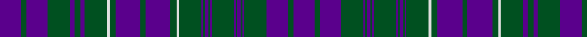

In pattern [BGBGBGBGBGBGBGBGWGBGBGWGBGBGBGB](/patterns/bgbgbgbgbgbgbgbgwgbgbgwgbgbgbgb/).

This was sourced from register-of-tartans.  It is a [31 stripes tartan](/stripes/stripes31/).

Original link https://www.tartanregister.gov.uk/tartanDetails.aspx?ref=2740

## Thread count
P/50 G12 P50 G52 P10 G14 P10 G52 LN6 G14 P58 G12 P58 G14 LN6 G52 P4 G4 P8 G4 P4 G52 P4 G4 P8 G4 P4 G52 P50 G12 P/50

## Palette
Each colour and its ΔE from the base-6 reference it is a variant of.

| Colour | Shade | Base | ΔE (OKLab) |
|---|---|---|---|
| G | <code style="background-color:#005020;">#005020</code> `#005020` | G <code style="background-color:#006400;">#006400</code> | 0.08 |
| LN | <code style="background-color:#E0E0E0;">#E0E0E0</code> `#E0E0E0` | W <code style="background-color:#F4F4F0;">#F4F4F0</code> | 0.06 |
| P | <code style="background-color:#5A008C;">#5A008C</code> `#5A008C` | B <code style="background-color:#2C4084;">#2C4084</code> | 0.12 |

## Nearest tartans

The nearest existing variants by ΔTartan distance.

1. [MacRae/Rae](/setts/s27/b54g12b54g56b10g14b10g56b62g12b62g56b4g4b8g4b4g56b4g4b8g4b4g56b54g12b54-b5a008c-g005020/) — ΔT 1.04
1. [MacRae (Rae)](/setts/s27/b28g6b28g28b6g6b6g28b32g6b32g28b2g2b4g2b2g28b2g2b4g2b2g28b28g6b28-b5a008c-g005020/) — ΔT 1.09
1. [Fleming Commemorative Tartan Tartan Number: 2531. Earliest known date: 1997 Kilt was created for Scotland Flanders 2002 as a cultural exchange product. See products available Copyright © Blair Urquhart, Comrie, 2015](/setts/s28/b32k6b6k6b6k32b34k4y8k4b34k32b34k4w8k4b34k32b34k4y8k4b34k32b6k6b6k6-b2c2c80-k101010-we0e0e0-ye8c000/) — ΔT 1.56
1. [Platt (Name)](/setts/s28/g32b12y4g24r4g28b28y2b24r4g12b48g12y4r4y4g12b48g12r4b24y2b28g28r4g24y4b12-b2c2c80-g408060-rc80000-ye8c000/) — ΔT 1.62
1. [MacRae, (MacCrae)](/setts/s31/b50g12b50g52b10g14b10g52w6g14b58g12b58g14w6g52b4g4b8g4b4g52b4g4b8g4b4g52b50g12b50-b800080-g008000-we0e0e0/) — ΔT 1.67
1. [Rae (Wilsons) (Clan)](/setts/s27/b27g12b54g56b10g14b10g56b62g12b62g56b4g4b8g4b4g56b4g4b8g4b4g56b54g12b27-b440044-g285800/) — ΔT 1.71
1. [MacRae, (Rae)](/setts/s27/b28g6b28g28b6g6b6g28b32g6b32g28b2g2b4g2b2g28b2g2b4g2b2g28b28g6b28-b800080-g008000/) — ΔT 1.78
1. [MacRae, Rae](/setts/s27/b54g12b54g56b10g14b10g56b62g12b62g56b4g4b8g4b4g56b4g4b8g4b4g56b54g12b54-b800080-g008000/) — ΔT 1.78
1. [Matheson Hunting (Blue)](/setts/s21/g32b16g4b4g4b96k32g16b4g4b4g16b32g4b4g4b4k32g32b8g8-b202060-g789484-k101010/) — ΔT 1.94
1. [James of Wales](/setts/s28/k8y4r14b22y2b22r14b8r6b12k2b12r6k2b22k2r6b12k2b12r6b8r14b22y2b22r14y4-b202060-k101010-r901c38-ybc8c00/) — ΔT 1.95

## Neighbour map

Every grey dot is one of 15726 variants placed by the first two principal components of the ΔTartan feature space (44% of its variance). Red is this tartan; blue dots are its nearest — click one to open its page.

<svg viewBox="0 0 640 380" role="img" style="max-width:100%;height:auto;border:1px solid #e0e0e0;border-radius:4px;display:block" xmlns="http://www.w3.org/2000/svg"><image href="/nn/cloud.v1.png" width="640" height="380"/><a href="/setts/s27/b54g12b54g56b10g14b10g56b62g12b62g56b4g4b8g4b4g56b4g4b8g4b4g56b54g12b54-b5a008c-g005020/"><circle cx="387.4" cy="182.4" r="4" fill="#3465a4"><title>MacRae/Rae</title></circle></a><a href="/setts/s27/b28g6b28g28b6g6b6g28b32g6b32g28b2g2b4g2b2g28b2g2b4g2b2g28b28g6b28-b5a008c-g005020/"><circle cx="393.4" cy="181.2" r="4" fill="#3465a4"><title>MacRae (Rae)</title></circle></a><a href="/setts/s28/b32k6b6k6b6k32b34k4y8k4b34k32b34k4w8k4b34k32b34k4y8k4b34k32b6k6b6k6-b2c2c80-k101010-we0e0e0-ye8c000/"><circle cx="303.5" cy="173.4" r="4" fill="#3465a4"><title>Fleming Commemorative Tartan Tartan Number: 2531. Earliest known date: 1997 Kilt was created for Scotland Flanders 2002 as a cultural exchange product. See products available Copyright © Blair Urquhart, Comrie, 2015</title></circle></a><a href="/setts/s28/g32b12y4g24r4g28b28y2b24r4g12b48g12y4r4y4g12b48g12r4b24y2b28g28r4g24y4b12-b2c2c80-g408060-rc80000-ye8c000/"><circle cx="295.7" cy="127.3" r="4" fill="#3465a4"><title>Platt (Name)</title></circle></a><a href="/setts/s31/b50g12b50g52b10g14b10g52w6g14b58g12b58g14w6g52b4g4b8g4b4g52b4g4b8g4b4g52b50g12b50-b800080-g008000-we0e0e0/"><circle cx="306.5" cy="136.1" r="4" fill="#3465a4"><title>MacRae, (MacCrae)</title></circle></a><a href="/setts/s27/b27g12b54g56b10g14b10g56b62g12b62g56b4g4b8g4b4g56b4g4b8g4b4g56b54g12b27-b440044-g285800/"><circle cx="387.3" cy="183.7" r="4" fill="#3465a4"><title>Rae (Wilsons) (Clan)</title></circle></a><a href="/setts/s27/b28g6b28g28b6g6b6g28b32g6b32g28b2g2b4g2b2g28b2g2b4g2b2g28b28g6b28-b800080-g008000/"><circle cx="354.9" cy="157.3" r="4" fill="#3465a4"><title>MacRae, (Rae)</title></circle></a><a href="/setts/s27/b54g12b54g56b10g14b10g56b62g12b62g56b4g4b8g4b4g56b4g4b8g4b4g56b54g12b54-b800080-g008000/"><circle cx="348.7" cy="158.7" r="4" fill="#3465a4"><title>MacRae, Rae</title></circle></a><a href="/setts/s21/g32b16g4b4g4b96k32g16b4g4b4g16b32g4b4g4b4k32g32b8g8-b202060-g789484-k101010/"><circle cx="306.8" cy="120.7" r="4" fill="#3465a4"><title>Matheson Hunting (Blue)</title></circle></a><a href="/setts/s28/k8y4r14b22y2b22r14b8r6b12k2b12r6k2b22k2r6b12k2b12r6b8r14b22y2b22r14y4-b202060-k101010-r901c38-ybc8c00/"><circle cx="351.4" cy="182.2" r="4" fill="#3465a4"><title>James of Wales</title></circle></a><circle cx="336.5" cy="155.8" r="5" fill="#c00000"/></svg>

ID: /setts/s31/b50g12b50g52b10g14b10g52w6g14b58g12b58g14w6g52b4g4b8g4b4g52b4g4b8g4b4g52b50g12b50-b5a008c-g005020-we0e0e0/
