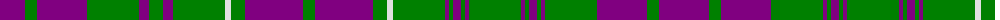

In pattern [BGBGBGBGBGBGBGBGWGBGBGWGBGBGBGB](/patterns/bgbgbgbgbgbgbgbgwgbgbgwgbgbgbgb/).

This was sourced from weddslist.  It is a [31 stripes tartan](/stripes/stripes31/).

Original link http://www.weddslist.com/cgi-bin/tartans/pg.pl?source=sts

## Thread count
P/50 G12 P50 G52 P10 G14 P10 G52 LN6 G14 P58 G12 P58 G14 LN6 G52 P4 G4 P8 G4 P4 G52 P4 G4 P8 G4 P4 G52 P50 G12 P/50

## Palette
Each colour and its ΔE from the base-6 reference it is a variant of.

| Colour | Shade | Base | ΔE (OKLab) |
|---|---|---|---|
| G | <code style="background-color:#008000;">#008000</code> `#008000` | G <code style="background-color:#006400;">#006400</code> | 0.09 |
| LN | <code style="background-color:#E0E0E0;">#E0E0E0</code> `#E0E0E0` | W <code style="background-color:#F4F4F0;">#F4F4F0</code> | 0.06 |
| P | <code style="background-color:#800080;">#800080</code> `#800080` | B <code style="background-color:#2C4084;">#2C4084</code> | 0.17 |

ID: /setts/s31/b50g12b50g52b10g14b10g52w6g14b58g12b58g14w6g52b4g4b8g4b4g52b4g4b8g4b4g52b50g12b50-b800080-g008000-we0e0e0/
