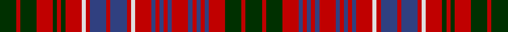

In pattern [GRGRBRBRBRBRBRBRWRBRBRWRGRGRGRG](/stripes/grgrbrbrbrbrbrbrwrbrbrwrgrgrgrg/).

This was sourced from weddslist.  It is a [31 stripe tartan](/stripes/stripes31/).

Original link http://www.weddslist.com/cgi-bin/tartans/pg.pl?source=sts

## Attestations

This cloth appears in 2 source records; the oldest owns this page.

- undated — MacRae (weddslist, [record](http://www.weddslist.com/cgi-bin/tartans/pg.pl?source=sts))
- undated — MacRae Clan Tartan Tartan Number: 859. Earliest known date: 1850 This plate is taken from the manuscript of William and Andrew Smith's 'Authenticated Tartans of the Clans and Families of Scotland', with a minor error corrected in the count given by D.C.Stewart in 'The Setts of the Scottish Tartans' (1950). The Smith's sources included the findings of George Hunter, who toured the Highlands in search of old tartans prior to 1822. See products available Copyright © Blair Urquhart, Comrie, 2015 (house-of-tartan, [record](http://www.house-of-tartan.scotland.net/house/TartanViewjs.asp?colr=Def&tnam=859))

## Thread count
DG/16 R4 DG16 R16 DG4 R4 DG4 R16 LN4 R4 B16 R4 B16 R4 LN4 R16 B4 R4 B4 R4 B4 R16 B4 R4 B4 R4 B4 R16 DG16 R4 DG/16

## Palette
Each colour and the base-6 reference it is a variant of.

| Colour | Shade | Base |
|---|---|---|
| B | <code style="background-color:#304080;">#304080</code> `oklch(39.4% 0.109 270.2)` <small>#304080</small> | B <code style="background-color:#2A418A;">#2A418A</code> |
| DG | <code style="background-color:#003000;">#003000</code> `oklch(26.8% 0.091 142.5)` <small>#003000</small> | G <code style="background-color:#006100;">#006100</code> |
| LN | <code style="background-color:#E0E0E0;">#E0E0E0</code> `oklch(90.7% 0.000 89.9)` <small>#E0E0E0</small> | W <code style="background-color:#F7F7F7;">#F7F7F7</code> |
| R | <code style="background-color:#C00000;">#C00000</code> `oklch(50.7% 0.208 29.2)` <small>#C00000</small> | R <code style="background-color:#CC0000;">#CC0000</code> |

## Nearest tartans

The nearest existing variants by ΔTartan distance.

1. [MacRae (Red)](/setts/s31/g4r1g4r4db1r1db1r1db1r4db1r1db1r1db1r4w1r1db4r1db4r1w1r4g1r1g1r4g4r1g4~x4/) — ΔT 0.48
1. [MacRae](/setts/s31/dg4r1dg4r4dg1r1dg1r4lb1r1db4r1db4r1lb1r4db1r1db1r1db1r4db1r1db1r1db1r4dg4r1dg4/) — ΔT 0.52
1. [MacRae](/setts/s31/dg4r1dg4r4dg1r1dg1r4lr1r1db4r1db4r1lr1r4db1r1db1r1db1r4db1r1db1r1db1r4dg4r1dg4~x2/) — ΔT 0.52
1. [Grant of Ballindalloch (Personal)](/setts/s28/r5db3r3g16r3g3r3db5r3y5r12db5r3db3r5~x4/) — ΔT 0.81
1. [Staffa (Silk)](/setts/s25/r17dg14r4dg4r17dg4r4db12r13w5r13dg14w3dg14r4dg4r17dg4r4dg8r4db4r4db4r14~x2/) — ΔT 1.29
1. [Ross](/setts/s27/dg8r1dg8r8dg1r2dg1r8db8r1db8r8db1r1db2r1db1r8db1r1db2r1db1r8dg8r1dg8~x2/) — ΔT 1.57
1. [MacInroy #2](/setts/s28/r18k3r3k11dg9k2dg9k11r2k11r3k3r9dg2k3dg2r9k3r3k11r2k11r3k3r18db2r3db2~x2/) — ΔT 1.58
1. [Innes of Cowie (Clan?)](/setts/s31/db1k6r1k1r1k1r6w1r2g3r2k1g5k1r2w1r2k1g5k1r2g3r2w1r6k1r1k1r1k6g1~x4/) — ΔT 1.60
1. [Reid of Straloch (Personal)](/setts/s17/r1g1r6db2r1g1w1g6r2db6w1db1r1g2r6g1r1~x6/) — ΔT 1.61
1. [Grant of Ballindalloch (Personal)](/setts/s15/r5db3r3g16r3g3r3db5r3y5r12db5r3db3r5~x4/) — ΔT 1.63

## Neighbour map

Every grey dot is one of 14299 variants placed by the first two principal components of the ΔTartan feature space (44% of its variance). Red is this tartan; blue dots are its nearest — click one to open its page.

<svg viewBox="0 0 640 380" role="img" style="max-width:100%;height:auto;border:1px solid #e0e0e0;border-radius:4px;display:block" xmlns="http://www.w3.org/2000/svg"><image href="/nn/cloud.v1.png" width="640" height="380"/><a href="/setts/s31/g4r1g4r4db1r1db1r1db1r4db1r1db1r1db1r4w1r1db4r1db4r1w1r4g1r1g1r4g4r1g4~x4/"><circle cx="174.8" cy="176.0" r="4" fill="#3465a4"><title>MacRae (Red)</title></circle></a><a href="/setts/s31/dg4r1dg4r4dg1r1dg1r4lb1r1db4r1db4r1lb1r4db1r1db1r1db1r4db1r1db1r1db1r4dg4r1dg4/"><circle cx="166.5" cy="174.7" r="4" fill="#3465a4"><title>MacRae</title></circle></a><a href="/setts/s31/dg4r1dg4r4dg1r1dg1r4lr1r1db4r1db4r1lr1r4db1r1db1r1db1r4db1r1db1r1db1r4dg4r1dg4~x2/"><circle cx="184.6" cy="187.1" r="4" fill="#3465a4"><title>MacRae</title></circle></a><a href="/setts/s28/r5db3r3g16r3g3r3db5r3y5r12db5r3db3r5~x4/"><circle cx="185.7" cy="172.8" r="4" fill="#3465a4"><title>Grant of Ballindalloch (Personal)</title></circle></a><a href="/setts/s25/r17dg14r4dg4r17dg4r4db12r13w5r13dg14w3dg14r4dg4r17dg4r4dg8r4db4r4db4r14~x2/"><circle cx="240.8" cy="181.0" r="4" fill="#3465a4"><title>Staffa (Silk)</title></circle></a><a href="/setts/s27/dg8r1dg8r8dg1r2dg1r8db8r1db8r8db1r1db2r1db1r8db1r1db2r1db1r8dg8r1dg8~x2/"><circle cx="232.2" cy="162.7" r="4" fill="#3465a4"><title>Ross</title></circle></a><a href="/setts/s28/r18k3r3k11dg9k2dg9k11r2k11r3k3r9dg2k3dg2r9k3r3k11r2k11r3k3r18db2r3db2~x2/"><circle cx="207.9" cy="142.8" r="4" fill="#3465a4"><title>MacInroy #2</title></circle></a><a href="/setts/s31/db1k6r1k1r1k1r6w1r2g3r2k1g5k1r2w1r2k1g5k1r2g3r2w1r6k1r1k1r1k6g1~x4/"><circle cx="147.7" cy="145.4" r="4" fill="#3465a4"><title>Innes of Cowie (Clan?)</title></circle></a><a href="/setts/s17/r1g1r6db2r1g1w1g6r2db6w1db1r1g2r6g1r1~x6/"><circle cx="203.7" cy="170.1" r="4" fill="#3465a4"><title>Reid of Straloch (Personal)</title></circle></a><a href="/setts/s15/r5db3r3g16r3g3r3db5r3y5r12db5r3db3r5~x4/"><circle cx="216.3" cy="200.4" r="4" fill="#3465a4"><title>Grant of Ballindalloch (Personal)</title></circle></a><circle cx="181.4" cy="180.6" r="5" fill="#c00000"/></svg>

ID: /setts/s31/dg4r1dg4r4dg1r1dg1r4w1r1db4r1db4r1w1r4db1r1db1r1db1r4db1r1db1r1db1r4dg4r1dg4~x4/
