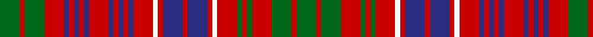

In pattern [GRGRBRBRBRBRBRBRWRBRBRWRGRGRGRG](/patterns/grgrbrbrbrbrbrbrwrbrbrwrgrgrgrg/).

This was sourced from register-of-tartans.  It is a [31 stripes tartan](/stripes/stripes31/).

Original link https://www.tartanregister.gov.uk/tartanDetails.aspx?ref=2742

## Thread count
G/16 R4 G16 R16 DB4 R4 DB4 R4 DB4 R16 DB4 R4 DB4 R4 DB4 R16 W4 R4 DB16 R4 DB16 R4 W4 R16 G4 R4 G4 R16 G16 R4 G/16

## Palette
Each colour and its ΔE from the base-6 reference it is a variant of.

| Colour | Shade | Base | ΔE (OKLab) |
|---|---|---|---|
| DB | <code style="background-color:#2C2C80;">#2C2C80</code> `#2C2C80` | B <code style="background-color:#2C4084;">#2C4084</code> | 0.05 |
| G | <code style="background-color:#006818;">#006818</code> `#006818` | G <code style="background-color:#006400;">#006400</code> | 0.02 |
| R | <code style="background-color:#C80000;">#C80000</code> `#C80000` | R <code style="background-color:#C80000;">#C80000</code> | 0.00 |
| W | <code style="background-color:#FCFCFC;">#FCFCFC</code> `#FCFCFC` | W <code style="background-color:#F4F4F0;">#F4F4F0</code> | 0.03 |

ID: /setts/s31/g16r4g16r16b4r4b4r4b4r16b4r4b4r4b4r16w4r4b16r4b16r4w4r16g4r4g4r16g16r4g16-b2c2c80-g006818-rc80000-wfcfcfc/
