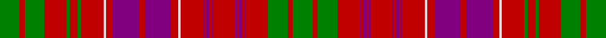

In pattern [GRGRBRBRBRBRBRBRWRBRBRWRGRGRGRG](/stripes/grgrbrbrbrbrbrbrwrbrbrwrgrgrgrg/).

This was sourced from weddslist.  It is a [31 stripe tartan](/stripes/stripes31/).

Original link http://www.weddslist.com/cgi-bin/tartans/pg.pl?source=sts

## Also known as

This cloth is also recorded under:

- Ross #3

## Thread count
G/46 R12 G46 R52 G8 R18 G8 R52 LN6 R16 P62 R12 P62 R16 LN6 R52 P4 R4 P8 R4 P4 R52 P4 R4 P8 R4 P4 R52 G46 R12 G/46

## Palette
Each colour and the base-6 reference it is a variant of.

| Colour | Shade | Base |
|---|---|---|
| G | <code style="background-color:#008000;">#008000</code> `oklch(52.0% 0.177 142.5)` <small>#008000</small> | G <code style="background-color:#006100;">#006100</code> |
| LN | <code style="background-color:#E0E0E0;">#E0E0E0</code> `oklch(90.7% 0.000 89.9)` <small>#E0E0E0</small> | W <code style="background-color:#F7F7F7;">#F7F7F7</code> |
| P | <code style="background-color:#800080;">#800080</code> `oklch(42.1% 0.193 328.4)` <small>#800080</small> | B <code style="background-color:#2A418A;">#2A418A</code> |
| R | <code style="background-color:#C00000;">#C00000</code> `oklch(50.7% 0.208 29.2)` <small>#C00000</small> | R <code style="background-color:#CC0000;">#CC0000</code> |

## Nearest tartans

The nearest existing variants by ΔTartan distance.

1. [Ross #3](/setts/s31/dg23r6dg23r26dg4r9dg4r26w3r8dp31r6dp31r8w3r26dp2r2dp4r2dp2r26dp2r2dp4r2dp2r26dg23r6dg23~x2/) — ΔT 0.71
1. [Marchioness of Huntly's](/setts/s33/g32r7g32r33g4r12g4r33lb3r12ly3dp33r7dp33ly3r12lb3r33dp2r2dp5r2dp2r33dp2r2dp5r2dp2r33g32r7g32~x2/) — ΔT 0.90
1. [Lumsden, of Clova](/setts/s31/db9r2db9r9g1r1g2r1g1r9g1r1g2r1g1r9w1r4db11r2db11r4w1r9g2r4g2r9g9r2g9~x2/) — ΔT 0.95
1. [Huntly (District)](/setts/s33/dg32r7dg32r33dg4r12dg4r33w3r12ly3dp33r7dp33ly3r12w3r33dp2r2dp5r2dp2r33dp2r2dp5r2dp2r33dg32r6dg23/) — ΔT 0.95
1. [MacLeod Red](/setts/s21/db4r1db1r2db11r2db1r1ly1r1db1r16db8r4g4r16g11r8db4r2ly2~x2/) — ΔT 1.12
1. [Huntly](/setts/s33/g8r2g8r12g2r3g2r12w1r3ly1db12r3db12ly1r3w1r12db1r1db2r1db1r12db1r1db2r1db1r12g8r2g8~x2/) — ΔT 1.12
1. [MacDonald of Staffa #2](/setts/s29/r37dg6r11dg32w4dg18r27w3r27k16dg21r5dg5r27dg5r5k3dg25k3dg4r27dg5r5dg5r5dg5r5dg5r8/) — ΔT 1.16
1. [Ross #4](/setts/s27/dg18r2dg18r18dg2r4dg2r18db18r2db18r18db1r1db2r1db1r18db1r1db2r1db1r18dg18r2dg18~x2/) — ΔT 1.17
1. [Murray of Tullibardine](/setts/s21/db4r2db2r3db12r3db2r2k5r2db2r22db26r6dg6r22dg23r14db8r7k3~x2/) — ΔT 1.20
1. [Ross #8](/setts/s25/r14db1r1db2r1db1r10dg10r2dg10r2dg10r10dg2r6dg2r10db10r2db10r2db10r10dg2r6~x2/) — ΔT 1.24

## Neighbour map

Every grey dot is one of 14299 variants placed by the first two principal components of the ΔTartan feature space (44% of its variance). Red is this tartan; blue dots are its nearest — click one to open its page.

<svg viewBox="0 0 640 380" role="img" style="max-width:100%;height:auto;border:1px solid #e0e0e0;border-radius:4px;display:block" xmlns="http://www.w3.org/2000/svg"><image href="/nn/cloud.v1.png" width="640" height="380"/><a href="/setts/s31/dg23r6dg23r26dg4r9dg4r26w3r8dp31r6dp31r8w3r26dp2r2dp4r2dp2r26dp2r2dp4r2dp2r26dg23r6dg23~x2/"><circle cx="265.5" cy="106.7" r="4" fill="#3465a4"><title>Ross #3</title></circle></a><a href="/setts/s33/g32r7g32r33g4r12g4r33lb3r12ly3dp33r7dp33ly3r12lb3r33dp2r2dp5r2dp2r33dp2r2dp5r2dp2r33g32r7g32~x2/"><circle cx="271.3" cy="92.3" r="4" fill="#3465a4"><title>Marchioness of Huntly's</title></circle></a><a href="/setts/s31/db9r2db9r9g1r1g2r1g1r9g1r1g2r1g1r9w1r4db11r2db11r4w1r9g2r4g2r9g9r2g9~x2/"><circle cx="246.5" cy="135.1" r="4" fill="#3465a4"><title>Lumsden, of Clova</title></circle></a><a href="/setts/s33/dg32r7dg32r33dg4r12dg4r33w3r12ly3dp33r7dp33ly3r12w3r33dp2r2dp5r2dp2r33dp2r2dp5r2dp2r33dg32r6dg23/"><circle cx="274.1" cy="91.3" r="4" fill="#3465a4"><title>Huntly (District)</title></circle></a><a href="/setts/s21/db4r1db1r2db11r2db1r1ly1r1db1r16db8r4g4r16g11r8db4r2ly2~x2/"><circle cx="300.6" cy="120.6" r="4" fill="#3465a4"><title>MacLeod Red</title></circle></a><a href="/setts/s33/g8r2g8r12g2r3g2r12w1r3ly1db12r3db12ly1r3w1r12db1r1db2r1db1r12db1r1db2r1db1r12g8r2g8~x2/"><circle cx="260.2" cy="102.8" r="4" fill="#3465a4"><title>Huntly</title></circle></a><a href="/setts/s29/r37dg6r11dg32w4dg18r27w3r27k16dg21r5dg5r27dg5r5k3dg25k3dg4r27dg5r5dg5r5dg5r5dg5r8/"><circle cx="289.3" cy="124.8" r="4" fill="#3465a4"><title>MacDonald of Staffa #2</title></circle></a><a href="/setts/s27/dg18r2dg18r18dg2r4dg2r18db18r2db18r18db1r1db2r1db1r18db1r1db2r1db1r18dg18r2dg18~x2/"><circle cx="291.0" cy="127.5" r="4" fill="#3465a4"><title>Ross #4</title></circle></a><a href="/setts/s21/db4r2db2r3db12r3db2r2k5r2db2r22db26r6dg6r22dg23r14db8r7k3~x2/"><circle cx="258.8" cy="132.5" r="4" fill="#3465a4"><title>Murray of Tullibardine</title></circle></a><a href="/setts/s25/r14db1r1db2r1db1r10dg10r2dg10r2dg10r10dg2r6dg2r10db10r2db10r2db10r10dg2r6~x2/"><circle cx="289.7" cy="157.1" r="4" fill="#3465a4"><title>Ross #8</title></circle></a><circle cx="276.2" cy="112.9" r="5" fill="#c00000"/></svg>

ID: /setts/s31/g23r6g23r26g4r9g4r26w3r8p31r6p31r8w3r26p2r2p4r2p2r26p2r2p4r2p2r26g23r6g23~x2/
