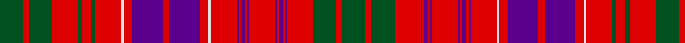

In pattern [GRGRBRBRBRBRBRBRWRBRBRWRGRGRGRG](/patterns/grgrbrbrbrbrbrbrwrbrbrwrgrgrgrg/).

This was sourced from register-of-tartans.  It is a [31 stripes tartan](/stripes/stripes31/).

Original link https://www.tartanregister.gov.uk/tartanDetails.aspx?ref=3554

## Thread count
G/46 R12 G46 R52 G8 R18 G8 R52 LN6 R16 P62 R12 P62 R16 LN6 R52 P4 R4 P8 R4 P4 R52 P4 R4 P8 R4 P4 R52 G46 R12 G/46

## Palette
Each colour and its ΔE from the base-6 reference it is a variant of.

| Colour | Shade | Base | ΔE (OKLab) |
|---|---|---|---|
| G | <code style="background-color:#005020;">#005020</code> `#005020` | G <code style="background-color:#006400;">#006400</code> | 0.08 |
| LN | <code style="background-color:#E0E0E0;">#E0E0E0</code> `#E0E0E0` | W <code style="background-color:#F4F4F0;">#F4F4F0</code> | 0.06 |
| P | <code style="background-color:#5A008C;">#5A008C</code> `#5A008C` | B <code style="background-color:#2C4084;">#2C4084</code> | 0.12 |
| R | <code style="background-color:#DC0000;">#DC0000</code> `#DC0000` | R <code style="background-color:#C80000;">#C80000</code> | 0.04 |

## Nearest tartans

The nearest existing variants by ΔTartan distance.

1. [Ross 7](/setts/s31/g46r12g46r52g8r18g8r52w6r16b62r12b62r16w6r52b4r4b8r4b4r52b4r4b8r4b4r52g46r12g46-b800080-g008000-rc00000-we0e0e0/) — ΔT 0.70
1. [MacLeod Red](/setts/s21/b8r2b2r4b22r4b2r2y2r2b2r32b16r8g8r32g22r16b8r4y4-b2c2c80-g006818-rc80000-ye8c000/) — ΔT 0.96
1. [MacLeod Red Clan Tartan Tartan Number: 496. Earliest known date: 1982 Designed after the tartan worn by Norman MacLeod, 22nd Chief of the clan, painted by Allan Ramsay in 1747, with the costume painted by Van Haecken (see details in entry for MacLeod portrait.) A yellow stripe was added by Ruairidh MacLeod to enhance the family resemblance to other MacLeod tartans, and to differentiate this from Murray of Tullibardine, the name now attached to the sett in the portrait. Approved by the Clan MacLeod Parliament in 1982. See products available Copyright © Blair Urquhart, Comrie, 2015](/setts/s21/b8r2b2r4b22r4b2r2y2r2b2r32b16r8g8r32g22r16b8r4y4-b202060-g006818-rc80000-ye8c000/) — ΔT 0.96
1. [Murray of Tullibardine](/setts/s21/b8r4b4r6b24r6b4r4k10r4b4r44b52r12g12r44g46r28b16r14k6-b2c4084-g005020-k101010-rdc0000/) — ΔT 1.03
1. [MacLeod of Tullibardine](/setts/s21/b16r4b4r8b40r8b4r4k4r4b4r48b24r16g16r48g40r24b16r8k8-b2c2c80-g006818-k101010-rc80000/) — ΔT 1.09
1. [Summerville Presbyterian Church (Cor](/setts/s29/b6r30g4r4g24w4b24r4b8r4b24w4r16b4r4b4r4b4r16b4r4b4r4b4r16g20b2g4r4-b202060-g006818-rc80000-wfcfcfc/) — ΔT 1.13
1. [Lumsden, of Clova](/setts/s31/b18r4b18r18g2r2g4r2g2r18g2r2g4r2g2r18w2r8b22r4b22r8w2r18g4r8g4r18g18r4g18-b304080-g008000-rc00000-we0e0e0/) — ΔT 1.15
1. [Huntly District Tartan Tartan Number: 853. Earliest known date: 1893 (1745) 'Old and Rare Scottish Tartans' was published in 1893 by D.W. Stewart. The book was illustrated by samples woven in silk. The Huntly district tartan is known to have been worn at the time of the '45 rebellion by Brodies, Forbes', Gordons, MacRaes, Munros and Rosses which gives a strong indication of the greater antiquity of the 'District' setts. See products available Copyright © Blair Urquhart, Comrie, 2015](/setts/s33/g16r4g16r24g4r6g4r24w2r6y2b24r6b24y2r6w2r24b2r2b4r2b2r24b2r2b4r2b2r24g16r4g16-b2c2c80-g006818-rc80000-we0e0e0-ye8c000/) — ΔT 1.15
1. [Hebrides #2](/setts/s20/b50ba4r50g20r8b50r4g4r50g4r4g4r50g4r4b50r8g20r50ba4-b202060-ba2c2c80-g006818-rc80000/) — ΔT 1.16
1. [Huntly (District)](/setts/s33/g32r7g32r33g4r12g4r33w3r12y3b33r7b33y3r12w3r33b2r2b5r2b2r33b2r2b5r2b2r33g32r6g23-b580058-g285800-rc80000-wfcfcfc-yd8b000/) — ΔT 1.17

## Neighbour map

Every grey dot is one of 15726 variants placed by the first two principal components of the ΔTartan feature space (44% of its variance). Red is this tartan; blue dots are its nearest — click one to open its page.

<svg viewBox="0 0 640 380" role="img" style="max-width:100%;height:auto;border:1px solid #e0e0e0;border-radius:4px;display:block" xmlns="http://www.w3.org/2000/svg"><image href="/nn/cloud.v1.png" width="640" height="380"/><a href="/setts/s31/g46r12g46r52g8r18g8r52w6r16b62r12b62r16w6r52b4r4b8r4b4r52b4r4b8r4b4r52g46r12g46-b800080-g008000-rc00000-we0e0e0/"><circle cx="274.2" cy="111.8" r="4" fill="#3465a4"><title>Ross 7</title></circle></a><a href="/setts/s21/b8r2b2r4b22r4b2r2y2r2b2r32b16r8g8r32g22r16b8r4y4-b2c2c80-g006818-rc80000-ye8c000/"><circle cx="298.6" cy="120.0" r="4" fill="#3465a4"><title>MacLeod Red</title></circle></a><a href="/setts/s21/b8r2b2r4b22r4b2r2y2r2b2r32b16r8g8r32g22r16b8r4y4-b202060-g006818-rc80000-ye8c000/"><circle cx="294.9" cy="118.9" r="4" fill="#3465a4"><title>MacLeod Red Clan Tartan Tartan Number: 496. Earliest known date: 1982 Designed after the tartan worn by Norman MacLeod, 22nd Chief of the clan, painted by Allan Ramsay in 1747, with the costume painted by Van Haecken (see details in entry for MacLeod portrait.) A yellow stripe was added by Ruairidh MacLeod to enhance the family resemblance to other MacLeod tartans, and to differentiate this from Murray of Tullibardine, the name now attached to the sett in the portrait. Approved by the Clan MacLeod Parliament in 1982. See products available Copyright © Blair Urquhart, Comrie, 2015</title></circle></a><a href="/setts/s21/b8r4b4r6b24r6b4r4k10r4b4r44b52r12g12r44g46r28b16r14k6-b2c4084-g005020-k101010-rdc0000/"><circle cx="256.4" cy="131.5" r="4" fill="#3465a4"><title>Murray of Tullibardine</title></circle></a><a href="/setts/s21/b16r4b4r8b40r8b4r4k4r4b4r48b24r16g16r48g40r24b16r8k8-b2c2c80-g006818-k101010-rc80000/"><circle cx="265.9" cy="140.9" r="4" fill="#3465a4"><title>MacLeod of Tullibardine</title></circle></a><a href="/setts/s29/b6r30g4r4g24w4b24r4b8r4b24w4r16b4r4b4r4b4r16b4r4b4r4b4r16g20b2g4r4-b202060-g006818-rc80000-wfcfcfc/"><circle cx="218.3" cy="112.7" r="4" fill="#3465a4"><title>Summerville Presbyterian Church (Cor</title></circle></a><a href="/setts/s31/b18r4b18r18g2r2g4r2g2r18g2r2g4r2g2r18w2r8b22r4b22r8w2r18g4r8g4r18g18r4g18-b304080-g008000-rc00000-we0e0e0/"><circle cx="244.0" cy="133.5" r="4" fill="#3465a4"><title>Lumsden, of Clova</title></circle></a><a href="/setts/s33/g16r4g16r24g4r6g4r24w2r6y2b24r6b24y2r6w2r24b2r2b4r2b2r24b2r2b4r2b2r24g16r4g16-b2c2c80-g006818-rc80000-we0e0e0-ye8c000/"><circle cx="255.2" cy="99.5" r="4" fill="#3465a4"><title>Huntly District Tartan Tartan Number: 853. Earliest known date: 1893 (1745) 'Old and Rare Scottish Tartans' was published in 1893 by D.W. Stewart. The book was illustrated by samples woven in silk. The Huntly district tartan is known to have been worn at the time of the '45 rebellion by Brodies, Forbes', Gordons, MacRaes, Munros and Rosses which gives a strong indication of the greater antiquity of the 'District' setts. See products available Copyright © Blair Urquhart, Comrie, 2015</title></circle></a><a href="/setts/s20/b50ba4r50g20r8b50r4g4r50g4r4g4r50g4r4b50r8g20r50ba4-b202060-ba2c2c80-g006818-rc80000/"><circle cx="291.3" cy="137.4" r="4" fill="#3465a4"><title>Hebrides #2</title></circle></a><a href="/setts/s33/g32r7g32r33g4r12g4r33w3r12y3b33r7b33y3r12w3r33b2r2b5r2b2r33b2r2b5r2b2r33g32r6g23-b580058-g285800-rc80000-wfcfcfc-yd8b000/"><circle cx="271.6" cy="89.8" r="4" fill="#3465a4"><title>Huntly (District)</title></circle></a><circle cx="263.5" cy="106.5" r="5" fill="#c00000"/></svg>

ID: /setts/s31/g46r12g46r52g8r18g8r52w6r16b62r12b62r16w6r52b4r4b8r4b4r52b4r4b8r4b4r52g46r12g46-b5a008c-g005020-rdc0000-we0e0e0/
