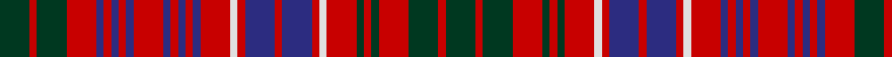

In pattern [GRGRBRBRBRBRBRBRWRBRBRWRGRGRGRG](/patterns/grgrbrbrbrbrbrbrwrbrbrwrgrgrgrg/).

This was sourced from house-of-tartan.  It is a [31 stripes tartan](/stripes/stripes31/).

Original link http://www.house-of-tartan.scotland.net/house/TartanViewjs.asp?colr=Def&tnam=859

## Thread count
DG/16 R4 DG16 R16 DB4 R4 DB4 R4 DB4 R16 DB4 R4 DB4 R4 DB4 R16 LN4 R4 DB16 R4 DB16 R4 LN4 R16 DG4 R4 DG4 R16 DG16 R4 DG/16

## Palette
Each colour and its ΔE from the base-6 reference it is a variant of.

| Colour | Shade | Base | ΔE (OKLab) |
|---|---|---|---|
| DB | <code style="background-color:#2C2C80;">#2C2C80</code> `#2C2C80` | B <code style="background-color:#2A418A;">#2A418A</code> | 0.06 |
| DG | <code style="background-color:#003820;">#003820</code> `#003820` | G <code style="background-color:#006100;">#006100</code> | 0.15 |
| LN | <code style="background-color:#E0E0E0;">#E0E0E0</code> `#E0E0E0` | W <code style="background-color:#F7F7F7;">#F7F7F7</code> | 0.07 |
| R | <code style="background-color:#C80000;">#C80000</code> `#C80000` | R <code style="background-color:#CC0000;">#CC0000</code> | 0.01 |

## Nearest tartans

The nearest existing variants by ΔTartan distance.

1. [MacRae](/setts/s31/g4r1g4r4b1r1b1r1b1r4b1r1b1r1b1r4w1r1b4r1b4r1w1r4g1r1g1r4g4r1g4~b304080-g003000-rc00000-we0e0e0~x4/) — ΔT 0.33
1. [MacRae (Red)](/setts/s31/g4r1g4r4b1r1b1r1b1r4b1r1b1r1b1r4w1r1b4r1b4r1w1r4g1r1g1r4g4r1g4~b2c2c80-g006818-rc80000-wfcfcfc~x4/) — ΔT 0.59
1. [MacRae](/setts/s31/g4r1g4r4b1r1b1r1b1r4b1r1b1r1b1r4w1r1b4r1b4r1w1r4g1r1g1r4g4r1g4~b000064-g004c00-rc80000-wd0d0d0/) — ΔT 0.59
1. [MacRae](/setts/s31/g4r1g4r4b1r1b1r1b1r4b1r1b1r1b1r4y1r1b4r1b4r1y1r4g1r1g1r4g4r1g4~b000052-g11450d-raa0000-yaaaaaa~x2/) — ΔT 0.67
1. [MacRae](/setts/s31/g4r1g4r4b1r1b1r1b1r4b1r1b1r1b1r4y1r1b4r1b4r1y1r4g1r1g1r4g4r1g4~b000052-g11450d-raa0000-yaaaaaa/) — ΔT 0.67
1. [Grant of Ballindalloch (Personal)](/setts/s28/r5b3r3b5r12g5r3b5r3ga3r3ga16r3b3r5b3r3ga16r3ga3r3b5r3g5r12b5r3b3~b2c2c80-g789484-ga006818-rc80000~x4/) — ΔT 0.92
1. [Staffa (Silk)](/setts/s25/r17g14r4g4r17g4r4b12r13w5r13g14w3g14r4g4r17g4r4g8r4b4r4b4r14~b2c2c80-g003820-rc80000-we0e0e0~x2/) — ΔT 1.31
1. [MacRae Red Clan Tartan Tartan Number: 885. Earliest known date: pre 2003 Paton's 'Red MacRae' Alexander Macrae received the lands of Conchra and Ardachy in 1677 and became progenitor of the Macraes of Conchra. The Conchra tartan is blue and white. See products available Copyright © Blair Urquhart, Comrie, 2015](/setts/s20/g20r3g20r20b3r3b6r3b3r20b3r3b6r3b3r20w3r4b20r4~b202060-g003820-rc80000-we0e0e0/) — ΔT 1.40
1. [MacRae of Conchra](/setts/s20/g20r3g20r20b3r3b6r3b3r20b3r3b6r3b3r20w3r4b20r4~b000050-g003000-rc00000-we0e0e0/) — ΔT 1.53
1. [MacRae of Conchra](/setts/s20/g20r3g20r20b3r3b6r3b3r20b3r3b6r3b3r20w3r4b20r4~b080848-g002814-rdc0000-we0e0e0/) — ΔT 1.59

## Neighbour map

Every grey dot is one of 15726 variants placed by the first two principal components of the ΔTartan feature space (44% of its variance). Red is this tartan; blue dots are its nearest — click one to open its page.

<svg viewBox="0 0 640 380" role="img" style="max-width:100%;height:auto;border:1px solid #e0e0e0;border-radius:4px;display:block" xmlns="http://www.w3.org/2000/svg"><image href="/nn/cloud.v1.png" width="640" height="380"/><a href="/setts/s31/g4r1g4r4b1r1b1r1b1r4b1r1b1r1b1r4w1r1b4r1b4r1w1r4g1r1g1r4g4r1g4~b304080-g003000-rc00000-we0e0e0~x4/"><circle cx="180.2" cy="179.7" r="4" fill="#3465a4"><title>MacRae</title></circle></a><a href="/setts/s31/g4r1g4r4b1r1b1r1b1r4b1r1b1r1b1r4w1r1b4r1b4r1w1r4g1r1g1r4g4r1g4~b2c2c80-g006818-rc80000-wfcfcfc~x4/"><circle cx="173.6" cy="175.7" r="4" fill="#3465a4"><title>MacRae (Red)</title></circle></a><a href="/setts/s31/g4r1g4r4b1r1b1r1b1r4b1r1b1r1b1r4w1r1b4r1b4r1w1r4g1r1g1r4g4r1g4~b000064-g004c00-rc80000-wd0d0d0/"><circle cx="164.9" cy="175.2" r="4" fill="#3465a4"><title>MacRae</title></circle></a><a href="/setts/s31/g4r1g4r4b1r1b1r1b1r4b1r1b1r1b1r4y1r1b4r1b4r1y1r4g1r1g1r4g4r1g4~b000052-g11450d-raa0000-yaaaaaa~x2/"><circle cx="183.1" cy="185.2" r="4" fill="#3465a4"><title>MacRae</title></circle></a><a href="/setts/s31/g4r1g4r4b1r1b1r1b1r4b1r1b1r1b1r4y1r1b4r1b4r1y1r4g1r1g1r4g4r1g4~b000052-g11450d-raa0000-yaaaaaa/"><circle cx="183.1" cy="185.2" r="4" fill="#3465a4"><title>MacRae</title></circle></a><a href="/setts/s28/r5b3r3b5r12g5r3b5r3ga3r3ga16r3b3r5b3r3ga16r3ga3r3b5r3g5r12b5r3b3~b2c2c80-g789484-ga006818-rc80000~x4/"><circle cx="184.5" cy="170.6" r="4" fill="#3465a4"><title>Grant of Ballindalloch (Personal)</title></circle></a><a href="/setts/s25/r17g14r4g4r17g4r4b12r13w5r13g14w3g14r4g4r17g4r4g8r4b4r4b4r14~b2c2c80-g003820-rc80000-we0e0e0~x2/"><circle cx="240.5" cy="182.7" r="4" fill="#3465a4"><title>Staffa (Silk)</title></circle></a><a href="/setts/s20/g20r3g20r20b3r3b6r3b3r20b3r3b6r3b3r20w3r4b20r4~b202060-g003820-rc80000-we0e0e0/"><circle cx="238.8" cy="163.7" r="4" fill="#3465a4"><title>MacRae Red Clan Tartan Tartan Number: 885. Earliest known date: pre 2003 Paton's 'Red MacRae' Alexander Macrae received the lands of Conchra and Ardachy in 1677 and became progenitor of the Macraes of Conchra. The Conchra tartan is blue and white. See products available Copyright © Blair Urquhart, Comrie, 2015</title></circle></a><a href="/setts/s20/g20r3g20r20b3r3b6r3b3r20b3r3b6r3b3r20w3r4b20r4~b000050-g003000-rc00000-we0e0e0/"><circle cx="223.9" cy="161.4" r="4" fill="#3465a4"><title>MacRae of Conchra</title></circle></a><a href="/setts/s20/g20r3g20r20b3r3b6r3b3r20b3r3b6r3b3r20w3r4b20r4~b080848-g002814-rdc0000-we0e0e0/"><circle cx="218.3" cy="155.3" r="4" fill="#3465a4"><title>MacRae of Conchra</title></circle></a><circle cx="178.6" cy="178.0" r="5" fill="#c00000"/></svg>

ID: /setts/s31/g4r1g4r4b1r1b1r1b1r4b1r1b1r1b1r4w1r1b4r1b4r1w1r4g1r1g1r4g4r1g4~b2c2c80-g003820-rc80000-we0e0e0~x4/
