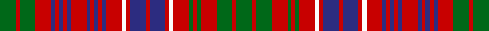

In pattern [GRGRBRBRBRBRBRBRWRBRBRWRGRGRGRG](/stripes/grgrbrbrbrbrbrbrwrbrbrwrgrgrgrg/).

This was sourced from register-of-tartans.  It is a [31 stripe tartan](/stripes/stripes31/).

Original link https://www.tartanregister.gov.uk/tartanDetails.aspx?ref=2742

## Attestations

This cloth appears in 2 source records; the oldest owns this page.

- 01/01/1850 — MacRae (Red) (register-of-tartans, [record](https://www.tartanregister.gov.uk/tartanDetails.aspx?ref=2742))
- 1850 — MacRae - 1850 (Clan) (tartans-authority, [record](http://www.tartansauthority.com/tartan-ferret/display/859/))

## Register references

External register numbers recorded for this tartan.

- Scottish Register of Tartans: [2742](https://www.tartanregister.gov.uk/tartanDetails.aspx?ref=2742)
- Scottish Tartans Authority (ITI): 859
- Scottish Tartans World Register: 859

## Thread count
G/16 R4 G16 R16 DB4 R4 DB4 R4 DB4 R16 DB4 R4 DB4 R4 DB4 R16 W4 R4 DB16 R4 DB16 R4 W4 R16 G4 R4 G4 R16 G16 R4 G/16

## Palette
Each colour and its ΔE from the base-6 reference it is a variant of.

| Colour | Shade | Base | ΔE (OKLab) |
|---|---|---|---|
| DB | <code style="background-color:#2C2C80;">#2C2C80</code> `#2C2C80` | B <code style="background-color:#2A418A;">#2A418A</code> | 0.06 |
| G | <code style="background-color:#006818;">#006818</code> `#006818` | G <code style="background-color:#006100;">#006100</code> | 0.02 |
| R | <code style="background-color:#C80000;">#C80000</code> `#C80000` | R <code style="background-color:#CC0000;">#CC0000</code> | 0.01 |
| W | <code style="background-color:#FCFCFC;">#FCFCFC</code> `#FCFCFC` | W <code style="background-color:#F7F7F7;">#F7F7F7</code> | 0.01 |

## Nearest tartans

The nearest existing variants by ΔTartan distance.

1. [MacRae](/setts/s31/dg4r1dg4r4dg1r1dg1r4w1r1db4r1db4r1w1r4db1r1db1r1db1r4db1r1db1r1db1r4dg4r1dg4~x4/) — ΔT 0.48
1. [MacRae](/setts/s31/dg4r1dg4r4dg1r1dg1r4lb1r1db4r1db4r1lb1r4db1r1db1r1db1r4db1r1db1r1db1r4dg4r1dg4/) — ΔT 0.61
1. [Grant of Ballindalloch (Personal)](/setts/s28/r5db3r3g16r3g3r3db5r3y5r12db5r3db3r5~x4/) — ΔT 0.75
1. [MacRae](/setts/s31/dg4r1dg4r4dg1r1dg1r4lr1r1db4r1db4r1lr1r4db1r1db1r1db1r4db1r1db1r1db1r4dg4r1dg4~x2/) — ΔT 0.91
1. [Staffa (Silk)](/setts/s25/r17dg14r4dg4r17dg4r4db12r13w5r13dg14w3dg14r4dg4r17dg4r4dg8r4db4r4db4r14~x2/) — ΔT 1.32
1. [Reid of Straloch (Personal)](/setts/s17/r1g1r6db2r1g1w1g6r2db6w1db1r1g2r6g1r1~x6/) — ΔT 1.52
1. [Grant of Ballindalloch (Personal)](/setts/s15/r5db3r3g16r3g3r3db5r3y5r12db5r3db3r5~x4/) — ΔT 1.61
1. [Fox, Red](/setts/s23/r7db6r3db4r3db11r18ly3r18g10r7g15r7g15r18lb3r18db11r3db4r3db6r7~x2/) — ΔT 1.64
1. [Fitzgerald](/setts/s15/db3r4w3r15db4r4db13r4g13r4db4r15w3r4db3~x2/) — ΔT 1.65
1. [Ross](/setts/s27/dg8r1dg8r8dg1r2dg1r8db8r1db8r8db1r1db2r1db1r8db1r1db2r1db1r8dg8r1dg8~x2/) — ΔT 1.66

## Neighbour map

Every grey dot is one of 14299 variants placed by the first two principal components of the ΔTartan feature space (44% of its variance). Red is this tartan; blue dots are its nearest — click one to open its page.

<svg viewBox="0 0 640 380" role="img" style="max-width:100%;height:auto;border:1px solid #e0e0e0;border-radius:4px;display:block" xmlns="http://www.w3.org/2000/svg"><image href="/nn/cloud.v1.png" width="640" height="380"/><a href="/setts/s31/dg4r1dg4r4dg1r1dg1r4w1r1db4r1db4r1w1r4db1r1db1r1db1r4db1r1db1r1db1r4dg4r1dg4~x4/"><circle cx="181.4" cy="180.6" r="4" fill="#3465a4"><title>MacRae</title></circle></a><a href="/setts/s31/dg4r1dg4r4dg1r1dg1r4lb1r1db4r1db4r1lb1r4db1r1db1r1db1r4db1r1db1r1db1r4dg4r1dg4/"><circle cx="166.5" cy="174.7" r="4" fill="#3465a4"><title>MacRae</title></circle></a><a href="/setts/s28/r5db3r3g16r3g3r3db5r3y5r12db5r3db3r5~x4/"><circle cx="185.7" cy="172.8" r="4" fill="#3465a4"><title>Grant of Ballindalloch (Personal)</title></circle></a><a href="/setts/s31/dg4r1dg4r4dg1r1dg1r4lr1r1db4r1db4r1lr1r4db1r1db1r1db1r4db1r1db1r1db1r4dg4r1dg4~x2/"><circle cx="184.6" cy="187.1" r="4" fill="#3465a4"><title>MacRae</title></circle></a><a href="/setts/s25/r17dg14r4dg4r17dg4r4db12r13w5r13dg14w3dg14r4dg4r17dg4r4dg8r4db4r4db4r14~x2/"><circle cx="240.8" cy="181.0" r="4" fill="#3465a4"><title>Staffa (Silk)</title></circle></a><a href="/setts/s17/r1g1r6db2r1g1w1g6r2db6w1db1r1g2r6g1r1~x6/"><circle cx="203.7" cy="170.1" r="4" fill="#3465a4"><title>Reid of Straloch (Personal)</title></circle></a><a href="/setts/s15/r5db3r3g16r3g3r3db5r3y5r12db5r3db3r5~x4/"><circle cx="216.3" cy="200.4" r="4" fill="#3465a4"><title>Grant of Ballindalloch (Personal)</title></circle></a><a href="/setts/s23/r7db6r3db4r3db11r18ly3r18g10r7g15r7g15r18lb3r18db11r3db4r3db6r7~x2/"><circle cx="234.1" cy="167.9" r="4" fill="#3465a4"><title>Fox, Red</title></circle></a><a href="/setts/s15/db3r4w3r15db4r4db13r4g13r4db4r15w3r4db3~x2/"><circle cx="230.7" cy="194.6" r="4" fill="#3465a4"><title>Fitzgerald</title></circle></a><a href="/setts/s27/dg8r1dg8r8dg1r2dg1r8db8r1db8r8db1r1db2r1db1r8db1r1db2r1db1r8dg8r1dg8~x2/"><circle cx="232.2" cy="162.7" r="4" fill="#3465a4"><title>Ross</title></circle></a><circle cx="174.8" cy="176.0" r="5" fill="#c00000"/></svg>

ID: /setts/s31/g4r1g4r4db1r1db1r1db1r4db1r1db1r1db1r4w1r1db4r1db4r1w1r4g1r1g1r4g4r1g4~x4/
