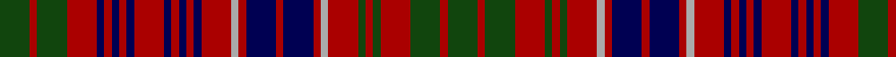

In pattern [GRGRBRBRBRBRBRBRYRBRBRYRGRGRGRG](/patterns/grgrbrbrbrbrbrbryrbrbryrgrgrgrg/).

This was sourced from weddslist.  It is a [31 stripes tartan](/stripes/stripes31/).

Original link http://www.weddslist.com/cgi-bin/tartans/pg.pl?source=tinsel

## Thread count
DG/8 DR2 DG8 DR8 DB2 DR2 DB2 DR2 DB2 DR8 DB2 DR2 DB2 DR2 DB2 DR8 N2 DR2 DB8 DR2 DB8 DR2 N2 DR8 DG2 DR2 DG2 DR8 DG8 DR2 DG/8

## Palette
Each colour and its ΔE from the base-6 reference it is a variant of.

| Colour | Shade | Base | ΔE (OKLab) |
|---|---|---|---|
| DB | <code style="background-color:#000052;">#000052</code> `#000052` | B <code style="background-color:#2A418A;">#2A418A</code> | 0.20 |
| DG | <code style="background-color:#11450D;">#11450D</code> `#11450D` | G <code style="background-color:#006100;">#006100</code> | 0.09 |
| DR | <code style="background-color:#AA0000;">#AA0000</code> `#AA0000` | R <code style="background-color:#CC0000;">#CC0000</code> | 0.07 |
| N | <code style="background-color:#AAAAAA;">#AAAAAA</code> `#AAAAAA` | Y <code style="background-color:#F2BF00;">#F2BF00</code> | 0.19 |

## Nearest tartans

The nearest existing variants by ΔTartan distance.

1. [MacRae](/setts/s31/g4r1g4r4b1r1b1r1b1r4b1r1b1r1b1r4y1r1b4r1b4r1y1r4g1r1g1r4g4r1g4-b000052-g11450d-raa0000-yaaaaaa/) — ΔT 0.00
1. [MacRae](/setts/s31/g16r4g16r16b4r4b4r4b4r16b4r4b4r4b4r16w4r4b16r4b16r4w4r16g4r4g4r16g16r4g16-b304080-g003000-rc00000-we0e0e0/) — ΔT 0.52
1. [MacRae Clan Tartan Tartan Number: 859. Earliest known date: 1850 This plate is taken from the manuscript of William and Andrew Smith's 'Authenticated Tartans of the Clans and Families of Scotland', with a minor error corrected in the count given by D.C.Stewart in 'The Setts of the Scottish Tartans' (1950). The Smith's sources included the findings of George Hunter, who toured the Highlands in search of old tartans prior to 1822. See products available Copyright © Blair Urquhart, Comrie, 2015](/setts/s31/g16r4g16r16b4r4b4r4b4r16b4r4b4r4b4r16w4r4b16r4b16r4w4r16g4r4g4r16g16r4g16-b2c2c80-g003820-rc80000-we0e0e0/) — ΔT 0.67
1. [MacRae](/setts/s31/g4r1g4r4b1r1b1r1b1r4b1r1b1r1b1r4w1r1b4r1b4r1w1r4g1r1g1r4g4r1g4-b000064-g004c00-rc80000-wd0d0d0/) — ΔT 0.70
1. [MacRae (Red)](/setts/s31/g16r4g16r16b4r4b4r4b4r16b4r4b4r4b4r16w4r4b16r4b16r4w4r16g4r4g4r16g16r4g16-b2c2c80-g006818-rc80000-wfcfcfc/) — ΔT 0.90
1. [Grant of Ballindalloch (Personal)](/setts/s28/r20b12r12b20r48g20r12b20r12ga12r12ga64r12b12r20b12r12ga64r12ga12r12b20r12g20r48b20r12b12-b2c2c80-g789484-ga006818-rc80000/) — ΔT 1.02
1. [Innes of Cowie (Clan?)](/setts/s31/b4k24r4k4r4k4r24w4r8g12r8k4g20k4r8w4r8k4g20k4r8g12r8w4r24k4r4k4r4k24g4-b1c0070-g006818-k101010-r880000-wfcfcfc/) — ΔT 1.45
1. [MacRae Red Clan Tartan Tartan Number: 885. Earliest known date: pre 2003 Paton's 'Red MacRae' Alexander Macrae received the lands of Conchra and Ardachy in 1677 and became progenitor of the Macraes of Conchra. The Conchra tartan is blue and white. See products available Copyright © Blair Urquhart, Comrie, 2015](/setts/s20/g20r3g20r20b3r3b6r3b3r20b3r3b6r3b3r20w3r4b20r4-b202060-g003820-rc80000-we0e0e0/) — ΔT 1.53
1. [MacRae of Conchra](/setts/s20/g20r3g20r20b3r3b6r3b3r20b3r3b6r3b3r20w3r4b20r4-b000050-g003000-rc00000-we0e0e0/) — ΔT 1.54
1. [Staffa (Silk)](/setts/s25/r34g28r8g8r34g8r8b24r26w10r26g28w6g28r8g8r34g8r8g16r8b8r8b8r28-b2c2c80-g003820-rc80000-we0e0e0/) — ΔT 1.56

## Neighbour map

Every grey dot is one of 15726 variants placed by the first two principal components of the ΔTartan feature space (44% of its variance). Red is this tartan; blue dots are its nearest — click one to open its page.

<svg viewBox="0 0 640 380" role="img" style="max-width:100%;height:auto;border:1px solid #e0e0e0;border-radius:4px;display:block" xmlns="http://www.w3.org/2000/svg"><image href="/nn/cloud.v1.png" width="640" height="380"/><a href="/setts/s31/g4r1g4r4b1r1b1r1b1r4b1r1b1r1b1r4y1r1b4r1b4r1y1r4g1r1g1r4g4r1g4-b000052-g11450d-raa0000-yaaaaaa/"><circle cx="182.5" cy="185.5" r="4" fill="#3465a4"><title>MacRae</title></circle></a><a href="/setts/s31/g16r4g16r16b4r4b4r4b4r16b4r4b4r4b4r16w4r4b16r4b16r4w4r16g4r4g4r16g16r4g16-b304080-g003000-rc00000-we0e0e0/"><circle cx="179.7" cy="179.9" r="4" fill="#3465a4"><title>MacRae</title></circle></a><a href="/setts/s31/g16r4g16r16b4r4b4r4b4r16b4r4b4r4b4r16w4r4b16r4b16r4w4r16g4r4g4r16g16r4g16-b2c2c80-g003820-rc80000-we0e0e0/"><circle cx="178.2" cy="178.1" r="4" fill="#3465a4"><title>MacRae Clan Tartan Tartan Number: 859. Earliest known date: 1850 This plate is taken from the manuscript of William and Andrew Smith's 'Authenticated Tartans of the Clans and Families of Scotland', with a minor error corrected in the count given by D.C.Stewart in 'The Setts of the Scottish Tartans' (1950). The Smith's sources included the findings of George Hunter, who toured the Highlands in search of old tartans prior to 1822. See products available Copyright © Blair Urquhart, Comrie, 2015</title></circle></a><a href="/setts/s31/g4r1g4r4b1r1b1r1b1r4b1r1b1r1b1r4w1r1b4r1b4r1w1r4g1r1g1r4g4r1g4-b000064-g004c00-rc80000-wd0d0d0/"><circle cx="164.7" cy="174.9" r="4" fill="#3465a4"><title>MacRae</title></circle></a><a href="/setts/s31/g16r4g16r16b4r4b4r4b4r16b4r4b4r4b4r16w4r4b16r4b16r4w4r16g4r4g4r16g16r4g16-b2c2c80-g006818-rc80000-wfcfcfc/"><circle cx="173.3" cy="175.8" r="4" fill="#3465a4"><title>MacRae (Red)</title></circle></a><a href="/setts/s28/r20b12r12b20r48g20r12b20r12ga12r12ga64r12b12r20b12r12ga64r12ga12r12b20r12g20r48b20r12b12-b2c2c80-g789484-ga006818-rc80000/"><circle cx="183.6" cy="171.3" r="4" fill="#3465a4"><title>Grant of Ballindalloch (Personal)</title></circle></a><a href="/setts/s31/b4k24r4k4r4k4r24w4r8g12r8k4g20k4r8w4r8k4g20k4r8g12r8w4r24k4r4k4r4k24g4-b1c0070-g006818-k101010-r880000-wfcfcfc/"><circle cx="143.9" cy="143.5" r="4" fill="#3465a4"><title>Innes of Cowie (Clan?)</title></circle></a><a href="/setts/s20/g20r3g20r20b3r3b6r3b3r20b3r3b6r3b3r20w3r4b20r4-b202060-g003820-rc80000-we0e0e0/"><circle cx="238.0" cy="163.0" r="4" fill="#3465a4"><title>MacRae Red Clan Tartan Tartan Number: 885. Earliest known date: pre 2003 Paton's 'Red MacRae' Alexander Macrae received the lands of Conchra and Ardachy in 1677 and became progenitor of the Macraes of Conchra. The Conchra tartan is blue and white. See products available Copyright © Blair Urquhart, Comrie, 2015</title></circle></a><a href="/setts/s20/g20r3g20r20b3r3b6r3b3r20b3r3b6r3b3r20w3r4b20r4-b000050-g003000-rc00000-we0e0e0/"><circle cx="223.4" cy="160.1" r="4" fill="#3465a4"><title>MacRae of Conchra</title></circle></a><a href="/setts/s25/r34g28r8g8r34g8r8b24r26w10r26g28w6g28r8g8r34g8r8g16r8b8r8b8r28-b2c2c80-g003820-rc80000-we0e0e0/"><circle cx="240.7" cy="181.5" r="4" fill="#3465a4"><title>Staffa (Silk)</title></circle></a><circle cx="182.5" cy="185.5" r="5" fill="#c00000"/></svg>

ID: /setts/s31/g8r2g8r8b2r2b2r2b2r8b2r2b2r2b2r8y2r2b8r2b8r2y2r8g2r2g2r8g8r2g8-b000052-g11450d-raa0000-yaaaaaa/
