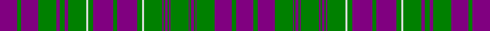

This page is one **sett** — a single exact thread-count. It belongs to the [tartan](/tartans/p25g6p25g26p5g7p5g26w3g7p29g6p29g7w3g26p2g2p4g2p2g26p2g2p4g2p2g26p25g6p25/)
(the same proportion at any scale), whose colour order is pattern [BGBGBGBGBGBGBGBGWGBGBGWGBGBGBGB](/stripes/bgbgbgbgbgbgbgbgwgbgbgwgbgbgbgb/).

Sourced from weddslist.  It is a [31 stripe tartan](/stripes/stripes31/).

Original link http://www.weddslist.com/cgi-bin/tartans/pg.pl?source=sts

## Also known as

This cloth is also recorded under:

- MacRae,

## Thread count
P/50 G12 P50 G52 P10 G14 P10 G52 LN6 G14 P58 G12 P58 G14 LN6 G52 P4 G4 P8 G4 P4 G52 P4 G4 P8 G4 P4 G52 P50 G12 P/50

## Palette

Palette: <strong>Tartan Dictionary</strong> <small style="color:#888">(1 of 3 colours)</small>
<table><thead><tr><th>Colour</th><th>Threads</th><th>Shade</th><th>Base</th><th>OKLCh</th></tr></thead><tbody><tr><td>P/</td><td style="text-align:right;font-variant-numeric:tabular-nums">50</td><td><code style="background-color:#800080;">#800080</code> <small style="color:#888">#800080</small></td><td>B <code style="background-color:#2A418A;">#2A418A</code></td><td><small style="color:#888">oklch(42.1% 0.193 328.4)</small></td></tr><tr><td>G</td><td style="text-align:right;font-variant-numeric:tabular-nums">12</td><td><code style="background-color:#008000;">#008000</code> <small style="color:#888">#008000</small></td><td>G <code style="background-color:#006100;">#006100</code></td><td><small style="color:#888">oklch(52.0% 0.177 142.5)</small></td></tr><tr><td>P</td><td style="text-align:right;font-variant-numeric:tabular-nums">50</td><td><code style="background-color:#800080;">#800080</code> <small style="color:#888">#800080</small></td><td>B <code style="background-color:#2A418A;">#2A418A</code></td><td><small style="color:#888">oklch(42.1% 0.193 328.4)</small></td></tr><tr><td>G</td><td style="text-align:right;font-variant-numeric:tabular-nums">52</td><td><code style="background-color:#008000;">#008000</code> <small style="color:#888">#008000</small></td><td>G <code style="background-color:#006100;">#006100</code></td><td><small style="color:#888">oklch(52.0% 0.177 142.5)</small></td></tr><tr><td>P</td><td style="text-align:right;font-variant-numeric:tabular-nums">10</td><td><code style="background-color:#800080;">#800080</code> <small style="color:#888">#800080</small></td><td>B <code style="background-color:#2A418A;">#2A418A</code></td><td><small style="color:#888">oklch(42.1% 0.193 328.4)</small></td></tr><tr><td>G</td><td style="text-align:right;font-variant-numeric:tabular-nums">14</td><td><code style="background-color:#008000;">#008000</code> <small style="color:#888">#008000</small></td><td>G <code style="background-color:#006100;">#006100</code></td><td><small style="color:#888">oklch(52.0% 0.177 142.5)</small></td></tr><tr><td>P</td><td style="text-align:right;font-variant-numeric:tabular-nums">10</td><td><code style="background-color:#800080;">#800080</code> <small style="color:#888">#800080</small></td><td>B <code style="background-color:#2A418A;">#2A418A</code></td><td><small style="color:#888">oklch(42.1% 0.193 328.4)</small></td></tr><tr><td>G</td><td style="text-align:right;font-variant-numeric:tabular-nums">52</td><td><code style="background-color:#008000;">#008000</code> <small style="color:#888">#008000</small></td><td>G <code style="background-color:#006100;">#006100</code></td><td><small style="color:#888">oklch(52.0% 0.177 142.5)</small></td></tr><tr><td>LN</td><td style="text-align:right;font-variant-numeric:tabular-nums">6</td><td><code style="background-color:#E0E0E0;">#E0E0E0</code> <small style="color:#888">#E0E0E0</small></td><td>W <code style="background-color:#F7F7F7;">#F7F7F7</code></td><td><small style="color:#888">oklch(90.7% 0.000 89.9)</small></td></tr><tr><td>G</td><td style="text-align:right;font-variant-numeric:tabular-nums">14</td><td><code style="background-color:#008000;">#008000</code> <small style="color:#888">#008000</small></td><td>G <code style="background-color:#006100;">#006100</code></td><td><small style="color:#888">oklch(52.0% 0.177 142.5)</small></td></tr><tr><td>P</td><td style="text-align:right;font-variant-numeric:tabular-nums">58</td><td><code style="background-color:#800080;">#800080</code> <small style="color:#888">#800080</small></td><td>B <code style="background-color:#2A418A;">#2A418A</code></td><td><small style="color:#888">oklch(42.1% 0.193 328.4)</small></td></tr><tr><td>G</td><td style="text-align:right;font-variant-numeric:tabular-nums">12</td><td><code style="background-color:#008000;">#008000</code> <small style="color:#888">#008000</small></td><td>G <code style="background-color:#006100;">#006100</code></td><td><small style="color:#888">oklch(52.0% 0.177 142.5)</small></td></tr><tr><td>P</td><td style="text-align:right;font-variant-numeric:tabular-nums">58</td><td><code style="background-color:#800080;">#800080</code> <small style="color:#888">#800080</small></td><td>B <code style="background-color:#2A418A;">#2A418A</code></td><td><small style="color:#888">oklch(42.1% 0.193 328.4)</small></td></tr><tr><td>G</td><td style="text-align:right;font-variant-numeric:tabular-nums">14</td><td><code style="background-color:#008000;">#008000</code> <small style="color:#888">#008000</small></td><td>G <code style="background-color:#006100;">#006100</code></td><td><small style="color:#888">oklch(52.0% 0.177 142.5)</small></td></tr><tr><td>LN</td><td style="text-align:right;font-variant-numeric:tabular-nums">6</td><td><code style="background-color:#E0E0E0;">#E0E0E0</code> <small style="color:#888">#E0E0E0</small></td><td>W <code style="background-color:#F7F7F7;">#F7F7F7</code></td><td><small style="color:#888">oklch(90.7% 0.000 89.9)</small></td></tr><tr><td>G</td><td style="text-align:right;font-variant-numeric:tabular-nums">52</td><td><code style="background-color:#008000;">#008000</code> <small style="color:#888">#008000</small></td><td>G <code style="background-color:#006100;">#006100</code></td><td><small style="color:#888">oklch(52.0% 0.177 142.5)</small></td></tr><tr><td>P</td><td style="text-align:right;font-variant-numeric:tabular-nums">4</td><td><code style="background-color:#800080;">#800080</code> <small style="color:#888">#800080</small></td><td>B <code style="background-color:#2A418A;">#2A418A</code></td><td><small style="color:#888">oklch(42.1% 0.193 328.4)</small></td></tr><tr><td>G</td><td style="text-align:right;font-variant-numeric:tabular-nums">4</td><td><code style="background-color:#008000;">#008000</code> <small style="color:#888">#008000</small></td><td>G <code style="background-color:#006100;">#006100</code></td><td><small style="color:#888">oklch(52.0% 0.177 142.5)</small></td></tr><tr><td>P</td><td style="text-align:right;font-variant-numeric:tabular-nums">8</td><td><code style="background-color:#800080;">#800080</code> <small style="color:#888">#800080</small></td><td>B <code style="background-color:#2A418A;">#2A418A</code></td><td><small style="color:#888">oklch(42.1% 0.193 328.4)</small></td></tr><tr><td>G</td><td style="text-align:right;font-variant-numeric:tabular-nums">4</td><td><code style="background-color:#008000;">#008000</code> <small style="color:#888">#008000</small></td><td>G <code style="background-color:#006100;">#006100</code></td><td><small style="color:#888">oklch(52.0% 0.177 142.5)</small></td></tr><tr><td>P</td><td style="text-align:right;font-variant-numeric:tabular-nums">4</td><td><code style="background-color:#800080;">#800080</code> <small style="color:#888">#800080</small></td><td>B <code style="background-color:#2A418A;">#2A418A</code></td><td><small style="color:#888">oklch(42.1% 0.193 328.4)</small></td></tr><tr><td>G</td><td style="text-align:right;font-variant-numeric:tabular-nums">52</td><td><code style="background-color:#008000;">#008000</code> <small style="color:#888">#008000</small></td><td>G <code style="background-color:#006100;">#006100</code></td><td><small style="color:#888">oklch(52.0% 0.177 142.5)</small></td></tr><tr><td>P</td><td style="text-align:right;font-variant-numeric:tabular-nums">4</td><td><code style="background-color:#800080;">#800080</code> <small style="color:#888">#800080</small></td><td>B <code style="background-color:#2A418A;">#2A418A</code></td><td><small style="color:#888">oklch(42.1% 0.193 328.4)</small></td></tr><tr><td>G</td><td style="text-align:right;font-variant-numeric:tabular-nums">4</td><td><code style="background-color:#008000;">#008000</code> <small style="color:#888">#008000</small></td><td>G <code style="background-color:#006100;">#006100</code></td><td><small style="color:#888">oklch(52.0% 0.177 142.5)</small></td></tr><tr><td>P</td><td style="text-align:right;font-variant-numeric:tabular-nums">8</td><td><code style="background-color:#800080;">#800080</code> <small style="color:#888">#800080</small></td><td>B <code style="background-color:#2A418A;">#2A418A</code></td><td><small style="color:#888">oklch(42.1% 0.193 328.4)</small></td></tr><tr><td>G</td><td style="text-align:right;font-variant-numeric:tabular-nums">4</td><td><code style="background-color:#008000;">#008000</code> <small style="color:#888">#008000</small></td><td>G <code style="background-color:#006100;">#006100</code></td><td><small style="color:#888">oklch(52.0% 0.177 142.5)</small></td></tr><tr><td>P</td><td style="text-align:right;font-variant-numeric:tabular-nums">4</td><td><code style="background-color:#800080;">#800080</code> <small style="color:#888">#800080</small></td><td>B <code style="background-color:#2A418A;">#2A418A</code></td><td><small style="color:#888">oklch(42.1% 0.193 328.4)</small></td></tr><tr><td>G</td><td style="text-align:right;font-variant-numeric:tabular-nums">52</td><td><code style="background-color:#008000;">#008000</code> <small style="color:#888">#008000</small></td><td>G <code style="background-color:#006100;">#006100</code></td><td><small style="color:#888">oklch(52.0% 0.177 142.5)</small></td></tr><tr><td>P</td><td style="text-align:right;font-variant-numeric:tabular-nums">50</td><td><code style="background-color:#800080;">#800080</code> <small style="color:#888">#800080</small></td><td>B <code style="background-color:#2A418A;">#2A418A</code></td><td><small style="color:#888">oklch(42.1% 0.193 328.4)</small></td></tr><tr><td>G</td><td style="text-align:right;font-variant-numeric:tabular-nums">12</td><td><code style="background-color:#008000;">#008000</code> <small style="color:#888">#008000</small></td><td>G <code style="background-color:#006100;">#006100</code></td><td><small style="color:#888">oklch(52.0% 0.177 142.5)</small></td></tr><tr><td>P/</td><td style="text-align:right;font-variant-numeric:tabular-nums">50</td><td><code style="background-color:#800080;">#800080</code> <small style="color:#888">#800080</small></td><td>B <code style="background-color:#2A418A;">#2A418A</code></td><td><small style="color:#888">oklch(42.1% 0.193 328.4)</small></td></tr></tbody></table>

## Nearest tartans

The nearest existing variants by ΔTartan distance, with this tartan at the top so the swatches line up against it.

ΔTartan

Tartan

Sett

—

<a href="/ttd/edit/#slug=p25g6p25g26p5g7p5g26w3g7p29g6p29g7w3g26p2g2p4g2p2g26p2g2p4g2p2g26p25g6p25~x2">MacRae, (MacCrae)</a> <a class="nn-out" href="/setts/s31/p25g6p25g26p5g7p5g26w3g7p29g6p29g7w3g26p2g2p4g2p2g26p2g2p4g2p2g26p25g6p25~x2/" title="open its dictionary page">↗</a>

0.97

<a href="/ttd/edit/#slug=p27g6p27g28p5g7p5g28p31g6p31g28p2g2p4g2p2g28p2g2p4g2p2g28p27g6p27~x2">MacRae, Rae</a> <a class="nn-out" href="/setts/s27/p27g6p27g28p5g7p5g28p31g6p31g28p2g2p4g2p2g28p2g2p4g2p2g28p27g6p27~x2/" title="open its dictionary page">↗</a>

1.02

<a href="/ttd/edit/#slug=p14g3p14g14p3g3p3g14p16g3p16g14p1g1p2g1p1g14p1g1p2g1p1g14p14g3p14~x2">MacRae, (Rae)</a> <a class="nn-out" href="/setts/s27/p14g3p14g14p3g3p3g14p16g3p16g14p1g1p2g1p1g14p1g1p2g1p1g14p14g3p14~x2/" title="open its dictionary page">↗</a>

1.68

<a href="/ttd/edit/#slug=dp25dg6dp25dg26dp5dg7dp5dg26w3dg7dp29dg6dp29dg7w3dg26dp2dg2dp4dg2dp2dg26dp2dg2dp4dg2dp2dg26dp25dg6dp25~x2">MacRae (MacCrae)</a> <a class="nn-out" href="/setts/s31/dp25dg6dp25dg26dp5dg7dp5dg26w3dg7dp29dg6dp29dg7w3dg26dp2dg2dp4dg2dp2dg26dp2dg2dp4dg2dp2dg26dp25dg6dp25~x2/" title="open its dictionary page">↗</a>

1.79

<a href="/ttd/edit/#slug=dp6k1o1k2o1k1dp6k1o22k3o1k3o10k1dp3o1k6o1dg3k1o10k3o1k3o22k1dg6k1o1k2o1k1dg6k1o12k1~x2">Weiss-Halliwell (Personal)</a> <a class="nn-out" href="/setts/s36/dp6k1o1k2o1k1dp6k1o22k3o1k3o10k1dp3o1k6o1dg3k1o10k3o1k3o22k1dg6k1o1k2o1k1dg6k1o12k1~x2/" title="open its dictionary page">↗</a>

1.80

<a href="/ttd/edit/#slug=r18db1r1db2r1db1r18db18r2db18r18g2r4g2r18g18r2g9~x2">MacTier of Durris</a> <a class="nn-out" href="/setts/s18/r18db1r1db2r1db1r18db18r2db18r18g2r4g2r18g18r2g9~x2/" title="open its dictionary page">↗</a>

1.86

<a href="/ttd/edit/#slug=k6r5k5r5k5r5k12w2k2w2k12r5k38r21k6r21w2k12w2k12r3w2r3w2k6">Amstartan</a> <a class="nn-out" href="/setts/s25/k6r5k5r5k5r5k12w2k2w2k12r5k38r21k6r21w2k12w2k12r3w2r3w2k6/" title="open its dictionary page">↗</a>

1.87

<a href="/ttd/edit/#slug=g18r2g18r18g2r4g2r18db18r2db18r18db1r1db2r1db1r18db1r1g2r1db1r18g18r2g18~x2">Ross (Clan)</a> <a class="nn-out" href="/setts/s27/g18r2g18r18g2r4g2r18db18r2db18r18db1r1db2r1db1r18db1r1g2r1db1r18g18r2g18~x2/" title="open its dictionary page">↗</a>

1.87

<a href="/ttd/edit/#slug=g18r2g18r18g2r4g2r18db18r2db18r18db1r1db2r1db1r18db1r1db2r1db1r18g18r2g18~x2">Ross Clan Tartan Tartan Number: 864. Earliest known date: 1810-15 D.C.Stewart says, &quot;The version here given may be taken to be correct.&quot; Later versions, including Logans, are known to have omissions. The Clan Ross is descended from Fearcher MacinTagart, Earl of Ross in the 13th century. The chiefship has passed to the Rosses of Shandwick. The tartan is also worn by the MacTiers. Also worn by the Metro Toronto Police pipe band. (Strathallan 1994) See products available Copyright © Blair Urquhart, Comrie, 2015</a> <a class="nn-out" href="/setts/s27/g18r2g18r18g2r4g2r18db18r2db18r18db1r1db2r1db1r18db1r1db2r1db1r18g18r2g18~x2/" title="open its dictionary page">↗</a>

1.94

<a href="/ttd/edit/#slug=dg18r2dg18r18dg2r4dg2r18db18r2db18r18db1r1db2r1db1r18db1r1db2r1db1r18dg18r2dg18~x2">Ross #4</a> <a class="nn-out" href="/setts/s27/dg18r2dg18r18dg2r4dg2r18db18r2db18r18db1r1db2r1db1r18db1r1db2r1db1r18dg18r2dg18~x2/" title="open its dictionary page">↗</a>

1.94

<a href="/ttd/edit/#slug=k27r13k27r2k2r2k2r2k2r2k2r2k2r2k2lb6k3lb6k3lb6k3lb6k3lb6~x2">Angus, Red (Fashion)</a> <a class="nn-out" href="/setts/s24/k27r13k27r2k2r2k2r2k2r2k2r2k2r2k2lb6k3lb6k3lb6k3lb6k3lb6~x2/" title="open its dictionary page">↗</a>

## Neighbour map

Every grey dot is one of 14299 variants placed by the first two principal components of the ΔTartan feature space (44% of its variance). Red is this tartan; blue dots are its nearest — click one to open its page.

<svg viewBox="0 0 640 380" role="img" style="max-width:100%;height:auto;border:1px solid #e0e0e0;border-radius:4px;display:block" xmlns="http://www.w3.org/2000/svg"><image href="/nn/cloud.v1.png" width="640" height="380"/><a href="/setts/s27/p27g6p27g28p5g7p5g28p31g6p31g28p2g2p4g2p2g28p2g2p4g2p2g28p27g6p27~x2/"><circle cx="350.7" cy="159.7" r="4" fill="#3465a4"><title>MacRae, Rae</title></circle></a><a href="/setts/s27/p14g3p14g14p3g3p3g14p16g3p16g14p1g1p2g1p1g14p1g1p2g1p1g14p14g3p14~x2/"><circle cx="356.8" cy="158.3" r="4" fill="#3465a4"><title>MacRae, (Rae)</title></circle></a><a href="/setts/s31/dp25dg6dp25dg26dp5dg7dp5dg26w3dg7dp29dg6dp29dg7w3dg26dp2dg2dp4dg2dp2dg26dp2dg2dp4dg2dp2dg26dp25dg6dp25~x2/"><circle cx="340.5" cy="160.3" r="4" fill="#3465a4"><title>MacRae (MacCrae)</title></circle></a><a href="/setts/s36/dp6k1o1k2o1k1dp6k1o22k3o1k3o10k1dp3o1k6o1dg3k1o10k3o1k3o22k1dg6k1o1k2o1k1dg6k1o12k1~x2/"><circle cx="321.0" cy="76.3" r="4" fill="#3465a4"><title>Weiss-Halliwell (Personal)</title></circle></a><a href="/setts/s18/r18db1r1db2r1db1r18db18r2db18r18g2r4g2r18g18r2g9~x2/"><circle cx="325.0" cy="156.0" r="4" fill="#3465a4"><title>MacTier of Durris</title></circle></a><a href="/setts/s25/k6r5k5r5k5r5k12w2k2w2k12r5k38r21k6r21w2k12w2k12r3w2r3w2k6/"><circle cx="357.7" cy="123.2" r="4" fill="#3465a4"><title>Amstartan</title></circle></a><a href="/setts/s27/g18r2g18r18g2r4g2r18db18r2db18r18db1r1db2r1db1r18db1r1g2r1db1r18g18r2g18~x2/"><circle cx="294.0" cy="130.7" r="4" fill="#3465a4"><title>Ross (Clan)</title></circle></a><a href="/setts/s27/g18r2g18r18g2r4g2r18db18r2db18r18db1r1db2r1db1r18db1r1db2r1db1r18g18r2g18~x2/"><circle cx="292.8" cy="130.4" r="4" fill="#3465a4"><title>Ross Clan Tartan Tartan Number: 864. Earliest known date: 1810-15 D.C.Stewart says, &quot;The version here given may be taken to be correct.&quot; Later versions, including Logans, are known to have omissions. The Clan Ross is descended from Fearcher MacinTagart, Earl of Ross in the 13th century. The chiefship has passed to the Rosses of Shandwick. The tartan is also worn by the MacTiers. Also worn by the Metro Toronto Police pipe band. (Strathallan 1994) See products available Copyright © Blair Urquhart, Comrie, 2015</title></circle></a><a href="/setts/s27/dg18r2dg18r18dg2r4dg2r18db18r2db18r18db1r1db2r1db1r18db1r1db2r1db1r18dg18r2dg18~x2/"><circle cx="291.0" cy="127.5" r="4" fill="#3465a4"><title>Ross #4</title></circle></a><a href="/setts/s24/k27r13k27r2k2r2k2r2k2r2k2r2k2r2k2lb6k3lb6k3lb6k3lb6k3lb6~x2/"><circle cx="318.4" cy="114.9" r="4" fill="#3465a4"><title>Angus, Red (Fashion)</title></circle></a><circle cx="309.4" cy="137.2" r="5" fill="#c00000"/></svg>

ID: /setts/s31/p25g6p25g26p5g7p5g26w3g7p29g6p29g7w3g26p2g2p4g2p2g26p2g2p4g2p2g26p25g6p25~x2/
