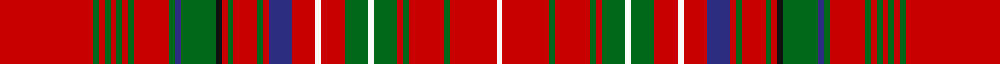

In pattern [RGRGRGRGRGBGKRGRGRBRWRGWGRGRGRW](/stripes/rgrgrgrgrgbgkrgrgrbrwrgwgrgrgrw/).

This was sourced from register-of-tartans.  It is a [31 stripe tartan](/stripes/stripes31/).

Original link https://www.tartanregister.gov.uk/tartanDetails.aspx?ref=2373

## Also known as

This cloth is also recorded under:

- MacDonald of Staffa 2

## Attestations

This cloth appears in 4 source records; the oldest owns this page.

- 01/01/1822 — MacDonald of Staffa (Smith's) (register-of-tartans, [record](https://www.tartanregister.gov.uk/tartanDetails.aspx?ref=2373))
- c1850 — MacDonald of Staffa - 1850 (Clan) (tartans-authority, [record](http://www.tartansauthority.com/tartan-ferret/display/1529/))
- undated — MacDonald of Staffa 2 (weddslist, [record](http://www.weddslist.com/cgi-bin/tartans/pg.pl?source=sts))
- undated — MacDonald of Staffa Clan Tartan Tartan Number: 1529. Earliest known date: 1850 This plate is taken from the manuscript of William and Andrew Smith's 'Authenticated Tartans of the Clans and Families of Scotland'. The Smith's sources included the findings of George Hunter, an Army clothier, who toured the Highlands in search of old tartans prior to 1822. See products available Copyright © Blair Urquhart, Comrie, 2015 (house-of-tartan, [record](http://www.house-of-tartan.scotland.net/house/TartanViewjs.asp?colr=Def&tnam=1529))

## Register references

External register numbers recorded for this tartan.

- Scottish Register of Tartans: [2373](https://www.tartanregister.gov.uk/tartanDetails.aspx?ref=2373)
- Scottish Tartans Authority (ITI): 1529
- Scottish Tartans World Register: 1529

## Thread count
R/32 G2 R2 G2 R2 G2 R2 G2 R12 G2 DB2 G12 K2 R2 G2 R8 G2 R2 DB8 R8 W2 R8 G8 W2 G8 R2 G2 R12 G2 R16 W/2

## Palette
Each colour and the base-6 reference it is a variant of.

| Colour | Shade | Base |
|---|---|---|
| DB | <code style="background-color:#2C2C80;">#2C2C80</code> `oklch(35.0% 0.138 276.6)` <small>#2C2C80</small> | B <code style="background-color:#2A418A;">#2A418A</code> |
| G | <code style="background-color:#006818;">#006818</code> `oklch(45.0% 0.142 145.0)` <small>#006818</small> | G <code style="background-color:#006100;">#006100</code> |
| K | <code style="background-color:#101010;">#101010</code> `oklch(17.3% 0.000 89.9)` <small>#101010</small> | K <code style="background-color:#000000;">#000000</code> |
| R | <code style="background-color:#C80000;">#C80000</code> `oklch(52.3% 0.215 29.2)` <small>#C80000</small> | R <code style="background-color:#CC0000;">#CC0000</code> |
| W | <code style="background-color:#FCFCFC;">#FCFCFC</code> `oklch(99.1% 0.000 89.9)` <small>#FCFCFC</small> | W <code style="background-color:#F7F7F7;">#F7F7F7</code> |

## Nearest tartans

The nearest existing variants by ΔTartan distance.

1. [MacDonald of Staffa 3](/setts/s29/r37g2r2g2r2g2r2g2r11k2g11r3g2r11g2r3db9r11w2r9g11w2g11r3g2r9g2r19w2/) — ΔT 0.46
1. [MacDonald of Staffa #4](/setts/s29/r37dg2r2dg2r2dg2r2dg2r11k2dg11r3dg2r11dg2r3db9r11w2r9dg11w2dg11r3dg2r9dg2r19w2/) — ΔT 0.62
1. [MacAlister (Gourlay Steele Collection)](/setts/s30/r12dg3ly1r2ly1dg3r3db3r6t1r1dg8r1t1r12t1r1dg8r1t1r6dg2r1t1r2t1r1dg3ly1r4~x4/) — ΔT 0.80
1. [MacDonald of Staffa #3](/setts/s31/r16dg1r1dg1r1dg1r1dg1r6dg1db1dg6db1r1dg1r4dg1r1db4r4w1r4dg4w1dg4r1dg1r6dg1r8w1~x2/) — ΔT 0.90
1. [MacDonald of Staffa 1](/setts/s31/r16g1r1g1r1g1r1g1r6g1db1g6db1r1g1r4g1r1db4r4w1r4g4w1g4r1g1r6g1r8w1~x2/) — ΔT 0.92
1. [Donald of Staffa's Sett](/setts/s40/r30y5r27dg5r5dg5r5dg5r5dg5r25dg5r5k2dg28k2r5dg5r28dg5r5y28r26w5r26dg24w2dg24r7dg5r28dg5r7dg5k5r7y5r7y5r24~x2/) — ΔT 1.05
1. [MacAlister](/setts/s30/r12g3ly1r2ly1g3r3db3r6t1r1g8r1t1r12t1r1g8r1t1r6g2r1t1r2t1r1g3ly1r4~x4/) — ΔT 1.07
1. [MacDonald of Staffa](/setts/s40/r24db4r22dg4r4dg4r4dg4r4dg4r20dg4r4k2dg22k2r4dg4r22dg4r4db22r21w4r21dg19w2dg19r5dg4r22dg4r5dg4k4r5db4r5db4r19/) — ΔT 1.12
1. [Confrerie de Vouvray Corporate Tartan Tartan Number: 5802. Earliest known date: 2003 The Confrerie de Vouvray tartan was created for the French Order of Wine Growers by the Chevaliers Ecossais de la Chantepleure de Vouvray. The red, yellow and maroon are the colours of the french order and the grid pattern of green lines depict the rows of vines of the Chenin Blanc grape. The tartan was presented as a gift to the Grand Council at the 2nd Scottish Confrerie, held in Dundee in May 2003. See products available Copyright © Blair Urquhart, Comrie, 2015](/setts/s34/dt6r3ly14r3r15ly3r15dt5r3g1r3g1r3g1r3g1r3g1r3g1r3g1r3g1r3g1r3dt5r15ly3r19r3ly14r3~x2/) — ΔT 1.12
1. [MacAlister Modern (Lochcarron)](/setts/s25/r18t1r1g8r1t1r6w1r1db4r1w1r2g3g1r2g1g3r3w1r1db2r1w1r8~x2/) — ΔT 1.13

## Neighbour map

Every grey dot is one of 14299 variants placed by the first two principal components of the ΔTartan feature space (44% of its variance). Red is this tartan; blue dots are its nearest — click one to open its page.

<svg viewBox="0 0 640 380" role="img" style="max-width:100%;height:auto;border:1px solid #e0e0e0;border-radius:4px;display:block" xmlns="http://www.w3.org/2000/svg"><image href="/nn/cloud.v1.png" width="640" height="380"/><a href="/setts/s29/r37g2r2g2r2g2r2g2r11k2g11r3g2r11g2r3db9r11w2r9g11w2g11r3g2r9g2r19w2/"><circle cx="366.7" cy="75.8" r="4" fill="#3465a4"><title>MacDonald of Staffa 3</title></circle></a><a href="/setts/s29/r37dg2r2dg2r2dg2r2dg2r11k2dg11r3dg2r11dg2r3db9r11w2r9dg11w2dg11r3dg2r9dg2r19w2/"><circle cx="367.6" cy="71.5" r="4" fill="#3465a4"><title>MacDonald of Staffa #4</title></circle></a><a href="/setts/s30/r12dg3ly1r2ly1dg3r3db3r6t1r1dg8r1t1r12t1r1dg8r1t1r6dg2r1t1r2t1r1dg3ly1r4~x4/"><circle cx="299.3" cy="96.7" r="4" fill="#3465a4"><title>MacAlister (Gourlay Steele Collection)</title></circle></a><a href="/setts/s31/r16dg1r1dg1r1dg1r1dg1r6dg1db1dg6db1r1dg1r4dg1r1db4r4w1r4dg4w1dg4r1dg1r6dg1r8w1~x2/"><circle cx="367.7" cy="91.6" r="4" fill="#3465a4"><title>MacDonald of Staffa #3</title></circle></a><a href="/setts/s31/r16g1r1g1r1g1r1g1r6g1db1g6db1r1g1r4g1r1db4r4w1r4g4w1g4r1g1r6g1r8w1~x2/"><circle cx="372.4" cy="98.3" r="4" fill="#3465a4"><title>MacDonald of Staffa 1</title></circle></a><a href="/setts/s40/r30y5r27dg5r5dg5r5dg5r5dg5r25dg5r5k2dg28k2r5dg5r28dg5r5y28r26w5r26dg24w2dg24r7dg5r28dg5r7dg5k5r7y5r7y5r24~x2/"><circle cx="305.7" cy="91.2" r="4" fill="#3465a4"><title>Donald of Staffa's Sett</title></circle></a><a href="/setts/s30/r12g3ly1r2ly1g3r3db3r6t1r1g8r1t1r12t1r1g8r1t1r6g2r1t1r2t1r1g3ly1r4~x4/"><circle cx="305.7" cy="103.7" r="4" fill="#3465a4"><title>MacAlister</title></circle></a><a href="/setts/s40/r24db4r22dg4r4dg4r4dg4r4dg4r20dg4r4k2dg22k2r4dg4r22dg4r4db22r21w4r21dg19w2dg19r5dg4r22dg4r5dg4k4r5db4r5db4r19/"><circle cx="291.8" cy="95.4" r="4" fill="#3465a4"><title>MacDonald of Staffa</title></circle></a><a href="/setts/s34/dt6r3ly14r3r15ly3r15dt5r3g1r3g1r3g1r3g1r3g1r3g1r3g1r3g1r3g1r3dt5r15ly3r19r3ly14r3~x2/"><circle cx="284.3" cy="67.5" r="4" fill="#3465a4"><title>Confrerie de Vouvray Corporate Tartan Tartan Number: 5802. Earliest known date: 2003 The Confrerie de Vouvray tartan was created for the French Order of Wine Growers by the Chevaliers Ecossais de la Chantepleure de Vouvray. The red, yellow and maroon are the colours of the french order and the grid pattern of green lines depict the rows of vines of the Chenin Blanc grape. The tartan was presented as a gift to the Grand Council at the 2nd Scottish Confrerie, held in Dundee in May 2003. See products available Copyright © Blair Urquhart, Comrie, 2015</title></circle></a><a href="/setts/s25/r18t1r1g8r1t1r6w1r1db4r1w1r2g3g1r2g1g3r3w1r1db2r1w1r8~x2/"><circle cx="327.9" cy="58.1" r="4" fill="#3465a4"><title>MacAlister Modern (Lochcarron)</title></circle></a><circle cx="350.0" cy="79.3" r="5" fill="#c00000"/></svg>

ID: /setts/s31/r16g1r1g1r1g1r1g1r6g1db1g6k1r1g1r4g1r1db4r4w1r4g4w1g4r1g1r6g1r8w1~x2/
