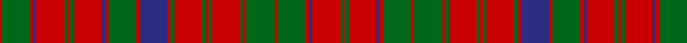

This page is one **sett** — a single exact thread-count. It belongs to the [tartan](/tartans/r1g17r2db2r17g2r2g2r17db2r2g17r2db17r2g2r17g2r2g2r17g2r2g17r2g17r2db2r17g2r1/)
(the same proportion at any scale), whose colour order is pattern [RGRBRGRGRBRGRBRGRGRGRGRGRGRBRGR](/stripes/rgrbrgrgrbrgrbrgrgrgrgrgrgrbrgr/).

Sourced from logan-1831.  It is a [31 stripe tartan](/stripes/stripes31/).

Original link /posts/logans-scottish-gael/

## Provenance

<figure class="logan-scan">

<figcaption>Logan, The Scottish Gaël (1831), vol. II p. 407 — page-scan crop (1088,716)–(1341,1876)</figcaption>
</figure>

James Logan recorded the **Robertson** sett in 1831, on page 407 of the *Table of Clan Tartans* in *The Scottish Gaël* — the earliest systematic published collection of clan setts. Logan gives the stripe widths in eighths of an inch, measured across the cloth and reflected about each end (a half-sett):

> ½ red · 1 green · 8½ red · 1 blue · 1 red · 8½ green · 1 red · 8½ green · 1 red · 1 green · 8½ red · 1 green · 1 red · 1 green · 8½ red · 1 green · 1 red · 8½ blue · 1 red · 8½ green · 1 red · 1 blue · 8½ red · 1 green · 1 red · 1 green · 8½ red · 1 blue · 1 red · 8½ green · ½ red

In threads (at 8 to the eighth-inch) that is `R/4 G8 R68 B8 R8 G68 R8 G68 R8 G8 R68 G8 R8 G8 R68 G8 R8 B68 R8 G68 R8 B8 R68 G8 R8 G8 R68 B8 R8 G68 R/4`. Logan named his colours rather than dyeing to a standard, so the palette here is the Dictionary's modern reading of his names.

See [Logan's Scottish Gaël](/posts/logans-scottish-gael/) for the full table and method.

## Related setts

Later records of the **Robertson** name adjusted Logan's counts: [Robertson](/setts/s6/r2g20r2b8r36g1~b2c4084-g005020-rdc0000~x2/); [Robertson #2](/setts/s14/g15r1g1r1g1r18g24r1g1r18g1r1g1r3~g005020-rdc0000~x2/); [Robertson #3](/setts/s13/r1g1r9b1r1g9r1b9r1g1r9g1r1~b2c4084-g005020-rdc0000~x4/); [Robertson #4](/setts/s29/r28g2r5g2r28b3r3b24r3g24r3b3r28g2r5g2r28b3r3b24r3g24r3b3r28g2r5g2r28~b2c4084-g005020-rdc0000~x2/). Compare their thread counts with Logan's above.

## Thread count
R/4 G68 R8 DB8 R68 G8 R8 G8 R68 DB8 R8 G68 R8 DB68 R8 G8 R68 G8 R8 G8 R68 G8 R8 G68 R8 G68 R8 DB8 R68 G8 R/4

## Palette

Palette: <strong>Tartan Register</strong>
<table><thead><tr><th>Colour</th><th>Threads</th><th>Shade</th><th>Base</th><th>OKLCh</th></tr></thead><tbody><tr><td>R/</td><td style="text-align:right;font-variant-numeric:tabular-nums">4</td><td><code style="background-color:#C80000;">#C80000</code> <small style="color:#888">#C80000</small></td><td>R <code style="background-color:#CC0000;">#CC0000</code></td><td><small style="color:#888">oklch(52.3% 0.215 29.2)</small></td></tr><tr><td>G</td><td style="text-align:right;font-variant-numeric:tabular-nums">68</td><td><code style="background-color:#006818;">#006818</code> <small style="color:#888">#006818</small></td><td>G <code style="background-color:#006100;">#006100</code></td><td><small style="color:#888">oklch(45.0% 0.142 145.0)</small></td></tr><tr><td>R</td><td style="text-align:right;font-variant-numeric:tabular-nums">8</td><td><code style="background-color:#C80000;">#C80000</code> <small style="color:#888">#C80000</small></td><td>R <code style="background-color:#CC0000;">#CC0000</code></td><td><small style="color:#888">oklch(52.3% 0.215 29.2)</small></td></tr><tr><td>DB</td><td style="text-align:right;font-variant-numeric:tabular-nums">8</td><td><code style="background-color:#2C2C80;">#2C2C80</code> <small style="color:#888">#2C2C80</small></td><td>B <code style="background-color:#2A418A;">#2A418A</code></td><td><small style="color:#888">oklch(35.0% 0.138 276.6)</small></td></tr><tr><td>R</td><td style="text-align:right;font-variant-numeric:tabular-nums">68</td><td><code style="background-color:#C80000;">#C80000</code> <small style="color:#888">#C80000</small></td><td>R <code style="background-color:#CC0000;">#CC0000</code></td><td><small style="color:#888">oklch(52.3% 0.215 29.2)</small></td></tr><tr><td>G</td><td style="text-align:right;font-variant-numeric:tabular-nums">8</td><td><code style="background-color:#006818;">#006818</code> <small style="color:#888">#006818</small></td><td>G <code style="background-color:#006100;">#006100</code></td><td><small style="color:#888">oklch(45.0% 0.142 145.0)</small></td></tr><tr><td>R</td><td style="text-align:right;font-variant-numeric:tabular-nums">8</td><td><code style="background-color:#C80000;">#C80000</code> <small style="color:#888">#C80000</small></td><td>R <code style="background-color:#CC0000;">#CC0000</code></td><td><small style="color:#888">oklch(52.3% 0.215 29.2)</small></td></tr><tr><td>G</td><td style="text-align:right;font-variant-numeric:tabular-nums">8</td><td><code style="background-color:#006818;">#006818</code> <small style="color:#888">#006818</small></td><td>G <code style="background-color:#006100;">#006100</code></td><td><small style="color:#888">oklch(45.0% 0.142 145.0)</small></td></tr><tr><td>R</td><td style="text-align:right;font-variant-numeric:tabular-nums">68</td><td><code style="background-color:#C80000;">#C80000</code> <small style="color:#888">#C80000</small></td><td>R <code style="background-color:#CC0000;">#CC0000</code></td><td><small style="color:#888">oklch(52.3% 0.215 29.2)</small></td></tr><tr><td>DB</td><td style="text-align:right;font-variant-numeric:tabular-nums">8</td><td><code style="background-color:#2C2C80;">#2C2C80</code> <small style="color:#888">#2C2C80</small></td><td>B <code style="background-color:#2A418A;">#2A418A</code></td><td><small style="color:#888">oklch(35.0% 0.138 276.6)</small></td></tr><tr><td>R</td><td style="text-align:right;font-variant-numeric:tabular-nums">8</td><td><code style="background-color:#C80000;">#C80000</code> <small style="color:#888">#C80000</small></td><td>R <code style="background-color:#CC0000;">#CC0000</code></td><td><small style="color:#888">oklch(52.3% 0.215 29.2)</small></td></tr><tr><td>G</td><td style="text-align:right;font-variant-numeric:tabular-nums">68</td><td><code style="background-color:#006818;">#006818</code> <small style="color:#888">#006818</small></td><td>G <code style="background-color:#006100;">#006100</code></td><td><small style="color:#888">oklch(45.0% 0.142 145.0)</small></td></tr><tr><td>R</td><td style="text-align:right;font-variant-numeric:tabular-nums">8</td><td><code style="background-color:#C80000;">#C80000</code> <small style="color:#888">#C80000</small></td><td>R <code style="background-color:#CC0000;">#CC0000</code></td><td><small style="color:#888">oklch(52.3% 0.215 29.2)</small></td></tr><tr><td>DB</td><td style="text-align:right;font-variant-numeric:tabular-nums">68</td><td><code style="background-color:#2C2C80;">#2C2C80</code> <small style="color:#888">#2C2C80</small></td><td>B <code style="background-color:#2A418A;">#2A418A</code></td><td><small style="color:#888">oklch(35.0% 0.138 276.6)</small></td></tr><tr><td>R</td><td style="text-align:right;font-variant-numeric:tabular-nums">8</td><td><code style="background-color:#C80000;">#C80000</code> <small style="color:#888">#C80000</small></td><td>R <code style="background-color:#CC0000;">#CC0000</code></td><td><small style="color:#888">oklch(52.3% 0.215 29.2)</small></td></tr><tr><td>G</td><td style="text-align:right;font-variant-numeric:tabular-nums">8</td><td><code style="background-color:#006818;">#006818</code> <small style="color:#888">#006818</small></td><td>G <code style="background-color:#006100;">#006100</code></td><td><small style="color:#888">oklch(45.0% 0.142 145.0)</small></td></tr><tr><td>R</td><td style="text-align:right;font-variant-numeric:tabular-nums">68</td><td><code style="background-color:#C80000;">#C80000</code> <small style="color:#888">#C80000</small></td><td>R <code style="background-color:#CC0000;">#CC0000</code></td><td><small style="color:#888">oklch(52.3% 0.215 29.2)</small></td></tr><tr><td>G</td><td style="text-align:right;font-variant-numeric:tabular-nums">8</td><td><code style="background-color:#006818;">#006818</code> <small style="color:#888">#006818</small></td><td>G <code style="background-color:#006100;">#006100</code></td><td><small style="color:#888">oklch(45.0% 0.142 145.0)</small></td></tr><tr><td>R</td><td style="text-align:right;font-variant-numeric:tabular-nums">8</td><td><code style="background-color:#C80000;">#C80000</code> <small style="color:#888">#C80000</small></td><td>R <code style="background-color:#CC0000;">#CC0000</code></td><td><small style="color:#888">oklch(52.3% 0.215 29.2)</small></td></tr><tr><td>G</td><td style="text-align:right;font-variant-numeric:tabular-nums">8</td><td><code style="background-color:#006818;">#006818</code> <small style="color:#888">#006818</small></td><td>G <code style="background-color:#006100;">#006100</code></td><td><small style="color:#888">oklch(45.0% 0.142 145.0)</small></td></tr><tr><td>R</td><td style="text-align:right;font-variant-numeric:tabular-nums">68</td><td><code style="background-color:#C80000;">#C80000</code> <small style="color:#888">#C80000</small></td><td>R <code style="background-color:#CC0000;">#CC0000</code></td><td><small style="color:#888">oklch(52.3% 0.215 29.2)</small></td></tr><tr><td>G</td><td style="text-align:right;font-variant-numeric:tabular-nums">8</td><td><code style="background-color:#006818;">#006818</code> <small style="color:#888">#006818</small></td><td>G <code style="background-color:#006100;">#006100</code></td><td><small style="color:#888">oklch(45.0% 0.142 145.0)</small></td></tr><tr><td>R</td><td style="text-align:right;font-variant-numeric:tabular-nums">8</td><td><code style="background-color:#C80000;">#C80000</code> <small style="color:#888">#C80000</small></td><td>R <code style="background-color:#CC0000;">#CC0000</code></td><td><small style="color:#888">oklch(52.3% 0.215 29.2)</small></td></tr><tr><td>G</td><td style="text-align:right;font-variant-numeric:tabular-nums">68</td><td><code style="background-color:#006818;">#006818</code> <small style="color:#888">#006818</small></td><td>G <code style="background-color:#006100;">#006100</code></td><td><small style="color:#888">oklch(45.0% 0.142 145.0)</small></td></tr><tr><td>R</td><td style="text-align:right;font-variant-numeric:tabular-nums">8</td><td><code style="background-color:#C80000;">#C80000</code> <small style="color:#888">#C80000</small></td><td>R <code style="background-color:#CC0000;">#CC0000</code></td><td><small style="color:#888">oklch(52.3% 0.215 29.2)</small></td></tr><tr><td>G</td><td style="text-align:right;font-variant-numeric:tabular-nums">68</td><td><code style="background-color:#006818;">#006818</code> <small style="color:#888">#006818</small></td><td>G <code style="background-color:#006100;">#006100</code></td><td><small style="color:#888">oklch(45.0% 0.142 145.0)</small></td></tr><tr><td>R</td><td style="text-align:right;font-variant-numeric:tabular-nums">8</td><td><code style="background-color:#C80000;">#C80000</code> <small style="color:#888">#C80000</small></td><td>R <code style="background-color:#CC0000;">#CC0000</code></td><td><small style="color:#888">oklch(52.3% 0.215 29.2)</small></td></tr><tr><td>DB</td><td style="text-align:right;font-variant-numeric:tabular-nums">8</td><td><code style="background-color:#2C2C80;">#2C2C80</code> <small style="color:#888">#2C2C80</small></td><td>B <code style="background-color:#2A418A;">#2A418A</code></td><td><small style="color:#888">oklch(35.0% 0.138 276.6)</small></td></tr><tr><td>R</td><td style="text-align:right;font-variant-numeric:tabular-nums">68</td><td><code style="background-color:#C80000;">#C80000</code> <small style="color:#888">#C80000</small></td><td>R <code style="background-color:#CC0000;">#CC0000</code></td><td><small style="color:#888">oklch(52.3% 0.215 29.2)</small></td></tr><tr><td>G</td><td style="text-align:right;font-variant-numeric:tabular-nums">8</td><td><code style="background-color:#006818;">#006818</code> <small style="color:#888">#006818</small></td><td>G <code style="background-color:#006100;">#006100</code></td><td><small style="color:#888">oklch(45.0% 0.142 145.0)</small></td></tr><tr><td>R/</td><td style="text-align:right;font-variant-numeric:tabular-nums">4</td><td><code style="background-color:#C80000;">#C80000</code> <small style="color:#888">#C80000</small></td><td>R <code style="background-color:#CC0000;">#CC0000</code></td><td><small style="color:#888">oklch(52.3% 0.215 29.2)</small></td></tr></tbody></table>

## Nearest tartans

The nearest existing variants by ΔTartan distance, with this tartan at the top so the swatches line up against it.

ΔTartan

Tartan

Sett

—

<a href="/ttd/edit/#slug=r1g17r2db2r17g2r2g2r17db2r2g17r2db17r2g2r17g2r2g2r17g2r2g17r2g17r2db2r17g2r1~x4">Robertson</a> <a class="nn-out" href="/setts/s31/r1g17r2db2r17g2r2g2r17db2r2g17r2db17r2g2r17g2r2g2r17g2r2g17r2g17r2db2r17g2r1~x4/" title="open its dictionary page">↗</a>

0.72

<a href="/ttd/edit/#slug=g18r2g18r18g2r4g2r18db18r2db18r18db1r1db2r1db1r18db1r1g2r1db1r18g18r2g18~x2">Ross (Clan)</a> <a class="nn-out" href="/setts/s27/g18r2g18r18g2r4g2r18db18r2db18r18db1r1db2r1db1r18db1r1g2r1db1r18g18r2g18~x2/" title="open its dictionary page">↗</a>

0.76

<a href="/ttd/edit/#slug=g18r2g18r18g2r4g2r18db18r2db18r18db1r1db2r1db1r18db1r1db2r1db1r18g18r2g18~x2">Ross Clan Tartan Tartan Number: 864. Earliest known date: 1810-15 D.C.Stewart says, &quot;The version here given may be taken to be correct.&quot; Later versions, including Logans, are known to have omissions. The Clan Ross is descended from Fearcher MacinTagart, Earl of Ross in the 13th century. The chiefship has passed to the Rosses of Shandwick. The tartan is also worn by the MacTiers. Also worn by the Metro Toronto Police pipe band. (Strathallan 1994) See products available Copyright © Blair Urquhart, Comrie, 2015</a> <a class="nn-out" href="/setts/s27/g18r2g18r18g2r4g2r18db18r2db18r18db1r1db2r1db1r18db1r1db2r1db1r18g18r2g18~x2/" title="open its dictionary page">↗</a>

0.85

<a href="/ttd/edit/#slug=dg18r2dg18r18dg2r4dg2r18db18r2db18r18db1r1db2r1db1r18db1r1db2r1db1r18dg18r2dg18~x2">Ross #4</a> <a class="nn-out" href="/setts/s27/dg18r2dg18r18dg2r4dg2r18db18r2db18r18db1r1db2r1db1r18db1r1db2r1db1r18dg18r2dg18~x2/" title="open its dictionary page">↗</a>

1.05

<a href="/ttd/edit/#slug=r28g2r5g2r28g2r5g2r28db3r3g24r3db24r3db3r28g2r5g2r28db3r3g24r3db24r3db3~x2">Robertson 4</a> <a class="nn-out" href="/setts/s28/r28g2r5g2r28g2r5g2r28db3r3g24r3db24r3db3r28g2r5g2r28db3r3g24r3db24r3db3~x2/" title="open its dictionary page">↗</a>

1.17

<a href="/ttd/edit/#slug=g8r4g1r1g1r24db8g4r1g1r1g4r8g1r1g1r1db8g8r2g4~x2">Matheson</a> <a class="nn-out" href="/setts/s21/g8r4g1r1g1r24db8g4r1g1r1g4r8g1r1g1r1db8g8r2g4~x2/" title="open its dictionary page">↗</a>

1.17

<a href="/ttd/edit/#slug=r32db3r3db8r3db3r23g20r6g20r6g20r22g5r10g5r22db24r5db24r23db3r3db8r3db3r32db3r3db8r3db3r23g20r6g20">Ross 1</a> <a class="nn-out" href="/setts/s36/r32db3r3db8r3db3r23g20r6g20r6g20r22g5r10g5r22db24r5db24r23db3r3db8r3db3r32db3r3db8r3db3r23g20r6g20/" title="open its dictionary page">↗</a>

1.17

<a href="/ttd/edit/#slug=g8r4g1r1g1r24dp8g4r1g1r1g4r8g1r1g1r1dp8g8r2g4~x2">Matheson Dress</a> <a class="nn-out" href="/setts/s21/g8r4g1r1g1r24dp8g4r1g1r1g4r8g1r1g1r1dp8g8r2g4~x2/" title="open its dictionary page">↗</a>

1.18

<a href="/ttd/edit/#slug=db3r1db1r3db9r3db1r1db3r1db1r18db14r3db1r1db1r3g4r14g10r10db5r4db1~x2">Campbell of Loudoun, Plaid</a> <a class="nn-out" href="/setts/s25/db3r1db1r3db9r3db1r1db3r1db1r18db14r3db1r1db1r3g4r14g10r10db5r4db1~x2/" title="open its dictionary page">↗</a>

1.21

<a href="/ttd/edit/#slug=db18r2db18r18g2r4g2r18g18r2g18r2g18r18db1r1db2r1db1r18~x2">Ross 3</a> <a class="nn-out" href="/setts/s20/db18r2db18r18g2r4g2r18g18r2g18r2g18r18db1r1db2r1db1r18~x2/" title="open its dictionary page">↗</a>

1.22

<a href="/setts/s26/g6r2g2r18dp9r3g3r3dp9r3g24r2g2r4~x2/">Stewart of Killiecrankie</a>

## Neighbour map

Every grey dot is one of 14359 variants placed by the first two principal components of the ΔTartan feature space (44% of its variance). Red is this tartan; blue dots are its nearest — click one to open its page.

<svg viewBox="0 0 640 380" role="img" style="max-width:100%;height:auto;border:1px solid #e0e0e0;border-radius:4px;display:block" xmlns="http://www.w3.org/2000/svg"><image href="/nn/cloud.v1.png" width="640" height="380"/><a href="/setts/s27/g18r2g18r18g2r4g2r18db18r2db18r18db1r1db2r1db1r18db1r1g2r1db1r18g18r2g18~x2/"><circle cx="293.3" cy="131.1" r="4" fill="#3465a4"><title>Ross (Clan)</title></circle></a><a href="/setts/s27/g18r2g18r18g2r4g2r18db18r2db18r18db1r1db2r1db1r18db1r1db2r1db1r18g18r2g18~x2/"><circle cx="292.1" cy="130.9" r="4" fill="#3465a4"><title>Ross Clan Tartan Tartan Number: 864. Earliest known date: 1810-15 D.C.Stewart says, &quot;The version here given may be taken to be correct.&quot; Later versions, including Logans, are known to have omissions. The Clan Ross is descended from Fearcher MacinTagart, Earl of Ross in the 13th century. The chiefship has passed to the Rosses of Shandwick. The tartan is also worn by the MacTiers. Also worn by the Metro Toronto Police pipe band. (Strathallan 1994) See products available Copyright © Blair Urquhart, Comrie, 2015</title></circle></a><a href="/setts/s27/dg18r2dg18r18dg2r4dg2r18db18r2db18r18db1r1db2r1db1r18db1r1db2r1db1r18dg18r2dg18~x2/"><circle cx="290.3" cy="128.0" r="4" fill="#3465a4"><title>Ross #4</title></circle></a><a href="/setts/s28/r28g2r5g2r28g2r5g2r28db3r3g24r3db24r3db3r28g2r5g2r28db3r3g24r3db24r3db3~x2/"><circle cx="361.8" cy="133.7" r="4" fill="#3465a4"><title>Robertson 4</title></circle></a><a href="/setts/s21/g8r4g1r1g1r24db8g4r1g1r1g4r8g1r1g1r1db8g8r2g4~x2/"><circle cx="325.2" cy="117.9" r="4" fill="#3465a4"><title>Matheson</title></circle></a><a href="/setts/s36/r32db3r3db8r3db3r23g20r6g20r6g20r22g5r10g5r22db24r5db24r23db3r3db8r3db3r32db3r3db8r3db3r23g20r6g20/"><circle cx="289.7" cy="151.0" r="4" fill="#3465a4"><title>Ross 1</title></circle></a><a href="/setts/s21/g8r4g1r1g1r24dp8g4r1g1r1g4r8g1r1g1r1dp8g8r2g4~x2/"><circle cx="328.6" cy="115.7" r="4" fill="#3465a4"><title>Matheson Dress</title></circle></a><a href="/setts/s25/db3r1db1r3db9r3db1r1db3r1db1r18db14r3db1r1db1r3g4r14g10r10db5r4db1~x2/"><circle cx="351.3" cy="132.3" r="4" fill="#3465a4"><title>Campbell of Loudoun, Plaid</title></circle></a><a href="/setts/s20/db18r2db18r18g2r4g2r18g18r2g18r2g18r18db1r1db2r1db1r18~x2/"><circle cx="288.4" cy="150.4" r="4" fill="#3465a4"><title>Ross 3</title></circle></a><a href="/setts/s26/g6r2g2r18dp9r3g3r3dp9r3g24r2g2r4~x2/"><circle cx="255.5" cy="143.1" r="4" fill="#3465a4"><title>Stewart of Killiecrankie</title></circle></a><circle cx="324.4" cy="124.3" r="5" fill="#c00000"/></svg>

ID: /setts/s31/r1g17r2db2r17g2r2g2r17db2r2g17r2db17r2g2r17g2r2g2r17g2r2g17r2g17r2db2r17g2r1~x4/
