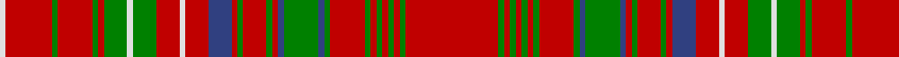

In pattern [RGRGRGRGRGBGBRGRGRBRWRGWGRGRGRW](/patterns/rgrgrgrgrgbgbrgrgrbrwrgwgrgrgrw/).

This was sourced from weddslist.  It is a [31 stripes tartan](/stripes/stripes31/).

Original link http://www.weddslist.com/cgi-bin/tartans/pg.pl?source=sts

## Thread count
LN/2 R16 G2 R12 G2 R2 G8 LN2 G8 R8 LN2 R8 B8 R2 G2 R8 G2 R2 B2 G12 B2 G2 R12 G2 R2 G2 R2 G2 R2 G2 R/32

## Palette
Each colour and its ΔE from the base-6 reference it is a variant of.

| Colour | Shade | Base | ΔE (OKLab) |
|---|---|---|---|
| B | <code style="background-color:#304080;">#304080</code> `#304080` | B <code style="background-color:#2A418A;">#2A418A</code> | 0.02 |
| G | <code style="background-color:#008000;">#008000</code> `#008000` | G <code style="background-color:#006100;">#006100</code> | 0.10 |
| LN | <code style="background-color:#E0E0E0;">#E0E0E0</code> `#E0E0E0` | W <code style="background-color:#F7F7F7;">#F7F7F7</code> | 0.07 |
| R | <code style="background-color:#C00000;">#C00000</code> `#C00000` | R <code style="background-color:#CC0000;">#CC0000</code> | 0.03 |

## Nearest tartans

The nearest existing variants by ΔTartan distance.

1. [MacDonald of Staffa #3](/setts/s31/r32g2r2g2r2g2r2g2r12g2b2g12b2r2g2r8g2r2b8r8w2r8g8w2g8r2g2r12g2r16w2-b2c4084-g005020-rdc0000-we0e0e0/) — ΔT 0.64
1. [MacDonald of Staffa 2](/setts/s31/r32g2r2g2r2g2r2g2r12g2b2g12k2r2g2r8g2r2b8r8w2r8g8w2g8r2g2r12g2r16w2-b304080-g008000-k000000-rc00000-we0e0e0/) — ΔT 0.86
1. [MacDonald of Staffa Clan Tartan Tartan Number: 1529. Earliest known date: 1850 This plate is taken from the manuscript of William and Andrew Smith's 'Authenticated Tartans of the Clans and Families of Scotland'. The Smith's sources included the findings of George Hunter, an Army clothier, who toured the Highlands in search of old tartans prior to 1822. See products available Copyright © Blair Urquhart, Comrie, 2015](/setts/s31/r32g2r2g2r2g2r2g2r12g2b2g12k2r2g2r8g2r2b8r8w2r8g8w2g8r2g2r12g2r16w2-b2c2c80-g006818-k101010-rc80000-we0e0e0/) — ΔT 0.89
1. [MacDonald of Staffa (Smith's)](/setts/s31/r32g2r2g2r2g2r2g2r12g2b2g12k2r2g2r8g2r2b8r8w2r8g8w2g8r2g2r12g2r16w2-b2c2c80-g006818-k101010-rc80000-wfcfcfc/) — ΔT 0.91
1. [MacDonald of Staffa 3](/setts/s29/r37g2r2g2r2g2r2g2r11k2g11r3g2r11g2r3b9r11w2r9g11w2g11r3g2r9g2r19w2-b000050-g008000-k000000-rc00000-we0e0e0/) — ΔT 1.01
1. [Robertson 5](/setts/s29/r56g4r10g4r56b6r6b48r6g48r6b6r56g4r10g4r56b6r6b48r6g48r6b6r56g4r10g4r56-b304080-g008000-rc00000/) — ΔT 1.15
1. [MacAlister (Gourlay Steele Collection)](/setts/s30/r48g12y4r8y4g12r12b12r24ba4r4g32r4ba4r48ba4r4g32r4ba4r24g8r4ba4r8ba4r4g12y4r16-b2c4084-ba3c82af-g005020-rdc0000-ye8c000/) — ΔT 1.21
1. [MacAlister](/setts/s30/r48g12y4r8y4g12r12b12r24ba4r4g32r4ba4r48ba4r4g32r4ba4r24g8r4ba4r8ba4r4g12y4r16-b304080-ba5480b0-g008000-rc00000-yf0c000/) — ΔT 1.22
1. [Robertson 4](/setts/s28/r56g4r10g4r56g4r10g4r56b6r6g48r6b48r6b6r56g4r10g4r56b6r6g48r6b48r6b6-b304080-g008000-rc00000/) — ΔT 1.22
1. [MacDonald of Staffa #4](/setts/s29/r37g2r2g2r2g2r2g2r11k2g11r3g2r11g2r3b9r11w2r9g11w2g11r3g2r9g2r19w2-b080848-g005020-k101010-rdc0000-we0e0e0/) — ΔT 1.23

## Neighbour map

Every grey dot is one of 15726 variants placed by the first two principal components of the ΔTartan feature space (44% of its variance). Red is this tartan; blue dots are its nearest — click one to open its page.

<svg viewBox="0 0 640 380" role="img" style="max-width:100%;height:auto;border:1px solid #e0e0e0;border-radius:4px;display:block" xmlns="http://www.w3.org/2000/svg"><image href="/nn/cloud.v1.png" width="640" height="380"/><a href="/setts/s31/r32g2r2g2r2g2r2g2r12g2b2g12b2r2g2r8g2r2b8r8w2r8g8w2g8r2g2r12g2r16w2-b2c4084-g005020-rdc0000-we0e0e0/"><circle cx="366.9" cy="92.2" r="4" fill="#3465a4"><title>MacDonald of Staffa #3</title></circle></a><a href="/setts/s31/r32g2r2g2r2g2r2g2r12g2b2g12k2r2g2r8g2r2b8r8w2r8g8w2g8r2g2r12g2r16w2-b304080-g008000-k000000-rc00000-we0e0e0/"><circle cx="348.7" cy="80.6" r="4" fill="#3465a4"><title>MacDonald of Staffa 2</title></circle></a><a href="/setts/s31/r32g2r2g2r2g2r2g2r12g2b2g12k2r2g2r8g2r2b8r8w2r8g8w2g8r2g2r12g2r16w2-b2c2c80-g006818-k101010-rc80000-we0e0e0/"><circle cx="353.6" cy="81.5" r="4" fill="#3465a4"><title>MacDonald of Staffa Clan Tartan Tartan Number: 1529. Earliest known date: 1850 This plate is taken from the manuscript of William and Andrew Smith's 'Authenticated Tartans of the Clans and Families of Scotland'. The Smith's sources included the findings of George Hunter, an Army clothier, who toured the Highlands in search of old tartans prior to 1822. See products available Copyright © Blair Urquhart, Comrie, 2015</title></circle></a><a href="/setts/s31/r32g2r2g2r2g2r2g2r12g2b2g12k2r2g2r8g2r2b8r8w2r8g8w2g8r2g2r12g2r16w2-b2c2c80-g006818-k101010-rc80000-wfcfcfc/"><circle cx="348.6" cy="79.3" r="4" fill="#3465a4"><title>MacDonald of Staffa (Smith's)</title></circle></a><a href="/setts/s29/r37g2r2g2r2g2r2g2r11k2g11r3g2r11g2r3b9r11w2r9g11w2g11r3g2r9g2r19w2-b000050-g008000-k000000-rc00000-we0e0e0/"><circle cx="365.4" cy="76.3" r="4" fill="#3465a4"><title>MacDonald of Staffa 3</title></circle></a><a href="/setts/s29/r56g4r10g4r56b6r6b48r6g48r6b6r56g4r10g4r56b6r6b48r6g48r6b6r56g4r10g4r56-b304080-g008000-rc00000/"><circle cx="385.8" cy="133.8" r="4" fill="#3465a4"><title>Robertson 5</title></circle></a><a href="/setts/s30/r48g12y4r8y4g12r12b12r24ba4r4g32r4ba4r48ba4r4g32r4ba4r24g8r4ba4r8ba4r4g12y4r16-b2c4084-ba3c82af-g005020-rdc0000-ye8c000/"><circle cx="297.8" cy="96.7" r="4" fill="#3465a4"><title>MacAlister (Gourlay Steele Collection)</title></circle></a><a href="/setts/s30/r48g12y4r8y4g12r12b12r24ba4r4g32r4ba4r48ba4r4g32r4ba4r24g8r4ba4r8ba4r4g12y4r16-b304080-ba5480b0-g008000-rc00000-yf0c000/"><circle cx="303.9" cy="102.6" r="4" fill="#3465a4"><title>MacAlister</title></circle></a><a href="/setts/s28/r56g4r10g4r56g4r10g4r56b6r6g48r6b48r6b6r56g4r10g4r56b6r6g48r6b48r6b6-b304080-g008000-rc00000/"><circle cx="361.7" cy="132.0" r="4" fill="#3465a4"><title>Robertson 4</title></circle></a><a href="/setts/s29/r37g2r2g2r2g2r2g2r11k2g11r3g2r11g2r3b9r11w2r9g11w2g11r3g2r9g2r19w2-b080848-g005020-k101010-rdc0000-we0e0e0/"><circle cx="366.7" cy="72.6" r="4" fill="#3465a4"><title>MacDonald of Staffa #4</title></circle></a><circle cx="371.3" cy="97.9" r="5" fill="#c00000"/></svg>

ID: /setts/s31/r32g2r2g2r2g2r2g2r12g2b2g12b2r2g2r8g2r2b8r8w2r8g8w2g8r2g2r12g2r16w2-b304080-g008000-rc00000-we0e0e0/
