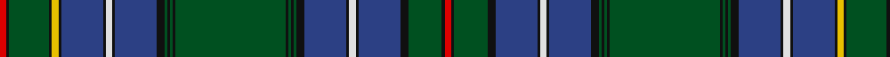

In pattern [RKGKBKWKBKGKGKGKGKGKBKWKBKYKGKR](/stripes/rkgkbkwkbkgkgkgkgkgkbkwkbkykgkr/).

This was sourced from register-of-tartans.  It is a [31 stripe tartan](/stripes/stripes31/).

Original link https://www.tartanregister.gov.uk/tartanDetails.aspx?ref=701

## Register references

External register numbers recorded for this tartan.

- Scottish Register of Tartans: [701](https://www.tartanregister.gov.uk/tartanDetails.aspx?ref=701)
- Scottish Tartans World Register: 1573

## Thread count
R/5 K2 G30 K2 Y5 K2 B31 K2 LN5 K2 B31 K6 G2 K2 G2 K2 G82 K2 G2 K2 G2 K6 B31 K2 LN5 K2 B31 K6 G25 K2 R/5

## Palette
Each colour and its ΔE from the base-6 reference it is a variant of.

| Colour | Shade | Base | ΔE (OKLab) |
|---|---|---|---|
| B | <code style="background-color:#2C4084;">#2C4084</code> `#2C4084` | B <code style="background-color:#2A418A;">#2A418A</code> | 0.01 |
| G | <code style="background-color:#005020;">#005020</code> `#005020` | G <code style="background-color:#006100;">#006100</code> | 0.07 |
| K | <code style="background-color:#101010;">#101010</code> `#101010` | K <code style="background-color:#000000;">#000000</code> | 0.17 |
| LN | <code style="background-color:#E0E0E0;">#E0E0E0</code> `#E0E0E0` | W <code style="background-color:#F7F7F7;">#F7F7F7</code> | 0.07 |
| R | <code style="background-color:#DC0000;">#DC0000</code> `#DC0000` | R <code style="background-color:#CC0000;">#CC0000</code> | 0.03 |
| Y | <code style="background-color:#E8C000;">#E8C000</code> `#E8C000` | Y <code style="background-color:#F2BF00;">#F2BF00</code> | 0.02 |

## Nearest tartans

The nearest existing variants by ΔTartan distance.

1. [St. Andrews Soc. of New York (Corp)](/setts/s27/r8k4g34k1g5k2g4k3g3k4g2k5g1k36db1k5db2k4db3k3db4k2db5k1db34w2r8/) — ΔT 1.29
1. [Whitworth (2003)](/setts/s34/db60k2db2k2db5k15db5g20r2k3r2g20db5k15g5db20k2g4~x2/) — ΔT 1.38
1. [Ayre Personal Tartan Tartan Number: 6305. Earliest known date: 1819 This is Wilsons No. 038 (1819) and has been adopted by David Ayre of Kilmarnock as a private family tartan. See #805. See products available Copyright © Blair Urquhart, Comrie, 2015](/setts/s38/g82k2g2k2g2k8db28k2w6k2db28k2ly6k2g32k2r5k2g15w6/) — ΔT 1.47
1. [Cockburn (Old Pattern)](/setts/s25/r6k1g34k2ly4k5db5k1w5k1db34k5g2k2g2k2g86k2g2k2g2k5db34k1w5/) — ΔT 1.50
1. [Cockburn #4](/setts/s60/r5k2g30k2ly5k2db31k2w5k2db31k6g2k2g2k2g86k2g2k2g2k6db31k2w5k2db31k6g25k2r5/) — ΔT 1.56
1. [Italian](/setts/s30/db24k2db24k1lb1k1g12r2k2r2g12k1lb1k1db24r2lb2g2db24k1lb1k1g12r2k2r2g12k1lb1k1~x2/) — ΔT 1.56
1. [Cockburn #2](/setts/s27/r3k2dg9db12w3db12dg2k2dg2k2dg36k2dg2k2dg2db12w3db12k3ly3k2dg12k2r3k2dg6w3~x2/) — ΔT 1.61
1. [Wood (Clan)](/setts/s23/k3lr2k6g3k3g21db18r1db2r1db2r3db2r1db2r1db18g21k3g3k6ly2k3~x2/) — ΔT 1.61
1. [Peter Pan Corporate Tartan Tartan Number: 5505. Earliest known date: pre 1998 Designed by Lochcarron for the Great Ormond Street Hospital for Sick Children. J.M.Barrie donated all the rights to Peter Pan to the Hospital in 1929, confirmed in his will in 1937. The royalties go to the Hospital to support its work. Sample in STA Johnston Collection. Design registration cover renewed through Peter MacDonald in July/August 2002. See products available Copyright © Blair Urquhart, Comrie, 2015](/setts/s38/db22g2g2g2g2g2db6k3g14db1g4db1g2g2g2g2g1db1k1r2~x2/) — ΔT 1.63
1. [Eastern Shore Police Emerald Society](/setts/s15/g4dg40g4k8n4k8g5k2ly4k2dg1g2dg2k1w1~x2/) — ΔT 1.64

## Neighbour map

Every grey dot is one of 14299 variants placed by the first two principal components of the ΔTartan feature space (44% of its variance). Red is this tartan; blue dots are its nearest — click one to open its page.

<svg viewBox="0 0 640 380" role="img" style="max-width:100%;height:auto;border:1px solid #e0e0e0;border-radius:4px;display:block" xmlns="http://www.w3.org/2000/svg"><image href="/nn/cloud.v1.png" width="640" height="380"/><a href="/setts/s27/r8k4g34k1g5k2g4k3g3k4g2k5g1k36db1k5db2k4db3k3db4k2db5k1db34w2r8/"><circle cx="220.8" cy="43.8" r="4" fill="#3465a4"><title>St. Andrews Soc. of New York (Corp)</title></circle></a><a href="/setts/s34/db60k2db2k2db5k15db5g20r2k3r2g20db5k15g5db20k2g4~x2/"><circle cx="259.4" cy="80.9" r="4" fill="#3465a4"><title>Whitworth (2003)</title></circle></a><a href="/setts/s38/g82k2g2k2g2k8db28k2w6k2db28k2ly6k2g32k2r5k2g15w6/"><circle cx="254.6" cy="16.2" r="4" fill="#3465a4"><title>Ayre Personal Tartan Tartan Number: 6305. Earliest known date: 1819 This is Wilsons No. 038 (1819) and has been adopted by David Ayre of Kilmarnock as a private family tartan. See #805. See products available Copyright © Blair Urquhart, Comrie, 2015</title></circle></a><a href="/setts/s25/r6k1g34k2ly4k5db5k1w5k1db34k5g2k2g2k2g86k2g2k2g2k5db34k1w5/"><circle cx="312.5" cy="19.3" r="4" fill="#3465a4"><title>Cockburn (Old Pattern)</title></circle></a><a href="/setts/s60/r5k2g30k2ly5k2db31k2w5k2db31k6g2k2g2k2g86k2g2k2g2k6db31k2w5k2db31k6g25k2r5/"><circle cx="263.5" cy="14.0" r="4" fill="#3465a4"><title>Cockburn #4</title></circle></a><a href="/setts/s30/db24k2db24k1lb1k1g12r2k2r2g12k1lb1k1db24r2lb2g2db24k1lb1k1g12r2k2r2g12k1lb1k1~x2/"><circle cx="306.1" cy="70.2" r="4" fill="#3465a4"><title>Italian</title></circle></a><a href="/setts/s27/r3k2dg9db12w3db12dg2k2dg2k2dg36k2dg2k2dg2db12w3db12k3ly3k2dg12k2r3k2dg6w3~x2/"><circle cx="221.8" cy="82.4" r="4" fill="#3465a4"><title>Cockburn #2</title></circle></a><a href="/setts/s23/k3lr2k6g3k3g21db18r1db2r1db2r3db2r1db2r1db18g21k3g3k6ly2k3~x2/"><circle cx="202.2" cy="87.0" r="4" fill="#3465a4"><title>Wood (Clan)</title></circle></a><a href="/setts/s38/db22g2g2g2g2g2db6k3g14db1g4db1g2g2g2g2g1db1k1r2~x2/"><circle cx="190.1" cy="56.6" r="4" fill="#3465a4"><title>Peter Pan Corporate Tartan Tartan Number: 5505. Earliest known date: pre 1998 Designed by Lochcarron for the Great Ormond Street Hospital for Sick Children. J.M.Barrie donated all the rights to Peter Pan to the Hospital in 1929, confirmed in his will in 1937. The royalties go to the Hospital to support its work. Sample in STA Johnston Collection. Design registration cover renewed through Peter MacDonald in July/August 2002. See products available Copyright © Blair Urquhart, Comrie, 2015</title></circle></a><a href="/setts/s15/g4dg40g4k8n4k8g5k2ly4k2dg1g2dg2k1w1~x2/"><circle cx="303.2" cy="66.8" r="4" fill="#3465a4"><title>Eastern Shore Police Emerald Society</title></circle></a><circle cx="283.5" cy="43.4" r="5" fill="#c00000"/></svg>

ID: /setts/s31/r5k2dg30k2ly5k2db31k2w5k2db31k6dg2k2dg2k2dg82k2dg2k2dg2k6db31k2w5k2db31k6dg25k2r5/
