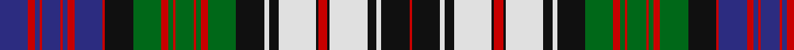

In pattern [BRBRBRBRBRKGRGRGRGRGKWKWKRKWKWKR](/patterns/brbrbrbrbrkgrgrgrgrgkwkwkrkwkwkr/).

This was sourced from house-of-tartan.  It is a [32 stripes tartan](/stripes/stripes32/).

Original link http://www.house-of-tartan.scotland.net/house/TartanViewjs.asp?colr=Def&tnam=1997

## Thread count
DB/24 R6 DB4 R2 DB16 R2 DB4 R6 DB24 R2 K24 G24 R6 G4 R2 G16 R2 G4 R6 G24 K24 LN4 K8 LN32 K2 R8 K2 LN32 K8 LN4 K24 R/2

## Palette
Each colour and its ΔE from the base-6 reference it is a variant of.

| Colour | Shade | Base | ΔE (OKLab) |
|---|---|---|---|
| DB | <code style="background-color:#2C2C80;">#2C2C80</code> `#2C2C80` | B <code style="background-color:#2A418A;">#2A418A</code> | 0.06 |
| G | <code style="background-color:#006818;">#006818</code> `#006818` | G <code style="background-color:#006100;">#006100</code> | 0.02 |
| K | <code style="background-color:#101010;">#101010</code> `#101010` | K <code style="background-color:#000000;">#000000</code> | 0.17 |
| LN | <code style="background-color:#E0E0E0;">#E0E0E0</code> `#E0E0E0` | W <code style="background-color:#F7F7F7;">#F7F7F7</code> | 0.07 |
| R | <code style="background-color:#C80000;">#C80000</code> `#C80000` | R <code style="background-color:#CC0000;">#CC0000</code> | 0.01 |

## Nearest tartans

The nearest existing variants by ΔTartan distance.

1. [MacDonald Dress](/setts/s32/b24r6b4r2b16r2b4r6b24r2k24g24r6g4r2g16r2g4r6g24k24w4b8w32k2r8k2w32b8w4k24r2-b202060-g006818-k101010-rc80000-we0e0e0/) — ΔT 0.11
1. [MacDonald, dress](/setts/s32/b24r6b4r2b16r2b4r6b24r2k24g24r6g4r2g16r2g4r6g24k24w4k8w32k2r8k2w32k8w4k24r2-b304080-g008000-k000000-rc00000-we0e0e0/) — ΔT 0.50
1. [MacDonald, dress](/setts/s33/b36r14b4r4b14r4b4r14b36r4k36w16b14w80b4r16b4w80b14w16r4k36g36r14g4r4g12r4g4r14g36k36r4-b304080-g008000-k000000-rc00000-we0e0e0/) — ΔT 0.91
1. [MacDonald Dress Clan Tartan Tartan Number: 1998. Earliest known date: c.1815 In 1815, members of the Highland Society of London resolved to request of each of the Highland chiefs, a sample of their clan tartan. The swatches were to be signed and sealed in the chief's own hand. This sett is one of those delivered to the Society between 1815 and 1822. See products available Copyright © Blair Urquhart, Comrie, 2015](/setts/s33/b36r14b4r4b14r4b4r14b36r4k36w16b14w80b4r16b4w80b14w16r4k36g36r14g4r4g12r4g4r14g36k36r4-b2c2c80-g006818-k101010-rc80000-we0e0e0/) — ΔT 0.95
1. [MacDonald Dress #2](/setts/s33/b36r14b4r4b14r4b4r14b36r4k36w16b14w80b4r16b4w80b14w16r4k36g36r14g4r4g12r4g4r14g36k36r4-b2c4084-g005020-k101010-rdc0000-we0e0e0/) — ΔT 0.98
1. [Lauder Dress (Can)](/setts/s36/b4w52b5w5k26g25r6g28k25g3b26g6b25g3k27w50b4r4b4w50k27g3b25g6b26g3k25g28r6g25k26w5b5w52b4r4-b2c2c80-g00683c-k101010-rc80000-we0e0e0/) — ΔT 1.00
1. [Gordon Dress (Original)](/setts/s23/w4b2w24b4w4k16b16k4b4k4b16k16g16k2y4k2g16k16w4b4w24b2w4-b2c4084-g005020-k101010-we0e0e0-ye8c000/) — ΔT 1.20
1. [Anderson (MacGregor-Hastie #3)](/setts/s24/r12b20r4k4r4b54k12w12k8y4k6y4k18r4k18r8g20r4k4r8k4r4g20r12-b3c82af-g005020-k101010-rdc0000-we0e0e0-ye8c000/) — ΔT 1.22
1. [Anderson 4](/setts/s24/r12b20r4k4r4b54k12w12k8y4k6y4k18r4k18r8g20r4k4r8k4r4g20r12-b5480b0-g008000-k000000-rc00000-we0e0e0-yf0c000/) — ΔT 1.23
1. [Gullane](/setts/s23/k40b8k12r8w4r12w4r16w4ra8w4ra12w4ra16w4b8w4b12w4b16w4k16w8-b5c5c5c-k101010-r980044-ra888888-we0e0e0/) — ΔT 1.24

## Neighbour map

Every grey dot is one of 15726 variants placed by the first two principal components of the ΔTartan feature space (44% of its variance). Red is this tartan; blue dots are its nearest — click one to open its page.

<svg viewBox="0 0 640 380" role="img" style="max-width:100%;height:auto;border:1px solid #e0e0e0;border-radius:4px;display:block" xmlns="http://www.w3.org/2000/svg"><image href="/nn/cloud.v1.png" width="640" height="380"/><a href="/setts/s32/b24r6b4r2b16r2b4r6b24r2k24g24r6g4r2g16r2g4r6g24k24w4b8w32k2r8k2w32b8w4k24r2-b202060-g006818-k101010-rc80000-we0e0e0/"><circle cx="59.4" cy="81.7" r="4" fill="#3465a4"><title>MacDonald Dress</title></circle></a><a href="/setts/s32/b24r6b4r2b16r2b4r6b24r2k24g24r6g4r2g16r2g4r6g24k24w4k8w32k2r8k2w32k8w4k24r2-b304080-g008000-k000000-rc00000-we0e0e0/"><circle cx="52.6" cy="78.7" r="4" fill="#3465a4"><title>MacDonald, dress</title></circle></a><a href="/setts/s33/b36r14b4r4b14r4b4r14b36r4k36w16b14w80b4r16b4w80b14w16r4k36g36r14g4r4g12r4g4r14g36k36r4-b304080-g008000-k000000-rc00000-we0e0e0/"><circle cx="85.9" cy="53.9" r="4" fill="#3465a4"><title>MacDonald, dress</title></circle></a><a href="/setts/s33/b36r14b4r4b14r4b4r14b36r4k36w16b14w80b4r16b4w80b14w16r4k36g36r14g4r4g12r4g4r14g36k36r4-b2c2c80-g006818-k101010-rc80000-we0e0e0/"><circle cx="92.6" cy="55.3" r="4" fill="#3465a4"><title>MacDonald Dress Clan Tartan Tartan Number: 1998. Earliest known date: c.1815 In 1815, members of the Highland Society of London resolved to request of each of the Highland chiefs, a sample of their clan tartan. The swatches were to be signed and sealed in the chief's own hand. This sett is one of those delivered to the Society between 1815 and 1822. See products available Copyright © Blair Urquhart, Comrie, 2015</title></circle></a><a href="/setts/s33/b36r14b4r4b14r4b4r14b36r4k36w16b14w80b4r16b4w80b14w16r4k36g36r14g4r4g12r4g4r14g36k36r4-b2c4084-g005020-k101010-rdc0000-we0e0e0/"><circle cx="93.5" cy="55.1" r="4" fill="#3465a4"><title>MacDonald Dress #2</title></circle></a><a href="/setts/s36/b4w52b5w5k26g25r6g28k25g3b26g6b25g3k27w50b4r4b4w50k27g3b25g6b26g3k25g28r6g25k26w5b5w52b4r4-b2c2c80-g00683c-k101010-rc80000-we0e0e0/"><circle cx="85.9" cy="75.0" r="4" fill="#3465a4"><title>Lauder Dress (Can)</title></circle></a><a href="/setts/s23/w4b2w24b4w4k16b16k4b4k4b16k16g16k2y4k2g16k16w4b4w24b2w4-b2c4084-g005020-k101010-we0e0e0-ye8c000/"><circle cx="74.5" cy="112.9" r="4" fill="#3465a4"><title>Gordon Dress (Original)</title></circle></a><a href="/setts/s24/r12b20r4k4r4b54k12w12k8y4k6y4k18r4k18r8g20r4k4r8k4r4g20r12-b3c82af-g005020-k101010-rdc0000-we0e0e0-ye8c000/"><circle cx="74.9" cy="84.1" r="4" fill="#3465a4"><title>Anderson (MacGregor-Hastie #3)</title></circle></a><a href="/setts/s24/r12b20r4k4r4b54k12w12k8y4k6y4k18r4k18r8g20r4k4r8k4r4g20r12-b5480b0-g008000-k000000-rc00000-we0e0e0-yf0c000/"><circle cx="59.4" cy="79.6" r="4" fill="#3465a4"><title>Anderson 4</title></circle></a><a href="/setts/s23/k40b8k12r8w4r12w4r16w4ra8w4ra12w4ra16w4b8w4b12w4b16w4k16w8-b5c5c5c-k101010-r980044-ra888888-we0e0e0/"><circle cx="64.3" cy="119.6" r="4" fill="#3465a4"><title>Gullane</title></circle></a><circle cx="63.0" cy="81.2" r="5" fill="#c00000"/></svg>

ID: /setts/s32/b24r6b4r2b16r2b4r6b24r2k24g24r6g4r2g16r2g4r6g24k24w4k8w32k2r8k2w32k8w4k24r2-b2c2c80-g006818-k101010-rc80000-we0e0e0/
