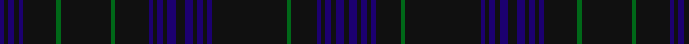

In pattern [BKBKBKGKGKBKBKBKBKBKBKKKGKBKBKBK](/patterns/bkbkbkgkgkbkbkbkbkbkbkkkgkbkbkbk/).

This was sourced from tartans-authority.  It is a [32 stripes tartan](/stripes/stripes32/).

Original link http://www.tartansauthority.com/tartan-ferret/display/2409/

## Thread count
DB/4 Kc4 DB6 K4 DB4 Kb32 G4 K48 G4 Kb32 DB4 K4 DB6 Kc4 DB8 Ka8 DB8 Kc4 DB6 K4 DB4 Ka24 K24 K24 G4 Kb24 DB4 K4 DB6 Kc4 DB8 Ka/4

## Palette
Each colour and its ΔE from the base-6 reference it is a variant of.

| Colour | Shade | Base | ΔE (OKLab) |
|---|---|---|---|
| DB | <code style="background-color:#1C0070;">#1C0070</code> `#1C0070` | B <code style="background-color:#2A418A;">#2A418A</code> | 0.14 |
| G | <code style="background-color:#006818;">#006818</code> `#006818` | G <code style="background-color:#006100;">#006100</code> | 0.02 |
| K | <code style="background-color:#101010;">#101010</code> `#101010` | K <code style="background-color:#000000;">#000000</code> | 0.17 |
| Ka | <code style="background-color:#101010;">#101010</code> `#101010` | K <code style="background-color:#000000;">#000000</code> | 0.17 |
| Kb | <code style="background-color:#101010;">#101010</code> `#101010` | K <code style="background-color:#000000;">#000000</code> | 0.17 |
| Kc | <code style="background-color:#101010;">#101010</code> `#101010` | K <code style="background-color:#000000;">#000000</code> | 0.17 |

## Nearest tartans

The nearest existing variants by ΔTartan distance.

1. [Cuillins of Skye Fashion Tartan Tartan Number: 8421. Earliest known date: pre 2011 Asymmetric. Designed by Duncan MacDonald and Helen Marshall of Marton Mills. Estimated Threadcount. See products available Copyright © Blair Urquhart, Comrie, 2015](/setts/s18/b19g2ga9g2gb19b2gb19g2ga9g2gc18ga9gc18g2ga9g2b19gd3~b622225-g45350d-ga334221-gb634929-gc1c321a-gd3d240a~x2/) — ΔT 2.94
1. [Phillips (Welsh Name)](/setts/s11/g2g35k30g3k30g2k4g2k30g20k2~g003820-k101010/) — ΔT 3.11
1. [Bute Heather, Modern](/setts/s11/b6w1ba18k6ba4k4bb8g1bb8k2b5~b141e46-ba282850-bb280032-g003c14-k101010-we0e0e0~x2/) — ΔT 3.14
1. [Van Ingelgem Htg (Personal)](/setts/s18/k3g18ga3g3ga3g3ga18gb3ga3gb3ga3gb12b2gb12ga9gb12g2b2~b2c2c80-g385024-ga503400-gb645434-k101010~x2/) — ΔT 3.19
1. [RAF Kinloss](/setts/s24/b5ba6b8bb50b4bb4b4k8bb8b44r4b10r4b44bb8k8b4bb4b4bb50b8g6b5y4~b32446c-ba041273-bb4f5670-g045d47-k101010-r75042f-ydba600/) — ΔT 3.31
1. [Spirit of Wales](/setts/s18/b24k2ba1b2ba1k2ba22bb2ba4bb2ba22k2ba1b2ba1k2b24w2~b202060-ba14283c-bb780078-k101010-we0e0e0~x2/) — ΔT 3.36
1. [LS Curling (Corporate)](/setts/s18/b2b4k2ba25k4ba2k4ba10b4ba2b4ba11k2ba2k24b4k2b2~b2c2c80-ba1c0070-k101010~x2/) — ΔT 3.48
1. [Rendell, Charles](/setts/s17/k2g2ka1g2ka1g2ka1g12b4k3b3k3b3k3b4ba24r2~b1a2b47-ba3d2e60-g052f14-k1c1714-ka000000-ra20d22~x2/) — ΔT 3.49
1. [Van Ingelgem Hunting (Personal)](/setts/s18/k3g18ga3g3ga3g3ga18gb3ga3gb3ga3gb12b2gb12ga9gb12g2b2~b444847-g69674d-ga21412d-gb716044-k101010~x2/) — ΔT 3.56
1. [Bruma](/setts/s13/r2b1k1b10r1b10k13ba4k1ba11g9ba2y1~b4c3428-ba505050-g503c14-k1c1714-r880000-yb0b0b0~x2/) — ΔT 3.62

## Neighbour map

Every grey dot is one of 15726 variants placed by the first two principal components of the ΔTartan feature space (44% of its variance). Red is this tartan; blue dots are its nearest — click one to open its page.

<svg viewBox="0 0 640 380" role="img" style="max-width:100%;height:auto;border:1px solid #e0e0e0;border-radius:4px;display:block" xmlns="http://www.w3.org/2000/svg"><image href="/nn/cloud.v1.png" width="640" height="380"/><a href="/setts/s18/b19g2ga9g2gb19b2gb19g2ga9g2gc18ga9gc18g2ga9g2b19gd3~b622225-g45350d-ga334221-gb634929-gc1c321a-gd3d240a~x2/"><circle cx="278.8" cy="227.1" r="4" fill="#3465a4"><title>Cuillins of Skye Fashion Tartan Tartan Number: 8421. Earliest known date: pre 2011 Asymmetric. Designed by Duncan MacDonald and Helen Marshall of Marton Mills. Estimated Threadcount. See products available Copyright © Blair Urquhart, Comrie, 2015</title></circle></a><a href="/setts/s11/g2g35k30g3k30g2k4g2k30g20k2~g003820-k101010/"><circle cx="435.4" cy="248.5" r="4" fill="#3465a4"><title>Phillips (Welsh Name)</title></circle></a><a href="/setts/s11/b6w1ba18k6ba4k4bb8g1bb8k2b5~b141e46-ba282850-bb280032-g003c14-k101010-we0e0e0~x2/"><circle cx="290.7" cy="205.3" r="4" fill="#3465a4"><title>Bute Heather, Modern</title></circle></a><a href="/setts/s18/k3g18ga3g3ga3g3ga18gb3ga3gb3ga3gb12b2gb12ga9gb12g2b2~b2c2c80-g385024-ga503400-gb645434-k101010~x2/"><circle cx="354.6" cy="234.5" r="4" fill="#3465a4"><title>Van Ingelgem Htg (Personal)</title></circle></a><a href="/setts/s24/b5ba6b8bb50b4bb4b4k8bb8b44r4b10r4b44bb8k8b4bb4b4bb50b8g6b5y4~b32446c-ba041273-bb4f5670-g045d47-k101010-r75042f-ydba600/"><circle cx="367.8" cy="143.3" r="4" fill="#3465a4"><title>RAF Kinloss</title></circle></a><a href="/setts/s18/b24k2ba1b2ba1k2ba22bb2ba4bb2ba22k2ba1b2ba1k2b24w2~b202060-ba14283c-bb780078-k101010-we0e0e0~x2/"><circle cx="426.6" cy="161.1" r="4" fill="#3465a4"><title>Spirit of Wales</title></circle></a><a href="/setts/s18/b2b4k2ba25k4ba2k4ba10b4ba2b4ba11k2ba2k24b4k2b2~b2c2c80-ba1c0070-k101010~x2/"><circle cx="321.3" cy="187.4" r="4" fill="#3465a4"><title>LS Curling (Corporate)</title></circle></a><a href="/setts/s17/k2g2ka1g2ka1g2ka1g12b4k3b3k3b3k3b4ba24r2~b1a2b47-ba3d2e60-g052f14-k1c1714-ka000000-ra20d22~x2/"><circle cx="300.0" cy="133.0" r="4" fill="#3465a4"><title>Rendell, Charles</title></circle></a><a href="/setts/s18/k3g18ga3g3ga3g3ga18gb3ga3gb3ga3gb12b2gb12ga9gb12g2b2~b444847-g69674d-ga21412d-gb716044-k101010~x2/"><circle cx="311.2" cy="216.9" r="4" fill="#3465a4"><title>Van Ingelgem Hunting (Personal)</title></circle></a><a href="/setts/s13/r2b1k1b10r1b10k13ba4k1ba11g9ba2y1~b4c3428-ba505050-g503c14-k1c1714-r880000-yb0b0b0~x2/"><circle cx="262.2" cy="189.4" r="4" fill="#3465a4"><title>Bruma</title></circle></a><circle cx="303.8" cy="175.3" r="5" fill="#c00000"/></svg>

ID: /setts/s32/b2k2b3k2b2k16g2k24g2k16b2k2b3k2b4k4b4k2b3k2b2k12k12k12g2k12b2k2b3k2b4k2~b1c0070-g006818-k101010~x2/
