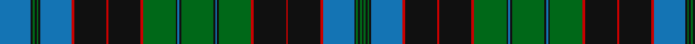

In pattern [BKGKGKBRKRKRGKBKGKBKGRKRKRBKGKGK](/patterns/bkgkgkbrkrkrgkbkgkbkgrkrkrbkgkgk/).

This was sourced from register-of-tartans.  It is a [32 stripes tartan](/stripes/stripes32/).

Original link https://www.tartanregister.gov.uk/tartanDetails.aspx?ref=3937

## Attestations

This cloth appears in 2 source records; the oldest owns this page.

- 01/01/1819 — Stewart of Bute (register-of-tartans, [record](https://www.tartanregister.gov.uk/tartanDetails.aspx?ref=3937))
- 1819 — Stewart of Bute - 1963 (Clan) (tartans-authority, [record](http://www.tartansauthority.com/tartan-ferret/display/5989/))

## Thread count
B/66 K4 G4 K4 G4 K4 B66 R6 K68 R4 K68 R6 G68 K4 B4 K4 G68 K4 B4 K4 G68 R6 K68 R4 K68 R6 B66 K4 G4 K4 G4 K/4

## Palette
Each colour and its ΔE from the base-6 reference it is a variant of.

| Colour | Shade | Base | ΔE (OKLab) |
|---|---|---|---|
| B | <code style="background-color:#1474B4;">#1474B4</code> `#1474B4` | B <code style="background-color:#2A418A;">#2A418A</code> | 0.15 |
| DB | <code style="background-color:#202060;">#202060</code> `#202060` | B <code style="background-color:#2A418A;">#2A418A</code> | 0.11 |
| DBa | <code style="background-color:#2C2C80;">#2C2C80</code> `#2C2C80` | B <code style="background-color:#2A418A;">#2A418A</code> | 0.06 |
| DG | <code style="background-color:#003820;">#003820</code> `#003820` | G <code style="background-color:#006100;">#006100</code> | 0.15 |
| G | <code style="background-color:#006818;">#006818</code> `#006818` | G <code style="background-color:#006100;">#006100</code> | 0.02 |
| Ga | <code style="background-color:#289C18;">#289C18</code> `#289C18` | G <code style="background-color:#006100;">#006100</code> | 0.19 |
| K | <code style="background-color:#101010;">#101010</code> `#101010` | K <code style="background-color:#000000;">#000000</code> | 0.17 |
| R | <code style="background-color:#C80000;">#C80000</code> `#C80000` | R <code style="background-color:#CC0000;">#CC0000</code> | 0.01 |

## Nearest tartans

The nearest existing variants by ΔTartan distance.

1. [Norwich No.023](/setts/s26/g2r2b1ba16r2g6r2b1ba6r2g16r2b1ba2b1r2g16r2ba6b1r2g6r2ba16b1r2~b5c8ca8-ba2c2c80-g006818-rc80000~x2/) — ΔT 1.14
1. [Scottish Tourist Board (1981)](/setts/s20/b30k2b2k2b2k32g15r2g4r4g30r4g4r2g15k32b2k2b2k2~b2c2c80-g006818-k101010-rc80000~x2/) — ΔT 1.20
1. [Sutherland](/setts/s22/g6w2g24k12b3k2b2k2b12r1b1r3b1r1b12k2b2k2b3k12g24w2~b2c2c80-g006818-k101010-rc80000-wfcfcfc~x2/) — ΔT 1.27
1. [Duchess of Albany Family Tartan Tartan Number: 1378. Earliest known date: 1880 'Clan Originaux' was published in Paris in 1880 by J. Claude Fres Et Cie. It contains the earliest known record of a number of Irish tartans and many variations of Scottish Clan tartans. The only copy known to exist was discovered recently in America and is now in the possession of Pendleton Mills in Portland, Oregon. See products available Copyright © Blair Urquhart, Comrie, 2015](/setts/s27/r2b14k8g2k1g2k1g4k1g2k1g2b4g2b4g2k1g2k1g4k1g2k1g2k8b14y2~b2c2c80-g006818-k101010-rc80000-ye8c000~x2/) — ΔT 1.29
1. [Gordon Clan](/setts/s28/b23k3b3k3b3k17g22k2y4k2g22k17b22k3b3k3b22k17g22k2y4k2g22k17b3k3b3k3~b2c2c80-g006818-k101010-ye8c000~x2/) — ΔT 1.29
1. [Park Clan/Family Weavers Tartan Tartan Number: 2387. Earliest known date: September 1996 William D. Park wished to have a tartan for himself and family. Can be worn by those of the same name. See products available Copyright © Blair Urquhart, Comrie, 2015](/setts/s22/g3r2g3r4g34k2g2k2g4k16b16r3b16k16g4k2g2k2g34r4g3r2~b2c2c80-g006818-k101010-rc80000~x2/) — ΔT 1.37
1. [Rankine](/setts/s23/b15k1b1k1b1k12g9r1g9k1w1k1g9r1g9k12r1b9r2b1r1b6w1~b2c2c80-g006818-k101010-rc80000-we0e0e0~x2/) — ΔT 1.40
1. [Buchan Cumming MacIntyre District Tartan Tartan Number: 1991. Earliest known date: 1790 Also MacIntyre and Glenorchy. Adopted by the Buchan family around 1965, on account of their long association with the Cummings which began with the marriage of Margaret, daughter of King Edgar, to William Coymen, sheriff of Forfar in 1210. The name, Buchan, though a family name, is territorial in origin. The sett is asymmetrical. There is a sample in the collection of the Highland Society of London, housed in the National Museums of Scotland, Edinburgh. See products available Copyright © Blair Urquhart, Comrie, 2015](/setts/s23/r6g6r2k24r2b2k2r2k24r2g6r6b2k6r2g27r2k2r2g27r2k6b2~b2c2c80-g006818-k101010-rc80000~x2/) — ΔT 1.41
1. [Duchess of Albany](/setts/s27/r2b14k8g2k1g2k1g4k1g2k1g2b4g2b4g2k1g2k1g4k1g2k1g2k8b14y2~b304080-g008000-k000000-rc00000-yf0c000~x2/) — ΔT 1.41
1. [Buchan](/setts/s23/r6g6r2k24r2b2k2r2k24r2g6r6b2k6r2g27r2k2r2g27r2k6b2~b2c2c80-g006818-k101010-ra00000~x2/) — ΔT 1.42

## Neighbour map

Every grey dot is one of 15726 variants placed by the first two principal components of the ΔTartan feature space (44% of its variance). Red is this tartan; blue dots are its nearest — click one to open its page.

<svg viewBox="0 0 640 380" role="img" style="max-width:100%;height:auto;border:1px solid #e0e0e0;border-radius:4px;display:block" xmlns="http://www.w3.org/2000/svg"><image href="/nn/cloud.v1.png" width="640" height="380"/><a href="/setts/s26/g2r2b1ba16r2g6r2b1ba6r2g16r2b1ba2b1r2g16r2ba6b1r2g6r2ba16b1r2~b5c8ca8-ba2c2c80-g006818-rc80000~x2/"><circle cx="241.6" cy="118.7" r="4" fill="#3465a4"><title>Norwich No.023</title></circle></a><a href="/setts/s20/b30k2b2k2b2k32g15r2g4r4g30r4g4r2g15k32b2k2b2k2~b2c2c80-g006818-k101010-rc80000~x2/"><circle cx="240.4" cy="131.9" r="4" fill="#3465a4"><title>Scottish Tourist Board (1981)</title></circle></a><a href="/setts/s22/g6w2g24k12b3k2b2k2b12r1b1r3b1r1b12k2b2k2b3k12g24w2~b2c2c80-g006818-k101010-rc80000-wfcfcfc~x2/"><circle cx="222.7" cy="92.6" r="4" fill="#3465a4"><title>Sutherland</title></circle></a><a href="/setts/s27/r2b14k8g2k1g2k1g4k1g2k1g2b4g2b4g2k1g2k1g4k1g2k1g2k8b14y2~b2c2c80-g006818-k101010-rc80000-ye8c000~x2/"><circle cx="208.9" cy="116.3" r="4" fill="#3465a4"><title>Duchess of Albany Family Tartan Tartan Number: 1378. Earliest known date: 1880 'Clan Originaux' was published in Paris in 1880 by J. Claude Fres Et Cie. It contains the earliest known record of a number of Irish tartans and many variations of Scottish Clan tartans. The only copy known to exist was discovered recently in America and is now in the possession of Pendleton Mills in Portland, Oregon. See products available Copyright © Blair Urquhart, Comrie, 2015</title></circle></a><a href="/setts/s28/b23k3b3k3b3k17g22k2y4k2g22k17b22k3b3k3b22k17g22k2y4k2g22k17b3k3b3k3~b2c2c80-g006818-k101010-ye8c000~x2/"><circle cx="185.0" cy="149.4" r="4" fill="#3465a4"><title>Gordon Clan</title></circle></a><a href="/setts/s22/g3r2g3r4g34k2g2k2g4k16b16r3b16k16g4k2g2k2g34r4g3r2~b2c2c80-g006818-k101010-rc80000~x2/"><circle cx="291.0" cy="125.3" r="4" fill="#3465a4"><title>Park Clan/Family Weavers Tartan Tartan Number: 2387. Earliest known date: September 1996 William D. Park wished to have a tartan for himself and family. Can be worn by those of the same name. See products available Copyright © Blair Urquhart, Comrie, 2015</title></circle></a><a href="/setts/s23/b15k1b1k1b1k12g9r1g9k1w1k1g9r1g9k12r1b9r2b1r1b6w1~b2c2c80-g006818-k101010-rc80000-we0e0e0~x2/"><circle cx="177.0" cy="118.6" r="4" fill="#3465a4"><title>Rankine</title></circle></a><a href="/setts/s23/r6g6r2k24r2b2k2r2k24r2g6r6b2k6r2g27r2k2r2g27r2k6b2~b2c2c80-g006818-k101010-rc80000~x2/"><circle cx="239.8" cy="123.9" r="4" fill="#3465a4"><title>Buchan Cumming MacIntyre District Tartan Tartan Number: 1991. Earliest known date: 1790 Also MacIntyre and Glenorchy. Adopted by the Buchan family around 1965, on account of their long association with the Cummings which began with the marriage of Margaret, daughter of King Edgar, to William Coymen, sheriff of Forfar in 1210. The name, Buchan, though a family name, is territorial in origin. The sett is asymmetrical. There is a sample in the collection of the Highland Society of London, housed in the National Museums of Scotland, Edinburgh. See products available Copyright © Blair Urquhart, Comrie, 2015</title></circle></a><a href="/setts/s27/r2b14k8g2k1g2k1g4k1g2k1g2b4g2b4g2k1g2k1g4k1g2k1g2k8b14y2~b304080-g008000-k000000-rc00000-yf0c000~x2/"><circle cx="167.1" cy="101.2" r="4" fill="#3465a4"><title>Duchess of Albany</title></circle></a><a href="/setts/s23/r6g6r2k24r2b2k2r2k24r2g6r6b2k6r2g27r2k2r2g27r2k6b2~b2c2c80-g006818-k101010-ra00000~x2/"><circle cx="251.7" cy="130.1" r="4" fill="#3465a4"><title>Buchan</title></circle></a><circle cx="225.8" cy="102.9" r="5" fill="#c00000"/></svg>

ID: /setts/s32/b33k2g2k2g2k2b33r3k34r2k34r3g34k2b2k2g34k2b2k2g34r3k34r2k34r3b33k2g2k2g2k2~b1474b4-g006818-k101010-rc80000~x2/
