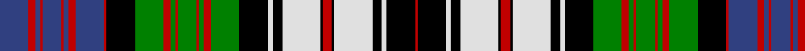

In pattern [BRBRBRBRBRKGRGRGRGRGKWKWKRKWKWKR](/stripes/brbrbrbrbrkgrgrgrgrgkwkwkrkwkwkr/).

This was sourced from weddslist.  It is a [32 stripe tartan](/stripes/stripes32/).

Original link http://www.weddslist.com/cgi-bin/tartans/pg.pl?source=sts

## Also known as

This cloth is also recorded under:

- MacDonald, dress

## Attestations

This cloth appears in 2 source records; the oldest owns this page.

- undated — MacDonald, dress (weddslist, [record](http://www.weddslist.com/cgi-bin/tartans/pg.pl?source=sts))
- undated — MacDonald Dress Clan Tartan Tartan Number: 1997. Earliest known date: 1906 Estimated count See products available Copyright © Blair Urquhart, Comrie, 2015 (house-of-tartan, [record](http://www.house-of-tartan.scotland.net/house/TartanViewjs.asp?colr=Def&tnam=1997))

## Thread count
B/24 R6 B4 R2 B16 R2 B4 R6 B24 R2 K24 G24 R6 G4 R2 G16 R2 G4 R6 G24 K24 LN4 K8 LN32 K2 R8 K2 LN32 K8 LN4 K24 R/2

## Palette
Each colour and the base-6 reference it is a variant of.

| Colour | Shade | Base |
|---|---|---|
| B | <code style="background-color:#304080;">#304080</code> `oklch(39.4% 0.109 270.2)` <small>#304080</small> | B <code style="background-color:#2A418A;">#2A418A</code> |
| G | <code style="background-color:#008000;">#008000</code> `oklch(52.0% 0.177 142.5)` <small>#008000</small> | G <code style="background-color:#006100;">#006100</code> |
| K | <code style="background-color:#000000;">#000000</code> `oklch(0.0% 0.000 0.0)` <small>#000000</small> | K <code style="background-color:#000000;">#000000</code> |
| LN | <code style="background-color:#E0E0E0;">#E0E0E0</code> `oklch(90.7% 0.000 89.9)` <small>#E0E0E0</small> | W <code style="background-color:#F7F7F7;">#F7F7F7</code> |
| R | <code style="background-color:#C00000;">#C00000</code> `oklch(50.7% 0.208 29.2)` <small>#C00000</small> | R <code style="background-color:#CC0000;">#CC0000</code> |

## Nearest tartans

The nearest existing variants by ΔTartan distance, with this tartan at the top so the swatches line up against it.

ΔTartan

Tartan

Sett

—

<a href="/ttd/edit/#slug=db12r3db2r1db8r1db2r3db12r1k12g12r3g2r1g8r1g2r3g12k12w2k4w16k1r4k1w16k4w2k12r1~x2">MacDonald, dress</a> <a class="nn-out" href="/setts/s32/db12r3db2r1db8r1db2r3db12r1k12g12r3g2r1g8r1g2r3g12k12w2k4w16k1r4k1w16k4w2k12r1~x2/" title="open its dictionary page">↗</a>

0.49

<a href="/ttd/edit/#slug=db12r3db2r1db8r1db2r3db12r1k12g12r3g2r1g8r1g2r3g12k12w2db4w16k1r4k1w16db4w2k12r1~x2">MacDonald Dress</a> <a class="nn-out" href="/setts/s32/db12r3db2r1db8r1db2r3db12r1k12g12r3g2r1g8r1g2r3g12k12w2db4w16k1r4k1w16db4w2k12r1~x2/" title="open its dictionary page">↗</a>

1.01

<a href="/ttd/edit/#slug=db18r7db2r2db7r2db2r7db18r2k18w8db7w40db2r8db2w40db7w8r2k18g18r7g2r2g6r2g2r7g18k18r2~x2">MacDonald, dress</a> <a class="nn-out" href="/setts/s33/db18r7db2r2db7r2db2r7db18r2k18w8db7w40db2r8db2w40db7w8r2k18g18r7g2r2g6r2g2r7g18k18r2~x2/" title="open its dictionary page">↗</a>

1.16

<a href="/ttd/edit/#slug=db4w52db5w5k26g25r6g28k25g3db26g6db25g3k27w50db4r4db4w50k27g3db25g6db26g3k25g28r6g25k26w5db5w52db4r4">Lauder Dress (Can)</a> <a class="nn-out" href="/setts/s36/db4w52db5w5k26g25r6g28k25g3db26g6db25g3k27w50db4r4db4w50k27g3db25g6db26g3k25g28r6g25k26w5db5w52db4r4/" title="open its dictionary page">↗</a>

1.17

<a href="/ttd/edit/#slug=w2db1w12db2w2k8db8k2db2k2db8k8g8k1ly2k1g8k8w2db2w12db1w2~x2">Gordon dress</a> <a class="nn-out" href="/setts/s23/w2db1w12db2w2k8db8k2db2k2db8k8g8k1ly2k1g8k8w2db2w12db1w2~x2/" title="open its dictionary page">↗</a>

1.19

<a href="/ttd/edit/#slug=r6g10r2k2r4k2r2g10r4k9r2k9ly2k3ly2k4w6k6t27r2k2r2t10r6~x2">Anderson 4</a> <a class="nn-out" href="/setts/s24/r6g10r2k2r4k2r2g10r4k9r2k9ly2k3ly2k4w6k6t27r2k2r2t10r6~x2/" title="open its dictionary page">↗</a>

1.24

<a href="/ttd/edit/#slug=db18r7db2r2db7r2db2r7db18r2k18w8db7w40db2r8db2w40db7w8r2k18dg18r7dg2r2dg6r2dg2r7dg18k18r2~x2">MacDonald Dress #2</a> <a class="nn-out" href="/setts/s33/db18r7db2r2db7r2db2r7db18r2k18w8db7w40db2r8db2w40db7w8r2k18dg18r7dg2r2dg6r2dg2r7dg18k18r2~x2/" title="open its dictionary page">↗</a>

1.30

<a href="/ttd/edit/#slug=w2db1w12db2w2k8dg8k1ly2k1dg8k8db8k2db2k2db8k8w2db2w12db1w2~x2">Gordon Dress (Original)</a> <a class="nn-out" href="/setts/s23/w2db1w12db2w2k8dg8k1ly2k1dg8k8db8k2db2k2db8k8w2db2w12db1w2~x2/" title="open its dictionary page">↗</a>

1.30

<a href="/ttd/edit/#slug=k15w3db3w18db2r2db2w19db3w3k15w2g13r2g14w2k15db10k2db2k2db10">Colquhoun, dress</a> <a class="nn-out" href="/setts/s22/k15w3db3w18db2r2db2w19db3w3k15w2g13r2g14w2k15db10k2db2k2db10/" title="open its dictionary page">↗</a>

1.31

<a href="/ttd/edit/#slug=k20g14k2ly4k2g14k10w6db6w18db3w4db3w18db6w6k10g14k2w4k2g14k12db12k2db6k2db12">Campbell of Loch Neil, dress</a> <a class="nn-out" href="/setts/s28/k20g14k2ly4k2g14k10w6db6w18db3w4db3w18db6w6k10g14k2w4k2g14k12db12k2db6k2db12/" title="open its dictionary page">↗</a>

1.34

<a href="/ttd/edit/#slug=k20dg14k2ly4k2dg14k10w6db6w18db3w4db3w18db6w6k10dg14k2w4k2dg14k12db12k2db6k2db12">Campbell of Loch Neil Dress</a> <a class="nn-out" href="/setts/s28/k20dg14k2ly4k2dg14k10w6db6w18db3w4db3w18db6w6k10dg14k2w4k2dg14k12db12k2db6k2db12/" title="open its dictionary page">↗</a>

## Neighbour map

Every grey dot is one of 14299 variants placed by the first two principal components of the ΔTartan feature space (44% of its variance). Red is this tartan; blue dots are its nearest — click one to open its page.

<svg viewBox="0 0 640 380" role="img" style="max-width:100%;height:auto;border:1px solid #e0e0e0;border-radius:4px;display:block" xmlns="http://www.w3.org/2000/svg"><image href="/nn/cloud.v1.png" width="640" height="380"/><a href="/setts/s32/db12r3db2r1db8r1db2r3db12r1k12g12r3g2r1g8r1g2r3g12k12w2db4w16k1r4k1w16db4w2k12r1~x2/"><circle cx="65.9" cy="82.7" r="4" fill="#3465a4"><title>MacDonald Dress</title></circle></a><a href="/setts/s33/db18r7db2r2db7r2db2r7db18r2k18w8db7w40db2r8db2w40db7w8r2k18g18r7g2r2g6r2g2r7g18k18r2~x2/"><circle cx="92.2" cy="53.6" r="4" fill="#3465a4"><title>MacDonald, dress</title></circle></a><a href="/setts/s36/db4w52db5w5k26g25r6g28k25g3db26g6db25g3k27w50db4r4db4w50k27g3db25g6db26g3k25g28r6g25k26w5db5w52db4r4/"><circle cx="92.2" cy="75.5" r="4" fill="#3465a4"><title>Lauder Dress (Can)</title></circle></a><a href="/setts/s23/w2db1w12db2w2k8db8k2db2k2db8k8g8k1ly2k1g8k8w2db2w12db1w2~x2/"><circle cx="71.8" cy="111.0" r="4" fill="#3465a4"><title>Gordon dress</title></circle></a><a href="/setts/s24/r6g10r2k2r4k2r2g10r4k9r2k9ly2k3ly2k4w6k6t27r2k2r2t10r6~x2/"><circle cx="65.5" cy="79.9" r="4" fill="#3465a4"><title>Anderson 4</title></circle></a><a href="/setts/s33/db18r7db2r2db7r2db2r7db18r2k18w8db7w40db2r8db2w40db7w8r2k18dg18r7dg2r2dg6r2dg2r7dg18k18r2~x2/"><circle cx="99.6" cy="55.1" r="4" fill="#3465a4"><title>MacDonald Dress #2</title></circle></a><a href="/setts/s23/w2db1w12db2w2k8dg8k1ly2k1dg8k8db8k2db2k2db8k8w2db2w12db1w2~x2/"><circle cx="80.1" cy="113.2" r="4" fill="#3465a4"><title>Gordon Dress (Original)</title></circle></a><a href="/setts/s22/k15w3db3w18db2r2db2w19db3w3k15w2g13r2g14w2k15db10k2db2k2db10/"><circle cx="68.3" cy="117.5" r="4" fill="#3465a4"><title>Colquhoun, dress</title></circle></a><a href="/setts/s28/k20g14k2ly4k2g14k10w6db6w18db3w4db3w18db6w6k10g14k2w4k2g14k12db12k2db6k2db12/"><circle cx="38.4" cy="123.4" r="4" fill="#3465a4"><title>Campbell of Loch Neil, dress</title></circle></a><a href="/setts/s28/k20dg14k2ly4k2dg14k10w6db6w18db3w4db3w18db6w6k10dg14k2w4k2dg14k12db12k2db6k2db12/"><circle cx="50.3" cy="127.6" r="4" fill="#3465a4"><title>Campbell of Loch Neil Dress</title></circle></a><circle cx="59.1" cy="79.1" r="5" fill="#c00000"/></svg>

ID: /setts/s32/db12r3db2r1db8r1db2r3db12r1k12g12r3g2r1g8r1g2r3g12k12w2k4w16k1r4k1w16k4w2k12r1~x2/
