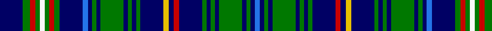

In pattern [BBGBGBGBGBRBYBGBGBGBGBBBGRGWGRGB](/stripes/bbgbgbgbgbrbybgbgbgbgbbbgrgwgrgb/).

This was sourced from register-of-tartans.  It is a [32 stripe tartan](/stripes/stripes32/).

Original link https://www.tartanregister.gov.uk/tartanDetails.aspx?ref=1244

## Also known as

This cloth is also recorded under:

- Franconian District Ger

## Attestations

This cloth appears in 3 source records; the oldest owns this page.

- 01/08/1997 — Franconian (register-of-tartans, [record](https://www.tartanregister.gov.uk/tartanDetails.aspx?ref=1244))
- Aug 1997 — Franconian (Corporate) (tartans-authority, [record](http://www.tartansauthority.com/tartan-ferret/display/2305/))
- undated — Franconian District Ger Tartan Tartan Number: 2305. Earliest known date: Aug 1997 August 1997. Designed by (or for?) the Highland Circle - a group of Malt Whisky drinkers in Franconia, Germany. Sample in STA's Johnston Collection + Lochcarron swatch. STS notes say designed by members of the Highland Circle and produced by Hugh MacPherson of Edinburgh. Blue & green lightened to show sett. See products available Copyright © Blair Urquhart, Comrie, 2015 (house-of-tartan, [record](http://www.house-of-tartan.scotland.net/house/TartanViewjs.asp?colr=Def&tnam=2305))

## Register references

External register numbers recorded for this tartan.

- Scottish Register of Tartans: [1244](https://www.tartanregister.gov.uk/tartanDetails.aspx?ref=1244)
- Scottish Tartans Authority (ITI): 2305
- Scottish Tartans World Register: 2305

## Thread count
DB/44 G14 R10 G8 W10 G8 R10 G10 DB44 B10 DB8 G8 DB8 G44 DB8 G8 DB8 G8 DB44 Y10 DB10 R10 DB44 G8 DB8 G8 DB8 G44 DB8 G8 DB8 B/10

## Palette
Each colour and its ΔE from the base-6 reference it is a variant of.

| Colour | Shade | Base | ΔE (OKLab) |
|---|---|---|---|
| B | <code style="background-color:#2474E8;">#2474E8</code> `#2474E8` | B <code style="background-color:#2A418A;">#2A418A</code> | 0.19 |
| DB | <code style="background-color:#000064;">#000064</code> `#000064` | B <code style="background-color:#2A418A;">#2A418A</code> | 0.18 |
| G | <code style="background-color:#007800;">#007800</code> `#007800` | G <code style="background-color:#006100;">#006100</code> | 0.07 |
| R | <code style="background-color:#C80000;">#C80000</code> `#C80000` | R <code style="background-color:#CC0000;">#CC0000</code> | 0.01 |
| W | <code style="background-color:#F8F8F8;">#F8F8F8</code> `#F8F8F8` | W <code style="background-color:#F7F7F7;">#F7F7F7</code> | 0.00 |
| Y | <code style="background-color:#E8C000;">#E8C000</code> `#E8C000` | Y <code style="background-color:#F2BF00;">#F2BF00</code> | 0.02 |

## Nearest tartans

The nearest existing variants by ΔTartan distance.

1. [Franconian](/setts/s32/k23db5k5g5k5g25db5g5k5g5k23r5k5ly5k23g5k5g5k5g25k5g5k5db5k23g7r5g5w5g5r5g7~x2/) — ΔT 1.24
1. [United Services Planning Association](/setts/s20/db20r2db12g6lb2g4b4g4lb2g16lb2g4b4g4lb2g6db12r2db20ly3~x2/) — ΔT 1.48
1. [Dow-Aerlift (Name)](/setts/s22/p14dg2p2dg14k2dg14k2dg2k9r2k8lo2k9dg2k2dg14k2dg14p2dg2p14w2~x2/) — ΔT 1.57
1. [Campbell of Argyll #2](/setts/s28/k1b8k8g8k1w2k1g8k8b1k1b1k1b8k1b1k1b1k8g8k1ly2k1g8k8b8k1b1~x2/) — ΔT 1.74
1. [Johnston Dress (Dalgleish)](/setts/s34/k3db3k3db18g20k3g3ly3g3k3g20lb3db3lb3db3lb12db3lb3~x2/) — ΔT 1.80
1. [Stephenson Hunting #2](/setts/s30/r2k1b9k9g9k1w1k2w1k1g9b9k9b9k1g2~x4/) — ΔT 1.84
1. [Hunter of Hunterston](/setts/s20/g4r2g14w2db14r2db14g14db2g5db2g14db14r2db14w2g14r2g4ly3~x2/) — ΔT 1.85
1. [Recovery hunting](/setts/s48/k1g8k1ly1k1g8k1k1k1k1k1k1k1k8w1k2w1k8k1k1k1k1k1k1k1g8k1r1k1g8k1k1k1k1k1k1k1k8w1k2w1k8k1k1k1k1k1k1~x4/) — ΔT 1.88
1. [Scottish American Military](/setts/s25/db11k2r2w2b2k16g16k2g16k16db16r2w2b2db16k16g16k2g16k16r2w2b2k2db11~x2/) — ΔT 1.90
1. [Allen, Christopher Holler](/setts/s21/g2r2g12k4db11r2db11k4db2k9db2k9db2k4db11ly2db11k4g12r2g2~x2/) — ΔT 1.90

## Neighbour map

Every grey dot is one of 14299 variants placed by the first two principal components of the ΔTartan feature space (44% of its variance). Red is this tartan; blue dots are its nearest — click one to open its page.

<svg viewBox="0 0 640 380" role="img" style="max-width:100%;height:auto;border:1px solid #e0e0e0;border-radius:4px;display:block" xmlns="http://www.w3.org/2000/svg"><image href="/nn/cloud.v1.png" width="640" height="380"/><a href="/setts/s32/k23db5k5g5k5g25db5g5k5g5k23r5k5ly5k23g5k5g5k5g25k5g5k5db5k23g7r5g5w5g5r5g7~x2/"><circle cx="125.8" cy="121.4" r="4" fill="#3465a4"><title>Franconian</title></circle></a><a href="/setts/s20/db20r2db12g6lb2g4b4g4lb2g16lb2g4b4g4lb2g6db12r2db20ly3~x2/"><circle cx="192.6" cy="130.1" r="4" fill="#3465a4"><title>United Services Planning Association</title></circle></a><a href="/setts/s22/p14dg2p2dg14k2dg14k2dg2k9r2k8lo2k9dg2k2dg14k2dg14p2dg2p14w2~x2/"><circle cx="175.2" cy="144.8" r="4" fill="#3465a4"><title>Dow-Aerlift (Name)</title></circle></a><a href="/setts/s28/k1b8k8g8k1w2k1g8k8b1k1b1k1b8k1b1k1b1k8g8k1ly2k1g8k8b8k1b1~x2/"><circle cx="148.6" cy="142.0" r="4" fill="#3465a4"><title>Campbell of Argyll #2</title></circle></a><a href="/setts/s34/k3db3k3db18g20k3g3ly3g3k3g20lb3db3lb3db3lb12db3lb3~x2/"><circle cx="126.2" cy="116.1" r="4" fill="#3465a4"><title>Johnston Dress (Dalgleish)</title></circle></a><a href="/setts/s30/r2k1b9k9g9k1w1k2w1k1g9b9k9b9k1g2~x4/"><circle cx="135.4" cy="141.1" r="4" fill="#3465a4"><title>Stephenson Hunting #2</title></circle></a><a href="/setts/s20/g4r2g14w2db14r2db14g14db2g5db2g14db14r2db14w2g14r2g4ly3~x2/"><circle cx="205.7" cy="169.3" r="4" fill="#3465a4"><title>Hunter of Hunterston</title></circle></a><a href="/setts/s48/k1g8k1ly1k1g8k1k1k1k1k1k1k1k8w1k2w1k8k1k1k1k1k1k1k1g8k1r1k1g8k1k1k1k1k1k1k1k8w1k2w1k8k1k1k1k1k1k1~x4/"><circle cx="149.0" cy="80.5" r="4" fill="#3465a4"><title>Recovery hunting</title></circle></a><a href="/setts/s25/db11k2r2w2b2k16g16k2g16k16db16r2w2b2db16k16g16k2g16k16r2w2b2k2db11~x2/"><circle cx="101.9" cy="138.6" r="4" fill="#3465a4"><title>Scottish American Military</title></circle></a><a href="/setts/s21/g2r2g12k4db11r2db11k4db2k9db2k9db2k4db11ly2db11k4g12r2g2~x2/"><circle cx="124.0" cy="170.8" r="4" fill="#3465a4"><title>Allen, Christopher Holler</title></circle></a><circle cx="164.2" cy="130.6" r="5" fill="#c00000"/></svg>

ID: /setts/s32/db22g7r5g4w5g4r5g5db22b5db4g4db4g22db4g4db4g4db22ly5db5r5db22g4db4g4db4g22db4g4db4b5~x2/
