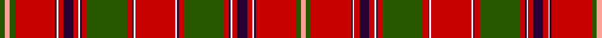

**Bands:** [GYGRBWRBRWBRGRBWRWBRGRBWRBRWBRGY](/stripes/gygrbwrbrwbrgrbwrwbrgrbwrbrwbrgy/) · **Stripes:** [DG LR DG R DP W R DP R W DP R DG R DP W R W DP R DG R DP W R DP R W DP R DG LR](/stripes/stripes32/) DG LR DG R DP W R DP R W DP R DG R DP W R W DP R DG R DP W R DP R W DP R DG LR

This was sourced from register-of-tartans.  It is a [32 band tartan](/bands/bands32/).

Original link https://www.tartanregister.gov.uk/tartanDetails.aspx?ref=1983

## Register references

External register numbers recorded for this tartan.

- Scottish Register of Tartans: [1983](https://www.tartanregister.gov.uk/tartanDetails.aspx?ref=1983)
- Scottish Tartans Authority (ITI): 5353

## Thread count
Ga/12 LR12 Ga12 R96 DP4 W4 R12 DP24 R12 W4 DP4 R12 Ga96 R12 DP4 W4 R96 W4 DP4 R12 Ga96 R12 DP4 W4 R12 DP24 R12 W4 DP4 R96 Ga12 LR/12

## Palette
Each colour and its ΔE from the base-6 reference it is a variant of.

| Colour | Shade | Base | ΔE (OKLab) |
|---|---|---|---|
| DP | <code style="background-color:#280034;">#280034</code> `#280034` | B <code style="background-color:#2A418A;">#2A418A</code> | 0.22 |
| G | <code style="background-color:#006818;">#006818</code> `#006818` | G <code style="background-color:#006100;">#006100</code> | 0.02 |
| Ga | <code style="background-color:#285800;">#285800</code> `#285800` | G <code style="background-color:#006100;">#006100</code> | 0.03 |
| LR | <code style="background-color:#FCA098;">#FCA098</code> `#FCA098` | Y <code style="background-color:#F2BF00;">#F2BF00</code> | 0.16 |
| N | <code style="background-color:#C8C8C8;">#C8C8C8</code> `#C8C8C8` | W <code style="background-color:#F7F7F7;">#F7F7F7</code> | 0.14 |
| R | <code style="background-color:#C80000;">#C80000</code> `#C80000` | R <code style="background-color:#CC0000;">#CC0000</code> | 0.01 |
| W | <code style="background-color:#F8F8F8;">#F8F8F8</code> `#F8F8F8` | W <code style="background-color:#F7F7F7;">#F7F7F7</code> | 0.00 |

## Nearest tartans

The nearest existing variants by ΔTartan distance.

1. [MacDougall - 1970 (H of E)](/setts/s27/r5g10r2db2r30dp3r2w1r2dp3r30db2r2g10r10g10dp4r2dp4db10r4g2r4g30r2dp3w1~x2/) — ΔT 0.91
1. [MacDougall Clan Tartan Tartan Number: 1519. Earliest known date: 1815-16 The earliest reference to the MacDougall tartan is in the collection of the Highland Society of London where a sample exists, signed and sealed by the Clan Chief around 1815. The sett is a complex one and the nearest count to the present day day tartan comes from a sample in Paton's collection housed at the Scottish Tartans Museum, and dating to about 1830. The Highland Society also have a sample certified by the Chief MacDougall of MacDougall dated 1906, in their archives store at the Royal Caledonian School near London. See products available Copyright © Blair Urquhart, Comrie, 2015](/setts/s27/r5g10r2db2r30lr3r2w1r2lr3r30db2r2g10r10g10lr4r2lr4db10r4g2r4g30r2lr3w1~x2/) — ΔT 0.96
1. [MacDougall 9](/setts/s27/r5g10r2db2r30p3r2w1r2p3r30db2r2g10r10g10p4r2p4db10r4g2r4g30r2p3w1~x2/) — ΔT 0.97
1. [MacDougal](/setts/s26/g10r2db2r30dp3r2w1r2dp3r30db2r2g10r10g10dp4r2dp4db10r4g2r4g30r2dp3w1~x2/) — ΔT 0.99
1. [Hebrides North Uist](/setts/s46/db5r3w2db1w2r3g9ly2w1ly2g9r1g1r27db1r1db1r27db1r1db9w1db1w4db1w1db9r1db1r27db1r1db1r27g1r1g9ly2w1ly2g9r3w2db1w2r3~x2/) — ΔT 0.99
1. [Confrerie de Vouvray Corporate Tartan Tartan Number: 5802. Earliest known date: 2003 The Confrerie de Vouvray tartan was created for the French Order of Wine Growers by the Chevaliers Ecossais de la Chantepleure de Vouvray. The red, yellow and maroon are the colours of the french order and the grid pattern of green lines depict the rows of vines of the Chenin Blanc grape. The tartan was presented as a gift to the Grand Council at the 2nd Scottish Confrerie, held in Dundee in May 2003. See products available Copyright © Blair Urquhart, Comrie, 2015](/setts/s34/dt6r3ly14r3r15ly3r15dt5r3g1r3g1r3g1r3g1r3g1r3g1r3g1r3g1r3g1r3dt5r15ly3r19r3ly14r3~x2/) — ΔT 1.02
1. [All Irish Red Irish District Tartan Tartan Number: 4067. Earliest known date: 1997 Part of a collection produced by Lochcarron in 1997 to acknowledge the early historical and cultural links between the Scots and Irish. Lochcarron sample. See products available Copyright © Blair Urquhart, Comrie, 2015](/setts/s28/r6y2db2r30g2r2g4r2g2r1g20r1y2db2r4db2y2r1g20r1g2r2g4r2g2r30db2y2~x2/) — ΔT 1.04
1. [Unidentified Scarlett #3](/setts/s34/r3k18r2g3r2k2r20g2ly1g2r2k18r2k2r20g3w1r3k18r2g3r2k2r20g2ly1g2r2k18r2g2r20g3w1~x2/) — ΔT 1.08
1. [Hebridean, North Uist](/setts/s24/db5r3w2db1w2r3g9ly2w1ly2g9r1g1r27db1r1db1r27db1r1db9w1db1w4~x2/) — ΔT 1.09
1. [MacDougall, Plaid](/setts/s24/db3p12w6r6g46r14g6r14db14p8w6r6w6p8g12r16g12r6db6r86p10w6r10db3/) — ΔT 1.10

## Neighbour map

Every grey dot is one of 14313 variants placed by the first two principal components of the ΔTartan feature space (44% of its variance). Red is this tartan; blue dots are its nearest — click one to open its page.

<svg viewBox="0 0 640 380" role="img" style="max-width:100%;height:auto;border:1px solid #e0e0e0;border-radius:4px;display:block" xmlns="http://www.w3.org/2000/svg"><image href="/nn/cloud.v1.png" width="640" height="380"/><a href="/setts/s27/r5g10r2db2r30dp3r2w1r2dp3r30db2r2g10r10g10dp4r2dp4db10r4g2r4g30r2dp3w1~x2/"><circle cx="308.3" cy="62.3" r="4" fill="#3465a4"><title>MacDougall - 1970 (H of E)</title></circle></a><a href="/setts/s27/r5g10r2db2r30lr3r2w1r2lr3r30db2r2g10r10g10lr4r2lr4db10r4g2r4g30r2lr3w1~x2/"><circle cx="307.0" cy="61.4" r="4" fill="#3465a4"><title>MacDougall Clan Tartan Tartan Number: 1519. Earliest known date: 1815-16 The earliest reference to the MacDougall tartan is in the collection of the Highland Society of London where a sample exists, signed and sealed by the Clan Chief around 1815. The sett is a complex one and the nearest count to the present day day tartan comes from a sample in Paton's collection housed at the Scottish Tartans Museum, and dating to about 1830. The Highland Society also have a sample certified by the Chief MacDougall of MacDougall dated 1906, in their archives store at the Royal Caledonian School near London. See products available Copyright © Blair Urquhart, Comrie, 2015</title></circle></a><a href="/setts/s27/r5g10r2db2r30p3r2w1r2p3r30db2r2g10r10g10p4r2p4db10r4g2r4g30r2p3w1~x2/"><circle cx="306.7" cy="62.1" r="4" fill="#3465a4"><title>MacDougall 9</title></circle></a><a href="/setts/s26/g10r2db2r30dp3r2w1r2dp3r30db2r2g10r10g10dp4r2dp4db10r4g2r4g30r2dp3w1~x2/"><circle cx="301.7" cy="63.4" r="4" fill="#3465a4"><title>MacDougal</title></circle></a><a href="/setts/s46/db5r3w2db1w2r3g9ly2w1ly2g9r1g1r27db1r1db1r27db1r1db9w1db1w4db1w1db9r1db1r27db1r1db1r27g1r1g9ly2w1ly2g9r3w2db1w2r3~x2/"><circle cx="316.0" cy="14.0" r="4" fill="#3465a4"><title>Hebrides North Uist</title></circle></a><a href="/setts/s34/dt6r3ly14r3r15ly3r15dt5r3g1r3g1r3g1r3g1r3g1r3g1r3g1r3g1r3g1r3dt5r15ly3r19r3ly14r3~x2/"><circle cx="284.8" cy="67.5" r="4" fill="#3465a4"><title>Confrerie de Vouvray Corporate Tartan Tartan Number: 5802. Earliest known date: 2003 The Confrerie de Vouvray tartan was created for the French Order of Wine Growers by the Chevaliers Ecossais de la Chantepleure de Vouvray. The red, yellow and maroon are the colours of the french order and the grid pattern of green lines depict the rows of vines of the Chenin Blanc grape. The tartan was presented as a gift to the Grand Council at the 2nd Scottish Confrerie, held in Dundee in May 2003. See products available Copyright © Blair Urquhart, Comrie, 2015</title></circle></a><a href="/setts/s28/r6y2db2r30g2r2g4r2g2r1g20r1y2db2r4db2y2r1g20r1g2r2g4r2g2r30db2y2~x2/"><circle cx="341.7" cy="50.3" r="4" fill="#3465a4"><title>All Irish Red Irish District Tartan Tartan Number: 4067. Earliest known date: 1997 Part of a collection produced by Lochcarron in 1997 to acknowledge the early historical and cultural links between the Scots and Irish. Lochcarron sample. See products available Copyright © Blair Urquhart, Comrie, 2015</title></circle></a><a href="/setts/s34/r3k18r2g3r2k2r20g2ly1g2r2k18r2k2r20g3w1r3k18r2g3r2k2r20g2ly1g2r2k18r2g2r20g3w1~x2/"><circle cx="275.5" cy="60.0" r="4" fill="#3465a4"><title>Unidentified Scarlett #3</title></circle></a><a href="/setts/s24/db5r3w2db1w2r3g9ly2w1ly2g9r1g1r27db1r1db1r27db1r1db9w1db1w4~x2/"><circle cx="297.8" cy="37.4" r="4" fill="#3465a4"><title>Hebridean, North Uist</title></circle></a><a href="/setts/s24/db3p12w6r6g46r14g6r14db14p8w6r6w6p8g12r16g12r6db6r86p10w6r10db3/"><circle cx="277.2" cy="54.4" r="4" fill="#3465a4"><title>MacDougall, Plaid</title></circle></a><circle cx="306.2" cy="45.3" r="5" fill="#c00000"/></svg>

ID: /setts/s32/dg3lr3dg3r24dp1w1r3dp6r3w1dp1r3dg24r3dp1w1r24w1dp1r3dg24r3dp1w1r3dp6r3w1dp1r24dg3lr3~x4/
