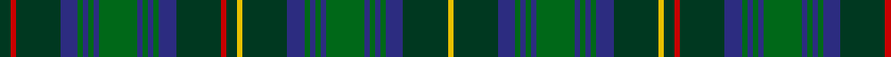

In pattern [GRGBGBGBGBGBGBGRGYGBGBGBGBGBGBGY](/patterns/grgbgbgbgbgbgbgrgygbgbgbgbgbgbgy/).

This was sourced from house-of-tartan.  It is a [32 stripes tartan](/stripes/stripes32/).

Original link http://www.house-of-tartan.scotland.net/house/TartanViewjs.asp?colr=Def&tnam=2179

## Thread count
DG/10 R5 DG42 DB16 G5 DB5 G5 DB5 G36 DB5 G5 DB5 G5 DB16 DG42 R5 DG10 Y5 DG42 DB16 G5 DB5 G5 DB5 G36 DB5 G5 DB5 G5 DB16 DG42 Y/5

## Palette
Each colour and its ΔE from the base-6 reference it is a variant of.

| Colour | Shade | Base | ΔE (OKLab) |
|---|---|---|---|
| DB | <code style="background-color:#2C2C80;">#2C2C80</code> `#2C2C80` | B <code style="background-color:#2A418A;">#2A418A</code> | 0.06 |
| DG | <code style="background-color:#003820;">#003820</code> `#003820` | G <code style="background-color:#006100;">#006100</code> | 0.15 |
| G | <code style="background-color:#006818;">#006818</code> `#006818` | G <code style="background-color:#006100;">#006100</code> | 0.02 |
| R | <code style="background-color:#C80000;">#C80000</code> `#C80000` | R <code style="background-color:#CC0000;">#CC0000</code> | 0.01 |
| Y | <code style="background-color:#E8C000;">#E8C000</code> `#E8C000` | Y <code style="background-color:#F2BF00;">#F2BF00</code> | 0.02 |

## Nearest tartans

The nearest existing variants by ΔTartan distance.

1. [Killen (Name)](/setts/s26/g8k1w2k1b8k8g1k1g1k1g8k1g1k1g1k8b8k1r2b1r2k1b8g8k1g5~b003c64-g006c40-k101010-r800000-we0e0e0~x2/) — ΔT 1.19
1. [Broun Hunting (Personal?)](/setts/s29/b16k3b3k3b3k16g15k1ba3k1g15k16b15k3b3k3b15k16g15k1y3k1g15k16b3k3b3k3b3~b14283c-ba5c8ca8-g006818-k101010-yb8b8b8~x4/) — ΔT 1.38
1. [Stuart/Stewart Hunting #3](/setts/s26/b8g2b8k2b2k2b2k4g11r2g11k4g2k9g2k9g2k4g11y2g11k4b2k2b2k4~b2c4084-g005020-k101010-rdc0000-ye8c000~x2/) — ΔT 1.41
1. [Pennsylvania (District)](/setts/s19/b30y2b2y2b5g5k15b5g20r2k3r2g20b5k15g5b20y2b2~b083c60-g006818-k101010-r880000-yb09400~x2/) — ΔT 1.42
1. [MacKenzie (Vestiarium Scoticum)](/setts/s24/b18k2b2k2b2k6g18w2g18k6b18k1b4k1b18k6g18r2g18k6b2k2b2k2~b2c4084-g005020-k101010-rdc0000-we0e0e0~x2/) — ΔT 1.49
1. [Wacker](/setts/s20/b6k3b3ba13g13k1g13ba13w1b3k3b3w1ba13g13k1g13ba13b3k3~b2c2c80-ba003c64-g006818-k101010-we0e0e0~x2/) — ΔT 1.56
1. [MacEwen (Clans Originaux)](/setts/s28/k1g6k6b1k1b1k1b7k1b1k1b1k6g6k1r1k1g6k6b6k1b1k1b6k6g6k1y1~b2c2c80-g006818-k101010-rc80000-yd8b000~x4/) — ΔT 1.58
1. [Stewart Hunting](/setts/s26/b9g4b9k3b3k3b3k8g27r4g27k8g5k13g4k13g5k8g27y4g27k8b3k3b3k3~b2c2c80-g285800-k101010-rc80000-ye8c000/) — ΔT 1.59
1. [Duchess of Albany](/setts/s27/r2b24k16g3k2g2k2g12k2g2k2g3b8g2b8g3k2g2k2g12k2g2k2g3k16b22y2~b2c2c80-g006818-k101010-rc80000-yd09800~x2/) — ΔT 1.60
1. [Campbell of Argyll](/setts/s28/k16g8k1y2k1g8k8b8k1b1k1b8k8g8k1w2k1g8k8b1k1b1k1b8k1b1k1b1~b2c4084-g005020-k101010-we0e0e0-ye8c000~x2/) — ΔT 1.62

## Neighbour map

Every grey dot is one of 15726 variants placed by the first two principal components of the ΔTartan feature space (44% of its variance). Red is this tartan; blue dots are its nearest — click one to open its page.

<svg viewBox="0 0 640 380" role="img" style="max-width:100%;height:auto;border:1px solid #e0e0e0;border-radius:4px;display:block" xmlns="http://www.w3.org/2000/svg"><image href="/nn/cloud.v1.png" width="640" height="380"/><a href="/setts/s26/g8k1w2k1b8k8g1k1g1k1g8k1g1k1g1k8b8k1r2b1r2k1b8g8k1g5~b003c64-g006c40-k101010-r800000-we0e0e0~x2/"><circle cx="173.3" cy="152.6" r="4" fill="#3465a4"><title>Killen (Name)</title></circle></a><a href="/setts/s29/b16k3b3k3b3k16g15k1ba3k1g15k16b15k3b3k3b15k16g15k1y3k1g15k16b3k3b3k3b3~b14283c-ba5c8ca8-g006818-k101010-yb8b8b8~x4/"><circle cx="230.2" cy="141.3" r="4" fill="#3465a4"><title>Broun Hunting (Personal?)</title></circle></a><a href="/setts/s26/b8g2b8k2b2k2b2k4g11r2g11k4g2k9g2k9g2k4g11y2g11k4b2k2b2k4~b2c4084-g005020-k101010-rdc0000-ye8c000~x2/"><circle cx="190.8" cy="190.6" r="4" fill="#3465a4"><title>Stuart/Stewart Hunting #3</title></circle></a><a href="/setts/s19/b30y2b2y2b5g5k15b5g20r2k3r2g20b5k15g5b20y2b2~b083c60-g006818-k101010-r880000-yb09400~x2/"><circle cx="249.2" cy="147.9" r="4" fill="#3465a4"><title>Pennsylvania (District)</title></circle></a><a href="/setts/s24/b18k2b2k2b2k6g18w2g18k6b18k1b4k1b18k6g18r2g18k6b2k2b2k2~b2c4084-g005020-k101010-rdc0000-we0e0e0~x2/"><circle cx="262.3" cy="137.3" r="4" fill="#3465a4"><title>MacKenzie (Vestiarium Scoticum)</title></circle></a><a href="/setts/s20/b6k3b3ba13g13k1g13ba13w1b3k3b3w1ba13g13k1g13ba13b3k3~b2c2c80-ba003c64-g006818-k101010-we0e0e0~x2/"><circle cx="221.2" cy="172.1" r="4" fill="#3465a4"><title>Wacker</title></circle></a><a href="/setts/s28/k1g6k6b1k1b1k1b7k1b1k1b1k6g6k1r1k1g6k6b6k1b1k1b6k6g6k1y1~b2c2c80-g006818-k101010-rc80000-yd8b000~x4/"><circle cx="179.4" cy="160.9" r="4" fill="#3465a4"><title>MacEwen (Clans Originaux)</title></circle></a><a href="/setts/s26/b9g4b9k3b3k3b3k8g27r4g27k8g5k13g4k13g5k8g27y4g27k8b3k3b3k3~b2c2c80-g285800-k101010-rc80000-ye8c000/"><circle cx="271.9" cy="154.5" r="4" fill="#3465a4"><title>Stewart Hunting</title></circle></a><a href="/setts/s27/r2b24k16g3k2g2k2g12k2g2k2g3b8g2b8g3k2g2k2g12k2g2k2g3k16b22y2~b2c2c80-g006818-k101010-rc80000-yd09800~x2/"><circle cx="214.1" cy="124.3" r="4" fill="#3465a4"><title>Duchess of Albany</title></circle></a><a href="/setts/s28/k16g8k1y2k1g8k8b8k1b1k1b8k8g8k1w2k1g8k8b1k1b1k1b8k1b1k1b1~b2c4084-g005020-k101010-we0e0e0-ye8c000~x2/"><circle cx="234.6" cy="123.1" r="4" fill="#3465a4"><title>Campbell of Argyll</title></circle></a><circle cx="233.0" cy="146.4" r="5" fill="#c00000"/></svg>

ID: /setts/s32/g10r5g42b16ga5b5ga5b5ga36b5ga5b5ga5b16g42r5g10y5g42b16ga5b5ga5b5ga36b5ga5b5ga5b16g42y5~b2c2c80-g003820-ga006818-rc80000-ye8c000/
