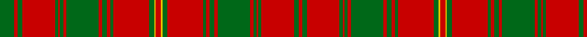

In pattern [GRGRGRGRGRGRGRGYRYGRGRGRGRGRGRGR](/patterns/grgrgrgrgrgrgrgyrygrgrgrgrgrgrgr/).

This was sourced from register-of-tartans.  It is a [32 stripes tartan](/stripes/stripes32/).

Original link https://www.tartanregister.gov.uk/tartanDetails.aspx?ref=1674

## Thread count
G/18 R4 G6 R40 G4 R2 G4 R4 G40 R4 G6 R4 G4 R44 G6 Y2 R6 Y2 G6 R44 G4 R4 G6 R4 G40 R4 G4 R2 G4 R40 G6 R/4

## Palette
Each colour and its ΔE from the base-6 reference it is a variant of.

| Colour | Shade | Base | ΔE (OKLab) |
|---|---|---|---|
| G | <code style="background-color:#006818;">#006818</code> `#006818` | G <code style="background-color:#006100;">#006100</code> | 0.02 |
| R | <code style="background-color:#C80000;">#C80000</code> `#C80000` | R <code style="background-color:#CC0000;">#CC0000</code> | 0.01 |
| Y | <code style="background-color:#E8C000;">#E8C000</code> `#E8C000` | Y <code style="background-color:#F2BF00;">#F2BF00</code> | 0.02 |

## Nearest tartans

The nearest existing variants by ΔTartan distance.

1. [Hayes](/setts/s26/r2g1y1g12r1g1r1g4r17g3r2g1r2ya2r2g1r2g3r17g4r1g1r1g12y1g1x4~g004c00-rc80000-yc89800-yab0b0b0/) — ΔT 1.30
1. [MacDonald of Staffa 1](/setts/s31/r16g1r1g1r1g1r1g1r6g1b1g6b1r1g1r4g1r1b4r4w1r4g4w1g4r1g1r6g1r8w1x2~b304080-g008000-rc00000-we0e0e0/) — ΔT 1.32
1. [MacAlister](/setts/s23/r32g8r4g8r8b8r12ba1r1g18r1ba1r32ba1r1g18r1ba1r12g6r1ba1r4x2~b304080-ba5480b0-g008000-rc00000/) — ΔT 1.32
1. [Unidentified Cant #05](/setts/s22/r13g2r13ga2r4ga2r4ga2r42ga2r4ga2r4ga2r13g2r13g8r2g36r2g2x2~g006818-ga604000-rc80000/) — ΔT 1.37
1. [Hebrides Outer](/setts/s17/g9r2g3r20g2r1g2r2g20r2g3r2g2r22g3y1r3x2~g008000-rc00000-yf0c000/) — ΔT 1.40
1. [Robertson 4](/setts/s28/r28g2r5g2r28g2r5g2r28b3r3g24r3b24r3b3r28g2r5g2r28b3r3g24r3b24r3b3x2~b304080-g008000-rc00000/) — ΔT 1.43
1. [Robertson 5](/setts/s29/r28g2r5g2r28b3r3b24r3g24r3b3r28g2r5g2r28b3r3b24r3g24r3b3r28g2r5g2r28x2~b304080-g008000-rc00000/) — ΔT 1.45
1. [MacAlister CC](/setts/s23/r32g8r4g8r8b8r12w1r1g18r1w1r32w1r1g18r1w1r12g6r1w1r4x2~b000064-g004c00-rc80000-wd0d0d0/) — ΔT 1.58
1. [MacAlister (Cockburn Collection 1810-20)](/setts/s23/r32g8r4g8r8b8r12ba1r1g18r1ba1r32ba1r1g18r1ba1r12g6r1ba1r4x2~b2c4084-ba3c82af-g005020-rdc0000/) — ΔT 1.59
1. [MacAlister CC](/setts/s23/r32g8r4g8r8b8r12ba1r1g18r1ba1r32ba1r1g18r1ba1r12g6r1ba1r4x2~b000052-ba4367ae-g11450d-raa0000/) — ΔT 1.67

## Neighbour map

Every grey dot is one of 15726 variants placed by the first two principal components of the ΔTartan feature space (44% of its variance). Red is this tartan; blue dots are its nearest — click one to open its page.

<svg viewBox="0 0 640 380" role="img" style="max-width:100%;height:auto;border:1px solid #e0e0e0;border-radius:4px;display:block" xmlns="http://www.w3.org/2000/svg"><image href="/nn/cloud.v1.png" width="640" height="380"/><a href="/setts/s26/r2g1y1g12r1g1r1g4r17g3r2g1r2ya2r2g1r2g3r17g4r1g1r1g12y1g1x4~g004c00-rc80000-yc89800-yab0b0b0/"><circle cx="342.2" cy="100.9" r="4" fill="#3465a4"><title>Hayes</title></circle></a><a href="/setts/s31/r16g1r1g1r1g1r1g1r6g1b1g6b1r1g1r4g1r1b4r4w1r4g4w1g4r1g1r6g1r8w1x2~b304080-g008000-rc00000-we0e0e0/"><circle cx="372.7" cy="99.7" r="4" fill="#3465a4"><title>MacDonald of Staffa 1</title></circle></a><a href="/setts/s23/r32g8r4g8r8b8r12ba1r1g18r1ba1r32ba1r1g18r1ba1r12g6r1ba1r4x2~b304080-ba5480b0-g008000-rc00000/"><circle cx="407.9" cy="91.6" r="4" fill="#3465a4"><title>MacAlister</title></circle></a><a href="/setts/s22/r13g2r13ga2r4ga2r4ga2r42ga2r4ga2r4ga2r13g2r13g8r2g36r2g2x2~g006818-ga604000-rc80000/"><circle cx="467.3" cy="121.6" r="4" fill="#3465a4"><title>Unidentified Cant #05</title></circle></a><a href="/setts/s17/g9r2g3r20g2r1g2r2g20r2g3r2g2r22g3y1r3x2~g008000-rc00000-yf0c000/"><circle cx="403.0" cy="131.9" r="4" fill="#3465a4"><title>Hebrides Outer</title></circle></a><a href="/setts/s28/r28g2r5g2r28g2r5g2r28b3r3g24r3b24r3b3r28g2r5g2r28b3r3g24r3b24r3b3x2~b304080-g008000-rc00000/"><circle cx="362.8" cy="133.6" r="4" fill="#3465a4"><title>Robertson 4</title></circle></a><a href="/setts/s29/r28g2r5g2r28b3r3b24r3g24r3b3r28g2r5g2r28b3r3b24r3g24r3b3r28g2r5g2r28x2~b304080-g008000-rc00000/"><circle cx="386.7" cy="135.7" r="4" fill="#3465a4"><title>Robertson 5</title></circle></a><a href="/setts/s23/r32g8r4g8r8b8r12w1r1g18r1w1r32w1r1g18r1w1r12g6r1w1r4x2~b000064-g004c00-rc80000-wd0d0d0/"><circle cx="395.4" cy="86.1" r="4" fill="#3465a4"><title>MacAlister CC</title></circle></a><a href="/setts/s23/r32g8r4g8r8b8r12ba1r1g18r1ba1r32ba1r1g18r1ba1r12g6r1ba1r4x2~b2c4084-ba3c82af-g005020-rdc0000/"><circle cx="401.7" cy="85.9" r="4" fill="#3465a4"><title>MacAlister (Cockburn Collection 1810-20)</title></circle></a><a href="/setts/s23/r32g8r4g8r8b8r12ba1r1g18r1ba1r32ba1r1g18r1ba1r12g6r1ba1r4x2~b000052-ba4367ae-g11450d-raa0000/"><circle cx="425.0" cy="102.0" r="4" fill="#3465a4"><title>MacAlister CC</title></circle></a><circle cx="407.1" cy="104.3" r="5" fill="#c00000"/></svg>

ID: /setts/s32/g9r2g3r20g2r1g2r2g20r2g3r2g2r22g3y1r3y1g3r22g2r2g3r2g20r2g2r1g2r20g3r2x2~g006818-rc80000-ye8c000/
