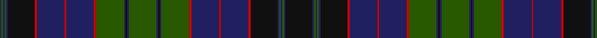

**Bands:** [BGBGBKRBRBRGBKBGBKBGRBRBRKBGBGBK](/stripes/bgbgbkrbrbrgbkbgbkbgrbrbrkbgbgbk/) · **Stripes:** [DB DG DB DG DB K R DB R DB R DG DB K DB DG DB K DB DG R DB R DB R K DB DG DB DG DB K](/stripes/stripes32/) DB DG DB DG DB K R DB R DB R DG DB K DB DG DB K DB DG R DB R DB R K DB DG DB DG DB K

This was sourced from house-of-tartan.  It is a [32 band tartan](/bands/bands32/).

Original link http://www.house-of-tartan.scotland.net/house/TartanViewjs.asp?colr=Def&tnam=2366

## Thread count
DB/4 G4 DB4 G4 DB4 K66 R6 DB68 R4 DB68 R6 G68 DB4 K4 DB4 G68 DB4 K4 DB4 G68 R6 DB68 R4 DB68 R6 K66 DB4 G4 DB4 G4 DB4 K/66

## Palette
Each colour and its ΔE from the base-6 reference it is a variant of.

| Colour | Shade | Base | ΔE (OKLab) |
|---|---|---|---|
| DB | <code style="background-color:#202060;">#202060</code> `#202060` | B <code style="background-color:#2A418A;">#2A418A</code> | 0.11 |
| DG | <code style="background-color:#003820;">#003820</code> `#003820` | G <code style="background-color:#006100;">#006100</code> | 0.15 |
| G | <code style="background-color:#285800;">#285800</code> `#285800` | G <code style="background-color:#006100;">#006100</code> | 0.03 |
| K | <code style="background-color:#101010;">#101010</code> `#101010` | K <code style="background-color:#000000;">#000000</code> | 0.17 |
| R | <code style="background-color:#C80000;">#C80000</code> `#C80000` | R <code style="background-color:#CC0000;">#CC0000</code> | 0.01 |

## Nearest tartans

The nearest existing variants by ΔTartan distance.

1. [Lumsden Hunting](/setts/s17/dg34db2k2db2dg34r3db34r2db34r3k33db2dg2db2dg2db2k33~x2/) — ΔT 1.40
1. [Campbell of Argyll](/setts/s28/k16dg8k1ly2k1dg8k8db8k1db1k1db8k8dg8k1w2k1dg8k8db1k1db1k1db8k1db1k1db1~x2/) — ΔT 1.42
1. [Buchan (Clan)](/setts/s21/r6k6r2db24r2db2k2r2db24r2k6db6r2k27r2db2r2k27r2db6k2~x2/) — ΔT 1.42
1. [MacKenzie (Vestiarium Scoticum)](/setts/s24/db18k2db2k2db2k6dg18w2dg18k6db18k1db4k1db18k6dg18r2dg18k6db2k2db2k2~x2/) — ΔT 1.44
1. [Duchess of Albany](/setts/s27/lo2db22k16g3k2g2k2g12k2g2k2g3db8g2db8g3k2g2k2g12k2g2k2g3k16db24r2~x2/) — ΔT 1.46
1. [Gordon #4](/setts/s32/db15k3db3k3db3k15dg15r1dg1r4dg1r1dg15k15db15k3db4k3db15k15dg15ly1dg1ly4dg1ly1dg15k15db3k3db3k3~x2/) — ΔT 1.52
1. [Asile](/setts/s18/dt3o1dp2o1k6o1dp2o1dt16k16dp1o2dp1dt6dp1o2dp1k3~x2/) — ΔT 1.52
1. [Broun Hunting (Personal?)](/setts/s29/dt16k3dt3k3dt3k16g15k1t3k1g15k16dt15k3dt3k3dt15k16g15k1lr3k1g15k16dt3k3dt3k3dt3~x4/) — ΔT 1.57
1. [Stewart/Stuart](/setts/s17/g34k2db2k2g34r3k34r2k34r3db33k2g2k2g2k2db33/) — ΔT 1.57
1. [Farquharson (Vestiarium Scoticum) or MacEwen/MacEwan](/setts/s28/k36dg22k1r4k1dg22k19db16k2db3k2db16k19dg22k1ly4k1dg22k19db3k2db3k2db28k2db3k2db3~x2/) — ΔT 1.58

## Neighbour map

Every grey dot is one of 14313 variants placed by the first two principal components of the ΔTartan feature space (44% of its variance). Red is this tartan; blue dots are its nearest — click one to open its page.

<svg viewBox="0 0 640 380" role="img" style="max-width:100%;height:auto;border:1px solid #e0e0e0;border-radius:4px;display:block" xmlns="http://www.w3.org/2000/svg"><image href="/nn/cloud.v1.png" width="640" height="380"/><a href="/setts/s17/dg34db2k2db2dg34r3db34r2db34r3k33db2dg2db2dg2db2k33~x2/"><circle cx="266.2" cy="164.4" r="4" fill="#3465a4"><title>Lumsden Hunting</title></circle></a><a href="/setts/s28/k16dg8k1ly2k1dg8k8db8k1db1k1db8k8dg8k1w2k1dg8k8db1k1db1k1db8k1db1k1db1~x2/"><circle cx="237.8" cy="131.1" r="4" fill="#3465a4"><title>Campbell of Argyll</title></circle></a><a href="/setts/s21/r6k6r2db24r2db2k2r2db24r2k6db6r2k27r2db2r2k27r2db6k2~x2/"><circle cx="295.3" cy="157.6" r="4" fill="#3465a4"><title>Buchan (Clan)</title></circle></a><a href="/setts/s24/db18k2db2k2db2k6dg18w2dg18k6db18k1db4k1db18k6dg18r2dg18k6db2k2db2k2~x2/"><circle cx="265.3" cy="148.3" r="4" fill="#3465a4"><title>MacKenzie (Vestiarium Scoticum)</title></circle></a><a href="/setts/s27/lo2db22k16g3k2g2k2g12k2g2k2g3db8g2db8g3k2g2k2g12k2g2k2g3k16db24r2~x2/"><circle cx="217.6" cy="132.4" r="4" fill="#3465a4"><title>Duchess of Albany</title></circle></a><a href="/setts/s32/db15k3db3k3db3k15dg15r1dg1r4dg1r1dg15k15db15k3db4k3db15k15dg15ly1dg1ly4dg1ly1dg15k15db3k3db3k3~x2/"><circle cx="194.7" cy="130.9" r="4" fill="#3465a4"><title>Gordon #4</title></circle></a><a href="/setts/s18/dt3o1dp2o1k6o1dp2o1dt16k16dp1o2dp1dt6dp1o2dp1k3~x2/"><circle cx="265.9" cy="144.8" r="4" fill="#3465a4"><title>Asile</title></circle></a><a href="/setts/s29/dt16k3dt3k3dt3k16g15k1t3k1g15k16dt15k3dt3k3dt15k16g15k1lr3k1g15k16dt3k3dt3k3dt3~x4/"><circle cx="233.2" cy="152.2" r="4" fill="#3465a4"><title>Broun Hunting (Personal?)</title></circle></a><a href="/setts/s17/g34k2db2k2g34r3k34r2k34r3db33k2g2k2g2k2db33/"><circle cx="247.9" cy="155.9" r="4" fill="#3465a4"><title>Stewart/Stuart</title></circle></a><a href="/setts/s28/k36dg22k1r4k1dg22k19db16k2db3k2db16k19dg22k1ly4k1dg22k19db3k2db3k2db28k2db3k2db3~x2/"><circle cx="268.7" cy="107.1" r="4" fill="#3465a4"><title>Farquharson (Vestiarium Scoticum) or MacEwen/MacEwan</title></circle></a><circle cx="280.7" cy="133.3" r="5" fill="#c00000"/></svg>

ID: /setts/s32/k33db2dg2db2dg2db2k33r3db34r2db34r3dg34db2k2db2dg34db2k2db2dg34r3db34r2db34r3k33db2dg2db2dg2db2~x2/
