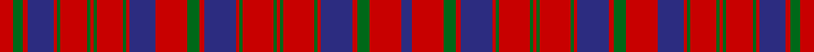

In pattern [BRGRBRGRGRGRGRBRGRBRGRGRGRGRBRGR](/stripes/brgrbrgrgrgrgrbrgrbrgrgrgrgrbrgr/).

This was sourced from tartans-authority.  It is a [32 stripe tartan](/stripes/stripes32/).

Original link http://www.tartansauthority.com/tartan-ferret/display/10435/

## Thread count
R/17 G12 R6 DB33 R4 G4 R33 G4 R4 G4 R33 G4 R4 DB33 R39 G15 R7 DB39 R4 G4 R39 G4 R4 G4 R39 G4 R4 DB39 R7 G15 R39 DB/14

## Palette
Each colour and the base-6 reference it is a variant of.

| Colour | Shade | Base |
|---|---|---|
| DB | <code style="background-color:#2C2C80;">#2C2C80</code> `oklch(35.0% 0.138 276.6)` <small>#2C2C80</small> | B <code style="background-color:#2A418A;">#2A418A</code> |
| G | <code style="background-color:#006818;">#006818</code> `oklch(45.0% 0.142 145.0)` <small>#006818</small> | G <code style="background-color:#006100;">#006100</code> |
| R | <code style="background-color:#C80000;">#C80000</code> `oklch(52.3% 0.215 29.2)` <small>#C80000</small> | R <code style="background-color:#CC0000;">#CC0000</code> |

## Nearest tartans

The nearest existing variants by ΔTartan distance.

1. [Ross 1](/setts/s36/r32db3r3db8r3db3r23g20r6g20r6g20r22g5r10g5r22db24r5db24r23db3r3db8r3db3r32db3r3db8r3db3r23g20r6g20/) — ΔT 1.09
1. [Ross #8](/setts/s25/r14db1r1db2r1db1r10dg10r2dg10r2dg10r10dg2r6dg2r10db10r2db10r2db10r10dg2r6~x2/) — ΔT 1.11
1. [Robertson 4](/setts/s28/r28g2r5g2r28g2r5g2r28db3r3g24r3db24r3db3r28g2r5g2r28db3r3g24r3db24r3db3~x2/) — ΔT 1.16
1. [Campbell of Loudoun, Plaid](/setts/s25/db3r1db1r3db9r3db1r1db3r1db1r18db14r3db1r1db1r3g4r14g10r10db5r4db1~x2/) — ΔT 1.21
1. [Robertson #4](/setts/s29/r28dg2r5dg2r28db3r3dg24r3db24r3db3r28dg2r5dg2r28db3r3dg24r3db24r3db3r28dg2r5dg2r28~x2/) — ΔT 1.29
1. [Campbell of Loudoun Plaid](/setts/s48/r4db5r10dg10r14dg4r3db1r1db1r3db14r18db1r1db3r1db1r3db9r3db1r1db3r1db1r3db9r3db1r1db3r1db1r18db14r3db1r1db1r3dg4r14dg10r10db5r4db1~x2/) — ΔT 1.31
1. [Robertson 5](/setts/s29/r28g2r5g2r28db3r3db24r3g24r3db3r28g2r5g2r28db3r3db24r3g24r3db3r28g2r5g2r28~x2/) — ΔT 1.33
1. [Ross #3](/setts/s31/dg23r6dg23r26dg4r9dg4r26w3r8dp31r6dp31r8w3r26dp2r2dp4r2dp2r26dp2r2dp4r2dp2r26dg23r6dg23~x2/) — ΔT 1.36
1. [Murray of Polmaise](/setts/s35/g3r3t9r12t1r1g1r1t1g1t6r1t1r1t1r1t1r1t6r1t1r1g1r1t1r12t9r3g3r7t3r3g1r4t3~x4/) — ΔT 1.36
1. [Ross 2](/setts/s25/r14db1r1db2r1db1r10g10r2g10r2g10r10g2r6g2r10db10r2db10r2db10r10g2r6~x2/) — ΔT 1.36

## Neighbour map

Every grey dot is one of 14299 variants placed by the first two principal components of the ΔTartan feature space (44% of its variance). Red is this tartan; blue dots are its nearest — click one to open its page.

<svg viewBox="0 0 640 380" role="img" style="max-width:100%;height:auto;border:1px solid #e0e0e0;border-radius:4px;display:block" xmlns="http://www.w3.org/2000/svg"><image href="/nn/cloud.v1.png" width="640" height="380"/><a href="/setts/s36/r32db3r3db8r3db3r23g20r6g20r6g20r22g5r10g5r22db24r5db24r23db3r3db8r3db3r32db3r3db8r3db3r23g20r6g20/"><circle cx="290.5" cy="150.5" r="4" fill="#3465a4"><title>Ross 1</title></circle></a><a href="/setts/s25/r14db1r1db2r1db1r10dg10r2dg10r2dg10r10dg2r6dg2r10db10r2db10r2db10r10dg2r6~x2/"><circle cx="289.7" cy="157.1" r="4" fill="#3465a4"><title>Ross #8</title></circle></a><a href="/setts/s28/r28g2r5g2r28g2r5g2r28db3r3g24r3db24r3db3r28g2r5g2r28db3r3g24r3db24r3db3~x2/"><circle cx="362.8" cy="133.3" r="4" fill="#3465a4"><title>Robertson 4</title></circle></a><a href="/setts/s25/db3r1db1r3db9r3db1r1db3r1db1r18db14r3db1r1db1r3g4r14g10r10db5r4db1~x2/"><circle cx="352.2" cy="131.9" r="4" fill="#3465a4"><title>Campbell of Loudoun, Plaid</title></circle></a><a href="/setts/s29/r28dg2r5dg2r28db3r3dg24r3db24r3db3r28dg2r5dg2r28db3r3dg24r3db24r3db3r28dg2r5dg2r28~x2/"><circle cx="378.2" cy="126.7" r="4" fill="#3465a4"><title>Robertson #4</title></circle></a><a href="/setts/s48/r4db5r10dg10r14dg4r3db1r1db1r3db14r18db1r1db3r1db1r3db9r3db1r1db3r1db1r3db9r3db1r1db3r1db1r18db14r3db1r1db1r3dg4r14dg10r10db5r4db1~x2/"><circle cx="337.5" cy="101.2" r="4" fill="#3465a4"><title>Campbell of Loudoun Plaid</title></circle></a><a href="/setts/s29/r28g2r5g2r28db3r3db24r3g24r3db3r28g2r5g2r28db3r3db24r3g24r3db3r28g2r5g2r28~x2/"><circle cx="386.3" cy="134.9" r="4" fill="#3465a4"><title>Robertson 5</title></circle></a><a href="/setts/s31/dg23r6dg23r26dg4r9dg4r26w3r8dp31r6dp31r8w3r26dp2r2dp4r2dp2r26dp2r2dp4r2dp2r26dg23r6dg23~x2/"><circle cx="265.5" cy="106.7" r="4" fill="#3465a4"><title>Ross #3</title></circle></a><a href="/setts/s35/g3r3t9r12t1r1g1r1t1g1t6r1t1r1t1r1t1r1t6r1t1r1g1r1t1r12t9r3g3r7t3r3g1r4t3~x4/"><circle cx="324.8" cy="132.3" r="4" fill="#3465a4"><title>Murray of Polmaise</title></circle></a><a href="/setts/s25/r14db1r1db2r1db1r10g10r2g10r2g10r10g2r6g2r10db10r2db10r2db10r10g2r6~x2/"><circle cx="294.2" cy="162.7" r="4" fill="#3465a4"><title>Ross 2</title></circle></a><circle cx="310.3" cy="147.7" r="5" fill="#c00000"/></svg>

ID: /setts/s32/r17g12r6db33r4g4r33g4r4g4r33g4r4db33r39g15r7db39r4g4r39g4r4g4r39g4r4db39r7g15r39db14/
