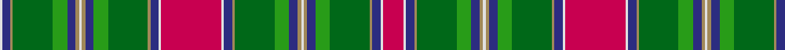

In pattern [RWBYGGBYWYBGGYBWRWBYGGBYWYBGGYBW](/patterns/rwbyggbywybggybwrwbyggbywybggybw/).

This was sourced from register-of-tartans.  It is a [32 stripes tartan](/stripes/stripes32/).

Original link https://www.tartanregister.gov.uk/tartanDetails.aspx?ref=3859

## Thread count
LN/4 DB14 LT4 G66 Ga24 DB14 LT6 LN4 LT6 DB14 Ga24 G66 LT4 DB14 LN4 R100 LN4 DB14 LT4 G66 Ga24 DB14 LT6 LN4 LT6 DB14 Ga24 G66 LT4 DB14 LN4 R/34

## Palette
Each colour and its ΔE from the base-6 reference it is a variant of.

| Colour | Shade | Base | ΔE (OKLab) |
|---|---|---|---|
| DB | <code style="background-color:#2C2C80;">#2C2C80</code> `#2C2C80` | B <code style="background-color:#2A418A;">#2A418A</code> | 0.06 |
| G | <code style="background-color:#006818;">#006818</code> `#006818` | G <code style="background-color:#006100;">#006100</code> | 0.02 |
| Ga | <code style="background-color:#289C18;">#289C18</code> `#289C18` | G <code style="background-color:#006100;">#006100</code> | 0.19 |
| LN | <code style="background-color:#E0E0E0;">#E0E0E0</code> `#E0E0E0` | W <code style="background-color:#F7F7F7;">#F7F7F7</code> | 0.07 |
| LT | <code style="background-color:#A08858;">#A08858</code> `#A08858` | Y <code style="background-color:#F2BF00;">#F2BF00</code> | 0.21 |
| R | <code style="background-color:#C80050;">#C80050</code> `#C80050` | R <code style="background-color:#CC0000;">#CC0000</code> | 0.07 |

## Nearest tartans

The nearest existing variants by ΔTartan distance.

1. [Wilson's No.171](/setts/s28/g29ga17k1w3k1y2k10b8g4b8k10y2k1w3g29w3k1y2k10b8g4b8k10y2k1w3k1ga17x2~b5c8ca8-g604000-ga006818-k101010-wfcfcfc-yd8b000/) — ΔT 0.98
1. [Wilson's No.017 #2](/setts/s28/g29ga17k1w3k1y2k10b8g4b8k10y2k1w3g29w3k1y2k10b8g4b8k10y2k1w3k1ga17x2~b5c8ca8-g604000-ga006818-k101010-wfcfcfc-ye8c000/) — ΔT 1.01
1. [Unidentified Plaid 15](/setts/s28/w70r7b7w7b7r7w7b5r9y4r3w4r3g13r70g30r4ra10r4g30r15b4r4b4r4b27g6b27x2~b304080-g008000-r806050-rac00000-we0e0e0-yf0c000/) — ΔT 1.11
1. [Unidentified Plaid #9](/setts/s28/w70g7b7w7b7g7w7b5g9y4g3w4g3ga13g70ga30g4r10g4ga30g15b4g4b4g4b27ga6b27x2~b2c4084-g503c14-ga005020-rdc0000-we0e0e0-ye8c000/) — ΔT 1.13
1. [Lawson, Robin (Personal)](/setts/s52/b1g10b4w1b4g10r1b4ba3y1b1y1b1y1b1y1b1y1b1y1b1y1b1y1b5r20w2g3y3g3w2g20b4ba4w2ba4b4g10r3g3y2g3r3g10b1ba1b1ba7r2ba7b1ba1x2~b1c1c1c-ba5f749c-g005020-rc80000-wf8f4d0-yc88c00/) — ΔT 1.22
1. [Goldstraw (Personal)](/setts/s30/k2y2k7ya7k6r10k3g40k7y2k2ya4k2r8w2g5w2r8k2ya4k2y2k7g40k3r10k6ya7k7y2x2~g006818-k101010-rc80000-we0e0e0-ye8c000-yad87c00/) — ΔT 1.27
1. [Stewart (Silk Fragment)](/setts/s24/b4w2b2w1ba5y5g5w1g20w1b4ba4ga3w1ga3ba4b4w1y30b2ba2w1ba2b2x2~b2c2c80-ba5c8ca8-g006818-ga604000-we0e0e0-yd87c00/) — ΔT 1.27
1. [O'Keefe](/setts/s22/k8r2k3y2k2w3k2ya12g22r2g2k1g2r2g22ya12k2w3k2y2k3r2x2~g8c7038-k101010-rc80000-we0e0e0-ye8c000-yaa08858/) — ΔT 1.37
1. [Duchess of Edinburgh Tartan Tartan Number: 358. Earliest known date: pre 2003 MacKinlay Strip See products available Copyright © Blair Urquhart, Comrie, 2015](/setts/s35/b12k4r4k4y2k5ba4k8ba10k4g32r4g32b8k8y2k2w2k2g12r8k2r5w2r5k2r8g12k2w2k2y2k8b8r12x2~b5c8ca8-ba2c2c80-g006818-k101010-rc80000-we0e0e0-ye8c000/) — ΔT 1.40
1. [Baxter Clan/Family Tartan Tartan Number: 3664. Earliest known date: 1856 This Baxter tartan is recorded by Logan (c.1832) as "Buchanan". Logans complied his tartan list from the limited information available at the time. It appears in a description as Baxter in D. Macgregor Peter's Baronage of Angus & Mearns, 1856. The principal branch of the clan is the Baxters of Earlshall who live at Leuchars in north Fife. See products available Copyright © Blair Urquhart, Comrie, 2015](/setts/s24/g16k1b2k1y4k1y4k1b2k1r16w2r16k1b2k1y4k1y4k1b2k1g16b2x4~b4468a4-g006818-k101010-r880000-wfcfcfc-yd09800/) — ΔT 1.45

## Neighbour map

Every grey dot is one of 15726 variants placed by the first two principal components of the ΔTartan feature space (44% of its variance). Red is this tartan; blue dots are its nearest — click one to open its page.

<svg viewBox="0 0 640 380" role="img" style="max-width:100%;height:auto;border:1px solid #e0e0e0;border-radius:4px;display:block" xmlns="http://www.w3.org/2000/svg"><image href="/nn/cloud.v1.png" width="640" height="380"/><a href="/setts/s28/g29ga17k1w3k1y2k10b8g4b8k10y2k1w3g29w3k1y2k10b8g4b8k10y2k1w3k1ga17x2~b5c8ca8-g604000-ga006818-k101010-wfcfcfc-yd8b000/"><circle cx="134.8" cy="49.8" r="4" fill="#3465a4"><title>Wilson's No.171</title></circle></a><a href="/setts/s28/g29ga17k1w3k1y2k10b8g4b8k10y2k1w3g29w3k1y2k10b8g4b8k10y2k1w3k1ga17x2~b5c8ca8-g604000-ga006818-k101010-wfcfcfc-ye8c000/"><circle cx="133.1" cy="49.1" r="4" fill="#3465a4"><title>Wilson's No.017 #2</title></circle></a><a href="/setts/s28/w70r7b7w7b7r7w7b5r9y4r3w4r3g13r70g30r4ra10r4g30r15b4r4b4r4b27g6b27x2~b304080-g008000-r806050-rac00000-we0e0e0-yf0c000/"><circle cx="144.3" cy="40.7" r="4" fill="#3465a4"><title>Unidentified Plaid 15</title></circle></a><a href="/setts/s28/w70g7b7w7b7g7w7b5g9y4g3w4g3ga13g70ga30g4r10g4ga30g15b4g4b4g4b27ga6b27x2~b2c4084-g503c14-ga005020-rdc0000-we0e0e0-ye8c000/"><circle cx="135.9" cy="40.7" r="4" fill="#3465a4"><title>Unidentified Plaid #9</title></circle></a><a href="/setts/s52/b1g10b4w1b4g10r1b4ba3y1b1y1b1y1b1y1b1y1b1y1b1y1b1y1b5r20w2g3y3g3w2g20b4ba4w2ba4b4g10r3g3y2g3r3g10b1ba1b1ba7r2ba7b1ba1x2~b1c1c1c-ba5f749c-g005020-rc80000-wf8f4d0-yc88c00/"><circle cx="154.4" cy="34.0" r="4" fill="#3465a4"><title>Lawson, Robin (Personal)</title></circle></a><a href="/setts/s30/k2y2k7ya7k6r10k3g40k7y2k2ya4k2r8w2g5w2r8k2ya4k2y2k7g40k3r10k6ya7k7y2x2~g006818-k101010-rc80000-we0e0e0-ye8c000-yad87c00/"><circle cx="174.8" cy="45.5" r="4" fill="#3465a4"><title>Goldstraw (Personal)</title></circle></a><a href="/setts/s24/b4w2b2w1ba5y5g5w1g20w1b4ba4ga3w1ga3ba4b4w1y30b2ba2w1ba2b2x2~b2c2c80-ba5c8ca8-g006818-ga604000-we0e0e0-yd87c00/"><circle cx="159.8" cy="30.7" r="4" fill="#3465a4"><title>Stewart (Silk Fragment)</title></circle></a><a href="/setts/s22/k8r2k3y2k2w3k2ya12g22r2g2k1g2r2g22ya12k2w3k2y2k3r2x2~g8c7038-k101010-rc80000-we0e0e0-ye8c000-yaa08858/"><circle cx="198.4" cy="59.9" r="4" fill="#3465a4"><title>O'Keefe</title></circle></a><a href="/setts/s35/b12k4r4k4y2k5ba4k8ba10k4g32r4g32b8k8y2k2w2k2g12r8k2r5w2r5k2r8g12k2w2k2y2k8b8r12x2~b5c8ca8-ba2c2c80-g006818-k101010-rc80000-we0e0e0-ye8c000/"><circle cx="105.4" cy="48.6" r="4" fill="#3465a4"><title>Duchess of Edinburgh Tartan Tartan Number: 358. Earliest known date: pre 2003 MacKinlay Strip See products available Copyright © Blair Urquhart, Comrie, 2015</title></circle></a><a href="/setts/s24/g16k1b2k1y4k1y4k1b2k1r16w2r16k1b2k1y4k1y4k1b2k1g16b2x4~b4468a4-g006818-k101010-r880000-wfcfcfc-yd09800/"><circle cx="141.7" cy="65.5" r="4" fill="#3465a4"><title>Baxter Clan/Family Tartan Tartan Number: 3664. Earliest known date: 1856 This Baxter tartan is recorded by Logan (c.1832) as &quot;Buchanan&quot;. Logans complied his tartan list from the limited information available at the time. It appears in a description as Baxter in D. Macgregor Peter's Baronage of Angus &amp; Mearns, 1856. The principal branch of the clan is the Baxters of Earlshall who live at Leuchars in north Fife. See products available Copyright © Blair Urquhart, Comrie, 2015</title></circle></a><circle cx="172.7" cy="48.0" r="5" fill="#c00000"/></svg>

ID: /setts/s32/r17w2b7y2g33ga12b7y3w2y3b7ga12g33y2b7w2r50w2b7y2g33ga12b7y3w2y3b7ga12g33y2b7w2x2~b2c2c80-g006818-ga289c18-rc80050-we0e0e0-ya08858/
