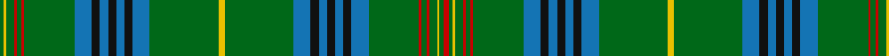

**Bands:** [GYGRGRGBKBKBKBGYGBKBKBKBGRGRGYGR](/stripes/gygrgrgbkbkbkbgygbkbkbkbgrgrgygr/) · **Stripes:** [G LY G R G R G B K B K B K B G LY G B K B K B K B G R G R G LY G R](/stripes/stripes32/) G LY G R G R G B K B K B K B G LY G B K B K B K B G R G R G LY G R

This was sourced from register-of-tartans.  It is a [32 band tartan](/bands/bands32/).

Original link https://www.tartanregister.gov.uk/tartanDetails.aspx?ref=1981

## Register references

External register numbers recorded for this tartan.

- Scottish Register of Tartans: [1981](https://www.tartanregister.gov.uk/tartanDetails.aspx?ref=1981)
- Scottish Tartans Authority (ITI): 1559
- Scottish Tartans World Register: 1559

## Thread count
G/5 Y3 G10 R3 G6 R3 G62 B21 K10 B10 K10 B10 K10 B21 G84 Y8 G84 B21 K10 B10 K10 B10 K10 B21 G62 R3 G6 R3 G10 Y3 G5 R/6

## Palette
Each colour and its ΔE from the base-6 reference it is a variant of.

| Colour | Shade | Base | ΔE (OKLab) |
|---|---|---|---|
| B | <code style="background-color:#1474B4;">#1474B4</code> `#1474B4` | B <code style="background-color:#2A418A;">#2A418A</code> | 0.15 |
| DB | <code style="background-color:#1C0070;">#1C0070</code> `#1C0070` | B <code style="background-color:#2A418A;">#2A418A</code> | 0.14 |
| DR | <code style="background-color:#880000;">#880000</code> `#880000` | R <code style="background-color:#CC0000;">#CC0000</code> | 0.15 |
| DY | <code style="background-color:#D09800;">#D09800</code> `#D09800` | Y <code style="background-color:#F2BF00;">#F2BF00</code> | 0.12 |
| G | <code style="background-color:#006818;">#006818</code> `#006818` | G <code style="background-color:#006100;">#006100</code> | 0.02 |
| K | <code style="background-color:#101010;">#101010</code> `#101010` | K <code style="background-color:#000000;">#000000</code> | 0.17 |
| R | <code style="background-color:#C80000;">#C80000</code> `#C80000` | R <code style="background-color:#CC0000;">#CC0000</code> | 0.01 |
| Ra | <code style="background-color:#C80050;">#C80050</code> `#C80050` | R <code style="background-color:#CC0000;">#CC0000</code> | 0.07 |
| Y | <code style="background-color:#E8C000;">#E8C000</code> `#E8C000` | Y <code style="background-color:#F2BF00;">#F2BF00</code> | 0.02 |

## Nearest tartans

The nearest existing variants by ΔTartan distance.

1. [Holmes](/setts/s28/g3ly2g5r2g3r2g32db9k3db5k3db9g39ly4g39db9k3db5k3db9g32r2g3r2g5ly2g3r3~x2/) — ΔT 1.14
1. [Hislop Hunting (Personal)](/setts/s34/db3k2db1k2db3lo1g3k2g2k6g2k6g2k2g24r2g4r2g24k2g2k6g2k6g2k2g3lo1db3k2db1k2db3g2~x2/) — ΔT 1.20
1. [King Edward VII (Royal)](/setts/s17/ly8g84b21k10b10k10b10k10b21g62r3g6r3g10ly3g5r6/) — ΔT 1.32
1. [Ettrick Forest](/setts/s24/db2g2r1g4r1db6r2g1ly1g1r1g1r1g1t1g1r2db6g26r1g1r1g1db1~x2/) — ΔT 1.41
1. [McGran (Personal)](/setts/s26/dp3g3g32dp2g4dp4g3g10dp2r2w1g1r3g1w1r2dp2g10g3dp4g4dp2g32g3dp3lo2~x2/) — ΔT 1.45
1. [Gray Hunting](/setts/s20/k3w1g29o8m2o2m2o2m8g7k2g7m8o2m2o2m2o8g29w1~x2/) — ΔT 1.46
1. [Hyslop Hunting (Name)](/setts/s18/g4r2g24k2g2k6g2k6g2k2g3lo1db3k2db1k2db3g2~x2/) — ΔT 1.57
1. [Sea Bees Regimental Tartan Tartan Number: 2197. Earliest known date: 1986 US military unit. See products available Copyright © Blair Urquhart, Comrie, 2015](/setts/s24/db6g3lb6g7ly2g36ly2g7lb6g3db6g3dy6g3r6g7ly2g36ly2g7r6g3dy6g3~x2/) — ΔT 1.62
1. [Kennedy Clan Tartan Tartan Number: 1123. Earliest known date: 1847 The Earls of Cassilis built Culzean Castle on the site of an ancient Kennedy stronghold. Dunure Castle near Culzean on the Ayrshire coast, was also owned by the Kennedys. The tartan was first recorded by MacIan in his book 'The Clans of the Scottish Highlands' (1847) which he co-authored with James Logan. See products available Copyright © Blair Urquhart, Comrie, 2015](/setts/s17/k2g2ly1g3m1g2m1g12db4k3db3k3db3k3db4g24r2~x2/) — ΔT 1.72
1. [Kennedy #3](/setts/s32/g24dt4k3dt3k3dt3k3dt4g12dp2g2dp2g3lo2g2k2g2lo2g3dp2g2dp2g12dt4k3dt3k3dt3k3dt4g24r3~x2/) — ΔT 1.80

## Neighbour map

Every grey dot is one of 14313 variants placed by the first two principal components of the ΔTartan feature space (44% of its variance). Red is this tartan; blue dots are its nearest — click one to open its page.

<svg viewBox="0 0 640 380" role="img" style="max-width:100%;height:auto;border:1px solid #e0e0e0;border-radius:4px;display:block" xmlns="http://www.w3.org/2000/svg"><image href="/nn/cloud.v1.png" width="640" height="380"/><a href="/setts/s28/g3ly2g5r2g3r2g32db9k3db5k3db9g39ly4g39db9k3db5k3db9g32r2g3r2g5ly2g3r3~x2/"><circle cx="401.0" cy="103.2" r="4" fill="#3465a4"><title>Holmes</title></circle></a><a href="/setts/s34/db3k2db1k2db3lo1g3k2g2k6g2k6g2k2g24r2g4r2g24k2g2k6g2k6g2k2g3lo1db3k2db1k2db3g2~x2/"><circle cx="321.3" cy="83.3" r="4" fill="#3465a4"><title>Hislop Hunting (Personal)</title></circle></a><a href="/setts/s17/ly8g84b21k10b10k10b10k10b21g62r3g6r3g10ly3g5r6/"><circle cx="353.8" cy="105.9" r="4" fill="#3465a4"><title>King Edward VII (Royal)</title></circle></a><a href="/setts/s24/db2g2r1g4r1db6r2g1ly1g1r1g1r1g1t1g1r2db6g26r1g1r1g1db1~x2/"><circle cx="390.0" cy="76.7" r="4" fill="#3465a4"><title>Ettrick Forest</title></circle></a><a href="/setts/s26/dp3g3g32dp2g4dp4g3g10dp2r2w1g1r3g1w1r2dp2g10g3dp4g4dp2g32g3dp3lo2~x2/"><circle cx="326.6" cy="55.7" r="4" fill="#3465a4"><title>McGran (Personal)</title></circle></a><a href="/setts/s20/k3w1g29o8m2o2m2o2m8g7k2g7m8o2m2o2m2o8g29w1~x2/"><circle cx="343.6" cy="95.4" r="4" fill="#3465a4"><title>Gray Hunting</title></circle></a><a href="/setts/s18/g4r2g24k2g2k6g2k6g2k2g3lo1db3k2db1k2db3g2~x2/"><circle cx="345.0" cy="111.6" r="4" fill="#3465a4"><title>Hyslop Hunting (Name)</title></circle></a><a href="/setts/s24/db6g3lb6g7ly2g36ly2g7lb6g3db6g3dy6g3r6g7ly2g36ly2g7r6g3dy6g3~x2/"><circle cx="363.7" cy="94.3" r="4" fill="#3465a4"><title>Sea Bees Regimental Tartan Tartan Number: 2197. Earliest known date: 1986 US military unit. See products available Copyright © Blair Urquhart, Comrie, 2015</title></circle></a><a href="/setts/s17/k2g2ly1g3m1g2m1g12db4k3db3k3db3k3db4g24r2~x2/"><circle cx="333.2" cy="99.6" r="4" fill="#3465a4"><title>Kennedy Clan Tartan Tartan Number: 1123. Earliest known date: 1847 The Earls of Cassilis built Culzean Castle on the site of an ancient Kennedy stronghold. Dunure Castle near Culzean on the Ayrshire coast, was also owned by the Kennedys. The tartan was first recorded by MacIan in his book 'The Clans of the Scottish Highlands' (1847) which he co-authored with James Logan. See products available Copyright © Blair Urquhart, Comrie, 2015</title></circle></a><a href="/setts/s32/g24dt4k3dt3k3dt3k3dt4g12dp2g2dp2g3lo2g2k2g2lo2g3dp2g2dp2g12dt4k3dt3k3dt3k3dt4g24r3~x2/"><circle cx="293.6" cy="108.3" r="4" fill="#3465a4"><title>Kennedy #3</title></circle></a><circle cx="358.1" cy="85.1" r="5" fill="#c00000"/></svg>

ID: /setts/s32/r6g5ly3g10r3g6r3g62b21k10b10k10b10k10b21g84ly8g84b21k10b10k10b10k10b21g62r3g6r3g10ly3g5/
